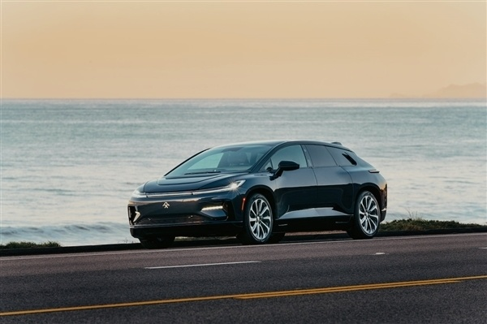
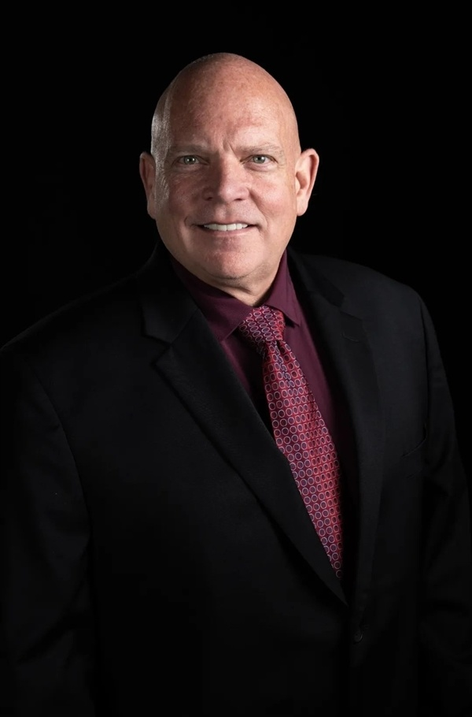

# 贾跃亭FF 91量产加速？FF任命新生产总裁：有35年造车经验

快科技5月5日消息，日前，法拉第未来（Faraday Future，简称“FF”）又有新动作，不过并不是FF 91要交付，
**而是宣布任命新任生产制造副总裁Rich Schmidt。**

据介绍，Rich拥有35年汽车制造经验，将负责领导FF的生产制造团队及公司位于加州汉福德的FF ieFactory California，同时负责监督与FF
91的生产有关的持续开发、零部件及模具管理和招聘工作。

从职业生涯来看， **Rich为** 丰田汽车工作了16年，负责制造和工程方面工作，离开丰田后，又在日产、现代、大众和特斯拉等公司的生产制造和工程部门就职。

4月中旬，首台量产车FF 91 Futurist下线，在量产仪式上，FF创始人贾跃亭表示，
**我们所有不被理解的疯魔般的坚持和决绝的付出终于换来了今天的SOP（开始量产），可谓是九年为梦想窒息，终于迎来颠覆时刻。**

不知Rich的加盟，是否能提高FF 91的量产速度，帮助贾跃亭完成九年的造车梦。

_Rich
Schmidt_

