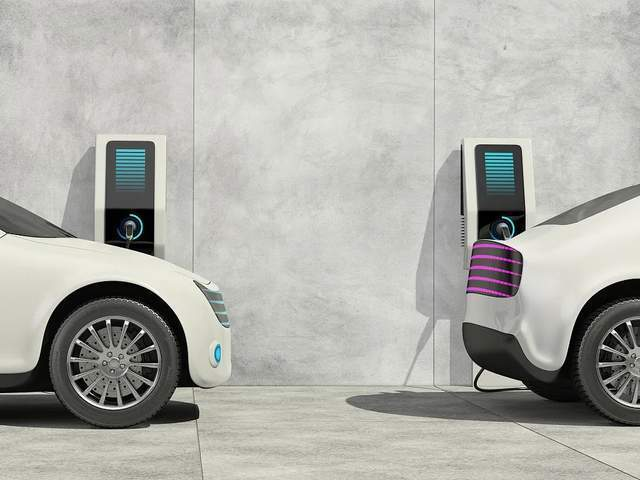
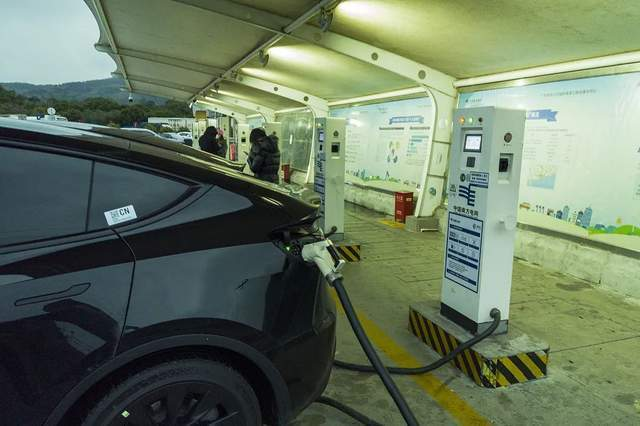

# 饥寒交迫苦等7小时充电，我的假期被“电动爹”毁了

**我们刚刚度过的，大概是史上最热闹、最火爆的五一假期了。**

**据交通运输部通报的数据显示，4月29日至5月3日，全国铁路、公路、水路、民航预计发送旅客总量27019万人次，日均发送5403.8万人次。其中，公路预计日均发送3261.8万人次，比2022年同期日均增长99.1%。**

**出于种种原因，依然有不少电动车主自驾出行，“排队四小时、充电一小时”的窘迫画面再度上演。**

**当新能源车渗透率一举冲破30%大关，尴尬的是，补能依然是电动车主心头挥之不去的阴霾。**

**文 |** 李馨婷

**编辑 |** 李欢欢

**运营 |** 牧歌

拖车都忙疯了

在成都工作的陈莹算是领教了这个五一的火爆，开售时间刚过一秒，回攀枝花的高铁票便被一抢而空。她满怀期待地下了候补订单，等待两周却连一张单程票都没等到。4月28日，陈莹彻底放弃了候补通道，想到五一期间高速公路可以免费通行，她决定开电动车自驾回家。

显然，过往电动车主曾遭遇的“排队四小时、充电一小时”的窘境，还没有对陈莹形成足够的警示。陈莹觉得大不了还可以动用保险公司赠送的拖车服务，抱着几分乐观预判，她甚至连沿途什么位置有充电站都没有搞清楚就上路了。4月28日下午4点，陈莹载着妈妈和一位朋友踏上了回家的旅程。她已经计算好了，这个时间启程，下高速时正好能赶上高速免费时段。

陈莹的车是一辆极狐阿尔法S，续航里程525公里，出发时表显剩余440公里。买这车主要是满足她的通勤需求，至今没跑过长途。不过，她乐观判断，从成都开到攀枝花，走京昆高速，全程大概600公里，车程7小时左右，中间大约充一两次电足够了。

开局比较顺利，他们用两个多小时便驶完全程的三分之一，路过荥经服务区时，陈莹看了一眼显示器，还有200多公里的电量，在这里充电似乎有点“鸡肋”，她打算继续开60公里，到汉源服务区再充电。没想到，当她抵达汉源服务区时，发现这里竟然没有充电桩。好在表显还有100多公里，开到石棉绰绰有余，到了石棉服务区，总算找到了充电桩。但是，硕大的服务站，只有4个充电桩运营，并且在她前面已经排了十几辆电车。

说走就走的轻松心情消失了，陈莹陷入了纠结，继续前进还是在这里排队？快充状态大约半小时可充80%电量。粗略估算，陈莹要等待两三个小时才能充上电。

此时陈莹的车表显剩余90公里电量，距离下一个服务区菩萨岗服务区还有60公里，理论上讲，电量足以支撑她到达菩萨岗。陈莹在地图软件搜索过，确认菩萨岗服务区有空闲的充电桩，她决定“冲一把”，顺便“试试90公里的表显开60公里能不能行”。

但现实情况远比想象中复杂。

出发时成都就在下雨，到了雅安雨下得更大，此时已经快到晚上9点，温度越来越低。更要命的是，去往菩萨岗服务区的路几乎全程上坡。种种因素导致耗电量大大增加，仅开出30公里，车上的电就迅速耗光了。

靠着最后的“隐藏电量”（电动车没电后，还可以启动，再开一段距离），陈莹以4-5公里/时的龟速向前滑动，但这个速度在高速路上行驶显然是行不通的。不幸中的万幸，路边刚好停着一辆拖车，司机过来询问了一番，拉着三人的车上路了。

此时，他们还没意识到，一段“囧途”才刚刚开始。

花了300元拖车费，终于抵达菩萨岗服务区，陈莹远远看到，菩萨岗服务区也只有4个充电桩。不少同病相怜的电车已经挤满了停车场，管理员走到陈莹车边，塞给她一张纸——15号。排队充电的车太多，得靠排号维持秩序了。已是晚上10点，陈莹苦苦等待了7个小时，直到次日凌晨5点，才终于充上电，彼时后面的车已经排到了50多号。

一位同在排队充电的车主与陈莹闲聊，“他们（拖车）都忙疯了，生意异常火爆。凌晨两三点还在往服务区拉车。”这位车主曾经打12122高速救援电话，请求拖车帮忙，但需要拖车的人太多了，他左等右等也等不来，就在路边叫了一辆“野生”拖车，5公里花了600元。

在停车场排队充电的那晚，除了与其他车主聊天，陈莹始终紧盯着排队实况。她一刻也不敢休息，毕竟充电桩没有专人维持秩序，她怕被别的车加塞。“通往充电桩的路很窄，大家都停在路上的话就堵死了，只能车停在旁边，人下车盯着。”排在她前面的热心车主自发担任起维持秩序的角色，指挥车辆出入，组织大家排号。

高海拔、低温也增加了排队充电的难度。下了一天雨后，晚上温度直降到3度，凌晨3点甚至下起了大雪，排队的车都是电量几乎耗尽的状态，也没法启用空调取暖。菩萨岗服务区没有酒店，便利店晚上11点多就关门了。陈莹和妈妈把行李箱里的衣服有一件算一件全部披在身上保暖。

同行的人正好有朋友路过，搭朋友的油车先走了，晚饭，陈莹和妈妈吃了随身带的几个面包，饥寒交迫地缩在车里熬时间。戏剧性的一刻来了，陈莹意外收到了高铁票候补成功的通知，后悔开电车出门的情绪在那一刻到达了顶点。最后，陈莹伸出冻僵的手指，哆哆嗦嗦忍痛把票给退了，“还花了我几十块钱手续费！”

即便如此，陈莹都觉得自己还算幸运。她看到几辆车，大概是用隐藏电量滑行了太久，电量彻底耗光，被拖车拖来时车门已经关不上，车窗也摇不起来。其中一位车主带着三四岁的小朋友，坐在车里瑟瑟发抖，大家帮忙把他的车推到充电桩附近，先充一点电应急。有辆车电耗得太彻底，怎么也充不进去电了，直到陈莹第二天早晨充完电离开，那辆车还在原地等待拖车拖去维修厂，车主更是不知所踪，这个假期恐怕是被毁了。

_▲ 在高速公路服务区，电动汽车在排队等候充电。图 / 视觉中国_

充电桩还是不够多

乘联会数据显示，2023年3月国内新能源车零售渗透率已经达到34.2%，也就是说每卖出十辆车其中就有三辆是新能源车。然而尴尬的是，开电动车远途出行，依然是一件令车主焦虑不安的事。

最关键的原因在于，喊了这么多年的基础设施建设，仍在推进中。

《电动汽车充电基础设施发展指南（2015-2020年）》曾提出，截至2030年我国新能源车桩比要达到1:1。而据中信证券研报分析，截至2022年底，我国存量车桩比为
2.5: 1，存量新能源汽车与公共充电桩比例约为 7.1:1，距离目标还有不小差距。

尤其在高速路段，充电桩仍然比较稀缺。

张佳在某充电桩投建企业工作，他向每人Auto解释，高速公路服务区内部的基础设施已经铺设得比较满了，如果要大规模建设充电桩，一方面需要更大的面积，即扩建服务区；另一方面，部分服务区的电容量不够，还需要铺设新的高压电网。“地还能解决，电的话难度就大了。”

与此同时，不管是车企还是经营充电桩的企业，都有盈利的压力。而高速公路的充电桩使用频率相对比较低，只在节假日客流爆满，远不如在城市内铺设充电桩“实惠”，因此企业缺乏动力在高速公路布局充电桩。两方面因素叠加，高速公路充电桩的生意便只有国家电网主力在推，但单凭一己之力，这是个漫长的过程。

另外，高速公路补能需求以快充为主。目前，最常见的快充桩有60kW和120kW两种，粗略估计分别能够在一小时、半小时左右给一台续航为500公里的电动车充满电。一位新能源汽车行业分析师认为，虽然国家在大力布局，但旧充电桩里慢充桩的比例还是很高。根据中国充电联盟发布的数据，截至2022年，国内公共充电桩有179.7万个，其中直流快充桩只有76.1万个，这些快充桩仅有约2%位于高速公路（根据交通运输部2022年10月公布的数据计算）。

走下高速公路，一些自驾热门目的地面临同样的问题。以新疆、西藏为例，截至2023年1月16日，西藏拉萨市新能源汽车保有量仅2105辆。2022年新疆整体新能源汽车保有量接近5万辆，与北京、上海超过50万的新能源汽车保有量相差巨大。企业总是优先在新能源车保有量高的地区建设充电桩，因而不同城市间铺桩量严重不均。而充电桩数量不足，反过来会影响当地居民购买新能源车的意愿，形成恶性循环。

另一方面，即使充电设施布局完善，电池端也要跟上才行。上述分析师认为，虽然近来车企推出的新车都在向超快充靠拢，但目前的存量新能源车，能够支持高速充电的车型并不多。可以说2022年以前的车型，还无法兼容4C（15分钟充满）充电效率，甚至很多车型也达不到半小时充满电的水平。

张佳坦言，要把充电桩升级到360kW并非难事，但车辆电池无法与之匹配是个问题。因此，目前而言增加充电桩数量才是更为实际的解决方案。

上述种种难题，很难在短时间内得到解决，开电车长途出行，将持续困扰着众多车主。

回想起从成都到攀枝花的糟糕旅程，尤其是困在半路得知候补到高铁票的那个瞬间，陈莹感到又恼又悔，“下次应该不会开电车自驾了，还是等（候补）抢票吧”。在菩萨岗服务区遭遇电车“趴窝”的车主里，也不乏家里有油车有电车，最后选择开电车自驾出行的。在花了数百元拖车费，被迫滞留在服务区度过窘迫的夜晚之后，他们的肠子都要悔青了。

_▲ 武深高速广东龙门县段某服务区，正在充电的新能源车。图 / 视觉中国_

补能焦虑终将成为过去？

与陈莹遭遇海拔提升、雨雪交加的极端处境不同，张佳这次五一自驾还算顺利。出于职业习惯，他一路都在留意高速公路充电桩的使用情况。

5月3日，高速路段迎来返程高峰，几个服务区的充电桩前排起了长队。张佳注意到快充桩的质量已经比之前提高了不少，印象最深的是在衢州服务区有5个快充桩，功率都是120kW、双枪的，并且都能够正常使用。张佳还记得当年充电桩刚刚投放时，“很多桩只是摆个样子，基本都是坏的，或者功率很低，派不上什么用场”。

顾戴杰是卫莱电充电站管理有限公司的投站总监，这家公司是公牛的宁波总代理，与星星充电、特来电等头部公司有合作，他的主要工作就是投建、运营充电站。据顾戴杰介绍，2020年3月开始，新能源汽车充电桩被国家纳入了新基建产业之一，土地、电力资源的审批相对放开，并投入了大量资金鼓励充电桩铺设。

以宁波卫莱电为例，顾戴杰粗略估计，每新建一座充电站，平均单把充电枪的成本在6万元左右，假如充电站的规划规模是20把枪，建设成本约为120万元。在补贴政策下，建一座充电站的成本可以降至70万元左右，这极大促进了充电桩的建设。

并且，相关补贴政策也在不断调整。顾戴杰介绍，以前国家补贴的方式是建设补贴，简单说就是建好充电桩就能领钱，目的是广铺充电桩。现在政策慢慢变为运营补贴，即在充电桩投入使用后，按耗电量补贴，这样就降低了“僵尸桩”出现的可能性，企业也更有动力去维护充电站。

车企也在为缓解用户的充电焦虑猛下功夫，目前主要有两种技术路线——换电和超快充。

今年五一，蔚来给车主提供了高速公路免费换电服务。杨逍和丈夫开着一辆蔚来ET5从上海前往南昌、长沙、武汉游玩，去程换了四五次电。她对换电模式很满意，往返2000多公里的路途，只在返程回上海时在仪征高速路段遇到了排队。

在顾戴杰看来，换电不失为一种解决用电焦虑的办法，但现阶段还难以铺开。因为新能源车电池型号参差不齐，没有统一标准。并且投建换电站的成本颇高，蔚来为此没少遭受质疑。

眼下，换电还难以惠及其他品牌车主。以特斯拉、小鹏、理想为代表的多数车企，选择的解决方案是超快充技术。

2022年9月，小鹏G9正式上市，这是国内首款基于800V高压SiC平台打造的量产车型，可实现充电5分钟，续航200公里。在去年8月举行的超级补能发布会上，小鹏提出到2025年，再建2000个超快充站，其中的超充桩最高充电功率可达480kW。

2023年4月17日，蔚来首批15座500kW超快充站上线，其中包括G3京台高速万庄服务区北京方向、S2广河高速中石化中新服务区广州方向、河源方向三个位于高速公路的快充站。在2023上海车展上，理想也开启了4C超级充电站试运营。

_▲
蔚来汽车换电站。图 / 视觉中国_

或许，随着众车企的努力，电动车主的充电焦虑终将成为过去，不过这需要多长时间，恐怕谁也说不清。电动车主选择在节假日自驾出行，还是需要提前规划好补能计划，必要的时候暂时驶离高速路、前往市区充电。

5月3日，陈莹踏上了从攀枝花回成都的返程，距离菩萨岗服务区2公里处，已经开始堵车了。好在这次她早有准备，在上一个服务区加满了电。

（应受访者要求，陈莹、张佳、杨逍为化名）

**文章为每人Auto原创，侵权必究。**

