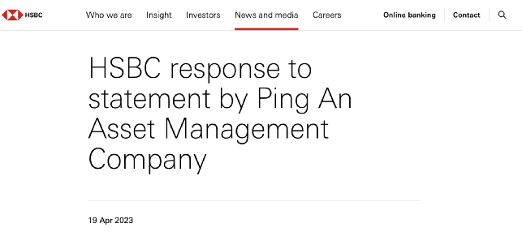

# 2年少分超60亿元！平安翻脸汇丰背后，高位买成大股东

_来源：视觉中国_

作者 | 肖望

编辑 | 杨布丁

出品 | 棱镜·腾讯小满工作室

“（包括战略重组亚洲业务及股息政策在内的议案）我们已经做出充分考虑，并强烈建议全体股东投反对票。”在5月5日傍晚举行的汇丰控股（00005.HK）2023年股东大会上，集团行政总裁祈耀年在声明中措辞强硬。

而晚间十点半披露的投票表决结果显示，上述两项议案在股东大会上遭到否决。汇丰集团董事会主席杜嘉棋表示，“我很高兴大部分汇丰股东以压倒性票数支持银行的策略，并拒绝再辩论银行的架构。”

汇丰集团第一大股东平安集团是上述两项议案的最主要支持者。平安集团发言人随后发表的声明称，公司尊重汇丰股东们在投票之后的选择。

至此，平安集团与汇丰控股就重组亚洲业务的纷争暂告一段落，但双方的龃龉却彻底摊开在台前。

从浓情蜜意到措辞强硬隔空喊话，平安和汇丰这两大金融巨头之间发生了什么？

**隔空互怼，平安“打脸”汇丰**

汇丰此次股东大会备受关注。包括其第一大股东平安资管在内的股东发出两项提议：一是敦促汇丰进行结构性改革，可包括（但不限于）将亚洲业务从西方业务中分拆出来，进行策略性重组及重整；二是只要有足够可分派利润，汇丰就应按新冠疫情前水平宣派股息，即每年不少于每股0.51美元（每季度支付）。

在股东大会上，CEO祈耀年表示，我们去年已审视多个替代结构方案，并深入考虑第三方顾问提出的意见和挑战，“我们的分析清楚显示这些选项将会损害汇丰的价值，令大家的股息蒙受风险”。

对于分红提议，祈耀年称，不认为按一个绝对水平派息在财务上合理、审慎或可行。设定派息比率、将股息和利润水平挂钩，是更加务实的做法，广为金融服务和其他行业采用。

投票结果显示，19.78%的投票赞成重组汇丰亚洲业务提议，19.20%的投票赞成股息政策提议。汇丰称，按大约50%的投票率推算，平安的票数约占大会投票比例的18-19%。这一投票率与过往几年一致。

中小股东关于汇丰分拆亚洲业务独立上市的提议已有多年，但直到去年4月，事态出现转变：这一次，第一大股东平安集团表示了支持。

2022年5月1日，据21世纪经济报道，平安集团对此回应：“凡是有投资者提出对于汇丰的经营管理有帮助、对长期价值增长有帮助的改革，我们都是支持的。”但对于平安集团已向汇丰董事会提交分拆计划的消息不予回应。

此后8月份的中国平安2022年中期业绩会上，平安集团延续了这一表态。

及至去年11月份，平安资管董事长黄勇在媒体交流中将汇丰有关的热点问题一一解答。黄勇直言，“近年来，如你们所观察到的，市场对汇丰的业绩、分红、市值等表现都比较失望”，并表示，建议汇丰以开放的心态，认真、审慎研究各方意见和建议，将有建设性的意见列入重要的议事日程，而不是简单地选择回避和拒绝。

在今年汇丰股东大会召开前夕，双方的论战达到白热化程度。

4月18日，黄勇发布《平安资管公司关于汇丰控股的原则和立场》，建议从原来的分拆方案调整为战略重组方案，并指出：尽管不断提出开放交流的请求，其他股东也提出了类似要求，汇丰团队及其指定的付费外部顾问，对审查任何结构性重组方案都保持先入为主的成见。

_汇丰在集团官网回应平安资管提议_

汇丰随即回应，称平安的提议将大大冲击汇丰战略所依赖的国际化商业模式，这将对收益、回报、股息和股东价值产生实质性侵蚀，并破坏其独特的全球客户服务主张。

汇丰还称，其在2022年和2023年与平安进行了广泛的高级别接触，包括和董事长、CEO、首席财务官和高管层的约20次会议。

4月21日，黄勇再度发声，打脸汇丰，直言“迄今为止，汇丰从未就新战略重组方案与平安做正式的讨论”。

**近两年少分超60亿，大股东的痛**

最新数据显示，平安资管持有汇丰控股16.55亿股，持股比例达8.38%，持股市值达967亿港元，超越资管巨头贝莱德占据汇丰控股第一大股东地位。

2002年时，汇丰集团入股中国平安，成为其第一大股东，后于2012年称因自身战略调整清仓。据媒体测算，其10年间获利超4倍，达587亿港元之巨。而平安自2015年开始投资汇丰，并于2018年末跻身第一大股东之列。平安和汇丰的这种联系一度成为资本市场的一段佳话。

2020年4月1日，汇丰宣布应英国审慎监管局要求，取消2019年第四次派息，同时考虑新冠肺炎疫情对全球经济的严重影响，在2020年底前暂停派息及回购股份。

消息一经宣布，汇丰控股当日股价大跌。投资者直言：“不分红的银行股还有什么意义？”

这在汇丰的历史上极为罕见。汇丰自1986年起每年稳定分派股息，哪怕在2008年金融危机后也只是减少末期派息而非暂停。

因为持续高分红策略，汇丰控股尤其受香港本地群众喜爱，汇丰的股票甚至成为亲朋好友间的送礼佳品，其还被称为“孤儿寡母股”：即便独自拉扯孩子的寡母，靠汇丰股票分红也能安稳养家。

平安投资汇丰，也正是看中其持续、稳定的高分红特点。

在2018年买成其第一大股东后，平安集团曾对此回应称，“该等投资纯属保险资金的财务性投资，中国平安看好汇丰的发展前景，且汇丰的分红率较高，符合保险资金的风险偏好和投资收益要求。”

的确，对当时保险可投资金2.79万亿、如今4.37万亿的平安集团来讲，如此庞大的可投资金要想获得持续较高的稳定回报殊为不易。高分红、股价相对稳定的大蓝筹成为其重点投资项目，除汇丰控股外，平安集团还重点投资了工商银行、招商银行、长江电力、碧桂园等。

作者计算，假设汇丰维持80%的股利支付率，则2021年和2022年平安从汇丰控股取得的分红少了近60亿元人民币（8.63亿美元，折合当下59.64亿元）。而此前多年汇丰股利支付率超过100%，意味着平安成为第一大股东后得到的分红落差更大，作者以此估算，平安近三年少分95.96亿元（13.89亿美元）。

此外，汇丰控股的股价更令平安坐立难安。在平安大举入股汇丰的2017末和2018年，汇丰控股正处于股价的历史高点，最高一度达72.37港元/股。疫情期间汇丰控股股价大幅下跌，2020年9月更是跌至21.867港元/股的低点，尽管此后触底反弹，到当前达到58港元/股左右，但距离巅峰仍有差距。而投资浮亏则会以公允价值计量并计入当期损益。

在去年11月的访谈中，黄勇历数平安对投资汇丰的失望之处：1． 汇丰的有形股本回报率（RoTE）落后于同业；2． 汇丰的市场排名大幅落后于同业；3．
汇丰的经营业绩落后于同业。汇丰的成本收入比，也显著高于可比同业对标行的水平。

黄勇还称，汇丰近两个季度业绩有所改善是在全球利率上升的背景下， 然而加息周期是阶段性的、不可持续的。

或许可以安慰平安的是，汇丰宣布今年一季度恢复季度派息，每股10美分恢复至疫情前水平，如果改革策略能够达到计划目标，2023年及2024年还会增派股息。汇丰还宣布回购最多20亿美元股份，这有助于提高股东的投资回报。

**环球策略，从“左右逢源”到“左右为难”**

汇丰以“环球金融、全球银行”模式著称。在回应平安资管的声明中，汇丰称，其不是分散的本地银行的组合，而是一家多地区融合的银行，重组将破坏其全球互联的核心商业模式，而这是收入的关键驱动力。并称重组或独立上市将影响国际客户的体验和服务，重组将增加运营成本，并存在较大复杂性和执行风险。

汇丰起家于中国香港，凭借英资背景在清政府时期获得诸多特权，并伴随香港经济腾飞在香港站稳脚跟。直到1977年汇丰大班（主席）沈弼上台后，才着手部署“三脚凳”的集团国际化战略，即亚洲、美洲和欧洲业务齐头并进。

历史上，汇丰也曾受益于国际化多地区布局，例如亚洲金融风暴期间，汇丰收购的英国米特兰银行贡献当时最大的利润来源。而在2008年金融危机期间，北美地区的巨亏被汇丰欧洲、中国香港和亚太地区贡献的利润所弥补。

但近年来，汇丰在香港和亚太地区的利润贡献愈发突出，这也愈发令亚洲地区投资者们不满。

平安方面指出：亚洲业务是汇丰的利润支柱，然而汇丰过去的全球资源配置策略一直以亚洲业务利润补贴欧美，汇丰亚洲难以获得充足的发展资源。

黄勇称，环球金融模式在上世纪一度主导并塑造全球金融业，如今其弊端、成本与风险日益突显。尤其是1997年、2008年两次全球金融危机后，金融市场风险、地缘政治风险等跨国传递的负面影响持续加大。一方面，各国政府及监管对于承担跨国银行所有非本土市场的风险压力，通常是十分担忧甚至是反感的；另一方面，跨国银行在全球经营，必须承担沉重的重叠监管成本、重叠风险成本、重叠资本需求，近年来，不断有欧美跨国银行宣布从部分区域退出，进一步收缩环球金融布局。

他建议汇丰从长计议、未雨绸缪，充分思考“新的环球模式”，全方位仔细评估环球金融模式的整体价值与业绩贡献，在环球金融模式与跨国系统性风险、地缘政治风险之间取得平衡，实现长期可持续稳定经营。仅靠退出少数规模不大的市场或业务，是无法从根本上解决这些问题的。

有资深金融市场人士对作者称，汇丰此前受益于“左右逢源”，但在当下，环球银行面临者更为复杂的地缘政治风险和更严苛的金融监管，很容易陷入“左右为难”的处境。

