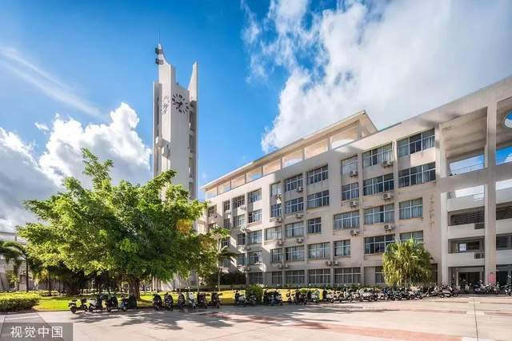

# “留学”海南，你去么？

在海南，境外高校可以独资办学了。

近日，教育部联合海南省政府研究制定的《境外高等教育机构在海南自由贸易港办学暂行规定》（以下简称《规定》）明确，境外高水平大学、职业院校，可在海南自由贸易港设立理工农医类学校或者校区。

具体在培养方面，《规定》显示，境外高等教育机构按照不低于本机构的教师配备标准，选派或者招聘足够数量的教师到办学机构任教，鼓励办学机构引进国内急需、在国际上具有先进性的课程和教材，鼓励办学机构和境外高等教育机构互派学生、互认学分。

教育部有关司局负责人、海南省政府有关部门负责人也以答记者问形式说明，与既有的中外合作办学相比，海南自贸港办学的特点是，境外高等教育机构不需要中方教育机构共同参与举办。在学校治理方面，在决策机构人员构成、招生、教学、学术治理等方面有更大的自主性。

最近，海南开启全岛封关的准备工作，为全岛自贸港再度全力冲刺。建设自贸港大局下，未来海南会成为教育高地吗？未来不用出境留学，就可就读境外大学?

_海南大学一景
图/视觉中国_

**为什么是海南**

自2020年6月中共中央、国务院发布《海南自由贸易港建设总体方案》以来，海南在自贸港建设方面取得多项进展。2023年3月底，海南宣布开启全岛封关准备，为进一步发展自贸港做准备。

作为目前我国最大的经济特区，海南具有实施全面深化改革和试验最高水平开放政策的独特优势，自由贸易港则是当今世界最高水平的开放形态。在专家看来，海南开放境外高校独资办学，是作为自由贸易试验区在高等教育走向开放中一次带有试验性质的尝试。与此同时，也与海南自由贸易港建设有直接关联，是海南自贸港建设的现实需要。

事实上，要建立高水平的自贸港，相关人才不可或缺，但在教育专家看来，海南现行的高等教育体系与人才培养体系，还存在不少短板。

海南大学经济学院前院长李世杰教授，长期研究海南经济发展与人才培养情况，并担任省委组织部设立的海南自由贸易港人才发展研究院院长。在他看来，目前海南缺乏人才的现状，是全方位的。

“一方面，海南缺少高精尖人才。海南本土在过去几十年历史上，只培养出过1位橡胶领域的院士，引进过1位生物医学领域院士担任校长；而目前在深海、航天、生物科技等紧缺行业领域，海南非常缺乏尖端人才。另外一方面，海南也缺乏应用型人才。”他说。

中国教育科学研究院研究员储朝晖直言，海南的高等教育不论与邻近的广东相比，还是从全国层面观察，都是相对落后的。

教育部全国高等学校名单显示：海南省目前仅有21所大学，包括海南大学、海南师范大学、海南医学院、海南热带海洋学院等8所本科层次高校和13所专科层次高校。

“在海南现有的8所本科高校中，只有海南大学属于综合性大学，海南师范大学、海南医学院、海南热带海洋学院等高校，培育方向更加偏向于师范、医学等特定专业领域。”李世杰对中国新闻周刊表示。

在本就不多的高校中，毕业生的留琼率也不容乐观。

李世杰说，以海南大学为例，由于学校外地生源占比约70%，很多外地生源一毕业就返回家乡，留下来的动机不强。而且，1988年海南岛才独立建省，此前一直隶属广东省，由于历史沿革，本地很多生源也被广州等珠三角城市吸引。

在整体缺乏人才的情况下，海南自贸港建设急需的重点领域，情况同样不容乐观。

目前全世界有130多个自由贸易港。新加坡、香港、鹿特丹、迪拜等地区，都是世界知名的自贸港。

以新加坡为例，新加坡之所以能发展成为亚洲地区重要的金融、贸易和航运中心，与其高度开放的自由贸易港定位息息相关。新加坡港是世界上最大的货柜转口中心，转口贸易占新加坡港货物处理总量的80%，在港口以及物流方面，新加坡集聚了不少人才和先进经验。

李世杰说，目前海南高校的专业设置，与建设自贸港需要的方向，存在一定程度的错配。

“以物流专业为例，现在海南高校未听说过有能培养海洋物流人才的学科专业，目前开办物流和供应链专业的几所高校，开设的也都是‘大物流’层面的课程。而类似海员管理、船舶管理、航空器管理等海南海洋物流发展急缺的专业，海南本地高校基本没有培养能力。”李世杰说。

此外，要建设高水平的自贸港，服务业是非常关键的一环。在不少专家看来，相比其他自贸港，海南工业底色较弱，但拥有较出色的气候条件和旅游资源，因此通过服务业吸引境内外人才的重要性更加凸显。

“比如，海南的气候和自然条件非常适宜发展医疗康养产业，但海南现有医疗资源不足，高校对医疗康养人才培养也不充分，缺乏能够服务于康养行业的人才。”李世杰说。

本地高校快速设置相关专业是选择之一。

李世杰说，海南大学最近几年才刚刚设立生物医学工程专业，目的在于匹配海南相关产业发展方面的需求，目前第一批毕业生还未走向社会。

但并非每一个当地紧缺专业，本地高校都可以快速设置。

“境外高校的专业设置和国内不同，相对灵活。国内高校的专业设置则要遵循较为严格的专业目录、专业代码等，并需要教育主管部门审批通过后才能开展招生培养工作。如果市场急需某一个专业，比如海南当前紧缺的游艇运营、维护方面的人才，但教育部目录里面没有，国内高校无法按此专业招生培养人才，而境外很多高校则可以根据市场需要，灵活调整招生专业。”李世杰说。

不可忽视的是，不少自贸港需要的专业领域，部分境外高校更是有着多年积淀的优势。《规定》中也明确表示，鼓励办学机构引进国内急需、在国际上具有先进性的课程和教材。

在李世杰看来，允许境外高校在海南独资办学，相当于在海南探索教育领域开放创新，在解决人才培育本地化问题的同时，通过推动教育领域开放来“倒逼”教育领域体制机制改革。

**只是第一步**

除了普通高校，在特定领域的高等职业教育方面，不少境外教学机构，同样积聚一定优势。

“很多游客喜欢到海南冲浪、潜水。在调研的过程中，我们发现有很多从业者都是来自东南亚、南美等国家的外籍人士，他们在海南除了从事冲浪、潜水的教学、训练等之外，还会兼做滑板等设备的维修。这些年海南岛内培养的旅游人才，大多数限于导游、酒店管理等领域。我们同样需要更加专业化、在细分市场的职业教育机构来培养市场所需人才。”李世杰说。

允许境外大学直接海南办学，可能只是海南自贸港相关配套政策的第一步。李世杰说，海南目前在谋划境外人才引进，已经着手研究海南自贸港的境外人才工作许可的负面清单，清单出台以后，负面清单以外的岗位都可以向境外人士开放。

“海南省还在研究出台境外人才资历、资格认定等方面的相关目录，以及他们在境内评聘职称方面的许可清单，从而为境外人才在海南的入职、晋升、成长提供相应的政策保障。”李世杰补充。

近年来，我国留学市场一片火热，最近几年留学生人数峰值是在疫情前的2019年。根据教育部数据，这一年，出国留学人员总数为70.35万人，较上一年度增加4.14万人，增长6.25%。

1978至2019年度，各类出国留学人员累计达656.06万人，其中165.62万人正在国外进行相关阶段的学习或研究；490.44万人已完成学业，423.17万人在完成学业后选择回国发展，占已完成学业群体的86.28%。庞大的留学生群体，也催生出较成熟的留学服务上下游产业链条。

目前，在海南多所高校中，仅有海南大学一所211、双一流高校。

值得注意的是，《规定》显示，海南自由贸易港办学的境外高等教育机构应当符合具有良好的办学声誉和较高的国际知名度、具有理工农医类方面的学科优势、毕业生具有较高的就业质量和良好的业内评价。

在教育专家看来，这为国际名校直接进入海南办分校，提供了可能。

“如果海南真能吸引到国际名校的分校，必然对部分留学生群体产生巨大吸引力，特别是对留学费用相对敏感的群体。”有留学中介工作对中国新闻周刊表示。

允许境外大学在海南独资办学，也被认为中国高等教育不断走向开放的关键一步。储朝晖说，这一做法本身是中国教育对外开放的一个组成部分，也带有试验性质。长久来看，中国教育对外开放是一个稳定、长期的政策，具体到如何去开放，如何发挥积极的效果，可能需要时间探索。

根据教育部公布的数据，截至2020年底，我国有中外合作办学机构和项目2332个，其中本科以上1230个。这其中，不乏宁波诺丁汉大学、西交利物浦大学等一批相对成功的中外合办大学。

在21世纪教育研究院院长熊丙奇看来，这一模式的优点是可以利用双方的资源优势，但也存在弊端，所有合作办学的大学和项目，都被纳入国内教育管理体制，实行统一招生、统一授予文凭，缺乏充分的办学自主权，对推进国内高等教育改革的作用有限。

直接允许境外大学办学，会不会出现水土不服的现象？会不会在体制机制上出现问题？这成为部分行业人士的担忧。

在熊丙奇看来，这一担心是多余的。他说，“近年来，我国一直把在海外名校留学的学生作为优秀人才，吸引他们回国就业、创业，对于他们在国外的求学经历，国内舆论与用人单位都是认可的，也就没有理由担心境外高等教育机构在内地办分校，不能培养出满足社会需要的优秀人才。”

值得一提的是，按照《规定》，办学机构应当按照中国对同级同类教育机构的要求开设包括中国宪法、法律、公民道德、国情等内容的课程。同时，办学机构选用境外教材按照国家关于高等学校选用境外教材的有关规定执行。

熊丙奇补充说，所有在我国内地办学的机构，都必须遵守有关教育法律法规，如果学校不遵守教育法律法规，可依法进行处理。

作者：赵越

