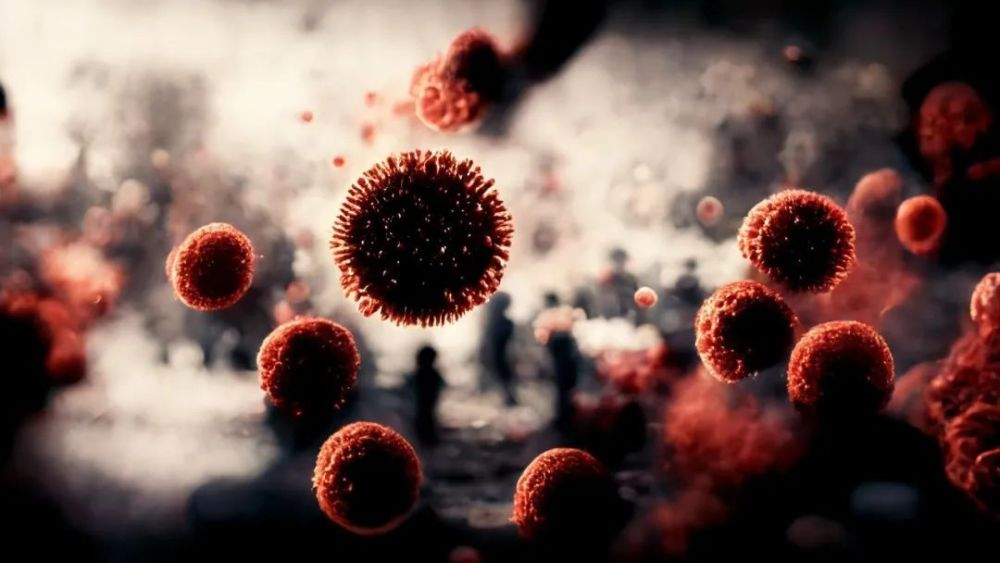
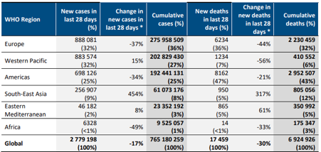
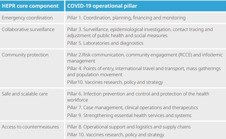

# 世卫宣告新冠紧急状态结束，专家：大流行退场但疫情不会消失

_图源：pixabay_

**撰文|周叶斌**

2023年5月5日，世界卫生组织（WHO）总干事谭德赛宣布接受前一天举行的第15次WHO新冠紧急会议的建议，不再将新冠疫情列为全球公卫紧急事件（public
health emergency of international
concern，PHEIC）[1]。这在某种程度上可以视作三年多的新冠全球大流行结束的象征，也意味着我们应对新冠的方式方法会步入新阶段。

**结束新冠大流行水到渠成**

自2020年1月30日WHO宣布新冠为全球公卫紧急事件（PHEIC）起，共组织了15次紧急会议。PHEIC的宣布在疫情早期提高了全球这个新型传染病的警惕性，之后则协调了全球的应对，包括跟踪新变异株的出现、推广新冠疫苗以及治疗药物等重要事项。这些显然在整个疫情期间起了巨大的作用。

可在最近几次WHO的新冠紧急会议中，新冠疫情是否能从PHEIC中移除，是否可以由WHO来做一个有象征意义的宣布新冠大流行结束，逐渐成了核心议题。

为什么会出现这种变化？一方面是任何紧急状态必然要有一个终点，威胁再大的疾病，最终也需要通过构建长期稳定的防范措施来应对，而不是一直“特事特办”。但更重要要的原因是新冠疫情真的变了。如同谭德赛在宣布取消新冠PHEIC时提到的，过去一年里，新冠疫情整体处于下行状态。而根据WHO在5月4日发布的最新一期全球新冠流行病学更新来看，近在4月全球新增感染与死亡分别比过去一个月下降17%与30%[2]。

_图1.全球新冠新增感染与死亡病例持续走低_

即便东南亚地区因XBB.1.16等新病毒株的出现引发了当地疫情反弹，可是这种反弹并没有影响全球疫情走势，而且当地无论是感染病例数还是重症、死亡人数都远低于以往疫情高峰时期。

从流行病学的数据来看，新冠疫情变得不那么冲击全球、威胁全球人类健康了。

这背后最为重要的一个原因是全球人群对新冠的免疫水平一直维持在比较高的水平。这种群体高免疫水平来自两个方面，一是大量的疫苗接种，在5月4日的15次WHO新冠紧急会议里公布的一个数据是，全球已经接种了133亿剂新冠疫苗，全球82%的60岁以上老人与89%的医务工作人员都完成了基础免疫[1]。另一方面，三年多疫情，特别是2022年初奥密克戎疫情暴发以来，全球很多人也经历了自然感染，有的还是多次自然感染。疫苗接种与过往感染结合，让全球绝大多数人都对新冠有了一定免疫防护，降低了新冠的致病能力，也降低了新冠的健康威胁。

当然，传染病的健康威胁是病原体与宿主双方角力决定的。如果说人群免疫水平提升是宿主一方让新冠威胁降低的主要因素，那么如今新冠健康影响降低的另一大原因则是在病原体一边，近一年半来全球主要流行的病毒株均是奥密克戎的亚株。尽管各个奥密克戎亚株仍在不断演变，但在转播能力、致病性等方面均处于相对稳定的状态。

人群免疫水平让新冠的健康威胁下降，病毒株的内在攻击力稳定，两厢叠加，让我们看到了新冠病毒在全球的冲击日益降低，也使得把新冠疫情移出PHEIC，告知世界大流行结束了，变得水到渠成。

**新冠没有消失**

WHO总干事谭德赛宣布新冠PHEIC结束是依据WHO新冠紧急会议专家组的意见，而专家们做出此决定是参考PHEIC的标准：新冠是否还是超乎寻常的事件；新冠是否还会通过国际间的传播对各国造成公卫威胁；新冠是否还需要国际协调来应对。尽管全球感染仍然很多，新冠病毒的演变也没有停止，可如前文提到的，随着疫情趋于稳定，对全球健康威胁下降，如今的新冠疫情很难再被定义为超乎寻常的事件。这也让WHO的专家组与总干事谭德赛都能有理有据地宣布新冠不再需要全球以紧急状态面对。

宣布新冠PHEIC结束，无疑可以视作我们走出新冠大流行的一个象征。在疫情暴发的第四个年头里，这也是我们翘首以盼的一天。

可是在庆贺这一极具标志性的时刻的同时，我们也不能忽视现实：新冠病毒并没有消失，新冠构成的健康威胁不再构成全球大流行也并不意味着新冠就不再是健康威胁。

新冠仍然是一个需要我们去面对，不应从此忽略的疾病。截止2023年4月底，全球累计新冠感染病例超过7.65亿，死亡超过690万人，这固然反映的主要是过去近三年半大流行的冲击，可即便如今，全球每个月因新冠死亡的人数也接近两万[2]。

不仅在全球，新冠不是一个可以被忽视的疾病，大流行的结束也不意味着全球各地区都同时同步地不再受疫情威胁。例如，美国在如今的疫情低谷每周仍然有超过一千人死于新冠，意味着新冠将成为美国长期要面对的健康负担[3]。我们也看到最近东南亚地区由于新的奥密克戎亚株影响，疫情处于反弹期。而中国过去几周出现了XBB株系取得其它奥密克戎病毒株的迹象，可能意味着第二波疫情即将形成[4]。

我们仍然要认识到新冠对高危人群的威胁不能忽视，帮助我们降低新冠致病力的人群免疫水平也会随时间出现下滑导致感染波动，而新冠病毒的持续演变也意味着这个病毒不会被人群免疫屏障消灭。

因此，当新冠不再是全球大流行，不再是PHEIC，不代表新冠病毒消失了，甚至也不代表新冠疫情消失了，而是督促我们需要开始更长远地应对新冠。

**长期管好新冠的征途刚刚开始**

在PHEIC之下，全球应对新冠有诸多特别合作以及经费支持，这些随着新冠PHEIC的解除将停止或转变方式。面对并未消失，在不同地区可能还有差异波动的新冠，各国在新冠PHEIC终止后，需要建立长期的新冠应对方案。

为此，WHO在5月3日发布了2023-2025年新冠由紧急状态向长期疾病管理的战略计划方案，提出了包括紧急协调、联合监测、社区保护、安全可调整的医疗方案以及具有可及性的防护措施五个方向的十项关键建议[5]。

_图2.
WHO对新冠长期管理的建议_

宣布终止新冠PHEIC的声明中，WHO也再度强调了多项帮助各国过渡到长期应对新冠的建议。例如，新冠还在不断演变，对新冠病毒的监测也仍然至关重要。在紧急状态下，新冠感染的检测、基因组定序往往是单独立项获取经费支持，未来需要纳入到包括流感病毒监测在内的长期系统中。

又比如，在降低新冠健康威胁中至关重要的新冠疫苗。多个以史无前例的速度研发出来的高效疫苗，无疑会成为药物研发史上特殊的一章。可是我们无法一直沿用大流行时期隔几个月临时决定要不要再增加一针疫苗的随机打补丁方案，而是需要将新冠疫苗纳入到常规的疫苗接种项目中。

而在新冠对全球、全人群威胁下降的背景之下，不同地区的疫情反复往往让当地的老年人以及有多种基础疾病的高位人群处于波动的风险之中，如何向不同人群沟通真实准确又贴近他（她）们实际情况的健康风险，也应是一项长久工程。

我们更不能忘记新冠仍然是一个进入人类视线不到4年的“新鲜”病毒。对这个病毒以及它引起的疾病还有很多未知需要去研究、探索。新冠病毒今后会如何进化，我们能否研发出更广谱、持久性更好，甚至能彻底阻断传播的新冠疫苗？而很多康复者仍然受到新冠后综合征，即新冠后遗症的困扰，造成这类“长新冠”的原因是什么？有什么药物、治疗手段能帮助他（她）们？这些都需要我们在未来几年乃至几十年间，继续支持新冠的研究。

WHO宣布新冠PHEIC结束一方面可以视作新冠大流行结束的象征，可另一方面，也可以视作长期管理、应对新冠的开端。

**大流行的教训与希望**

三年多的疫情深刻改变了我们的生活、我们的社会。当我们看到生活逐渐恢复正常，假期再度游人如织时，很多人就有诸多感概。而在极具象征意义的WHO宣布新冠全球公卫紧急状态结束之际，大多数人同样也可能有不少感触。

作为新冠大流行的亲历者，我们每个人身边甚至自己身上可能都发生了很多会影响我们终身的故事。

在这些故事里，我们无疑看到了现代科技的进步，短短几周，科学家确认了新冠病毒的基因组；不到一年，全球研制了多个新冠疫苗；三年，新冠抗病毒药物得以大量推广。病毒基因组监测更是让我们做到了对病毒演变近乎实时的跟踪，甚至还具备了一定的预测能力。

另一些故事则让我们看到了第一线工作人员的不易与努力。这里面既有穿梭忙碌的医务人员，也有维持社会基本运转的关键岗位人员——他（她）们的工作未必光鲜亮丽，可能只是超市的勤杂工，也可能只是货车司机、送货员，但毫无疑问，三年多疫情让我们在多个特殊的时刻意识到我们正常的生活是建立在他（她）们的工作之上。

作为个人，我们很难忘记这些故事，而作为国家、社会，我们也不应忘记这些故事背后的经验、教训与启示。在解释为何解除新冠PHEIC的电话会议上，多位WHO工作人员鼓励各国汲取新冠大流行中的经验教训。例如WHO新冠领域的技术负责人Maria
Van Kerkhove就表示“我们不应忘记那些火堆。不应忘记那些坟墓。在场的我们没法忘记那些。”

新冠大流行导致了很多困境，也暴露或者恶化了很多社会中本就存在的问题。例如医疗资源分配的极度不公被疫情放大，威胁着很多人的健康。又比如疫情让大量学生没法获得良好的教育体验，也进一步恶化了本就日益严重的全球心理健康危机。而之前已经蔓延、危害全球的虚假信息，更是在疫情之中大肆扩张。

这些大流行里让我们失望、痛苦、愤怒、悲哀的一面，也该当作经验教训谨记。甚至需要我们如今去弥补、去改变，例如如何建立更公平的社会资源分配体系，如何为年轻人补上失去的教育机会，如何阻止各种虚假医学信息威胁人们的健康等等。

只有汲取这些经验教训，才能让我们以更一个更公正，更完善的社会走出新冠的阴影，让我们在走出大流行之时，感受到的不是劫后余生的庆幸，而是未来更多丰富多彩的希望。

**参考文献**

1\. https://www.who.int/news/item/05-05-2023-statement-on-the-fifteenth-
meeting-of-the-international-health-regulations-(2005)-emergency-committee-
regarding-the-coronavirus-disease-(covid-19)-pandemic

2\. https://www.who.int/publications/m/item/weekly-epidemiological-update-on-
covid-19---4-may-2023

3.https://covid.cdc.gov/covid-data-tracker/#trends_weeklydeaths_select_00

4.https://www.chinacdc.cn/jkzt/crb/zl/szkb_11803/

5.https://www.who.int/publications/i/item/WHO-WHE-SPP-2023.1

