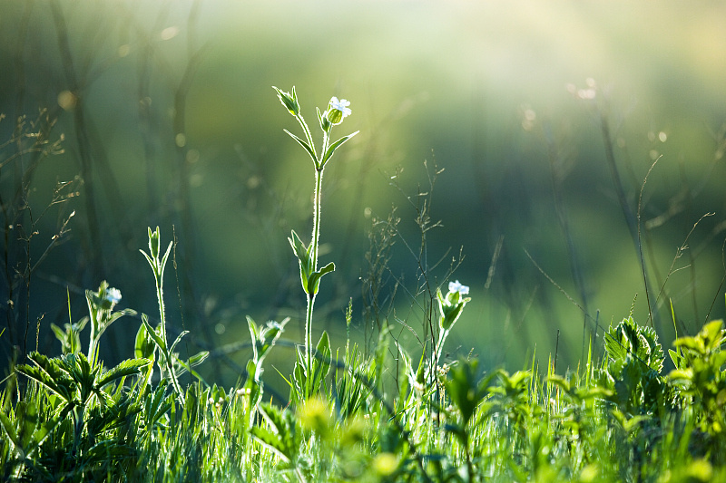
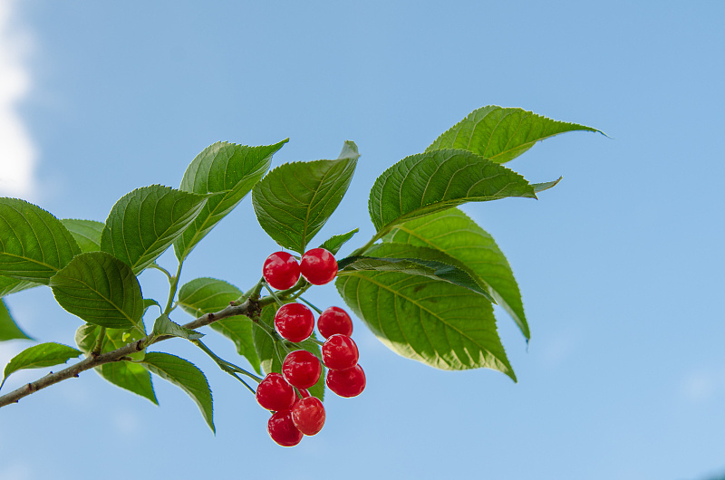
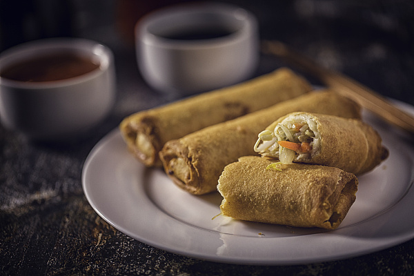
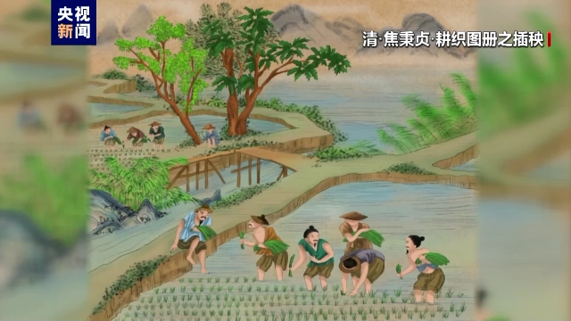
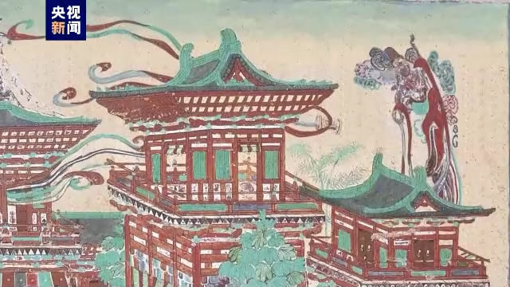
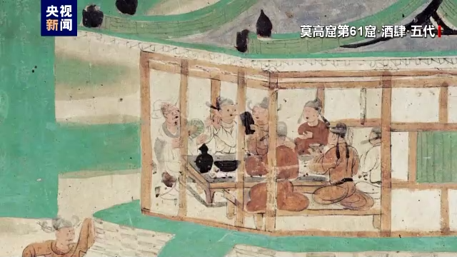

# 今日立夏，红摘樱桃青拈梅子，迎接清爽初夏

今天（6日）是二十四节气中的“立夏”，意味着从今天开始，我们告别了万物生长的春天，进入到众生并秀的夏天。

立夏，是二十四节气之一，也是干支历巳月的起始。

**“斗指东南，维为立夏，万物至此皆长大，故名立夏也。** ”立夏的“夏”是“大”的意思，“立夏”是指春天播种的植物到这时候已经直立长大了。

春生、夏长、秋收、冬藏，夏季是许多农作物旺盛生长的最好季节。

立夏·三候

**第一候：蝼蝈鸣**

蝼蝈，蝼蛄也，适宜温暖潮湿的环境中，随着蝼蛄的鸣叫，夏天的味道浓了。

**第二候：蚯蚓出**

蚯蚓是地地道道的阴物，生活在潮湿阴暗的土壤中，当阳气极盛的时候，蚯蚓也不耐烦了，出来凑凑热闹。

**第三候：王瓜生**

王瓜是华北特产的药用爬藤植物，在立夏时节快速攀爬生长，于六、七月更会结红色的果实。

就气候特点而言，立夏开始就正式进入雨季了。夏季是植物繁茂生长的季节，充足的日照和丰沛的雨量，为植物生长提供了很好的自然条件，农作物也进入茁壮生长的阶段。气温方面，我国幅员辽阔，南北各地自然节律不一，立夏以后南方已较为炎热，北方则凉爽少雨，而东北地区的气温尚处于春季。
**饮食起居方面也应跟随当地温湿度变化，做出相应的调整。**

「春生、夏长、秋收、冬藏」。经历过「春生」阶段阳气的一步步萌发，进入到「夏长」阶段，身体内的阳气逐渐向外扩张至体表，这一时期极易出现阳气外越而内里虚寒的状况。而夏与心相对应，随着气温越升越高，人们容易情绪焦躁，从而导致心火过旺，心律失常、血压升高等风险也随之增加。因此，
**立夏后「养心」是关键。**

**夏天是晨练的好时节。** 心阳在夏季最为旺盛，功能最强，此季节有利于心脏的生理活动，人在与节气相交之时故应顺之。所以，
**在整个夏季的养生中要注重对心脏的特别养护。**
《养生论》：“夏更宜调息净心，常如冰雪在心，炎热亦于吾心少减，不可以热为热，更生热矣。”立夏之际要注意清心除烦，使身体各脏腑功能正常。

立夏·诗词

立夏

宋·陆游

赤帜插城扉，东君整驾归。

泥新巢燕闹，花尽蜜蜂稀。

槐柳阴初密，帘栊暑尚微。

日斜汤沐罢，熟练试单衣。

山中立夏用坐客韵

宋·文天祥

归来泉石国，日月共溪翁。

夏气重渊底，春光万象中。

穷吟到云黑，淡饮胜裙红。

一阵弦声好，人间解愠风。

立夏日忆京师诸弟

唐·韦应物

改序念芳辰，烦襟倦日永。

夏木已成阴，公门昼恒静。

长风始飘阁，叠云才吐岭。

坐想离居人，还当惜徂景。

【04】立夏

宋·释居简

弦改南薰曲自调，萦回小篆水沉消。

叶舟自打窗前过，只有杨花度小桥。

【05】少年游 立夏

清·孙云凤

著柳烟浓，送春雨细，犹觉峭寒生。帘影参差，绿阴长昼，枝上杜鹃声。

去年今日阑干外，日暖午风轻。红摘樱桃，青拈梅子，何处寄离情。

立夏·习俗

**1、迎夏**

古代，人们非常重视立夏。在立夏的这一天，古代帝王要率文武百官到京城南郊去迎夏，举行迎夏仪式。君臣一律穿朱色礼服，配朱色玉佩，连马匹、车旗都要朱红色的，以表达对丰收的祈求和美好的愿望。宫廷里“立夏日启冰，赐文武大臣”。冰是上年冬天贮藏的，由皇帝赐给百官。

**2、秤人**

立夏吃罢中饭，有秤人的习俗。古诗云：“立夏秤人轻重数，秤悬梁上笑喧闺。”人们挂起一杆大木秤，秤钩悬一根凳子，大家轮流坐到凳子上面秤人。

**3、斗蛋游戏**

那日中午，家家户户煮好囫囵蛋(鸡蛋带壳清煮，不能破损)，用冷水浸上数分钟之后再套上早已编织好的丝网袋，挂于孩子颈上。孩子们便三五成群，进行斗蛋游戏。

**4、做夏**

立夏季节，福州风俗流行煮鼎边“做夏”。鼎边糊(又称锅边糊)，用米浆涮锅边烧煮而成，配以虾米、虾油、葱菜、金针、黑木耳、蚬子，或少量香菇、蛏干等海鲜清汤，其味极为荤美可口。

**5、食面食**

我国北方多种植小麦，立夏正是小麦上场时节，因此北方大部分地区立夏时有制作与食用面食的习俗，意在庆祝小麦丰收。立夏的面食主要有夏饼、面饼和春卷三种。

立夏·两宜

**（1）午休**

立夏后，正午气候炎热时，人体血管扩张，使血液大量集中于体表。午饭后消化道的供血增多，大脑供血相对减少，人在午后常感到精神不振，困意频频。午睡的时间不宜太长，即使睡不着也要闭目养神，转转眼睛，能促进血液流注到眼部，缓解眼疲劳。

**（2）夜卧早起**

立夏后，昼长夜短愈加明显，人生天地之间，当顺应自然界阳盛阴衰的变化，《内经》中记载：“阳气尽则卧，阴气尽则寐”，在阴气最盛的子夜和阳气最盛的正午都要休息好，夜里应适当“晚睡”，但不应晚于11点，以保证子时进入睡眠状态，早晨要“早起”，在5点至7点之间起床，能够接受天地的清明之气，用饱满的精神状态和充足的体力迎接新的一天！

立夏·三忌

**（1）冷饮**

吃过多冷饮，会让“喜燥恶湿”的脾胃受伤，出现腹胀、食欲减退、容易困倦等消化道症状。夏季高温，雨水增多，易导致湿热盛行。冷饮内积，导致里生湿热，加之湿热天气的影响，人体也容易出现一些不适反应，包括口苦、食欲下降、腹泻，还可能出现皮肤湿疹。

**（2）大汗**

中医认为，“汗”为心之液，汗出过多易伤心阴，耗心阳。心“主血脉”，血汗同源，汗出过多会影响血液的充盈，使心脏功能发挥受阻。立夏以后，自然界中阳气渐长、阴气转弱，气温逐渐走高，体内新陈代谢加快，生活中要避免剧烈运动导致大汗淋漓，可选择散步、慢跑、打太极等慢节奏的有氧运动。

**（3）郁怒**

夏季属火，火气通于心，心“主神志”，天热心火浮，暑热易让人烦躁不安，心神被扰动，出现心神不宁，心跳加速，进而出现胸闷、气短等症状。《素问·上古大真论》言：“精神内守，病安从来？”说明养神对于养生的重要性。进入夏季，由于天气炎热，人们往往心躁不安，从而产生许多精神方面的不良症状。所以在精神调养方面，夏季应静心养性，清心寡欲，戒大喜大悲。多静心养神，少贪心杂念。平日戒躁戒怒，静养身心。

文物里的二十四节气·立夏

槐花新绽柳成荫，夏虫初鸣忙栽秧，一切生命的活力在此时开启倍速增长，万物都向着繁盛而去。

我国古代先人非常重视立夏的礼俗，据记载，这一天，天子要率领三公九卿诸大夫前往南郊迎夏；到了明清时期，紫禁城里举行“立夏日启冰”仪式，将去年冬天储藏的冰启封，分赐满朝文武。

夏日开端，万物褪去春的稚嫩，进入生长繁盛季。蚕也不例外，经历一个月的发育，终于到了开动体内小宇宙，吐出缕缕丝绒的时刻。从蚕茧到蚕丝，通过劳动变成丝绸，这个过程赋予蚕丝新生命，也成为莫高窟的创作元素，融进一个个灵动飘逸的飞天壁画，为文明留下记录。

古代石窟壁画显示，时至立夏，日暖、风微、雨细，人们多在露天酒肆、帐篷酒肆、宅子酒肆开怀畅饮。百姓来此任意喝上一碗，称作“打碗”。与山间花木相伴，又有乐舞表演，趁着岁时节令，来一场畅快相逢。

大众报业·半岛新闻综合自央视新闻、中国日历网、视觉中国等

