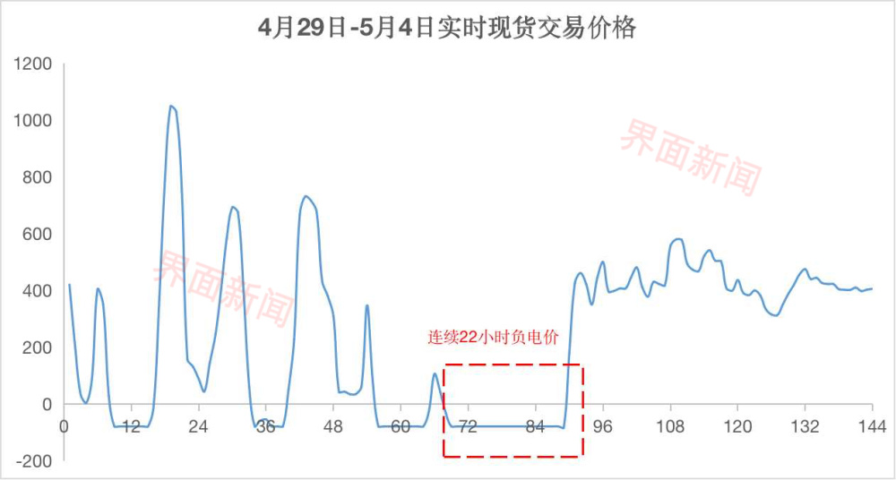

# 山东出现连续22小时负电价：卖一度电亏8分钱

界面新闻记者 ｜ 戴晶晶

今年“五一”期间，山东电力现货市场有两天内共出现了连续22个小时的负电价，刷新了国内电力现货市场负电价持续时间纪录。

山东电力交易中心数据显示，“五一”假期间，山东电力现货市场实时交易电价波动剧烈，区间为1047.51元/兆瓦时至-80元/兆瓦时（约为1.05元/度至-0.085元/度），多次出现负电价。

据界面新闻统计，4月29日-5月3日，山东电力现货实时交易累计出现46次的负电价。其中，从5月1日20时至5月2日17时，连续实时现货交易负电价时段长达22个小时。

这也使得5月1日全天山东实时现货交易电价均价成为负数，为-13.02元/兆瓦时。

_数据来源：山东电力交易中心_

按时间划分，将日以上的交易称为电力中长期交易（或远期交易），将日前及日以内的交易称为电力现货交易。

电力现货市场、中长期市场和辅助服务市场为电力市场的基本功能模块。其中，现货市场负责发现电力实时价格、准确反映供需关系，并实现电力系统的调峰。

山东省是全国第一批八个电力现货市场建设试点之一。

2019年12月11日，山东电力现货日前市场出现-40元/兆瓦时的出清价格，这也是国内首次出现负电价。此后，山东省现货市场负电价频现，负电价次数已超百余次。

今年3月13日，山东发改委印发《关于山东电力现货市场价格上下限规制有关事项的通知（征求意见稿）》，对市场电能量出清设置价格上限和下限，上限为1.5元/千瓦时，下限为-0.1元/千瓦时。

负电价意味着发电企业不仅不能靠卖电挣钱，还需要支付一定的费用给电网或用电方，以将电力卖出。

**作为价格信号，负电价的出现直接反映了电力市场供需的不平衡。**

“五一”假期间，由于部分工厂停工放假，工业用电大幅下降，山东电网负荷偏低。叠加该期间天气晴朗，风光发电量大增，煤电机组低容量运行，电力供应整体大量超过用电负荷。如果停止发电，可能带来的成本更高，所以部分发电方更愿意通过付费来进行电力消纳。

与普通燃煤机组发电不同，新能源发电具有波动性和间歇性。随着新能源装机容量增加，风、光大发时段与用户需求量不匹配，就容易出现负值的现货交易价格。

山东是国内光伏装机规模最大的省份。截至2023年3月底，山东光伏累计装机规模达到45.51 GW。其中，分布式光伏规模高达33.2
GW，装机容量也位列全国第一。

截至2022年底，山东光伏和风电装机容量分别占全省装机容量的34.6%。

在电力现货市场较为成熟的欧洲，负电价也早已普遍出现。

**在电力现货市场中以负电价交易，并不意味消费者也可以使用负电价。**

目前国内的居民电价和工商业电价受短期市场交易电价影响有限，尤其是居民电价，受政策规定的计费标准保障，波动不大。

此外，在中国的市场化交易电量中，约五分之四为中长期合同，现货市场占比较小。由于山东省在“五一”期间以负电价成交的电量并不明确，也无法判断对整体电力市场的影响。

随着今后新能源在电力系统中占比持续提升，现货市场中的负电价将可能常态化。但常态化并不代表着合理，负电价同时凸显了新能源消纳困境和电力无法大规模储存的困境。

负电价代表着部分时段的电力过剩，但绝不代表新能源装机已过剩。截至2022年底，山东的火电装机容量仍占62%，在“双碳”目标下，发电结构仍有较大调整空间。

根据《山东省能源发展“十四五”规划》，到2025年，山东光伏发电装机将达到5700万千瓦，风电装机达到2500万千瓦。

持续的负电价，或影响火电基础运行和新能源的进一步建设。在这种情况下，储能的建设仍有待进一步提速。

2022年12月，山东省能源局印发《山东省新型储能工程发展行动方案》提出，到2025年全省新型储能规模计划达到500万千瓦左右。其中，2023年规模达到200万千瓦以上；2024年规模达到400万千瓦。

