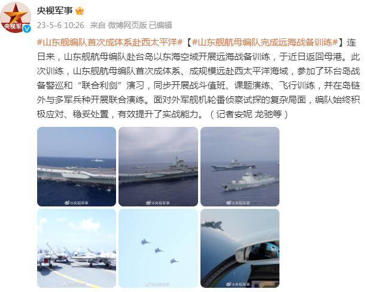
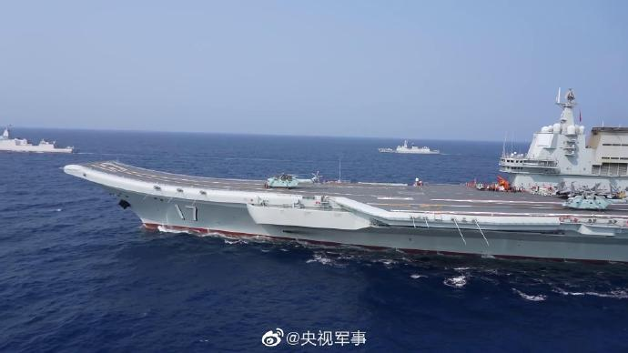
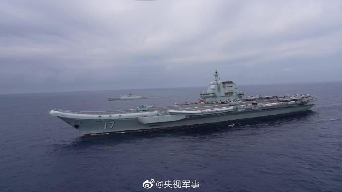
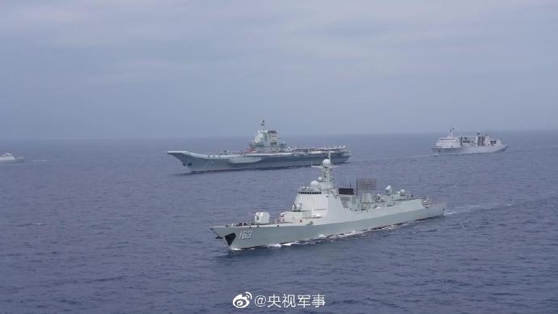
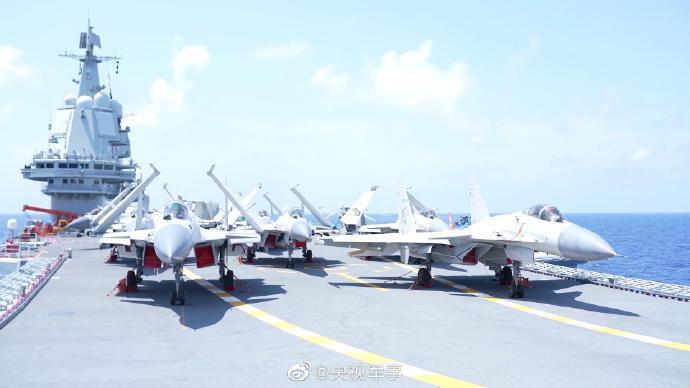
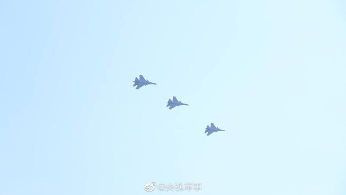

# 山东舰航母编队完成远海战备训练，首次成体系、成规模远赴西太平洋海域

来源：央视军事

连日来，山东舰航母编队赴台岛以东海空域开展远海战备训练，于近日返回母港。此次训练，山东舰航母编队首次成体系、成规模远赴西太平洋海域，参加了环台岛战备警巡和“联合利剑”演习，同步开展战斗值班、课题演练、飞行训练，并在岛链外与多军兵种开展联合演练。面对外军舰机轮番侦察试探的复杂局面，编队始终积极应对、稳妥处置，有效提升了实战能力。（记者安妮
龙驰等）

