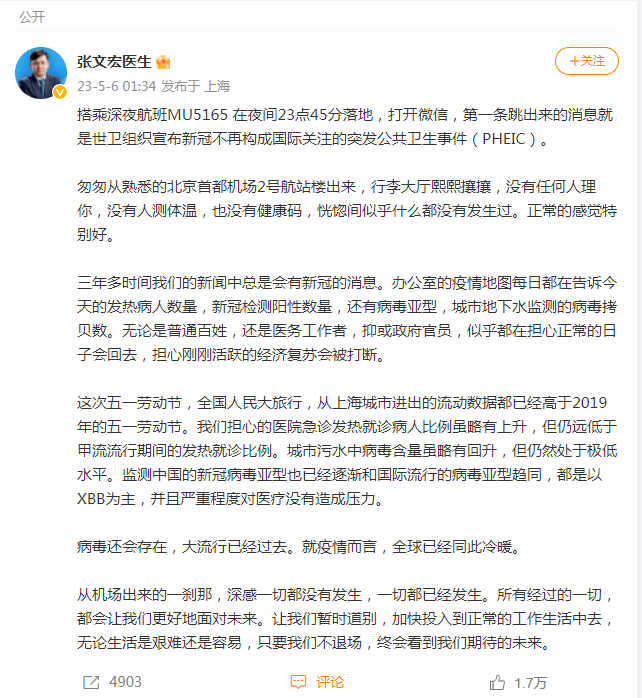
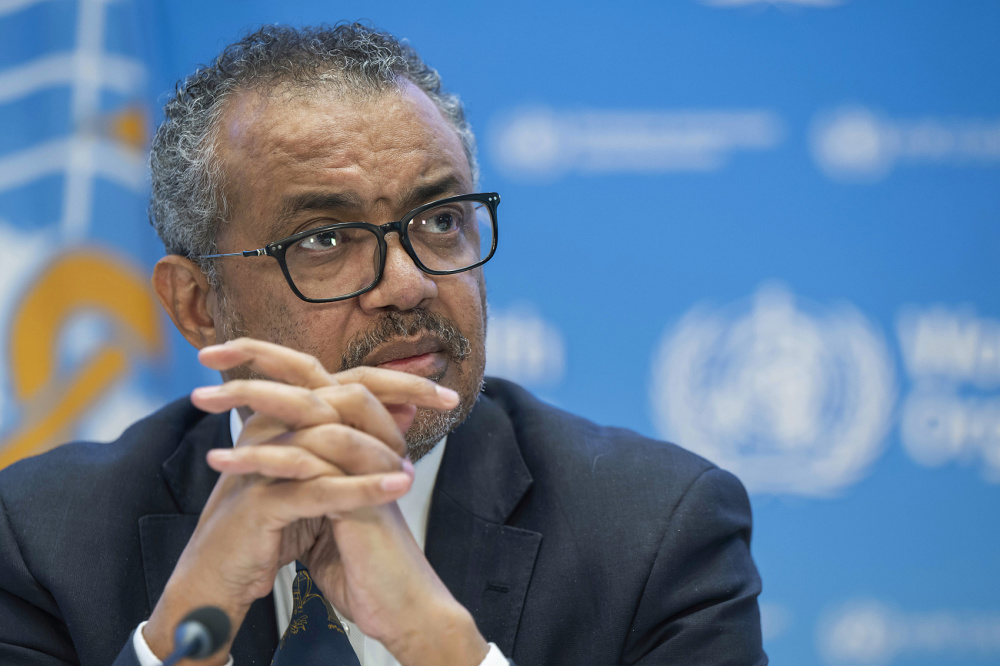

# 张文宏：病毒还会存在，但新冠大流行已经过去，正常的感觉特别好

5月5日，世卫组织宣布新冠不再构成国际关注的突发公共卫生事件。

张文宏医生5月6日凌晨在微博发文称，搭乘深夜航班MU5165
在夜间23点45分落地，打开微信，第一条跳出来的消息就是世卫组织宣布新冠不再构成国际关注的突发公共卫生事件（PHEIC）。

匆匆从熟悉的北京首都机场2号航站楼出来，行李大厅熙熙攘攘，没有任何人理你，没有人测体温，也没有健康码，恍惚间似乎什么都没有发生过。 **正常的感觉特别好**
。

这次五一劳动节，全国人民大旅行，从上海城市进出的流动数据都已经高于2019年的五一劳动节。我们担心的医院急诊发热就诊病人比例虽略有上升，但仍远低于甲流流行期间的发热就诊比例。城市污水中病毒含量虽略有回升，但仍然处于极低水平。监测中国的新冠病毒亚型也已经逐渐和国际流行的病毒亚型趋同，都是以XBB为主，并且严重程度对医疗没有造成压力。

**病毒还会存在，大流行已经过去。就疫情而言，全球已经同此冷暖。**

**张文宏表示，从机场出来的一刹那，深感一切都没有发生，一切都已经发生。所有经过的一切，都会让我们更好地面对未来。**
让我们暂时道别，加快投入到正常的工作生活中去，无论生活是艰难还是容易，只要我们不退场，终会看到我们期待的未来。

**新冠疫情不再构成“国际关注的突发公共卫生事件”**

据央视新闻，当地时间5月5日，世界卫生组织总干事谭德塞在日内瓦举行的发布会上宣布，新冠疫情不再构成“国际关注的突发公共卫生事件”。

从新冠疫情被世卫组织列为国际关注的突发公共卫生事件至今，经历了1191天（约3年3个月）。

新冠大流行迎来转折点，将给我国以及全球带来什么样的影响？

新华社记者采访国家卫生健康委疫情应对处置工作领导小组专家组组长梁万年、中国疾控中心应急中心副主任施国庆，第一时间作出解读。

**世卫组织决定表明目前可以有效控制新冠疫情危害**

问：世卫组织宣布新冠疫情不再构成“国际关注的突发公共卫生事件”，主要基于哪些方面考虑？

梁万年：我认为主要基于几个方面的考虑。第一，从当前流行态势来看，全球报告的新冠病毒感染人数、住院人数和ICU住院人数、病亡人数都处于持续下降状态。

第二，新冠病毒虽然持续变异，但变异株对人类健康的危害没有发生太大变化。

第三，全球来看，通过人群的自然感染和疫苗接种，已经建立比较良好的人群免疫屏障。

第四，3年多来，各国加强医疗救助体系和公共卫生体系的能力建设，包括人力资源、防护设备、药品等多方面能力都在加强。

综合这些要素来看，人类抵抗力与病毒之间已经取得一个较平衡的状态，也达到了《国际卫生条例》关于结束“国际关注的突发公共卫生事件”的基本要求。当然，结束“国际关注的突发公共卫生事件”并不意味着疫情危害就彻底没有，而是表明以人类目前的能力，可以有效控制这种危害。

**跨国交通、贸易、旅行等限制将进一步减少**

问：世卫组织这一决定，将在全球产生什么样的影响？对于我国意味着什么？

梁万年：对于跨国交通、贸易、旅行的一些限制，将进一步减少甚至消除，这应该是最大的影响。我国的国际交往包括贸易、旅游、学术交流等，都有望减少此前因部分疫情防控措施带来的不便。

当然，这并不意味着我国就对新冠疫情放任不管。只要疫情危害仍然存在，我们就还要继续做好相关防控工作，继续和全球各国紧密团结，共同采取更具针对性的措施，保护好人民群众的健康。

施国庆：世卫组织宣布新冠疫情不再构成“国际关注的突发公共卫生事件”，并不意味着新冠病毒流行的结束，我们仍处在新冠病毒的一个流行进程中，还要继续做好相关防控工作。

**监测新冠病毒变异情况，不断完善公共卫生体系**

问：下一步，我国将如何应对新冠疫情？

梁万年：有几个方面工作还需要继续坚持。一是坚持有效地监测新冠病毒变异情况和疫情的发生发展情况，同时补短板、强弱项，不断完善公共卫生体系。二是对一些高危人群和重点人群，继续加强疫苗接种。三是继续强化临床救治能力特别是重症的救治能力。四是呼吁大家保持已经养成的一些良好卫生习惯。

施国庆：我国已经建立了多渠道的监测预警体系，在城市社区、哨点医院、重点场所、城市污水等进行监测，不断观察疫情变化，及时做好风险研判。如果发现聚集性疫情，立刻启动现场调查。

我们要继续做好监测预警，掌握疫情流行趋势。同时，要加强健康教育和风险沟通，科学看待疫情，保持良好心态。

每日经济新闻综合央视新闻、张文宏微博、新华社

每日经济新闻

每经编辑：杜宇

