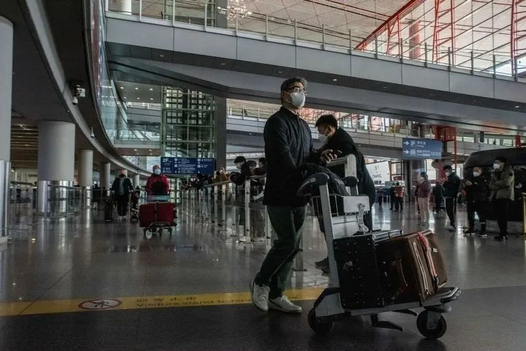
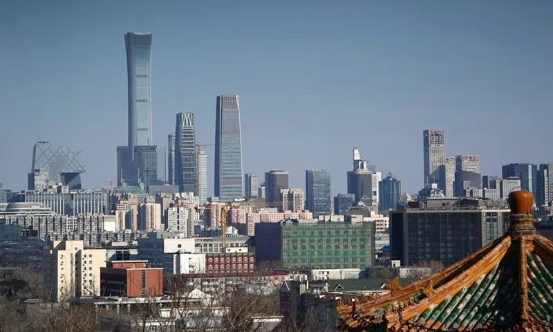

# 有些疫情期间关闭的大门，为何至今还没有打开？

世卫组织宣布新冠疫情不再构成国际关注的突发公共卫生事件。而刚刚过去的五一小长假，中国的消费和出行总人数都达到甚至超过了2019年的同期水平。世界在翻开新一页，中国的这一页尤其令人踌躇满志。

然而2019年不是我们的目标，我们必须迈上更高台阶，这是全国人民、尤其是年轻一代的强烈期望。

仔细观察， **疫情给我们造成的除了明面损失，还有一些“内伤”，这种“内伤”首先是一些地方和部门对责任以及“一失万无”的恐惧。**
疫情期间根据当时的需要实施了一些强管制措施，当时有的官员怕出事担责，搞“一刀切”甚至层层加码成了习惯。
**今后可以重新放松管制，把推动发展、营造活力真正放到社会治理的突出位置上吗？一些地方显然存在犹豫。**

一位走南闯北且非常可靠的朋友近日向老胡吐槽，讲了他观察到的一些场景。

比如他经常出入南方一个现代化大型国际机场，疫情之前中国公民和符合条件的外国人从该机场入境，几乎达到了无缝状态，护照扫描加上指纹或人脸识别就够了，出入非常自如。但是开放已经近半年了，该机场境外航线通道上的的所有自动设备都还处于关机状态，来往旅客像十年前一样排队。另外，海关还给加了一道程序：海关健康申报表。这是网络技术之前的入境表格，他实在想不出来这个申报表在疫情之后还有什么实际作用，因为上面要填的信息就是你从哪里来，到哪里去，这些信息航空系统里早已存在。为了扫二维码填这张表，出入造成堵塞，有时排队要整整一个小时。

_▲今年早些时候在北京机场的旅行者（图源：彭博社）_

他还举例说，因为工作需要，他经常要出入南方某个顶级大学，因为在那个大学里他们有合作项目。疫情期间大学的门关了，严格控制进出，有当时的必要。然而现在那所著名大学仍然保留了非学校员工和学生进校提前申报的机制，造成了大学和社会某种程度的继续隔离，不仅老百姓进入大学变麻烦了，连科研项目的校外合作者进入大学交流也降低了效率，推动高质量发展无形中增添了一个负面因子。

这位朋友说，他近来跑全国各地，也去了境外，亲身感受到各地都非常渴望把经济大幅振兴起来，地方政府抢项目的劲头是他见过的最旺盛时期。他接着气愤地说，但是有一些人有意无意成为了高质量发展的阻碍力量，他们或者不想放弃疫情期间获得的特殊权力，或者继续玩“一刀切”，能严不松，只要自己不担责，社会发展快慢与我何干？

这位朋友所说的 **“疫情遗留”现象恐怕不是个别的。**
疫情期间，我们的社会管理因当时需要骤然变严，现在疫情过去了，很多人都感觉那种严格形成了一定惯性，首先思想上就放松不下来，在一些地方和机构里形成了“管得越严越好”的倾向。疫情期间一些机构因特殊原因超长加班，在那之后超长加班似乎成了常态。还有过去几年变繁琐了的各种请示和审批制度也似乎回复不到从前了。
**所有这些在不同方向上紧了一部分或者一点，但合起来就可能阻碍市场经济所需要的宽松和释放。**

_▲北京CBD（图源：新华社）_

**经济发展一定是与思想解放和环境开放成正比的。**
我们中国今年经济发展肯定能比去年上一个台阶，成为主要经济体中最好的一个。但我们需要走得更快，真正重振2019年之前的高质量发展雄风。为满足国内人民群众对美好生活的新渴望，我们需要这样做。强化对外竞争和博弈能力，同样需要我们实现更快增长。
**从去年底到今天，中国中央政府领导国家走出疫情的行动可谓大刀阔斧，希望我们社会上的所有人都从思想上真正走出疫情，摆脱它留给我们的无形负担，朝着未来轻装前进。**

