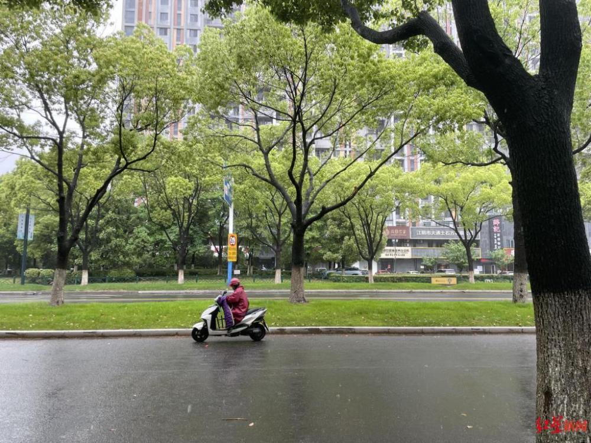

# 江苏江阴枪击案嫌犯疑似逃进山，警方正在搜山，枪击动机疑似劫财

5月4日，江苏江阴毗陵东路一带发生枪击案引发关注。据郑州经济广播，嫌疑人疑似逃进山中，警方将山团团包围，地面和空中配合展开搜索。

**有伤者仍在ICU**

据上游新闻报道，该案共有两名伤者。

5日，红星新闻记者向医院方面了解到，一名周姓伤者目前正在ICU治疗，另一名伤者亦在住院治疗。记者从其亲友了解到，周姓伤者身中多枪，目前身体情况平稳，仍有子弹留在体内，计划手术取出。

**动机疑似劫财**

亲友称，周先生每天凌晨3点多出门锻炼，凌晨5点左右去往公司办公。5月4日，周先生独自在自家公司内，被两名嫌疑人尾随，而后发生冲突，疑似为劫财。期间，嫌疑人告诉周先生，他们已跟踪周先生约半年时间。

而后，嫌疑人将周先生押出公司，一位市民目睹后前来制止，该市民被击伤，周先生也在挣脱过程中被击伤。

记者询问枪支是否为自制枪支，该知情人士表示不了解。

（综合郑州经济广播、红星新闻、上游新闻）编辑：郑楚翘

