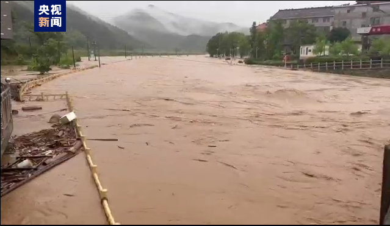

# 江西抚州特大暴雨致大规模城镇内涝：已转移352人，仍有45人被困

5月5日晚至5月6日，江西抚州遭遇特大暴雨侵袭，多个乡镇24小时降水量达250毫米以上（特大暴雨级别），其中抚州市崇仁县24小时降水量达304毫米。强降雨导致河水猛涨、农田被淹，出现了大规模城镇内涝。

当地政府已转移疏散被困群众352人。截至今天（6日）上午9时40分，消防部门已在核心区域营救出14名被困人员。但河对面村庄仍有45人被困，暂无生命危险，但由于目前水势比较湍急且水位继续上涨，暂时无法渡河展开救援。目前当地政府正组织消防、应急、民间救援力量和各乡镇干部展开救援。

（来源：央视新闻）

