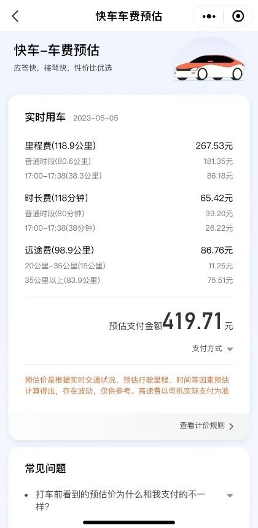

# 游客曝“五一”游河南多次遭网约车私收“空驶费”，涉事公司称已处罚

“五一”期间前往河南旅游的曾女士近日向澎湃质量观投诉平台反映，游玩期间她打车只要是行程超40公里的跨城市订单，无一例外会被网约车司机加收“空驶费”，金额10-100元不等。

比如4月29日她从登封打车到郑州，行程90公里左右。网约车司机称，政府不允许跨城市接单，且自己返程时很难再接单，所以要额外收取50元“空驶费”。几经协商，曾女士取消平台订单，转向网约车司机转账打车费170元和“空驶费”30元。

对此，澎湃新闻致电郑州市交通运输局。工作人员表示，只有行程两端都不在本地，才属于异地营运。另外额外加收费用属违规。

而为曾女士提供网约车服务的“妥妥E行”表示，涉事车辆牌照属本地，并不属于异地营运。公司明确规定不得以其他理由加收费用，目前已对涉事司机作出停止载客并退还订单费用的处罚。

**消费者投诉：**

4月29日，曾女士通过平台约到了从河南郑州到登封少林寺景区的网约车。平台显示，该订单“一口价”费用为151.67元。上车后，网约车司机告知曾女士，跨城订单需要加收48元的“空驶费”。由于“一口价”订单不能修改金额，司机在平台上添加附加费失败，曾女士最终没有支付“空驶费”。

_司机添加“空驶费”失败。_

没想到，在当晚的返程途中，曾女士又遇到要加收“空驶费”。这次网约车司机向曾女士解释称，从登封到郑州属于跨区域接单，而管理部门是不允许网约车跨区域接单的，更何况结束订单后他很难接到返程的乘客，因此要加收50元“空驶费”。

_订单信息。_

几经协商后，网约车司机表示，如果曾女士愿意取消订单，不走平台支付的话，“空驶费”可以只收30元。最终，曾女士向网约车司机的个人支付宝账号转账200元。

_曾女士向网约车司机个人账户付款。_

在接下来在河南的游玩过程中，曾女士又先后3次遇到网约车司机加收“空驶费”。

其中，4月30日中午，曾女士一行人通过“百度地图”约网约车从郑州市区酒店前往中牟县“只有河南·戏剧幻城”景区，上车之后司机当即表示需要扫码支付10元“空驶费”。当晚，返程使用“滴滴出行”从景区打车回酒店时，曾女士再次遇到要收取“空驶费”。协商之后，曾女士取消订单。5月1日，曾女士通过“高德打车”从郑州前往开封，结果被司机加收25元“空驶费”。

_打车费用及额外扫码支付的“空驶费”。_

曾女士从网约车司机口中得知，“空驶费”不是必需的，金额也并不固定。“遇到乘客质疑时，司机多半要求给一点，‘能给一点当然最好了’”。

**企业回应：**

就此纠纷，澎湃新闻致电郑州市交通运输局及网约车公司。

据郑州市交通运输局介绍，司机所谓的“跨城市运营”指的是行程两端都不在本地，如郑州市的出租车辆在其他城市接单且不回郑州，此种情况属于异地营运。按照《道路运输条例》相关规定，出租车异地营运属于超出运营范围，将责令改正，暂扣道路运输证，处以500元以上3000元以下罚款。

关于计费问题，郑州市交通运输局工作人员表示确有“远程费”一说。其以出租车为例说，出租车需打表计价，对于行程超过12公里的部分，乘客需要支付50%的返程费，也就是3元/公里，“但这部分费用已包含在计价中，出租车不得以其他理由再加收费用”。

至于网约车，澎湃新闻了解到，打车平台的计费标准中，总计价就已包括了“远程费”。澎湃新闻分别在高德打车、滴滴出行和哈啰出行预订从“上海-
苏州”同一起点、终点的网约车，发现不同网约车的预估价明细中，除了里程费和时长费之外，均有一项名为“远途费”的费用。

从上到下依次为高德“阳光出行-经济型”、滴滴快车、哈啰的打车收费标准。

以“滴滴出行”为例，其给出了“极速拼车”“快车”“专车”“第三方服务商”等多种打车服务，但每一个费用中均包含了“远途费”。以最常见的“快车”为例，行程20公里-35公里的部分需额外收费0.75元/公里，超过35公里则需收费0.9元/公里。“哈啰出行”并未提供计价标准，但在收费明细中，也显示存在“远途费”。

4月29日为曾女士提供服务并被收取30元“空驶费”的网约车由“妥妥E行”公司提供。工作人员告诉澎湃新闻，公司明确规定司机不得额外向乘客加收“空驶费”，4月29日涉事司机加收“空驶费”的行为已违反规定。此外，涉事车辆牌照属登封市本地，不属于异地经营范畴，因此以此为由加收费用也不成立。

“妥妥E行”表示，今后将更严格监督此类违规收费行为。

目前，“妥妥E行”已对涉事司机作出停止载客的处罚，并且将订单费用退还给曾女士。目前双方已经协商一致。

