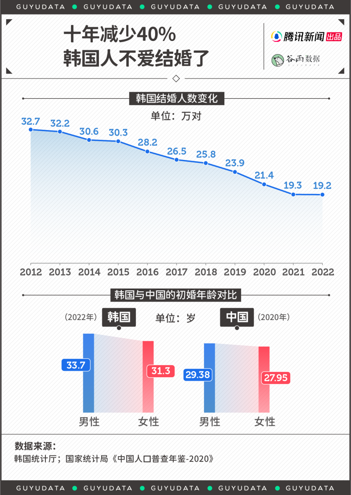
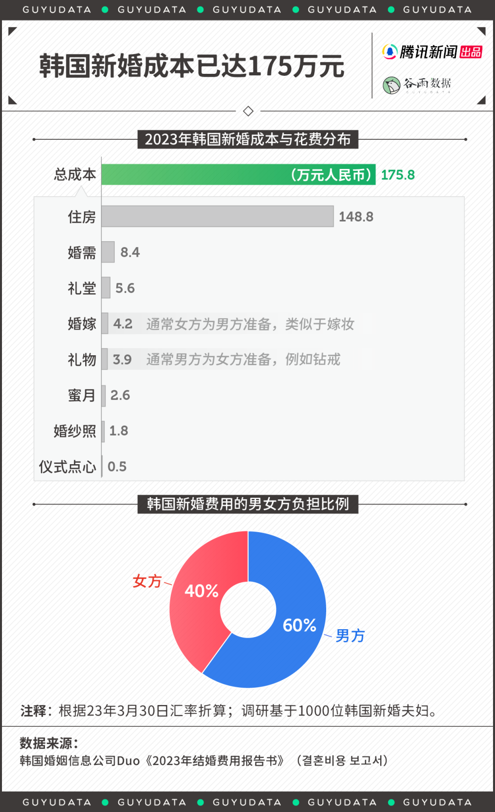
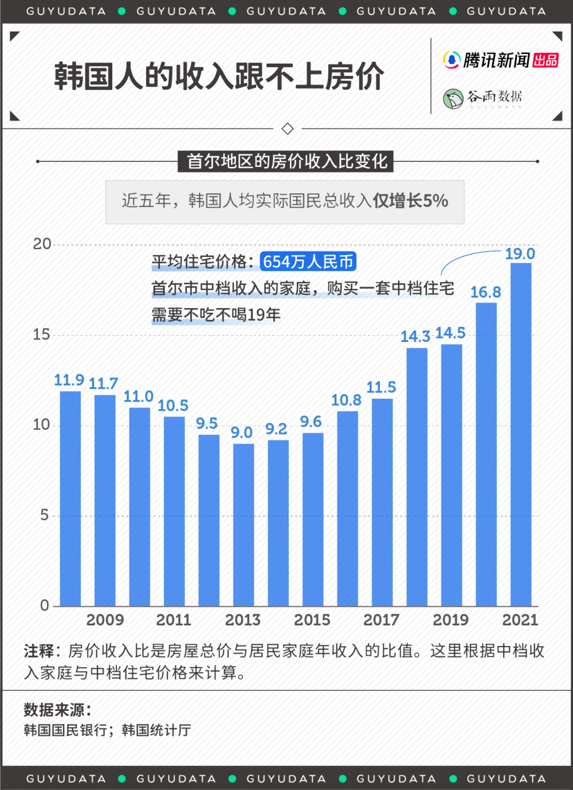
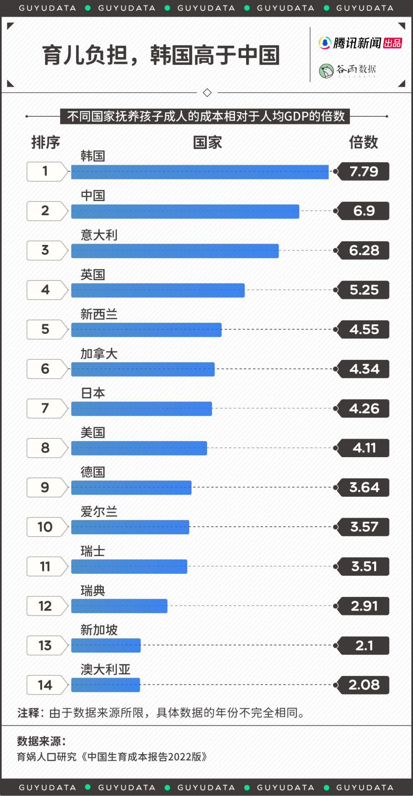
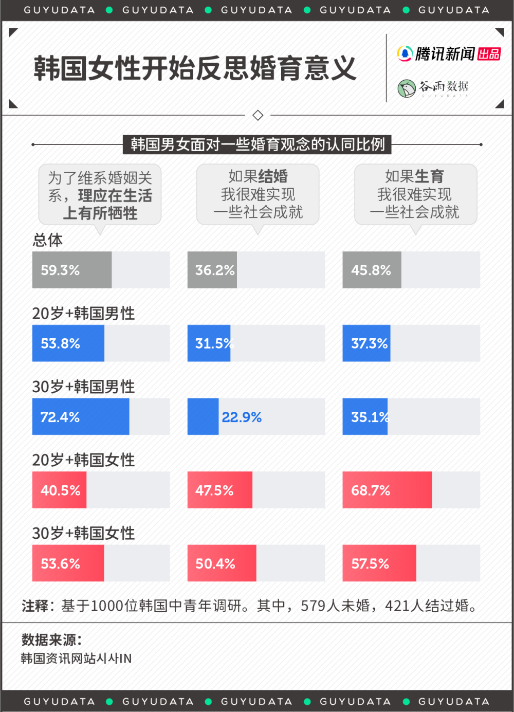

# 生育率全球最低，韩国离成为全世界第一个消失的国家还有多远？

前段时间流行一个段子：“韩国人不睡觉，日本人不吃饭，中国人不放假。东亚三国，个个‘卷’死自己。”

白天上班，晚上聚餐，聊到凌晨，喝到通宵。美式、红参不离手的韩国年轻人据传一天只睡四小时，也照样精神抖擞。

早晚生活丰富多彩，也来不及顾及人生大事。韩国统计厅数据显示，韩国2022年的总和生育率为0.78，为全球最低值。同一年的结婚人数，也创下历史新低。

韩国人为什么不结婚生子了？

韩国人正在放弃婚育

“韩国将成为全世界第一个消失的国家。”

2006年，牛津人口研究中心学者大卫·科尔曼（David Coleman）曾这样发出警告。

这并非耸人听闻。如今看来，这一预言显得深有见地——韩国人正在放弃婚育。

**从2012年到2022年，短短十年间，韩国结婚人数从每年32.7万对下降到19.2万对，接近腰斩。**

结婚人数一般与适婚人口总数有关，但韩国在2012-2022年适婚的应该是80-90年代生人的，但那个时候的韩国出生率变化不大。

**唯一上升的也许只有韩国人的结婚年龄。**
根据2022年统计结果，韩国男性的平均初婚年龄早已超过而立之年，来到33.7岁，女性初婚年龄为31.3岁。相比我国2020年人口普查结果，均高出3-4岁。

结婚的人少了，新生儿的增长就乏力。总和生育率表明妇女一生的生育胎数， **近几年，全球最低的总和生育率纪录，一直由韩国刷新**
：2020年生育率为0.84，2021年为0.81，到了去年，仅为0.78。而国际上通常以2.1作为人口世代更替水平，1.8则为警戒线。

韩国大城市尤甚。2022年，釜山生育率为0.72，首都首尔的生育率更是只有0.59，是全国最低水平。相当于每10名首尔女性，一生共生育六个孩子，意味着许多女性终身拒绝生育。

当然，以全球2.3的生育率均值来看，东亚三国在不爱生孩子这方面，旗鼓相当。

中国的生育率在2014年“二孩政策”放开后有过短暂提升，后来迅速下降，如今以1.15的指标（2021年数据）低于邻国日本。而日本的特点在于，近三十年，生育率在1.4上下徘徊，一直都不高。

韩国正在紧随日本后尘，无可避免地进入老龄化社会。2021年，录得有统计以来的首次人口负增长。2022年，韩国出生人数24.9万人，死亡人数37.3万人，人口持续负增长。

要知道，韩国2020年大学的招生人数约为47.3万人。可以预见的是，不少大学将缺乏生源。而在此之前，因学龄人口减少，空荡荡的韩国中小学不在少数。

根据韩国MBC电视台报道，2023年学年中，韩国6200多所小学，有131所小学新生入学人数为0，有125所小学只有1名新生。

房子、孩子与票子，韩国人婚姻的三座大山

韩国人的婚育现状，何以至此？

结婚者减少，通常与价值观念、生活成本与社会压力等因素有关。而韩国在这些因素上有过之而无不及。

韩国人的结婚成本高昂。根据婚姻信息公司Duo的调研结果，2023年，一对韩国新婚夫妇的平均结婚成本约为175.8万人民币。同一时期，韩国人均实际国民总收入约19万。

总体来看，男性负担比例更多，但与女方差别不大。例如，支出中的婚嫁，通常是女方赠予男方的礼金、礼品，类似于我国的嫁妆，在韩国的平均支出约为4.2万元。

同理，礼物通常是男方为女方购置的礼物，例如钻戒，珠宝，平均支出约为3.9万元。

与中国一样，韩国结婚重视有没有住房，平均支出约为148.8万元。

但值得一提的是，这里的住房成本通常不是买一套新房的价格，而是准备住处的价格——在韩国，流行一种租住形式：全租，介于购买与租房之间。

在全租形式中，租房者不会支付月租，而是一次性支付押金，通常浮动于房屋总价的50%，然后与房东协商免费居住的时间，比如两年。租赁结束后，押金全额退还。

因此，全租本质上是一种贷款。房东一次性获得了大笔免息资金，也让无力购买全套房的新人获得了临时新居。根据调研结果，约一半的韩国新婚夫妇会选择全租。

但全租形式助长了恶性的投资风气，让韩国人的收入跟不上房价。

近五年，韩国人均实际国民总收入从2017年的3493万韩元（183731元人民币）到2022年的3628万韩元（190832元人民币），增长缓慢，但房价不等人。同期，全国房价整体上扬80%。

以2021年12月底为基准，韩国的房价收入比（PIR）为7.6，首尔已达19，较2017年的11.5近乎翻了一番，同时朝着北京、上海、深圳等中国一线城市的房价收入比迈进——后者的房价收入比保持在20以上。

这意味着， **一个具有首尔市中档收入的家庭，需要不吃不喝19年才可以买一套首尔中档住宅。而据计算，首尔一套住宅的平均价格约合人民币654万。**

高房价是个门槛，遏制了人们婚育的欲望。与此同时，韩国人的育儿负担也不低。

**根据育娲人口研究的分析，韩国抚养孩子成人的成本是其同年人均GDP的7.79倍，远高于日本、美国等国，位列14个国家中的第一。**

根据估算，2019年，中国家庭抚养一个孩子长大成人的平均成本为48.5万元。但这一花费排在韩国之后，位列第二。

抚养成本高昂，核心是资源有限，而竞争激烈。

当中国高中生追逐双一流，并逐步通过考研、保研实现对清北与“华五”（复旦、上交、南大、中科大、浙大）学历的追求时，韩国学生也将目光放在首尔大学、高丽大学和延世大学这三所顶尖大学上。

韩国高考的竞争残酷性不亚于中国高考。为了实现目标，偷偷抢跑就成了必然。

**韩国是课外补习班最盛行的国家之一。根据一份韩国忠北大学学者发表的成果，截至2016年，韩国的课外教育支出是经合组织（OECD）平均水平的三倍。**

睡眠也成了“内卷”的对象。2022年，韩国高中生的平均睡眠时间只有5.8小时。韩国人不爱睡觉的习惯也许肇始于此。

这无疑是一段艰辛的学习历程。一项韩国发展研究所学者在2017年发布的调查显示，有80.8%的韩国大学生将高中描述为生死攸关的“竞争战场”，这一比例远远高于中国、美国与日本大学生。

而经历了残酷竞争的韩国年轻人，也许不想让下一代再受同样的罪了。

更何况，年轻人对未来保持悲观。辛苦争取到的学位，不一定能换取良好的就业结果——
**近五年，韩国就业市场低迷，大学生应届就业率在65%上下徘徊，三分之一的大学生面临持续待业的危机。**

为了生存，年轻人自顾不暇。婚育二事，长期搁浅。

而为了鼓励婚育，韩国政府动作频出。除了提高补贴，还在兵役政策上下功夫。

此前，韩国兵役制度也是影响婚育的一大要素。20岁至28岁的男性公民必须服兵役，而这一年龄段正值恋爱的大好时光。而正在研讨的新政是，允许30岁之前生育3名以上子女的男性免除兵役。极为难豁免的韩国兵役，如今需要为生育让步。

那些“戒”掉婚育的韩国年轻人

当然，无论是房价、教育投入还是婚姻本身的高成本，这些城市病存续在每个国家的发达地区。但韩国的特点在于，久病不治，堆积成山，压得每个人气喘吁吁。

韩国人不幸福。民调机构益普索集团发布的《2023年度全球幸福感》调查报告中，32个受调研国家， **韩国排名倒数第二，仅有57%的民众感到幸福** 。

根据韩国统计厅发布的《2021年死亡原因统计》，韩国每十万人自杀率为26，明显高于其他国家。其中，自杀“热门”地区麻浦大桥，就是中国网友熟悉的例子。

_麻浦大桥上设置的生命咨询专线电话，图源视觉中国_

而回到人是否要结婚这件事，还重要吗？韩国人意识到，如果婚姻本身不是幸福的解药，那么一切随缘。

认同“人一辈子需要结婚”的比例持续下降。如今，有半数韩国人认同一辈子完全可以不结婚。同时，在30岁以下韩国女性群体中，认为结婚就需要生孩子的比例已不足一半。

认为有理由就可以离婚的认同比例也在持续上升。而不愿婚育的社会肌理里，的确隐藏着男女冲突的线索。

韩国的性别不平等问题突出。女性主义韩剧《82年生的金智英》曾大火，但也引发过全韩男人的抵制。

从长期的弱势地位中觉醒后，韩国女性开始反思婚育意义。最近一项针对1000位韩国中青年的调研显示，
**超过一半的年轻女性相信婚育将影响她们实现一些社会成就，比例明显高于男性** 。

这样的观念转变也让韩国女性开始追寻自我的生命体验，而不是局限在小家庭的一方天地里。

归根结底，是年轻人对生活的感知变了。

韩国的尼特族不少（NEET，处于未升学、未工作、未进修状态，单纯休息的年轻人）。2021年，根据经合组织（OECD）标准，韩国尼特族规模达164万人，占15-29岁人口的20.9%。属于“无业游民”的他们，有不愿工作的，也有找不到工作的，婚育一再推迟，直到不再成为必须讨论的话题。

有人认为韩国人是第一个看开的群体。他们不是完全放弃婚育，而是放弃婚育作为一个人生的必答题，转而视为一个选答题。顺其自然，各凭心力。

置身于后现代的独身状态里，或是延续传统的养育故事，选择皆可。他们困惑并试图解答的，是如何在炙热的生活里，寻找恰如其分的幸福。

*感谢韩国汉阳大学国际文化学院秦榕女士对本文韩语翻译的支持。

作者｜鹿鸣 设计丨鹿鸣 编辑丨赤耳 出品丨腾讯新闻 谷雨工作室

腾讯新闻出品内容，未经授权，不得复制和转载，否则将追究法律责任。

