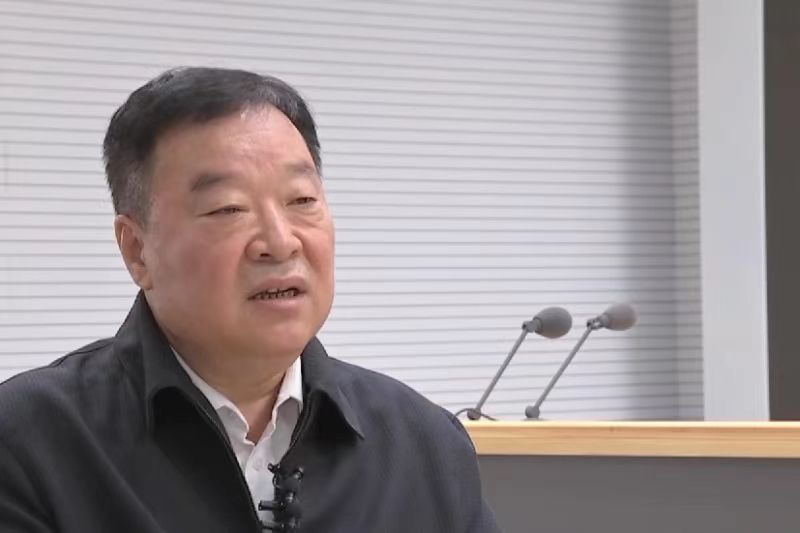
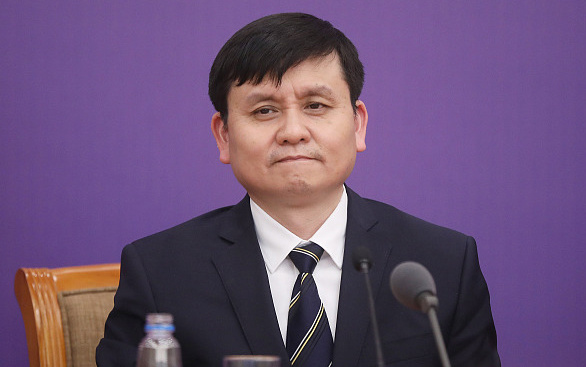

# 疫情彻底结束？对我国意味什么？世卫宣布新冠紧急状态结束，焦点释疑

世界卫生组织5日宣布，新冠疫情不再构成“国际关注的突发公共卫生事件”，解除2020年1月30日拉响的最高级别警报。

“我满怀希望地宣布，新冠疫情全球卫生紧急状态结束。”谭德塞5日在记者会上说，近期全球疫情总体呈下降趋势，人群免疫力提升，死亡率逐步下降，全球卫生系统承压减轻，多数国家恢复到过去熟悉的生活。

谭德塞同时指出， **“这不意味着新冠疫情不再是全球健康威胁”** ，一旦新冠疫情再次让世界处于危险中，他将毫不犹豫召集专家评估形势。

**Q1：什么是“国际关注的突发公共卫生事件”？有什么作用？**

新冠疫情暴发后，世卫组织于当地时间2020年1月30日宣布新冠疫情构成“国际关注的突发公共卫生事件”，这一定位有助于推动国际社会协同抗疫，加强在疫苗、治疗等方面的合作。

《国际卫生条例(2005)》规定，“国际关注的突发公共卫生事件”是按特殊程序确认的不寻常公共卫生事件，它意味着疾病的国际传播会对其他国家构成公共卫生风险，并可能需要采取协调一致的国际应对措施。

此后，随着新冠疫情在全球各地起伏发展，每隔几个月，世卫组织紧急委员会都会召开一次会议，讨论新冠疫情是否仍构成“国际关注的突发公共卫生事件”。今年1月底，世卫组织紧急委员会召开第14次会议后宣布，新冠疫情仍构成“国际关注的突发公共卫生事件”。

国家卫生健康委疫情应对处置工作领导小组专家组组长梁万年介绍，按照国际卫生条例的规定，构成“国际关注的突发公共卫生事件”， **主要有三个标准：**

1.这一事件是突如其来和超乎寻常的;

2.这个疾病可以跨境快速传播;

3.这一事件需要世界各国共同努力和协作来消除这一病毒的危害。

“世卫组织是一个国际组织，其发布的信息更多起到提醒作用，没有强制性。”南方医科大学公共卫生学院教授赵卫说，从另一方面看，世卫组织的参与国很多，提出的建议比较有参考意义，值得重视。因此，某个国家根据世卫组织的建议制定防疫措施，会更容易受到国际上的认可。

_国家卫生健康委疫情应对处置工作领导小组专家组组长梁万年。图片来源：央视新闻_

**Q2：世卫组织宣布新冠疫情不再构成“国际关注的突发公共卫生事件”，主要基于哪些方面考虑？**

国家卫生健康委疫情应对处置工作领导小组专家组组长梁万年认为主要基于几个方面的考虑。

第一，从当前流行态势来看，全球报告的新冠病毒感染人数、住院人数和ICU住院人数、病亡人数都处于持续下降状态。

第二，新冠病毒虽然持续变异，但变异株对人类健康的危害没有发生太大变化。

第三，全球来看，通过人群的自然感染和疫苗接种，已经建立比较良好的人群免疫屏障。

第四，3年多来，各国加强医疗救助体系和公共卫生体系的能力建设，包括人力资源、防护设备、药品等多方面能力都在加强。

综合这些要素来看，人类抵抗力与病毒之间已经取得一个较平衡的状态，也达到了《国际卫生条例》关于结束“国际关注的突发公共卫生事件”的基本要求。当然，结束“国际关注的突发公共卫生事件”并不意味着疫情危害就彻底没有，而是表明以人类目前的能力，可以有效控制这种危害。

**Q3：疫情彻底结束了吗？目前全球疫情形势如何？**

谭德塞5日强调，终结新冠疫情的全球紧急状态并不意味着新冠疫情不再是一个全球卫生威胁。他表示，若是新冠疫情再次让世界陷入危险，他会毫不犹豫地召集专家重新对疫情进行评估。

新冠疫情并未消失，甚至仍有反复的可能。世卫组织指出，近段时间，东南亚地区和中东地区就出现了新的新冠感染潮。据报道，4月中下旬以来，印度、尼泊尔等南亚国家，老挝、柬埔寨、马来西亚、越南等东南亚国家的新冠确诊病例都出现上涨趋势。

世卫组织卫生紧急项目负责人迈克·瑞恩强调，新冠紧急状况也许已经结束，但威胁仍然存在。

“我们完全相信这个病毒会持续传播，这也是大流行的历史(教训)。”瑞恩称，1918年大流感病毒在最后一次暴发几十年后才消失。“在大部分情况下，只有到下一个大流行开始了，这个大流行才真正结束。”

过去三年多，全球经历由阿尔法、德尔塔、奥密克戎等变异毒株引发的多轮疫情高峰。世卫组织数据显示，全球累计报告确诊病例逾7.6亿，死亡病例超过690万。

梁万年介绍，现在从当前的流行态势来看，新冠整个报告的感染人数以及住院人数，重症ICU的住院人数和死亡人数都呈持续下降状态。另外，新冠病毒虽说在继续变异，但是没有看到新冠病毒的致病力、致死率的变化。虽然新冠病毒有时变异株传播速度变快，免疫逃避能力变强，但是总体对人类健康的危害并没有发生太大变化。第三点，通过人群的感染，我们叫自然感染，加上主动疫苗接种，全球来看已经建立了比较良好的人群抵抗力，我们叫免疫屏障。第四点，三年的抗疫各国都在加强公共卫生体系的能力建设。综合考虑看，人类的抵抗力和新冠病毒之间，我们已经取得了一个平衡的状态，也可以说我们取得了阶段性的成果。

梁万年进一步解释称，达到不再继续构成“国际关注的突发公共卫生事件”，
**并不意味着新冠的流行就没有了，疾病的危害就消失了，而是说明我们的能力目前已经可以有效地控制疫情带来的危害。**

_上海复旦大学附属华山医院感染科主任张文宏。图片来源：视觉中国_

上海复旦大学附属华山医院感染科主任张文宏医生5月6日发布微博称， **病毒还会存在，大流行已经过去。** 就疫情而言，全球已经同此冷暖。

南方医科大学公共卫生学院教授赵卫认为，从数字看，目前新冠仍在世界范围内流行，“但按我个人理解，因为其症状已变得轻微，传播速度也相对减缓，让疫情整体处于可控范围，其在国际层面的影响已下降到一定的程度。这可能是世卫组织宣布新冠疫情不再构成‘国际关注的突发公共卫生事件’的一个原因。”

中国疾控中心应急中心副主任施国庆表示，世卫组织宣布新冠疫情不再构成“国际关注的突发公共卫生事件”，并不意味着新冠病毒流行的结束，我们仍处在新冠病毒的一个流行进程中，还要继续做好相关防控工作。

**Q4：世卫组织这一决定，将在全球产生什么样的影响?对于我国意味着什么？**

梁万年表示，对于跨国交通、贸易、旅行的一些限制，将进一步减少甚至消除，这应该是最大的影响。我国的国际交往包括贸易、旅游、学术交流等，都有望减少此前因部分疫情防控措施带来的不便。

梁万年表示，这并不意味着我国就对新冠疫情放任不管。只要疫情危害仍然存在，我们就还要继续做好相关防控工作，继续和全球各国紧密团结，共同采取更具针对性的措施，保护好人民群众的健康。

**Q5：目前我国对新冠疫情实施“乙类乙管”政策，新冠疫情不再构成“国际关注的突发公共卫生事件”后，我国的疫情应对措施是否也会有新的变化和调整？**

梁万年表示，不再构成“国际关注的突发公共卫生事件”，并不意味着新冠病毒已经对人类无害，也不意味着要放弃所有的防控，我国仍然要坚持预警监测、疫苗接种等必要的防控措施。

一是坚持有效地监测新冠病毒变异情况和疫情的发生发展情况，同时补短板、强弱项，不断完善公共卫生体系。

二是对一些高危人群和重点人群，继续加强疫苗接种。

三是继续强化临床救治能力特别是重症的救治能力。

四是呼吁大家保持已经养成的一些良好卫生习惯。

施国庆：我国已经建立了多渠道的监测预警体系，在城市社区、哨点医院、重点场所、城市污水等进行监测，不断观察疫情变化，及时做好风险研判。如果发现聚集性疫情，立刻启动现场调查。

我们要继续做好监测预警，掌握疫情流行趋势。同时，要加强健康教育和风险沟通，科学看待疫情，保持良好心态。

资料来源：新华社、央视新闻、南方都市报、新京报

编辑 常江

校对 吴兴发

