# 被流量“扼杀”的淄博八大局市场

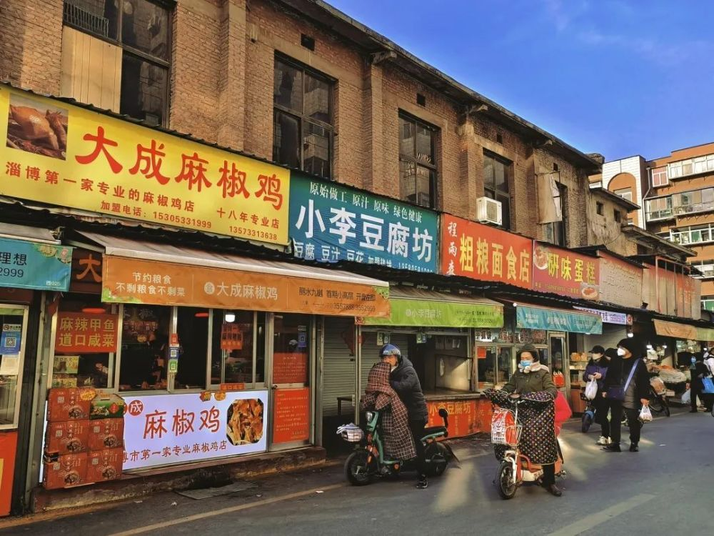

作者|小葵 陈默

编辑|江岳

微信公众号：首席人物观（ID：sxrenwuguan）

01“过完年了”

几乎每个到达淄博的外地游客，都可以熟练地说出“八大局”这个地名。

**同样的一致性还表现在：几乎没有一个游客是空手离开八大局的。**

这条突然爆红的市场街，如今已经同烧烤一起，成为火遍全网的淄博名片。只是，在当地人看来，几乎人手几盒的炒锅饼，实在算不上能拿出手的淄博特产。

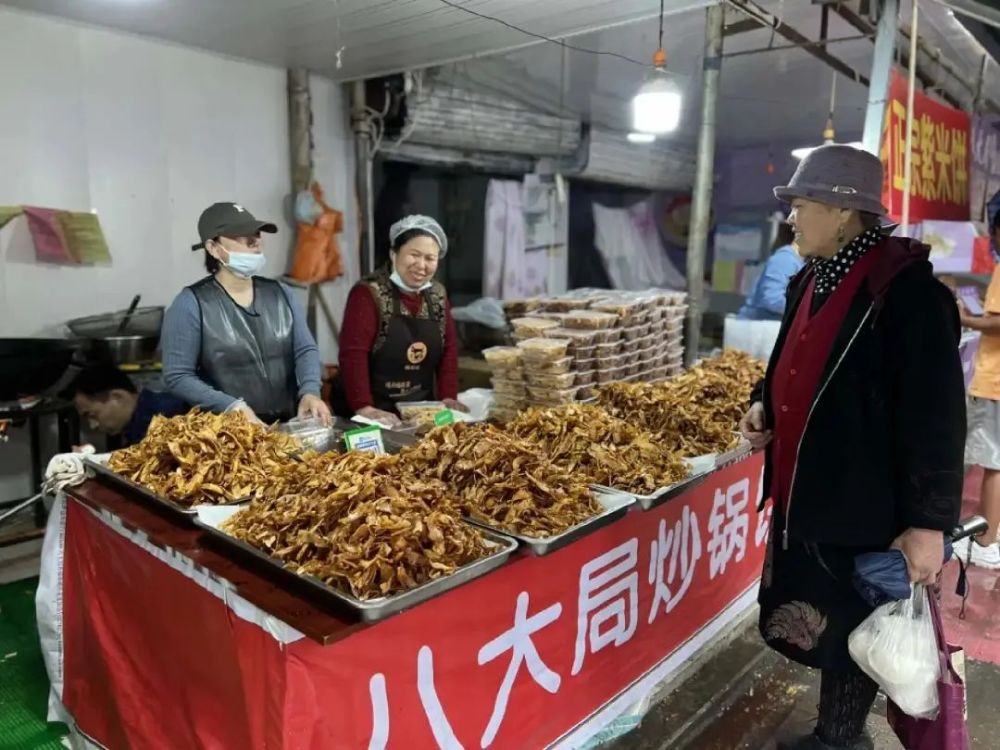

**“在我们博山，这是酒席上才有的菜，而且也没人爱吃。”**
38岁的玲子撇撇嘴。她在八大局出生长大，对老家博山的美食充满骄傲，“随便找家博山菜馆都好吃”。比炒锅饼更让她嫌弃的是紫米饼，“什么玩意儿”“你们那有粽子吗？它还不如粽子好吃呢！”

这是5月5日上午，淄博从一早就开始降雨，最低温度回落到13度左右，很多骑电动车的人都在雨衣里面加上了棉衣。八大局部分路面变得泥泞，需要踮脚穿过。

玲子穿上了厚厚的毛衣外套，坐在自己门脸房的雨棚之下。她在守摊。摊位很简陋，一块木板架在两只板凳上，铺上印花桌布，再摆上大大小小的琉璃制品——这是博山特产，在小红书等平台，很多游客会分享自己驱车或者坐车1个小时，从淄博赶到博山去逛琉璃大观园的经历。

但这天上午，玲子的生意不算好。

流量就像沙子划过指尖，带来过温柔又粗粝的触感，随后就消失了。从10点到11点，只有零星几位顾客在摊前驻足，一位打扮精致的主播对着琉璃们拍了几分钟，迅速离开，一对山西来的夫妇挑了20分钟才选中3件。玲子把原因归结于天气，下雨让游客比“五一”假期少了很多。
**但客观来说，她所在的位置并非八大局中心街区，摊位上的琉璃制品，也只能用“复古”来礼貌形容，至少，对于喜欢新潮的年轻人而言，吸引力并不大。**

类似的摊位，在八大局的主街上也零散着几家。彩色的琉璃手串一般在15块一条，下着雨的这个上午，进店顾客不算多，一位老板临时喊出了“买三条赠一条”的广告。

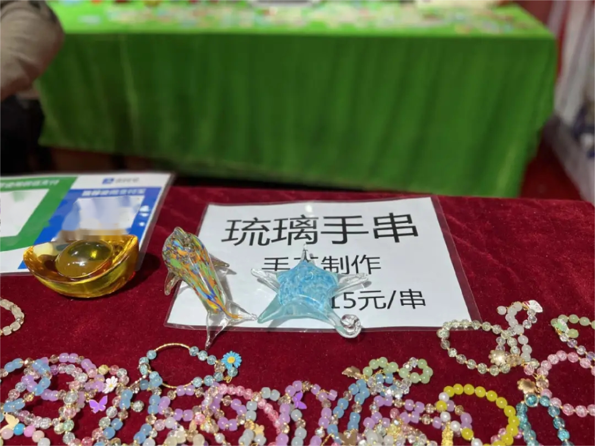

这里的定价显然有些随性。一些稍微贵重的琉璃手串单独摆放在角落里，但两位老板的报价并不一致，守在角落的老板喊60块，结账时，在摊前坐着收款的老板却告诉选好的顾客：这是68块一条的。“跟雍和宫的香灰琉璃手串一样的，我们这便宜多了。”他补充道。

店里定价15元的琉璃兔子，在不远处社区活动广场角落的本地人摊位上，变成了20元。摆摊者是住在附近的一位退休大娘，在女儿建议下从假期开始出摊，试图成为这波流量的获利者之一。

**相比假期，节后的收益显然让她有些不满意，“人一天比一天少”**
，她只带了一把雨伞，试图把它绑在路边的水泥墩子上，但绳子太松，几番调整雨伞都是歪歪斜斜的，似乎随时都能倒在风雨中。她有些执着于此，一时让人很难分清楚，她脸上的烦躁更多缘于稀疏的顾客还是不听话的雨伞。

**琉璃制品可能是整条八大局市场街上价格波动最大的商品了——甚至可能是唯一存在议价空间的商品。**
毕竟，街面上最多的摊位属于炒锅饼和紫米饼，它们从长相到价格都基本一样，以至于游客们完全无法辨识谁才是最早的店铺。对于它们的口味，也只能基于自己随机买的商品来评价。

保障价格稳定的更重要的力量，是密集分布在八大局的警察和“红马甲”们。后者的主力是社区工作者和体制内人士。在山东，这几乎是最受人尊重的职业。当他们站在雨天的泥泞中解答游客各种问题并维持秩序的时候，即使脸上布满倦意，也是充满耐心的。虽然是冷飕飕的雨天，但相比刚刚过去的“五一”假期，他们的工作环境已经好了许多。

至少，人口密度以及随之带来的安全风险都变小了。

“五一”期间，八大局登上全国景区热榜第一名，力压多个老牌5A级景点。假期首日，八大局接待了19万游客。同一天，故宫接待人数是3.5万，颐和园是7.8万，南锣鼓巷是7.5万。有人戏称，八大局是全国最牛的5A级菜市场。

“完全看不到对面店里的人。”在八大局经营五金杂货店铺的王老板摇摇头。八大局的街面宽约3米，假期时，站在店门口，放眼望去全是人头。
**因为店里只卖针对附近居民的日杂用品，汹涌而至的人流对他的生意只有坏处，“需要买东西的人，都过不来了”。流量拦住了他的老主顾们。**

好在，节后的雨天给他带来了新生意。5月5日这天，他把雨衣雨伞等雨具摆在了门口最显眼的位置，20块钱一把的天堂雨伞和10块钱一件的雨衣都走得很快。

同样在节后才等来好生意的，是顺丰快递的小哥们。他们在南北口的路边设置了发货点，节后平均每天能发走两千单。“假期不行，人是多，但里面都限购，不需要发快递。”一位顺丰工作人员忙到无暇抬头。他手脚麻利地装箱，间隙告诉等候的人，“人有点多，再等等啊”“紫米饼不要寄，放不住的”“烧烤跟水果一样，默认走生鲜”。

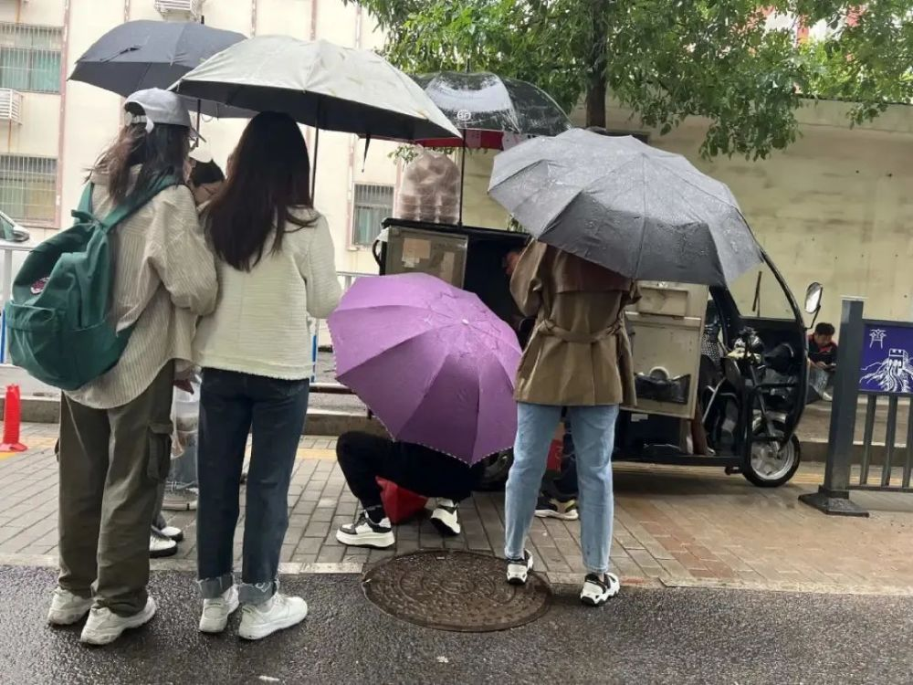

等候者大部分是年轻人。他们会交流各自从哪来、购买的炒锅饼价格。两位购买了烧烤等待快递的临沂姑娘，听说旁边的情侣从南京赶来，热情地赠送了几包烧烤料和辣椒面，后者显然有些意外，连连感慨：“大美山东。山东人真好。”

**在淄博，陌生人之间的热情变成寻常。**

共同等待的时间，创造了天然的交流契机。比如5月4日晚上的八大局烧烤摊门口，一群同样抱着错峰“进淄赶烤”想法的人相遇了。情况与他们预想的不太一样。烧烤摊被一扇铁门挡住，晚上9点半，门外还有大几十人在等待，没有什么通知，“需要排号”的信息在人群中流动，有人手里已经拿到了写着数字的号码牌，但更多新来的人是懵圈的，刚到的一段时间里，他们不知道在哪里取号，也不知道还要等待多久。

互助很自然地流行起来。一些选择专场的人，把提前领到的号转手送给了新来的人，还有人临时组成了烧烤搭子，三组来自不同省份的年轻人在几分钟内达成共识，去3公里外的另一家烧烤店。

但打车并不容易，等待时间最长的一辆滴滴，在接单后15分钟才赶到现场。“没办法，实在太堵了。”司机充满歉意。如果不是系统派单，他是万万不敢接八大局附近的订单的。因为堵车严重，导航上显示的路况经常是猪肝红色。

“五一”假期更加夸张。八大局附近几条道路临时改成了单行道，但还是“进来一个小时，出去还得一个小时”。
**过于汹涌的流量给这位滴滴司机带来的更多是烦恼：干活的时间变长了，但挣的还跟以前差不多，平均每天三四百。相比之下，他更享受节后的时光，八大局附近还是堵，但程度轻多了。**

“终于过完‘年’了。”他感慨。只是，作为土生土长的淄博人，他实在搞不清楚，八大局怎么就火起来了。

02流量的魔力

八大局，全名八大局便民农贸市场。

**顶着全国最火菜市场的名头，在流量降临之前，八大局其实只是一条再普通不过的十字街区，由密密麻麻的临街小店铺组成，卖的主要是菜、肉和馒头等主食。**
上世纪七十年代，淄博市政府曾经将财政局、教育局、卫生局、文化局等八个部门集中在一个大楼办公，简称“八大局”。后来“八大局”被拆除，但是旁边的便民农贸市场被留了下来。

如今，附近小区里还有很多始建于上世纪七八十年代的楼房，有些还是红砖楼，上世纪安装的铁窗户已经布满黄锈，在稍微远离中心的临街店铺，走几步就能看到“房屋防水堵漏”的广告牌——显然，这是刚需。

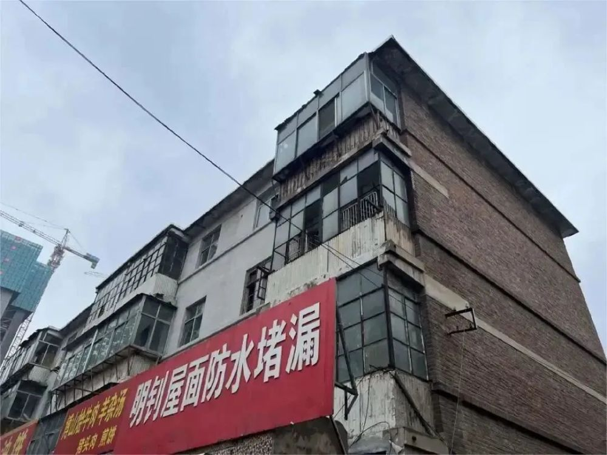

在刚刚过去的“五一”假期，它正式成为一处景点，并以单日接待19万游客的成绩位居全国景区排队榜单首位。限流成为必须手段。河南游客璐璐是19万分之一，她早上8点半就赶到八大局门口，当时人已经很多，一会儿功夫，市场就开始限流了。

便宜，是璐璐对这里最深刻的印象。她买了肥肠包和排骨包，一个包子6元，用的是肥肠和排骨这样较贵的原材料。炒锅饼一盒8元，头一天她在外面看到的价格是10元。大樱桃贵一些，最大的那种，外面是35元一斤，八大局卖45元一斤。“价格已经很良心了。我在其他旅游城市吃饭都觉得挺贵的，就淄博吃得挺便宜。”

**此时的八大局菜市场，已经在流量中完成了第一次迭代：一些路面被翻修，几处公共厕所都竖起了显眼的牌子。**
市场出口附近的一块空地，原本是卖西瓜、洗发水等日用品的场地，经过改造后，引进了烧烤摊，门口挂上了“八大局烧烤”的标志，很快成为热门打卡地。

**更重要的是，多数摊位进行了“换血”。肉铺和菜摊几乎全部迁走，取而代之的，是一家紧挨一家的炒锅饼、紫米糕，以及牛奶棒、炸南瓜条、桂花糕、捞汁小海鲜、炸肉、烤鸡店。**

或许是因为换得过于匆忙，有些店铺的旧招牌都没来得及撤掉，只能新旧共存。一些讲究的旧老板，在门框上贴上红色手写告示，标明了新址与联系方式。

整条街区对流量的热情拥抱姿态，肉眼可见。恨不得所有店铺都在招牌上印上“网红”两个字，还有一些店铺把老板与B太的合照放大，贴在最显眼的位置——他是最早探访八大局的网红博主之一，最新的抖音粉丝数是1920万。

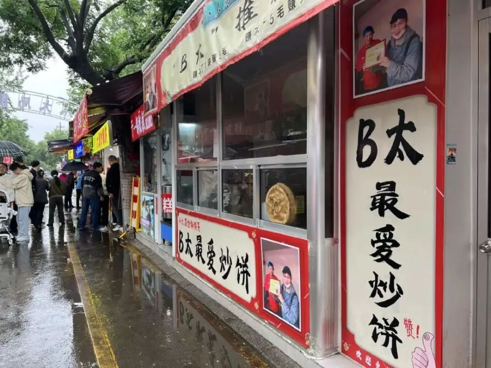

**网红街区吸引着网红主播。八大局每天早上迎接的第一波客人，以及送走的最后一波客人中，必定有很大比重是主播。** 他们也是附近快递发货点的重要客户。

一台手机，一部支架，最多是一位主播搭配一位主播，便是一场直播的全部成本了。

紫米饼和炒锅饼依然是最重要的大单品。5月5日早上8点15分，一家紫米饼摊前排着三四个人，主播站在一旁努力介绍，“家人们，我们的紫米饼，全是明早5点现烙现发”，“看看啊，现场排队的人已经很多了”——她的手机镜头在队伍前一闪，又迅速对焦回到了店主切紫米稿的案板上。

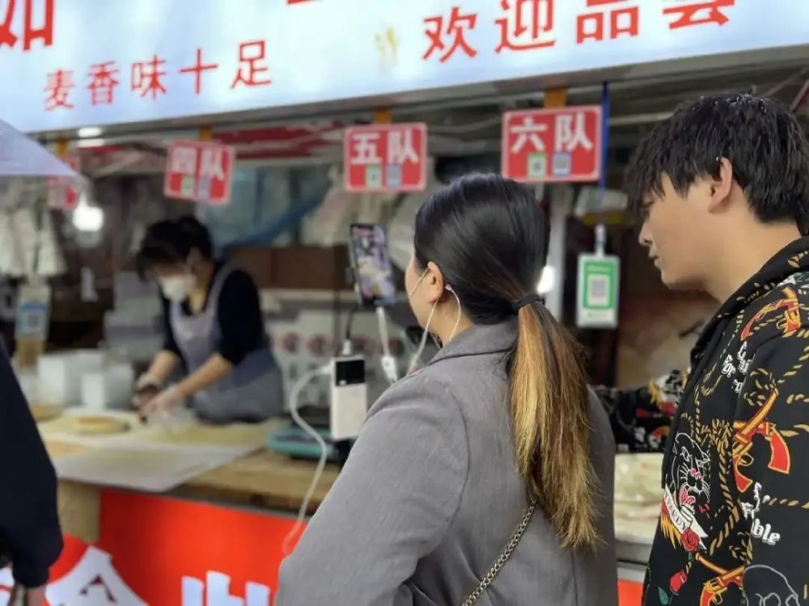

一位男主播在“长寿蛋糕”的摊前几乎直播了一整天。这也是被B太带火的店铺之一，算是八大局里的老店。因为老板年岁较长头发发白，主播以及跟风赶来的排队者都简称这里为“老爷爷蛋糕”。如此亲切的称呼，暗含着人们对于类似日本“寿司之神”的专业老者的尊重与仰慕。

**情绪投射到现实中，就变成了排队。**
即使在雨天，这里也是整个八大局街上排队最严重的店铺之一。最畅销的品类是无水蛋糕，12块钱一斤，大约12个。上午10点多，店铺的原材料鸡蛋已经消耗了六七筐，主播反复强调着：老爷爷从早上7点多一直忙到现在，完全没空休息。评论区里一片点赞。

**流量主导了这里的迭代方向，但显然不是所有的游客都喜欢这样的改造。**

威海游客小桦在“五一”假期的一天早晨7点半赶到了八大局，一个小时逛了个大概。除了物价便宜，她感觉也不过如此。她所在的威海也是旅游城市，从八大局买到的6块钱一份的炒锅饼，在威海是不可能买到的。但除此之外，八大局也没有更多吸引她的地方了。

逛菜市场，是多数游客对八大局的日程设定，也是最近几年流行起来的消遣方式。在小红书上，有人专门分享各地的菜市场信息，留言者众。很多人把菜市场视为治愈之地，正如汪曾祺在《人间滋味》中写到的：“到了一个新地方，有人爱逛百货公司，有人爱逛书店，我宁可去逛逛菜市场，看看生鸡活鸭、新鲜水灵的瓜菜、彤红的辣椒，热热闹闹，挨挨挤挤，让人感到一种生之乐趣。”

旧的八大局菜市场，属于这样的乐趣之地。

小红书博主“四宝姑娘”在今年4月发布了一篇文章《淄博八大局菜市场，被热度攻占之前》，其中提到，
**2023年春节前的八大局还没有成为网红地，“对我来说，只是爷爷家附近最平常不过的一条小巷而已”。**

每年年夜饭、每次她从外面回家第一顿饭，食材都是从这里采购。牛奶棒是爸爸哄她的礼物，烤排是奶奶生前宠她的主食，还有油炸翅根、脆皮五花，属于妈妈看见会生气的垃圾食品，但爸爸会买来给她吃。

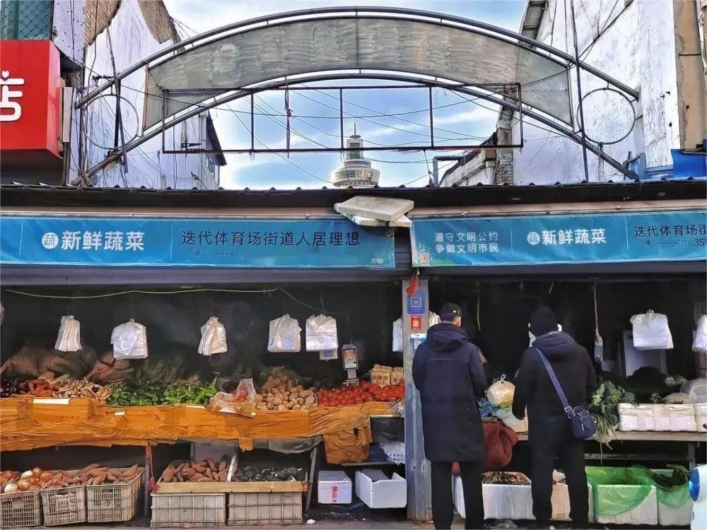

_图源：小红书博主@四宝姑娘_

**但“五一”假期之前，她的爸爸已经连续两周没能买到菜了。**
每天，街道从早餐时段就开始人满为患，热闹会持续到晚餐之后。没有菜摊的八大局已经完全属于游客。本地人只能小心翼翼避开人流，去更远的菜市场和商场采购。

为流量让路，成为很多淄博人最近的共识。

以往住在附近，习惯骑电动车过来买菜的居民，基本也要告别过去的生活方式，比如本地人白轩。距离“五一”还有一周多的时候，他就发现，八大局的各个入口都多了志愿者和保安，电动车不让进了，“只有住在里面的居民还可以骑电动车进出”。一想到要步行和游客一起挤进市场，一进一出都要花不少时间，他彻底放弃了去八大局买菜的念头。

美食博主和菜市场爱好者俊飞的情况大体类似。这位曾经的八大局爱好者，已经不太愿意去这里了。 **他很反感市场里遍布的网红招牌，
“很多当地老板都是中老年人，他们觉得‘网红’这两个字是褒义的，却不知道，现在越来越多的人讨厌这两个字。”**

白轩眼见着八大局在流量的推动之下，从一个普通的菜市场逐渐变成大红大紫的网红景点。

最开始是4月中旬，网上出现了各种关于进淄赶烤和到八大局吃紫米饼、炒锅饼和牛奶棒的短视频。八大局南门口附近那些卖紫米饼和牛奶棒的店，每到周末，门口会排很长的队，排队者主要是从济南过来玩的大学生。

但流量逐渐呈现出开闸之势，涌入速度超出很多本地人的预期，八大局排队的情况很快变得越来越严重。
**“以前本地人只有周末挤不进去，后来变成从周四到周末都挤不进去，再后来，就是每天都挤不进去。”**

当紫米饼和炒锅饼成为八大局的主角，继而成为淄博美食的重要代表，俊飞充满无奈。

他可以一口气说出很多真正的淄博美食，比如淄川肉烧饼、博山肉火烧、蕉庄烧饼、周村蛤蜊鸡、华荣哲绿豆饼、国梁烤鸡、江米糕、清梅居牛肉干、黄师傅炸五花和作为重头戏的博山菜，但现实是，对于大部分只安排了两天淄博行的游客，打卡完淄博烧烤和八大局，任务也就完成了。

至于八大局，除了那两样最先在网络中火起来的碳水食物，油炸冰淇淋、暴打柠檬水、冰奶茶、长沙臭豆腐已经陆续都冒出来了。“感觉跟全国各地的小吃街没什么不一样了”，俊飞只能在心里默默祈祷，“千万不要再出现轰炸大鱿鱼了”。

03命运缩影

进淄赶烤。

这个在网络上火起来的梗，在现实中的淄博市区随时可见。有时候，它出现在外地车牌的后窗上；有时候，它出现在白色文化衫的背面。当它被印在帆布袋上，并被两位年轻人拿着在八大局烧烤摊前叫卖时，身价就变成了15块——流量的定价。

从众人对淄博的热情来看，显然，大家乐于花极小的成本，换取参与感带来的快乐。数据显示，刚刚过去的“五一”假期，尽管国内出游整体恢复，但人均消费仅500元，低于2019年时的水平。花1.5元就能在烧烤摊买到一串牛肉的淄博，自然成为性价比极高的出行选择。

但在过去很长时间里，淄博都是一座缺乏存在感的城市。有人调侃，淄博上一次如此被众人向往还是在齐国。

**淄博曾经也有过高光时刻。作为拥有石油化工、机械制造业、煤炭开采和运输、纺织业等产业的老牌工业城市，在很长一段时间里，它在全国城市中的经济排名都很靠前。**

被当地人用来自证实力的一个细节是：淄博的车牌号是鲁C。

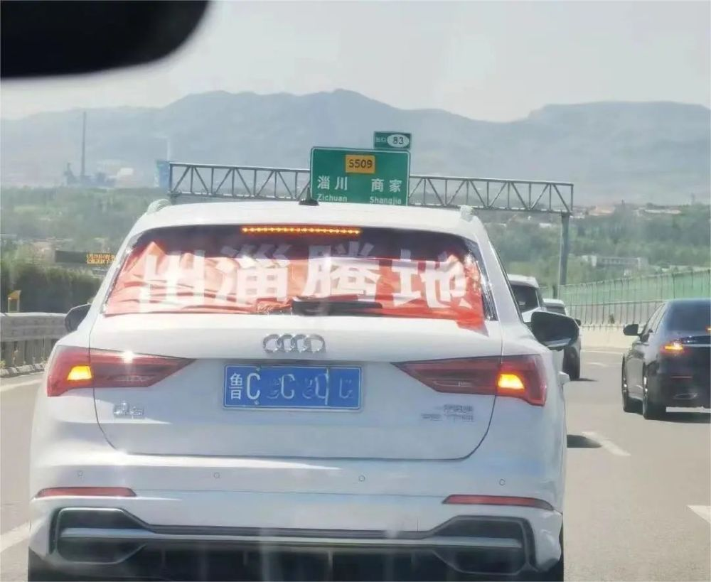

直到2022年，第二产业在淄博的GDP中，仍然占据高达58.8%的比重。但相比山东的一些城市，淄博的发展确实慢了一点。在2022年山东各市GDP排行榜中，淄博位于第7位，GDP总量不到排名第一的青岛的三分之一。在上榜的16个城市中，淄博的GDP名义增长率为4.81%，排名在中间。

**八大局，乃至八大局所在的淄博张店东城区，在一定程度上就是淄博这座城市命运的缩影。**

它曾经繁华过，“淄博多大的事都发生在这周边”。作为在东城区长大的孩子，白轩对这边昔日的盛况再熟悉不过了。这里是市政府所在地，有每座城市的中心地带都有的人民公园，有王府井广场，有市中心医院，有淄博饭店。淄博市第一家麦当劳，也开在区内的淄博商厦里。

产业造就了这里的繁华。东城区曾经是淄博最早的国企聚集地，聚集着山东新华制药厂、淄博东大化工厂、山东钢铁集团淄博张钢有限公司等企业。与之形成对比的是西边，那里曾经就是一片荒芜之地，白轩的父母在那里买过一套房，不久卖掉了。白轩记得，当时自己探头出去，看到的都是农田。

**转折点出现在2003年。**

淄博启动了西部新城区建设，试图把后者打造成为淄博发展的“领头羊”。这里的产业被规划为商务金融、高端服务、电子信息、文化创意、休闲旅游等新兴产业，换言之，这里代表着淄博的未来。资源开始向西边倾斜。

“航空港在西边，未来的淄博第一高楼在西边，CBD、政务、经济、文化、体育和休闲中心都在西边，最好的医院也在西边开了分部，所有最好的资源都去了西边。”白轩说。他父母卖掉的房子后来被拆迁了，上面盖起了万达商城。

代表着淄博过往荣光的东城区，则在逐渐衰落，成为“老破小”的代表。白轩觉得房价是最直接的体现：西部新城区的房子，最贵突破2万元一平米，均价在1.4-1.5万一平米，东城区的均价则是六千多元一平米。

“你把经济全部拉到西边去，那东边这座老城该怎么办呢？这是历史的底蕴。”一位淄博网友在网文中表达了担心。

**就像所有城市的老城区一样，生活方便成为东城区为数不多的优势。**

八大局，就是区内最大的便民菜市场。作为长期观察者，俊飞清楚它曾经的布局。八大局分东西街和南北街，东西街主要卖的是早饭、蔬菜、水产和生活用品等，南北街主要卖小吃、水果、糕点馒头包子和各种饼类，还有一条小路没有固定商铺，而是流动摊位，摊主铺块布就开始营业。

面积大，东西全，价格便宜，是八大局最主要的优势。他记得，以前的八大局，每家店都很有特色。光是早餐区，就有水煎包、肉火烧、油条豆浆、豆腐脑、肉油饼、煎饼果子、小笼包、武大郎烧饼、现擀的鸡蛋灌饼、滕州菜煎饼、安徽牛肉板面、西安甑糕，冬天还会卖博山酥锅。

各种应季蔬菜水果和肉禽水产更不必说。食客们都清楚，八大局的蔬菜和肉类，都是直接从批发市场运过来的，新鲜。白轩在这里买过8.9元一盒的蓝莓，外面超市要卖到11.9元。

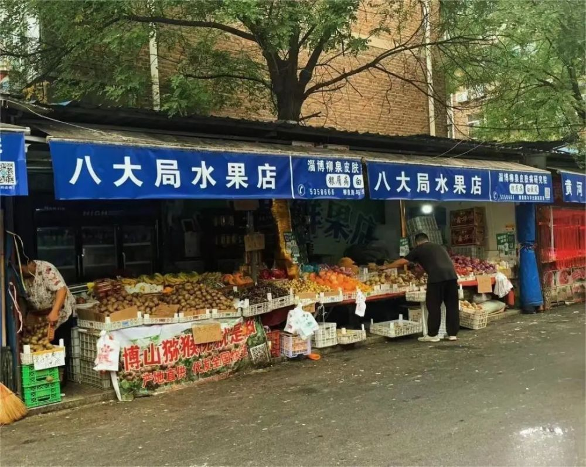

此外，这里还有理发店、服装店，价格都很亲民。

老城区的味道体现在，和新城区相比，这里有着更为悠闲的生活氛围和烟火气息。在八大局附近，很多居民都是老年人，他们习惯早早起床，去八大局吃个早饭，再溜达着买买菜。很多人会选择骑电动车。“对于腿脚不方便、体力不好的爷爷奶奶来说，这点是很友好的。”俊飞说。

然后，八大局突然火了。流量源源不断涌入，并以最快的速度推动了它的自我改造：成为一座最适合打卡的菜市场。

对于现在八大局的变化，白轩的内心非常纠结。
**他很怀念之前的老街区，但也明白八大局爆红对于淄博这座转型城市的意义——“淄博挺不容易的，能借此发展下也很好。”**
毕竟，不是每个城市都有这样的幸运。一个无法忽略的数据是，2023年“五一”期间，淄博旅游业消费额比4月增长73%。

往小里说，白轩觉得，在淄博西富东穷的情况下，八大局的走红，可以让东边老城区“不那么难堪”。很多游客第一站来的是这里，不是新区。

很多人由此刷新了对淄博的印象。八大局附近的老街，沿路长满高大的梧桐树，晴天可以遮阳，雨天可以避雨，在“五一”前后的春夏之交，满街绿色让这里漂亮得不像一座北方工业城市。

04流量隐忧

**淄博几乎在全城迎接流量的考验。**

比如“五一”期间，207家党政机关事业单位对外开放厕所，八大局等热门景点附近的单位几乎全部开放了自己的停车场。几乎所有的体制内人员全部变成了志愿者。有网友说，在一家不是网红的烧烤店，发现端盘子的志愿者是一位区级单位的副局长。

一切都是为了减少或者杜绝差评。一位北京游客发现酒店早餐一道菜不新鲜，跟前台随口提了一句，很快，经理带着礼物上门道歉，表示会仔细查清楚，再给予回复，在此之前，希望对方不要发布差评，“我们不能有投诉，现在查得很严”。

八大局的和谐更是重中之重。

最直接的体现是价格。关于这座菜市场的吐槽有不少，比如人太多、紫米饼味道不如预期，但几乎没有关于涨价的投诉。游客小桦感慨，节假日去过那么多景点，这里的物价是最低的。

**显然，八大局已经不只是一家菜市场。流量的注入，让它变成一只饱满漂亮的气球，飘在空中，吸引着所有人的注意力。**
但正如一只气球不可能永远飘荡在空中引人注目，一座菜市场，也很难长久地占据流量C位。

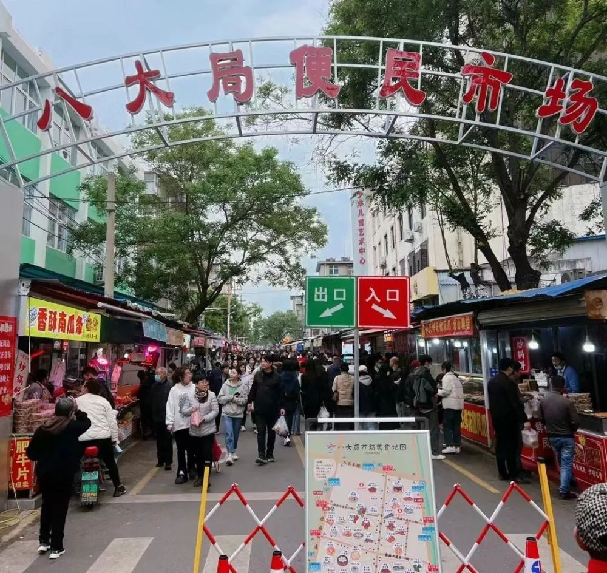

网红菜市场的故事，近年来已经逐渐为人们熟悉。

共研网数据显示，2022年，中国有44768个菜市场，其中不乏网红存在。比如北京的三源里菜市场、上海的PRADA菜场乌中市集、成都的玉林综合市场、昆明的篆新农贸市场。海外的网红菜市场也不在少数，比如日本东京的筑地市场、澳大利亚的墨尔本维多利亚女王市场、纽约的切尔西市场、荷兰鹿特丹拱廊市场、老挝琅勃拉邦早市。游客去当地旅行，它们往往是不可或缺的一站。

**对于这些老牌网红菜市场，游客的好奇和探访只是名气的助推器，抛开网红光环，它们本质上还是服务当地居民的菜市场，在城市日常运转中发挥着正常作用。**

比如说，在北京的三源里菜市场，有为西餐爱好者准备的黄油、淡奶、各国奶酪和新鲜的罗勒、百里香、迷迭香，为泰餐爱好者准备的新鲜香茅、柠檬叶和南姜。在昆明的篆新农贸市场，有各种云南特有的菌类和蔬菜，以及核桃酱卷卷粉、豌豆粉和乌鸡米线等小吃。

在日本的筑地市场，有大清早就举办的金枪鱼拍卖会，以及各种新鲜生鱼刺身。而在老挝的琅勃拉邦早市，芭蕉叶上摊着湄公河大鱼、竹鼠、蜂蛹，咖啡摊老板在路边用柴火现煮老挝咖啡。

这些菜市场，是游客和当地人共享的，甚至主要顾客就是当地人。

**作为新晋网红的八大局菜市场，如今的模样，其实更接近北京的南锣鼓巷——一条被过度商业化的街区。**

当地人隐身，临街店铺从装修、品类到价格，全部按照网红景点的标准打造，这是南锣鼓巷的现在。但十几年前，它曾经被视为商业与原住民共存的样本。在2007年之后的几年里，整条街道还是胡同生活的典型样本，早上，倒马桶的老人与酒吧出来的年轻人，毫不违和地在胡同里相遇。秋天，几条胡同大院里的柿子黄灿灿地探出墙头，总有人往社区居委会的桌子上送上几只。

流量改变了这里。“亚洲25处必去景点之一”，顶着这样的光环，南锣鼓巷的房租水涨船高，来钱更快的网红餐饮项目逐渐占据了整条街面。属于胡同的静谧，只有在深夜灯光熄灭之后，才会短暂降临。本地人也只有在陪游的时候，才会皱着眉头挤进这里的人群——就像他们不得不去陪逛故宫、长城一样。

**对于很多淄博老居民而言，他们已经失去了八大局市场。**

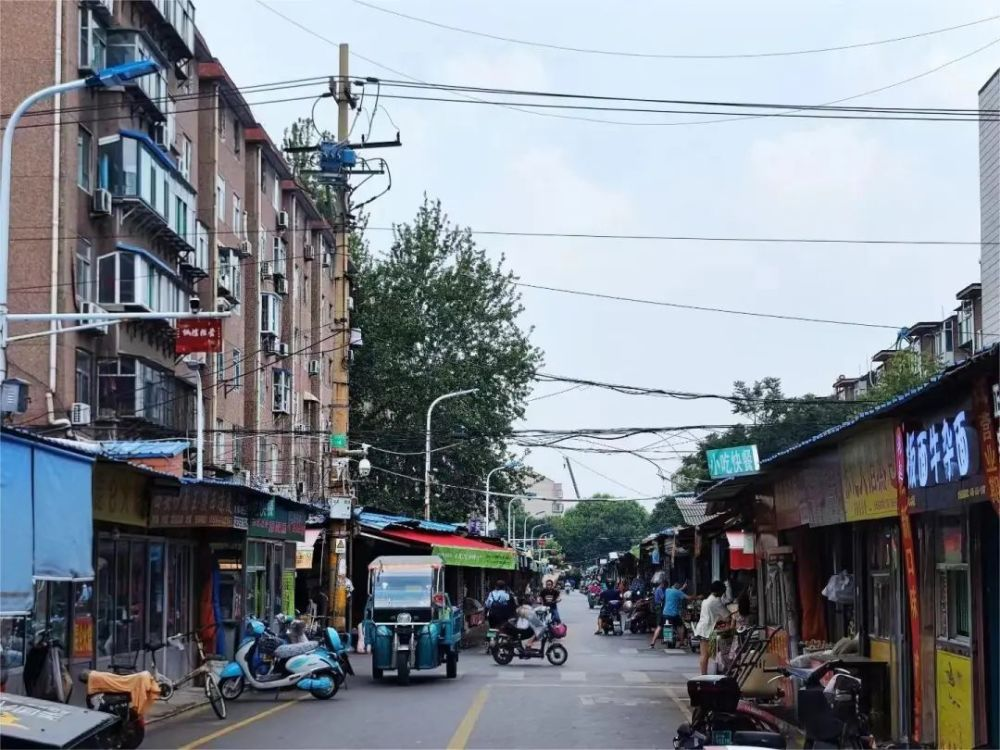

“估计能火到‘十一’之后吧。”淅淅沥沥的小雨中，玲子显得有些忧愁。夏天是淄博烧烤的传统旺季，估计八大局的热度能继续保持。但问题是，这就是一座菜市场——如果它还算是的话，谁会反复来打卡呢？

玲子记得，2022年，八大局的很多店铺都贴出了转租广告，但无人接盘。而现在，租金已经“高到了老百姓够不着”的水平。如果有一天游客没有了，这些网红店铺活不下去了，这条街还能回到以前吗？

这些问题，恐怕比流量获取和游客服务，更考验政府部门的规划治理能力。

**“淄博有高人。”**
北京游客山农在打卡了淄博烧烤、八大局后感慨。这座城市走红已经超过1个月，其间还经历过“五一”人流高峰，至今还在社交网络中保持着良好风评，光凭这一点，已经很不容易了。

从4月开始，淄博的政府治理能力已经被网友们反复表扬：从堪称范文的公开信，到紧随流量的频繁动作，比如在4月中旬就发布了《关于规范经营者价格行为提醒告诫书》，要求经营者明码标价，且不得随意涨价。一周后，关于酒店价格管理的通知继续出炉，要求全市所有宾馆酒店，不得在“五一”假期前后大幅涨价，并公布了清晰的罚款处理措施。

更多的细节体现在这座城市的细微之处。比如自驾来淄博的山农，几次在临时变道时都得到了本地车辆的礼让。“转向灯终于管用了”，他猜测，这应该与当地政府的提倡有关。

在经济复苏成为主题的当下，流量，似乎是互联网送给淄博的一份礼物。

**当然，闯关顺利，也与这座城市本身的底色有关。**

刚在淄博度过了“五一”假期的苏州游客许牧说，在八大局，一个阿姨很热情地走上来问：“你找到住的地方了吗？可以免费去我家住。”对方看起来很真诚，但她已经订好了酒店，就婉拒了。后来她发现，淄博确实民风淳朴，比如国内很多景区的物价在节假日都会翻倍，或者针对本地人和外地游客搞两个价。但在淄博，她没有遇到这样的情况。

5月5日下午，八大局市场南口，几位表演人员身着民族服装载歌载舞，众人看得热闹，主播们也纷纷靠拢，但表演很快被打断。在一曲结束的时候，几位工作人员模样的人上前交涉，随后，演出者不好意思地说道，因为扰民被投诉，演出要结束了。

遗憾的情绪在人流中涌起。但突然有人高喊：“淄博欢迎你们。”很快有人接话：“哪里都欢迎你们！”最后，活动以演出人员配合众人拍照留念而告终。没有争吵，没有不满，丝滑解决。

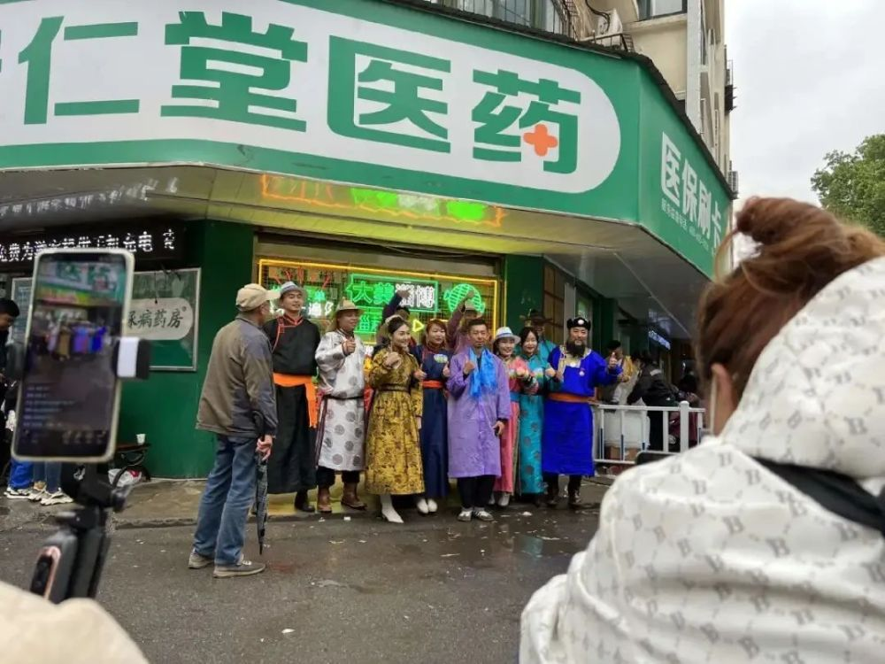

那一刻，八大局里熟悉的人情味又重现了。

（本文采访对象均为化名）

