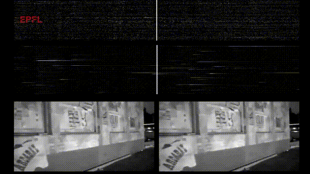
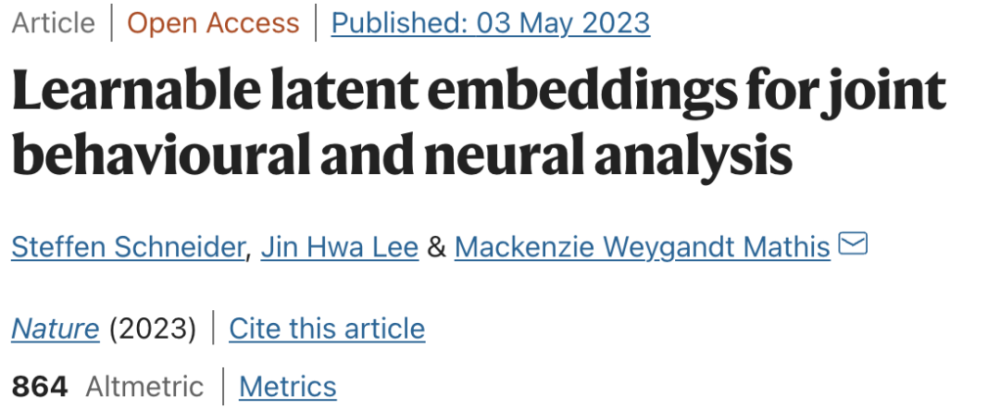
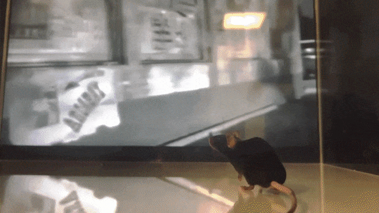
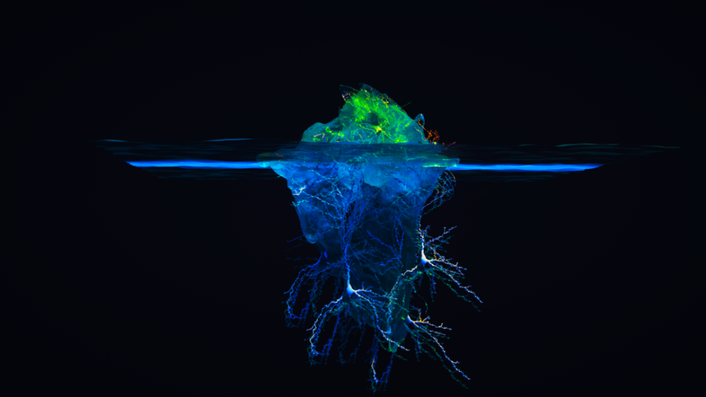
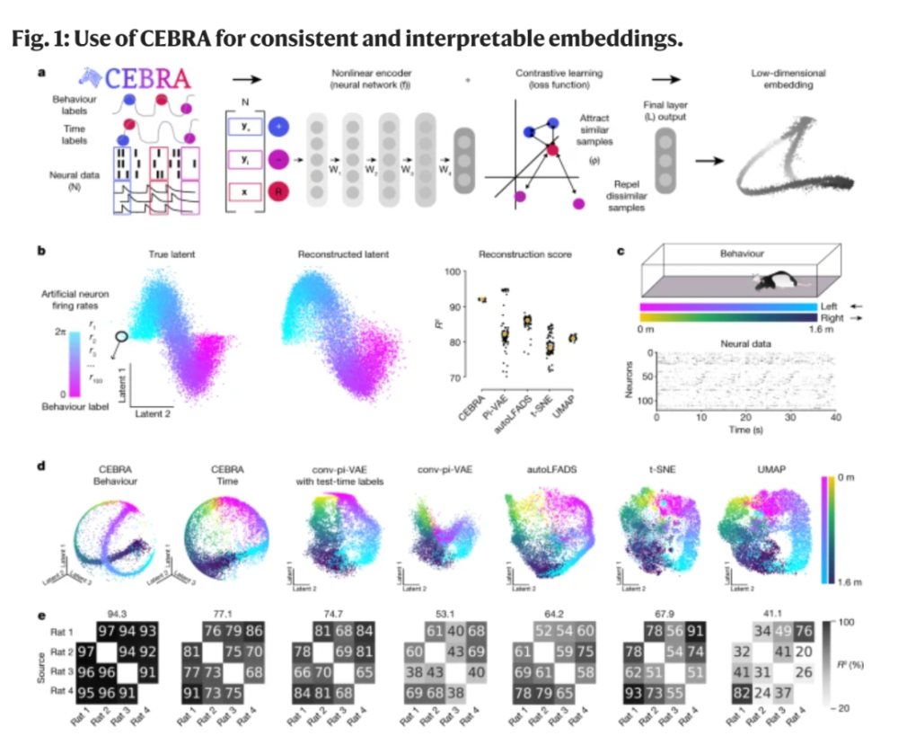
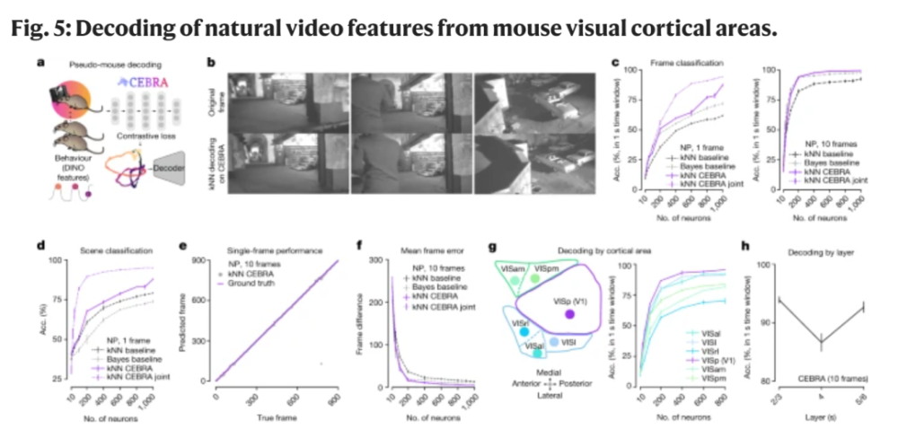
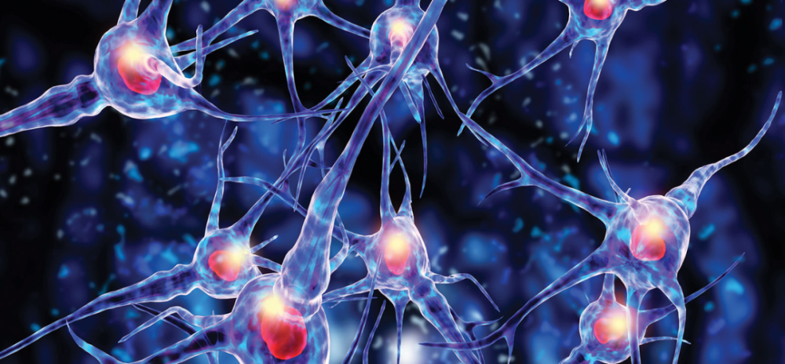

# AI读心重磅突破登Nature！大脑信号1秒被看穿，还能预测未来画面

现在，AI不仅会读脑，还会预测下一个画面了！

利用AI，一个研究团队「看见」了老鼠眼中的电影世界。

更神奇的是，这种机器学习算法，还能揭示大脑记录数据中隐藏的结构，预测复杂的信息，比如老鼠会看到的东西。

给一段上世纪60年代黑白老电影中截取的视频画面：一个男子向汽车跑去，打开了后备箱。

小鼠看过电影片段后，AI通过分析其脑部数据，竟把画面重构出来了。

可以说，几乎与电影原作一致，是不是很神奇？

近日，来自瑞士洛桑联邦理工学院的团队在Nature上提出了一种名为CEBRA的最新算法，就把AI读脑给实现了。

最最最重要的是，准确率超过了95%！

这一人工神经网络模型仅用了三步，首先分析和解释行为/神经数据，然后解码来自视觉皮层的活动，最后重建观看的视频。

CEBRA的意义在于，能够对来自视觉皮层的视频进行快速、高精度的解码，这对于理解人类大脑活动来说，意义重大。

网友调侃，各地的思想犯罪指数，会怎么样？

01 CEBRA，从小鼠的大脑信号中预测电影

此前，这种「AI读脑术」就曾在网上引发轩然大波。

一篇CVPR2023论文称，Stable Diffusion已经能重建大脑视觉信号了。

AI看了一眼人脑信号后，立马就给出下面这样的结果。

而在这次的研究中，科学家们更进了一步，新算法构建的人工神经网络模型，不仅能捕捉大脑动态、准确地重构画面，还能预测出小鼠能看到的东西。

另外，它还可以用来预测灵长类动物手臂的运动，重建老鼠在场地中自由奔跑的位置。

这种新型的机器学习算法名为CEBRA (与zebra同音) ，能够学习神经代码中的隐藏结构。

为了了解小鼠视觉系统中的隐藏结构，CEBRA可以在一个初始的训练阶段后，直接从大脑信号中预测看不见的电影画面，绘制大脑信号和电影特征。

具体来说，CEBRA是基于对比学习实现的一种机器学习算法。

CEBRA提供了三种不同的模式：1 假设驱动模式2 发现驱动模式3 混合模式

它能够学习将高维数据排列或嵌入到一个称为隐空间（latent space）的「低维空间」中。

这样做就能够实现，相似的数据点紧密相连，而差异大的数据点就会进一步分离。

这种嵌入模式可用于推断数据中的隐藏关系和结构。它使研究人员能够同时考虑神经数据和行为标签，包括运动，抽象标签（如奖励），或感官特征（如图像颜色或纹理）。

02 老鼠「读脑术」

怎样将小鼠脑中的画面重现呢？

研究者召集了50只小鼠，让它们一起观看一段30秒的电影片段，并将这个过程重复了9次。

在小鼠看电影时，研究者就会把探针插进小鼠的大脑视觉皮层区域，收集它们的神经元活动信号。这个过程，也就是我们熟悉的脑机接口（BMI）。

这个过程中用到的探针有两种：

一种是通过插入小鼠大脑视觉皮层区域的电极探针直接测量，另一种是通过光学探针在基因改造的小鼠中获取。这些光学探针经过改造，使激活的神经元发出绿光。

然后，研究者通过CEBRA，将这些神经信号与600帧电影片段联系起来，建立起两者之间的映射。

有了前面9次观看的记忆巩固加强后，研究人员又让小鼠观看第10次，并收集了这一次观看时的大脑活动数据。

_将CEBRA应用于小鼠初级视觉皮层_

基于这些大脑数据，研究人员测试了CEBRA在预测电影片段中画面顺序方面的能力。

结果发现，CEBRA能够在1秒内以95%的准确率预测下一个画面。

03 人类大脑，终极目标

将行为动作映射到神经活动，一直是神经科学的一个基本目标。

但是，研究者们一直缺乏可以灵活利用联合行为和神经数据揭示神经动力学的非线性技术，而CEBRA算法，填补了这一空缺。

而且，CEBRA还可以用于空间映射，从而揭示复杂的运动学特征，还能提供对来自视觉皮层的自然视频的快速、高精度的解码。

具体来说，研究者提出了一个联合训练的潜在嵌入框架。

CEBRA利用用户定义的标签或仅限时间的标签，获得了一致的神经活动嵌入，可用于可视化数据和解码之类的下游任务。

这个算法基于的对比学习，正是利用相互对比的样本（正样本和负样本）来找到共同属性和区分属性。

_使用CEBRA实现一致且可解释的嵌入_

CEBRA的优势就在于它的灵活性，以及有限假设和检验假设的能力。

对于海马体，可以假设这些神经元代表空间，因此行为标签可以是位置或速度（图2a）。

另外，还可以有一个替代假设：海马体不映射空间，而只是映射行进方向或其他一些特征。

_使用CEBRA的假设和发现驱动分析_

论文一作Steffen Schneider称，与其他算法相比，CEBRA在重建合成数据方面表现出色，这对比较算法至关重要。

它的优势还在于，能够跨不同模式组合数据，比如电影特征和大脑数据。它还有助于限制细微差别，比如收集数据收集方式对导致数据变化。

_从小鼠视觉皮层区域解码自然视频特征_

「这项工作朝着神经技术实现高性能BMI所需的理论支持算法，又迈出了一步，」EPFL的Bertarelli综合神经科学主席兼该研究的PI Mackenzie
Mathis说。

研究者称，CEBRA在视觉皮层只有不到1%的神经元的情况下表现良好。要知道小鼠的大脑大约有50万个神经元组成。

CEBRA的最终目标，是揭示复杂系统中的结构。由于大脑是我们宇宙中最复杂的结构，它是CEBRA的终极测试空间。

CEBRA还可以让我们了解大脑是如何处理信息的，并通过整合动物，甚至其他物种的数据，为发现神经科学的新原理提供一个平台。

当然，CEBRA算法并不仅限于神经科学研究，因为它可以应用于许多涉及时间或联合信息的数据集，包括动物行为和基因表达数据。因此，CEBRA潜在的临床应用令人兴奋。

04 网友质疑：这能叫读心术？

网友称，AI重现大脑画面的研究，这不是首次。

在11年，UC伯克利的一项研究使用功能磁共振成像（fMRI）和计算模型，初步重建了大脑的「动态视觉图像」。

也就是说，研究者重现了人类大脑看过的片段，但几乎是无法辨认。

不过，对于这项AI解析小鼠大脑信号、成功重构出观看的电影片段，网友纷纷表示质疑。

「我并非想贬低这项出色的工作，但这不是从老鼠看到的东西中创造视频，而是匹配哪一帧视频最符合模型解释当前帧的内容，所以......它不是产生视频数据，而是一个帧号，然后在屏幕上显示该帧。这个区别很微妙，但很重要。」

同样看过视频后的网友指出了问题——

「这个视频有点误导人。它并不像你看到所有这些扩散模型后所想的那样，完全从头开始构建。这个特定的模型只看过这个视频，并且只是将不同的帧映射到脑信号上。所以这并非是读心术。」

「这个说法是不准确的，并没有视频被生成。它只是在充分了解视频的情况下，预测了正在观看的视频的时间戳。」

参考资料：

https://www.eurekalert.org/news-releases/987862

