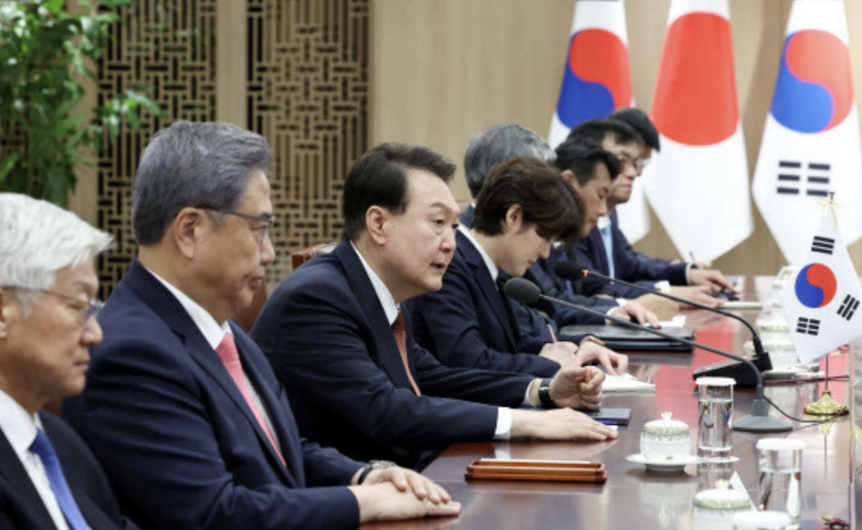
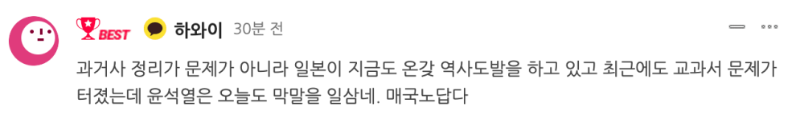
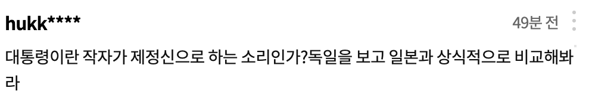

# 尹锡悦当岸田面说“须摆脱不清算历史就无法合作的思维”，韩网友怒了

【环球网报道】
日本首相岸田文雄7日访韩与韩国总统尹锡悦会谈，尹锡悦在会上涉及历史的发言再次引发日韩媒体关注。据日本广播协会（NHK）报道，尹锡悦向岸田表示，“必须摆脱‘如果不清算历史就无法推进未来的合作’这种思维”。这一言论很快在网络上受到韩国网友强烈抨击。有人警告尹锡悦，“忘记过去的民族没有未来”。

_尹锡悦（左3）在7日与岸田的会谈上发言，图自韩媒。_

NHK称，岸田在会谈中向尹锡悦表示，他对日韩重启“穿梭外交”感到高兴。尹锡悦则称，“（我与你）在东京的首脑会谈还没有过去超过两个月，韩日关系实质性的改善就如此呈现出来。我感到肩负着责任，去创造比以前双边关系良好时期更好的时代”。尹锡悦还主张称，“必须摆脱‘如果不清算历史就无法推进未来的合作’这种思维”，“期待岸田访韩成为两国未来合作的有意义的一步”。

尹锡悦关于历史的言论引发日本与韩国媒体的关注。日本右翼媒体《产经新闻》声称，这代表了“尹锡悦与要求日方就二战道歉的外交方式划清界线，重申了其推进日韩关系的方针”。另一方面，《韩民族日报》虽然没有直接在涉及该言论的报道中做出评论，但该媒体7日在网站上发布了题为《向岸田出卖“历史”，向拜登出卖“和平”，没有外交的一年》的文章，指责尹锡悦政府“失去的是历史与和平，得到的却是老旧的理念”。

尹锡悦的最新言论也引发韩国网友的愤怒。有网友评论称，“问题不在于清算历史，而是日本现在在进行各种历史挑衅，最近教科书问题也爆发了，尹锡悦今天也胡言乱语。真是卖国贼”。

有韩国网友警告尹锡悦，“忘记过去的民族没有未来”。

还有人说，“总统这家伙说话时是神志清醒的吗？看看德国，再用常识比较一下日本吧”。

近期，日本不断在历史问题上开倒车：4月21日，日本首相岸田文雄以“内阁总理大臣”的名义，向靖国神社供奉名为“真榊”的祭品；3月28日，日本文部科学省审定通过一批小学教科书，淡化和歪曲日本强征和奴役劳工的历史事实，掩盖其殖民统治朝鲜半岛期间的暴行。在历史问题上搞小动作已经成为日本的惯常操作，而令人担忧的是，殖民史观以及“殖民地近代化论”近年来在曾经的侵略战争受害国韩国有“兴起”之势，包括总统在内的不少韩国政界人士曾就历史问题发表不当言论。通过学者的抽丝剥茧可以发现，日本不仅在本国大搞历史修正主义，还通过提供“理论”和资金等方式，在韩国助推“有毒”的殖民史观，而追根究底，则是美国为维护本国的利益而阻碍日韩两国进行历史问题反思，从而给东亚以及亚太地区的发展和安全埋下隐患。

