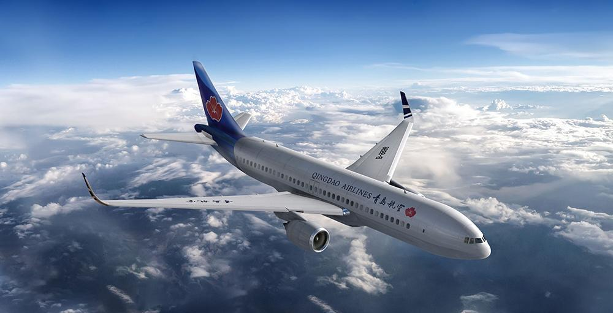

# 巨亏15亿！青岛航空董事长、控股股东董事落马，曾被山东前首富甩卖

本文来源：时代周报 作者：邓宇晨

青岛航空及其控股股东青岛城市建设投资（集团）有限责任公司集团（下称“青岛城投集团”）因人事变动而再度受到外界关注。

青岛城投集团5月4日公告，集团党委副书记、董事、总经理臧毅杰涉嫌严重违纪违法，目前正接受青岛市纪委监委纪律审查和监察调查。青岛航空原董事长卢民不久前也被纪委监委调查。4月30日晚间，青岛市纪委公号发布信息称，青岛航空原党委书记、董事长卢民涉嫌严重违纪违法，经青岛市纪委监委指定管辖，目前正接受莱西市纪委监委纪律审查和监察调查。

卢民还有两年就退休，1965年出生，今年已58岁。他曾在青岛市财政局、青岛市国资局任职，2001年-2022年，卢民先后任青岛开发投资公司总经理助理、青岛城投集团总经理助理等职。

2023年2月，卢民还曾公开露面，在青岛出席某论坛，代表青岛航空与青岛机场、新疆机场、南航新疆分公司签署合作协议。

青岛航空两年前成为青岛国资旗下企业。2020年9月，南山控股将青岛航空的控股权移交给青岛城投集团。据南山控股旗下南山集团此前公告，以青岛航空为主的南山集团航空板块资产的交易总价款为68.50亿元。交易完成后，青岛航空从全资民营航企转为全资国有企业。

_图片来源：青岛航空_

2023年是青岛航空开航第九年，青岛航空累计执行航班20.4万架次，承运旅客2233万人次。据青岛航空旗下“青航佳人”官微，青岛航空于2023年4月引入一架A320飞机，机队规模扩增至33架。

青岛航空去年亏损15.86亿

除去臧毅杰和卢民，2021年-2022年，青岛城投集团原董事长邢路正，青岛城投集团旗下城投实业投资（集团）有限公司原总经理徐建军、原副总经理王衡以及青岛城投集团基金管理中心原党支部书记、副主任宋秀红接连被查。

据“青岛城投”官微，2022年青岛城投集团资产总额4468亿元，排名全国城投类公司第5名、山东省百强企业第66名。

_图片来源：青岛城投集团官网_

据青岛城投集团2023年4月发布的公司债券年度报告披露，青岛航空2022年实现营收22.62亿元，亏损15.86亿元，总资产165.19亿元。这一体量与民营上市航司华夏航空（002928.SZ）相当。华夏航空2022年实现营收26.43亿元，归母净利润亏损19.74亿元，总资产174.96亿元。青岛航空也早有上市计划。2020年9月，青岛城投集团相关负责人就对外表示：“力争3-5年的时间（使青岛航空）具备上市条件”。

截至2021年末，青岛航空共设置8个外站基地，在飞航线60条（包括59条国内航线、1条国际航线），通航城市59个，青岛航空目前运力占青岛机场运力份额的17%。青岛城投集团在年报表示，集团主要定位为城乡基础设施投资建设服务运营平台、新能源平台和资本运作平台，并提出要“推动青岛航空建设具有核心竞争力的主基地航司”。

山东前首富缘何放弃“航空版图”？

从民营转为国营，青岛航空控股权的变化，也折射出民航领域民营资本的“撤退”。

2013年6月，青岛航空获中国民航局批准筹建，由南山集团、青岛交通发展集团、山东航空共同投资组建，成为了青岛本土的首家航司。2014年4月，青岛航空首架飞机顺利首飞。

南山集团隶属于南山控股，南山控股是山东省知名的大型民办企业。官网资料显示，南山控股目前拥有南山工业园区、东海旅游度假区、裕龙石化产业园区和屺母岛临港产业园四大园区，形成了以铝业、纺织、石化、地产、金融、教育、科技、旅游、健康养生为主导的多产业并举的发展格局，旗下上市公司包括南山铝业（600219.SH）、南山智尚（300918.SZ）。

南山集团前身是1979年的烟台龙口市东江镇前宋村村办企业。1988年，南山集团创始人宋作文作为致富“带头人”，被推举为前宋村村支书，在上述企业基础上改制组建了南山前宋企业集团总公司。1992年，南山前宋企业集团改制更名为南山集团有限公司。

2010年，《山东商报》发布的榜单显示，宋作文家族以396亿财富登顶山东首富；在2019的胡润百富榜中，宋作文家族以300亿元身家位列山东第三，烟台第一。宋作文也是青岛航空的首位董事长。

在青岛航空成立之初，南山集团持股55%，其余两家国资企业共持股45%，但在2015年，两家持股国资企业相继退出，由南山集团和关联企业持有全部股份。

航空产业的重资产特征明显，需要长期重金投入，对成本控制也有极高要求。据媒体报道，国资股东的退出与长期的亏损不无关系。南山集团曾有意寻找中国东航（600115.SH）接盘，但因价格太贵，最终两者没有“联姻”。

根据南山集团2019年12月发布的《航空板块收购框架协议》，截至2019年6月底，青岛航空总资产为65.6亿元，净资产12.08亿元，实现营业收入11.58亿元，营业利润亏损1.41亿元，净利润亏损9981万元，资产负债率81.7%。

多家中小航司获国资“增援”

近年来，民航市场不振，大多中小航司处于亏损状态。为了获得更好的发展，有不少航司成功拥抱资本市场，也有航司寻求国资支援“输血”求生。

从2004年5月首家民营航司奥凯航空成立后，2004年至2006年，共8家民营航司设立，它们的命运不尽相同——春秋航空（601021.SH）、吉祥航空（603885.SH）、华夏航空（002928.SZ）已顺利上市；东北航空和鹰联航空则先后被国资收购；东星航空已在2009年注销破产。

2013年，民航局时隔6年再发民航牌照。此后，航司再添新军，涌现出瑞丽航空、青岛航空、九元航空、红土航空、长龙航空等民营航司。2019年12月，湖南国资增资红土航空成为第二大股东。次年，红土航空更名为湖南航空。2021年，无锡市交通产业集团拿下瑞丽航空的控股权，并将之更名为苏南瑞丽航空。2022年，浙江本土航司长龙航空完成增资，两家新股东分别为浙江省产业基金和杭州萧山产业基金。

今年以来，航空市场持续复苏，中小航司表现出更快的恢复速度。航班管家统计数据显示，“五一”期间，国内航司日均航班量超过2019年同期的有25家，航班量恢复率排名前三均是中小型航司，分别为长龙航空（155%）、青岛航空（137%）以及成都航空（136.1%）。

