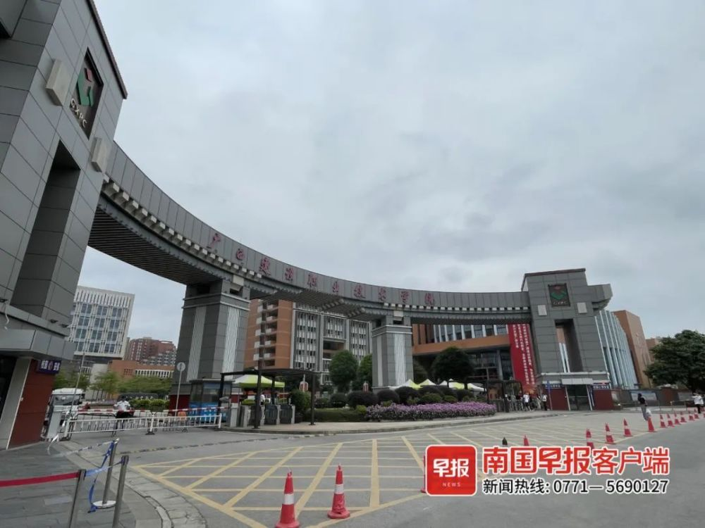

# 广西建设职业技术学院一名大二学生洗澡时触电身亡？校方通报

南国早报全媒体记者 李慧子

近日，网传广西建设职业技术学院一学生在学校洗澡时触电身亡，引发广泛关注。

南国早报全媒体记者了解到，这名学生姓岑。

记者联系上岑同学的一名家属，对方表示，岑同学于5月4日晚10时在学校宿舍洗澡，其间惨叫了一声，等同学发现后，经抢救无效身亡。

_▲5月7日下午，该校门口拉起警戒线。南国早报全媒体记者
李慧子摄_

岑同学的姐姐告诉记者，弟弟今年上大二，平时身体很好，因此怀疑岑同学是触电身亡。该校一名学生告诉记者：“学校使用的是智慧校园系统，漏电应该不太可能。”

5月7日晚，广西建设职业技术学院官网就此事发布情况通报称，5月4日晚10时20分许，该校学生岑某某在学校宿舍卫生间洗澡时晕倒，经120及时抢救无效死亡。目前，警方已初步排除案件可能，岑某某同学的确切死因需待相关部门进一步确定。

_▲校方发布情况通报。图源：广西建设职业技术学院官网_

（来源：南国早报）

