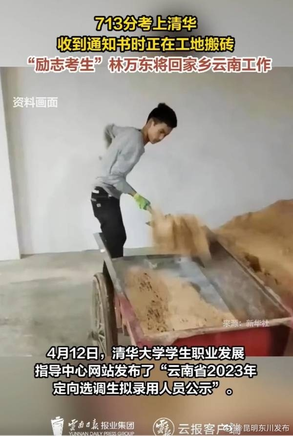

# 搬砖的清华学生谈回乡做公务员：爸爸去世了母亲还在工作，我想去陪她

4年前，云南宣威市阿都乡小山村的林万东在工地和母亲“搬砖”时，得知自己被清华大学录取。这一幕被媒体报道后，打动了不少人。

那时的他戴着一副厚重的黑框眼镜，身材瘦弱，皮肤黝黑。其腼腆地解释道：“读大学前只有90斤，现在比之前重了20斤。”

近日，林万东被拟录用为云南省2023年定向选调生，去向单位为云南省昆明市东川区委办公室。

有人说，“清华毕业的人才应该搞科研，当公务员是大材小用。”

林万东称，不是所有清华的学生都适合做科研。对他来说，回家乡当公务员是最好的选择，他不想让母亲继续在工地搬砖，回云南既可以陪伴母亲，又可以找到自己的根。

_林万东现状。图/九派新闻
辜子旋_

**【1】选择回乡，“想找到自己的根”**

现在，林万东衣着整洁，留长的头发，光洁白皙的脸庞。中等身高，面颊略显丰腴。

他关注到云南的一位80后的干部头发花白，面容沧桑，被质疑“像60后”。这让林万东对未来工作的难度有了心理预期。

但他认为自己未来不会变成这样。“我很尊敬这位干部，但是选择不这样拼命的人，也不应该受到指责。我性格比较佛系，并不是特别看重未来的工资收入，也没有太多的追求。”

他说，高考后，不少人向他咨询学习方法。他认为，最重要的是心态，告诉自己坦然面对。

“不是所有清华的学生都适合做科研，我没有做科研的兴趣和天赋。即便是读研，我也觉得我是在生产学术垃圾。对我来说，当公务员又比去公司上班要好一些。”

林万东坦言，刚读大学时，他从未规划过未来。后来，他了解到选调生的信息。大四上学期，他才真正下决定参加考试。

对他来说，毕业后无非是三条道路——读研、去公司上班、当公务员，他只是选择了其中的一条职业道路而已。

他说，身边的同学大多都选择继续读研，也有不少人进入了知名企业。

之所以选择云南的公务员岗位，林万东有两点考虑，“一是想离母亲近些，二是想找到自己的根。”他说。

高中期间，他每月回家一次。读大学后，只有寒暑假才能回家。长大后，和母亲相处的时光更是珍贵。没有家人在身旁，他常常感到没有归属感，渐渐找不到自己的定位，甚至不认识自己是谁。

林万东认可“寒门再难出贵子”的说法，也因为这样的现实而难过。他承认，考上清华只能代表自己善于做高考题目，而漫长的人生却是个复杂的命题，他并未因此成为所谓的贵子。

但许多人因此产生“读书无用”的想法，林万东却不这么想。他认为，是读书让他考上了清华，读更多的书，有了不一样的思考方式，给他们的家庭带来了希望。

**【2】高考对完答案，知道自己“稳上清华”**

4月底，北京的气温还算凉爽。

林万东想起高考前，为参加自强计划的面试，堂哥陪同他从云南来到清华大学。虽然两人都是第一次来清华，但在校园内转了几圈后，林万东默默在心里记下了学校各教学楼、食堂、宿舍的分布地点。

那一年，宣威六中的高考生接近1000人，只有3名同学可以获得自强计划的笔试资格。林万东得知可以去参加笔试时，并没有把这件事放在心上。

“参加这个比赛的都是大神级别的人物。我不觉得自己有多厉害，一开始没抱太大希望。”他说，他不仅顺利通过了面试，在高考时也超常发挥，这一切都让他非常意外。

比起查成绩和收到录取通知书，更让他激动的是考完后收到班主任发来的考题答案那天。他和表哥在昆明的一个花园散步，突然收到班主任发来的标准答案。

他等不及回家，站在原地对答案，一共只错了3个选择题。“当时是最激动的，觉得自己稳上清华，真正出成绩时反而不激动了。”

2019年8月底，作为大一新生的林万东来到清华大学报道。这是他第二次来到清华大学，一切还不算太过陌生。他没带太多行李，一个人摸索着坐地铁到学校，又独自一人办齐报道手续。

_刚上大学的林万东。图/清华大学_

考上清华后，因学业压力，林万东常常感到无所适从。和同学相比，他来自云南的一个小山村，教育资源和学术训练都很缺乏。这对他来说，是一个既客观却又无法改变的事实。

“很多来到清华的同学都是天才，而我却绝不可能称得上。我就是一个普通的庸才，只不过高考成绩好了点而已。”他几乎是勉强地挤出一丝苦笑。

上大学后他才发现，身边的同学早已参加过各种各样的编程竞赛，学过微积分，精通计算机。而他在高中时只学过高考大纲上的内容，对计算机技能一窍不通。大学4年，因为基础上的差异，学习同样的内容，林万东常常要比其他同学花更多时间与精力。

4年的时间，赶上他们了吗？林万东说，在他拼命追赶时，其他同学也在不停奔跑。“在清华，没有人会原地踏步。和一些同学相比，我们之间的差距越来越大，这种感受非常深刻。”

**【3】清华为他免除学费，老师建议他放弃勤工俭学**

来北京后，林万东想念家乡的美食，常点一份小锅米线或炸洋芋。舌尖被辛辣的刺激覆盖，将他的思绪拉回阿都乡的小山村。

小时候，吃的食材都是家里种的，他数不清家里种了多少地。读小学时，父亲因家里建房子，不小心伤到了腰椎，后来又查出脑梗。父亲身体虚弱，家里的重担全落在了母亲一个人头上。

父母从未对姐弟三个的成绩有过要求，聊起成绩时，他们总是说：“努力就好，现在已经很好了。”倒是弟弟，常常在外人面前自豪地夸奖他。兄弟俩吵架时，弟弟却又会流露自卑的情绪：“为什么你这么厉害，我就这么菜？”

不上学的时候，他会到山上去锄地、种庄稼，回家后帮着割草。高中后，母亲去了工地打工。高考一结束，为了赚取学费和生活费，他立即跑到工地帮母亲一起搬砖。

工地的薪资按天数和工作量计算，大约一天180元。没多久，他的背就被磨破了一层皮。但他仍旧觉得种地比搬砖要苦，“种地一年到头都不能停，也没有现金收入。搬砖虽然耗费体力，但干一天就有一天的工资。我从小就在山上搬土豆和玉米，习惯了体力劳动，也不觉得自己很苦。”

_视频截图。_

读大学后，清华大学给林万东免除了学费，并提供生活补助。“我每个月的主要花销是吃饭，在食堂吃一餐不超过15元。来到北京后，我没有因为经济条件而自卑过，能满足一日三餐、生活需要就可以了，其余的花销也没有太大意义。”

闲暇时，林万东会去北京的景点和胡同里逛逛。因为价格太高，他不常吃外面的餐厅。他想过多赚些钱，尝试做过家教兼职，每周末从海淀区跑到朝阳区，还在学校参加了不少勤工俭学的项目。老师知道后，建议其把更多精力放在学习上。思虑再三，林万东决定听从老师的建议。

**【4】不让母亲再去工地干活**

2020年，林万东的父亲因脑梗和其他身体问题去世。提及这件事，他一直保持的笑容瞬间消失。他把头埋在电脑后面，再抬起时，眼眶已微微泛红。

“我很少想这件事情，好像强制自己不去想，就不会难过。”他说，他从未和任何人聊过父亲去世。

说到这里，他又一次将头埋在电脑后，手指在鼠标上慌乱点击着。沉默数分钟后，他才缓缓开口。

那次，他在宿舍午休时，突然接到堂哥打来的电话。堂哥只说了父亲情况不好，病得很重。但林万东心里明白这句话的含义。他立即订了票，赶回云南。

父亲去世后，你有什么变化？“我不清楚，也许是我一直在回避。”他嘴唇颤抖数秒，寥寥几字，却用尽力气。

每周，林万东都会和母亲视频通话，大多时候是母亲主动联系他，母亲常问：“你是不是不想我？是不是把妈妈忘记了？”

父亲去世后，爷爷和大伯生活在老家。每到假期，他都会回昆明，再和家人一起回宣威老家。

现在，林万东的姐姐已大学毕业，在昆明找了份工作，和母亲住在一起。弟弟正在读大专，打算去当兵。母亲仍然坚持每天在工地搬砖背沙。

“这些年我们家经济条件有一些改善。可能是身为母亲，她总想为我们多攒些钱。每次寒暑假回家时，我常看见妈妈在工地加班到很晚。我们多次劝她找份轻松的工作，但是劝不动她。”

他决定，等毕业回云南工作后，一定不让母亲再去工地干重活。

**九派新闻记者 辜子旋 北京报道**

版权归原作者所有，向原创致敬

