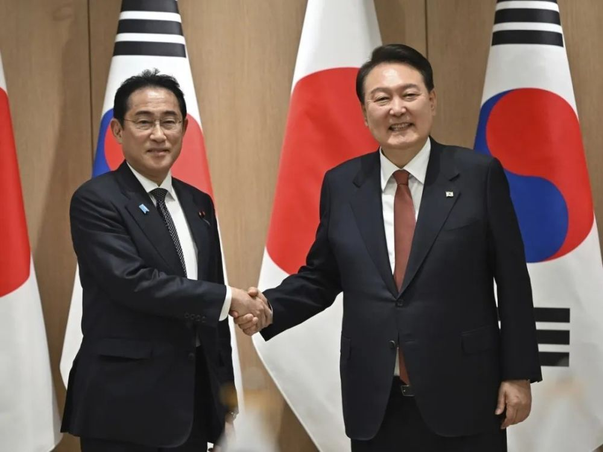

# 日韩关系“柳暗花明”？媒体：不过是又一只“强扭的瓜”罢了

**直新闻：吴先生，时隔12年，日韩重启首脑间“穿梭外交”。岸田文雄首相今日抵达韩国访问，说是要与尹锡悦总统“坦率交换意见”。日韩这对冤家真的迎来“柳暗花明”了吗？你如何展望岸田此访？**

**特约评论员 吴蔚：**
短短三个月内，美日韩三国领导人之间的互动确实非常频密，其中最引人关注的是日韩领导人之间“过于友善”的姿态，令我有些感慨：文在寅与安倍的“硬气外交”时代确实已经远去了。那么如何看待日韩两国领导人这一段密集交往呢？我先说结论，一言以蔽之：日本与韩国都已经明确地、公开地站队了，重新宣示了自己作为美国马前卒的角色。

确切地说，日本首相岸田文雄此访算是对尹锡悦今年3月访问日本的回访，用尹锡悦自己的话讲，就是：韩日迈向了“合作新时代”。日韩领导人“穿梭外交”时隔12年的重启，算是一个标志。当我们在展望岸田文雄此访能够取得什么成果时，不妨先考虑一个问题：是什么促使韩日这对冤家重新开始拥抱彼此呢？

我想最主要的还是美国因素在发挥作用。一直以来，所谓的“美日韩军事同盟”就是一个强扭的瓜，是在美国盟主软硬兼施下规劝出来的一个貌合神离的松散组合。之所以松散，源于日韩之间根深蒂固的矛盾，若将这个矛盾摊开了讲，大致可以归类为三个主因：历史上的民族仇恨、现实中的领土纷争以及经济上的产业链碰撞。

那么美国是如何着手发力，将日韩这对冤家重新笼络上一张桌子的呢？我认为拜登非常狡猾地抓住了一个“牛鼻子”，那就是日韩产业链之间的对立统一关系，美国用经济关系迫使韩日两国重新调试彼此关系。

大家应该还记得，拜登去年5月访问韩国，下飞机之后第一站去的是韩国三星位于京畿道的半导体工厂，尹锡悦全程陪着，点头哈腰有说有笑。为什么我说拜登抓住了韩国的“牛鼻子”？某种意义上看，美国现任政府的所谓“产业链重整计划”将直接决定韩国这个国家的产业之于全球经济活动的地位，事关韩国诸多财阀的未来生计，就算尹锡悦看不懂，财阀的老总们也会教他懂。

美国摆出了一副“顺我者昌逆我者亡”的姿态，以产业链的重新调整为切入点，让日韩两国乖乖归队。回看日本、韩国以及中国台湾的历次产业链转移，基本都是由美国主导的。别看如今三星、台积电都有着独步全球的先进制造业水平，归根结底那都是“美国爸爸赏饭吃”。因此，当美国政府一旦触及了这个根本，这些小弟都得乖乖低头。所以，并不是说日韩两国真的迎来了什么“柳暗花明”，实现了什么所谓的“历史和解”，只是人在屋檐下不得不低头。

回到现在，岸田文雄此访会取得什么成果，其实不难预期，因为拜登已经充分敲打过这两位日韩领导人了。我个人预计，日韩两国的产业链对接合作会更上一层楼，但在历史遗留问题上以及领土纷争上，岸田与尹锡悦不会有过多着墨，谈不拢的事情，谁都不提就是了。

一个有趣的细节是，岸田文雄抵达韩国后先去参拜了国立显忠院。这座韩国的国家公墓先后埋葬了韩国抗日独立运动、朝鲜战争以及越南战争中殉职的军人。那么你猜，岸田拜的是哪些“英灵”呢？

**直新闻：据韩媒报道，岸田文雄此访也是在韩国民众的一片抗议之声中展开的，一方面，韩国不少民众对总统尹锡悦在历史问题上的“让步”颇为不满，另一方面，韩日邦交的正常化却依然在稳步推动。吴先生，你怎么看这种“龃龉之下的握手言和”？**

**特约评论员 吴蔚：**
正如我刚刚所谈到的，日韩两国并没有真正实现所谓的“历史和解”，如今大家看到的不过是又一个“强扭的瓜”，是拜登摁着日韩两位领导人的头，硬生生鞠躬。在我看来，这是日本与韩国这两个“非正常国家”的悲哀。

我之前多次谈到过类似的看法，那就是日本与韩国的美国殖民色彩过于浓重，两个看似在国际上颇有分量的发达经济体，实则都或多或少将主权与外交自主权让渡给了美国。我的观点至今不变，一个允许他国大量驻军、放任自己的国家领导人被监听、被监视的国家，国格是不完整的。所以大家也不必过多地抨击尹锡悦所谓“自降国格”，韩国的现状就是如此。

韩国民众对日本的民族情绪是很刚烈的，某种程度上甚至比东亚许多遭受过日本侵略的国家还要激进。可就是这么一个韩国总统，能够“冒天下之大不韪”率先对日本摆出低姿态，好像还挺离谱的。但仔细分析，我们会发现离谱之下，有它自身的一套逻辑。

回看2022年韩国总统大选，尹锡悦的得票率是48.56%，李在明是47.83%，这是一个小于1%的极其微弱领先，尹锡悦靠这25万票的差距赢得大选，胜的太过惊险。从选举政治的角度出发，如果这场大选推迟一个月上演，随便出现一个什么小的变数，都能让这25万票的差距荡然无存。因此，尹锡悦对自己的广泛代表性是信心不足的。

考虑到韩国总统只能干一届，所以尹锡悦不会过多地关注民意的消长，他所做的只有一件事：维系好与美国的关系。只有顾好这一头，才能保证他这个任期相对安稳地度过。

一组民调数据足以折射尹锡悦的这个策略。今年4月，尹锡悦的支持率跌破30%大关，只有27%，但是当他结束访美行程回国之后，他的支持率回升到了33%，不要小看了这6%的提升，它充分说明在韩国一部分民众心目中，是非常认可美国这个盟主的。韩国民众是矛盾的，尹锡悦这33%的支持率，得分最高的是外交，可他57%的反对率，得分最低的也依然是外交。

那么我们是否能够认为尹锡悦这个总统宝座坐得并不稳当呢？其实也不尽然，检察官出身的尹锡悦非常清楚“美国因素在韩国政坛纷争中扮演的角色”，在如此汹涌的反对声浪面前，他只能寄希望于美国能够护他周全了。

历史大势浩浩汤汤,引领而望沛莫能御。当下我们在日韩两国政坛看到的“政治奇观”实则只代表了一时一事的力量分野，若放诸历史长河中不过须臾之一瞬，终究成为不了主流，也必然会遭受历史的公正审判。

作者丨吴蔚，直新闻高级主笔，深圳卫视《直播港澳台》特约评论员

