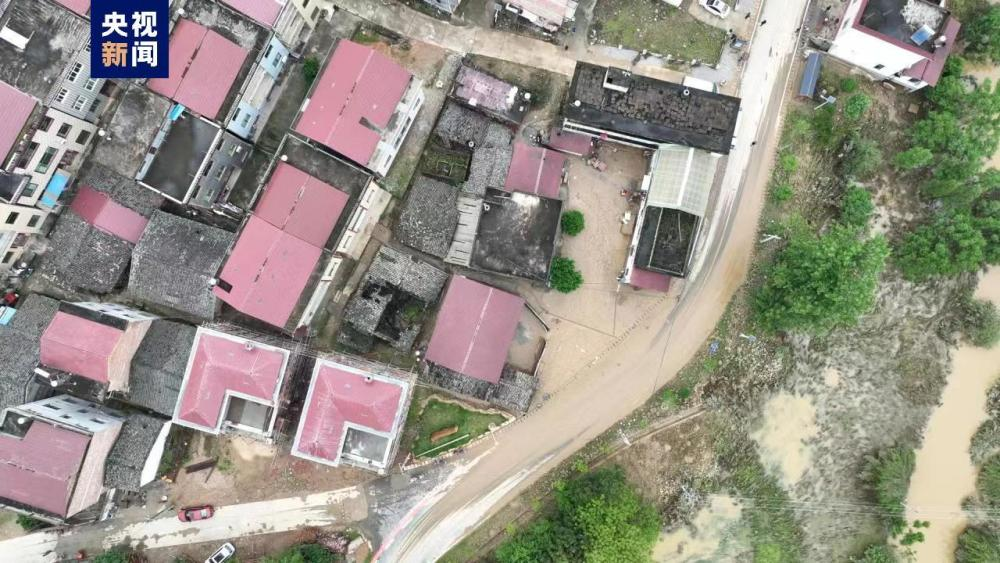

# 江西强降雨导致49.7万人受灾，直接经济损失5.2亿元

记者从江西省应急管理厅了解到，5月5日至7日16时，此次强降雨导致的灾害过程已造成抚州市、吉安市、宜春市、新余市、萍乡市、上饶市、赣州市7个设区市43个县（市、区，含功能区）49.7万人受灾，紧急转移安置1.4万人，需紧急生活救助2482人，农作物受灾面积67.7千公顷（101.5万亩）、绝收1.1千公顷（1.6万亩），倒塌房屋4户7间，严重损坏房屋3户7间，一般损坏房屋116户197间，直接经济损失5.2亿元，灾情还在进一步统计核查中。

来源：央视新闻客户端

编辑：孟紫薇

流程编辑：郭丹

