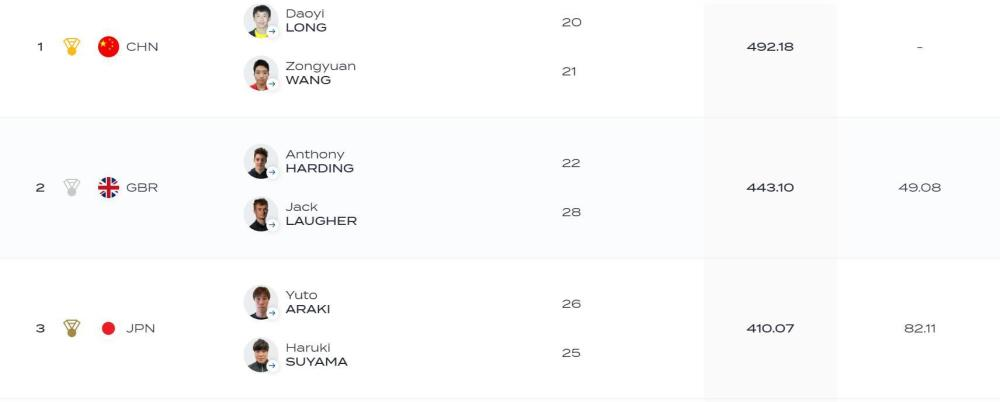

# 跳水世界杯男双板中国组合近50分优势摘金 中国队包揽四大双人项目桂冠

北京时间5月7日凌晨，世界泳联跳水世界杯蒙特利尔站结束了男子双人三米板争夺，中国组合龙道一/王宗源一路高歌猛进，单轮都是第一，最终以492.18分获得冠军。继西安站之后，今年跳水世界杯连续第二站中国队包揽四个双人项目的冠军。

今天的比赛，英国组合哈丁/杰克-
劳发挥得非常不错，但每一轮都被中国组合压制住。他们全程第二位到底，最终以443.10分获得亚军，差距在50分左右。日本组合410.07分第三。

第一轮201B，中国组合跳出55.80分，第二跳301B，拿到56.40分，总分112.20分。

第三跳5154B，中国组合拿到90.78分，总分202.98。超出英国组合15分左右。

第四跳5337D，龙道一/王宗源拿下本场最高的98.70分，总分来到了301.68分。

第五跳407C，龙道一/王宗源给出95.88分的发挥，总分397.56。超出英国组合35分左右。

最后一跳109C，中国组合94.62分顺利收工，总分491.18分拿到冠军。

