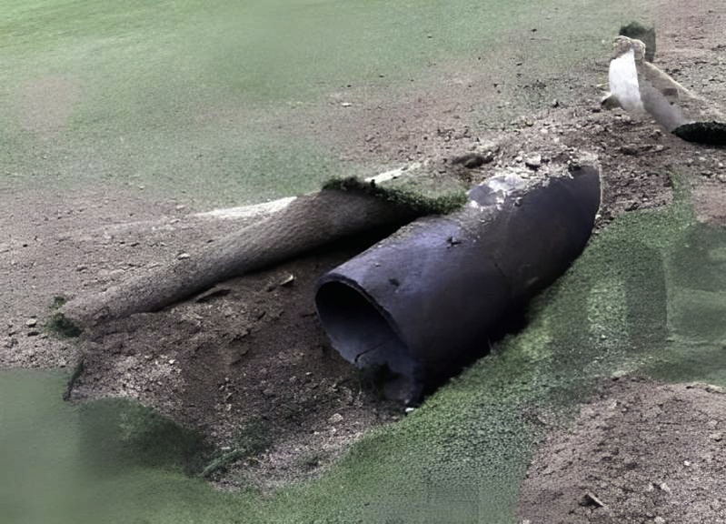
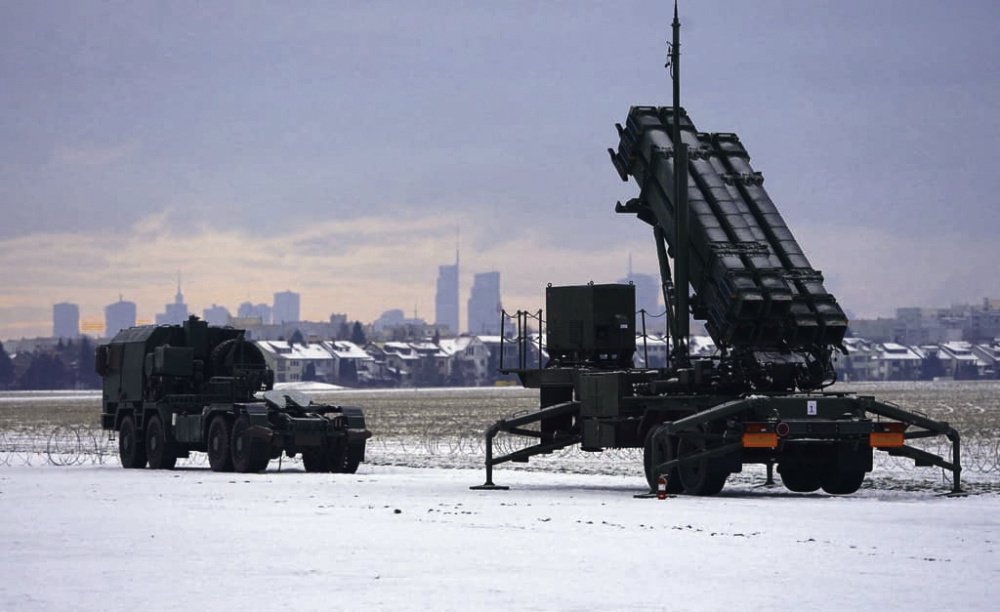

# 乌军宣称击落俄“匕首”导弹，高超音速武器难拦截神话破灭了？

【环球时报特约记者梁国宏柳玉鹏】乌克兰空军近日宣布击落一枚俄军“匕首”高超音速导弹的消息，让全球军事观察家都为之吃惊。尽管乌克兰媒体欢呼“这是俄乌冲突以来首次击落俄军高超音速导弹”“是给俄罗斯的一记响亮耳光”。但对于乌军宣称使用美国“爱国者”反导系统击落被普遍视为“非常难以拦截”的高超音速导弹，大部分西方媒体表态谨慎，均强调“未能证实其真实性”。中国军事专家张学峰7日接受《环球时报》采访时表示，乌军装备的“爱国者”反导系统要拦截“匕首”高超音速导弹的难度较大，而且乌方提供的证据也缺乏说服力。

**“爱国者”击落“匕首”？**

击落俄军“匕首”导弹的消息最早是乌克兰“防务快报”网站5月5日披露的。报道称，5月4日凌晨2时40分左右，乌克兰武装部队在基辅上空首次成功拦截俄罗斯Kh-47“匕首”高超音速导弹。同时，该报道还发布了“从消息来源收到的导弹残骸照片”。从照片来看，导弹残骸落在一处体育场上，可以看到带有损坏痕迹的弹头整流罩。报道称，照片上的导弹残骸特征不同于俄军经常使用的Kh-22巡航导弹，也与俄军“伊斯坎德尔”弹道导弹不同。残骸显示，弹头的头锥部分被击穿，可以看到非常厚的蒙皮材料，“这些材料很可能是为了抵御加速到高超音速过程中的高温”。报道称，这些照片表明“拦截非常有效”，因为俄军导弹的战斗部还在空中时就被摧毁了。“基辅民众当天听到的强烈爆炸声与此有关”。

_乌媒刊登“‘匕首’导弹残骸”照片_

乌克兰媒体还讥讽称，俄罗斯为研制“匕首”“锆石”等高超音速武器耗费了天价经费，并宣称它们“不仅可以突破现有的反导防御手段，而且可以应对未来先进的反导系统”，但“在现实中，它被20世纪90年代研制的‘爱国者’击落了”。

不过，乌克兰军方发布消息时的态度耐人寻味。乌克兰空军最初对此予以否认。乌空军发言人伊格纳特5日接受乌克兰媒体采访时曾明确否认击落“匕首”高超音速导弹。他说：“我已经否认了1000次。俄军有可能使用了这一导弹，但当晚在基辅上空没有发现这款导弹。”乌克兰空军在6日的表态却出现大转弯。乌克兰空军司令米科拉·奥列什丘克6日表示：“是的，我们拦截了‘无可匹敌的‘匕首’’。”他还透露，“匕首”导弹是由一架米格-31K战斗机从俄罗斯领空发射的，“拦截发生在5月4日夜间基辅地区上空”，当时俄方导弹正进行夜间袭击。但乌克兰空军表示，出于“非常明显”的原因，军方领导层决定不公布有关“爱国者”系统击落
“匕首”导弹的更多信息。据乌克兰国家通讯社7日报道，乌军当天又强调说，现在庆祝拦截俄“匕首”高超音速导弹“为时过早”，但没有透露具体原因。

**残骸照片疑点较大**

乌克兰媒体宣称，5月4日成为俄军高超音速武器的“神话破灭日”。不过，对于乌克兰击落的导弹残骸是否属于“匕首”导弹，各方专家提出不同看法。目前所有的公开证据都来自“防务快报”提供的导弹残骸照片。俄罗斯“自由媒体”7日称，“匕首”导弹的飞行速度高达10马赫，如果它真是被“爱国者”导弹击落，残骸很难保持完整的外形。还有俄媒质疑称，照片出现了属于不同导弹的各种零部件，残骸的外壳厚度也与“匕首”导弹的规格不符。

从导弹残骸外形来看，它和“匕首”导弹有明显的不同，也和用来充当参照物、据称是去年9月坠落的另一个“匕首”导弹残骸不同。也有分析人士对导弹头锥部分过厚的材料提出质疑：导弹配备的雷达或红外导引头很难透过如此厚重的材料进行工作。此外，头锥附近通常包含战斗部，这些部分被击穿时，剧烈撞击大概率会引发爆炸而无法保持弹体的完整。

由于乌克兰军方的态度是先否认后承认，而西方媒体主要转载乌克兰方面的报道，几乎未置可否，导致目前乌军是否击落“匕首”导弹成为罗生门。张学峰认为，乌克兰媒体之前宣称，乌克兰已经在4月底从美国和德国各自收到一套可以拦截弹道导弹的“爱国者”系统。“爱国者”刚进入乌克兰，就取得“击落俄高超音速导弹”的战果，很符合以往乌克兰宣传西方武器的套路——“一旦进入乌克兰，立刻取得重大战果”。

_美制“爱国者”反导系统_

张学峰认为，目前公开材料显示，乌军获得的是“爱国者-2”防空反导系统，没有装备反导能力更强的“爱国者-3”。理论上说，“爱国者”防空反导系统可以拦截射程500公里左右的弹道导弹。外界普遍认为“匕首”是“伊斯坎德尔”弹道导弹的空射版本，而后者的射程就在500公里左右。但“伊斯坎德尔”系列弹道导弹在末段可以进行大过载机动，而且还能释放假目标，本身拦截难度很大。

**高超音速导弹并非不可拦截**

张学峰强调说，即便“爱国者”反导系统在技术上具备针对“匕首”的拦截能力，但它在反导阵地部署上也较为苛刻。“爱国者”系统在反导作战时采用逆弹道拦截技术，拦截导弹要先飞到来袭导弹逆向弹道上，然后进行迎头攻击，所以对发射阵地与被保卫目标之间的方位和距离有特殊要求。“爱国者”系统在拦截弹道导弹时，有效作战距离比较近。因此在反导作战时，“爱国者”通常需要使用多套系统才能保卫城市等大型目标。乌克兰用一套“爱国者”系统，就成功拦截了包括高超音速导弹在内的各种导弹，概率比较小。另外乌军还要解决导弹预警、为“爱国者”制导雷达进行目标指示等一系列难题。在没有体系配合的情况下，“爱国者”导弹拦截“匕首”的成功率很低。

乌克兰国家通讯社6日称，乌克兰专家认为，“匕首”导弹是靠助推器加速到高超音速，但不能永远保持这样的速度。在飞行末段的攻击过程中，它的速度很快，但远不是高超音速。

张学峰认为，这种说法具有一定的合理性。助推滑翔型高超音速导弹在发动机关机后，总体趋势确实是越飞越慢，落地速度可能要低于同射程的常规弹道导弹。但高超音速导弹的突防能力并不单靠“快”，而是“快”+“活”。例如高超音速导弹能做10G以上的螺旋机动，给反导系统带来很大麻烦。特别是“爱国者-3”使用动能杀伤战斗部，需要直接命中才能有效摧毁，拦截难度更大。他强调说，高超音速导弹也不会“永远不被击落”。针对高超音速导弹的拦截弹正在发展中，导弹突防技术和拦截技术在斗争中螺旋上升。

