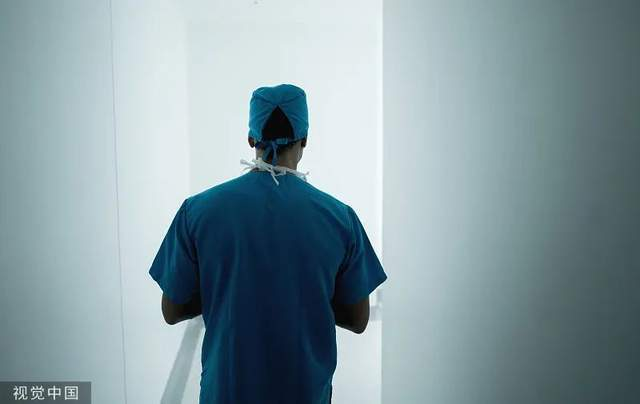

# 医保支付制度改革下的外科：成赔钱重灾区，有重病病人“治不起”

外科，一向站在医院的“舞台中央”。

作为支撑医院发展的重要科室，在DRG/DIP医保支付制度改革中，多数人眼中的外科代表着优势学科、“赚钱”，甚至反映了一家医院的能力。

但当DRG/DIP改革的信号逐渐传导至全国各地的医院，看似人人羡慕、“风光无限”的外科大夫们，也开始感受到来自“神经末梢”的隐痛。

肝胆外科大夫张洋几乎已经习惯了，从两个月前的某一天起，他都要每天加班一个小时，干一件和临床业务毫不相关的事——算钱。

两个月前，张洋所在的医院突然通知各临床科室，立刻开始推行DRG付费，“也没说试点不试点，直接无缝衔接了。”

曾经，大夫根据病人入院后情况，决定检查和治疗方案；现在，“病人还没住进医院呢，就要大概想好，哪些检查能做，哪些不能做。”

曾经，与临床操作匹配的病案首页主诊断，就是合格的；而现在变成了“结余多，亏钱少”的主诊断才是“标准答案”，甚至有时候为了结余，“不得不写严重一点。”

曾经，做一台胰腺大手术前，张洋最紧张的是高难度操作能否顺利完成；而现在，他还需要担心的是“这次又要亏多少钱”，只要一出现并发症，住院天数增加，“可能做很多其他手术的结余都补不回。”

面对这一堆复杂的计算规则，习惯和手术刀打交道的张洋感到心慌和局促。尽管他努力适应，绞尽脑汁地应对，但月底到手的收入还是“薄”了不少。

放眼望去，DRG/DIP改革途中，医院外科里还有无数的“张洋”和被改变的外科生态。

“不能赔钱”的外科

作为医院营收的主要来源，外科“不能赔钱”，这几乎成了医院里不成文的共识和期待。

但随着DRG/DIP的脚步踏入外科，这种共识正在被击碎，甚至瓦解。

在一家二甲医院里，刚开始试点DRG，医保办主任刘勇就发现：外科“赔”得一塌糊涂。

骨科原是“赚钱”的香饽饽，一下子从神坛跌落，成了医院运营的“拖油瓶”。一时全院外科大夫间，紧张氛围蔓延。明明检查、治疗和手术项目的数量和收费已经压得很低了，怎么还是“赔钱”？刘勇和临床科室开始复盘。

刘勇发现，在骨科，腰椎间盘和腰椎椎体的手术是“赔钱的重灾区”——手术需要的耗材尚未进集采，价格高昂，DRG的支付限额并不足以覆盖病组总价，耗材一用，“总价就得超”。

病组总价一旦超支，多余的部分只能由医院自掏腰包“买单”。倘若遇到自身经济条件较好、要求使用昂贵进口耗材的病人，医院只能尝试沟通，甚至医生有时会委婉劝说病人换家医院，“要不您别在我们医院做手术了，实在支付不起这个钱。”

同样的状况也发生在心血管外科，“全是赔，也是手术中耗材价格高的原因，凭医院去压下来不太可能。”

刘勇并非斤斤计较，以医院医保办主任的视角来看，在医院里，DRG规则下需要用DRG病组费用产生的正值去抵负值。当超出DRG支付总价的负值是个例、正值手术占绝大多数时，医院是能接受的。

但当下，在刘勇这里，“不赔钱”的外科几乎难见，暂时只是只闻其声、不见其影的传说。

在某一线城市的一家三甲医院，心胸外科医生杨刚进入“不超标的正循环”也显得跌跌撞撞。

心胸外科多是心脏大手术，技术复杂、耗材多、费用很容易超额。有时候为了控费，杨刚不得不用相对便宜的缝线。然而心脏瓣膜“非常韧”，针线不容易穿透，省下的这笔费用有时意味着更长的手术时间。

但这是与DRG“相处”的一年里，杨刚自己形成的一套“兼顾效率和质量”的办法。“复杂的病人不能躲，该做什么手术还得做，我们选择一些不太重要的地方节省费用。比如成型线就会选择便宜一点，包括连缝皮的钢丝，都会节省。”杨刚说。

在一家位于四线城市的三甲医院里，面对DRG的浪潮，外科应对时谨慎了很多。

这家医院病源“算不上特别充足”，而且早已耳闻同行“赔钱”的惨状，医院成立了专门的运营办。为了实时发现可能“赔钱”的情况，医院引进了“DRG预警系统”，时刻监控着每个病例的盈亏情况。

“哪个病人可能亏钱，哪个病人费用可能是正值，全部显示出来。”面对亏损很严重的病例，想出各种“解题思路”，对诊疗操作进行调整，然后让DRG模拟付费软件测算“能不能扭亏为盈”。

该院外科医生王明告诉八点健闻，医院曾一度把DRG改革视为“继集采后外科盈收的曙光”。因为相较于药品和耗材费用，外科常涉及到的手术费、治疗费对医院而言，是“纯收益”。“所以医院很重视，把DRG改革当做一个经济杠杆。”王明说。

这样的想法在“小三甲”医院里并不罕见。

然而，在DRG付费正式实施以后，一切都“事与愿违”。只要遇到了DRG付费标准低而手术难度大、术后出现并发症或住院周期久的病人，一不留神就“赔”了。尽管科室想方设法多收一些“DRG付费标准高的病人”，但“本来病房就住不满，这也不是我们这种‘小三甲医院’能挑挑拣拣的。”

随着DRG/DIP改革在全国扩面，外科面对大大小小的“难题”，医生开始在病历首页的主诊断上“稍作文章”。

医生们逐渐意识到，如果主诊断没有写好，导致入组差错、点值不对，亏损会是必然。比如机器人手术，如果不写“机器人”这三个字，就没有返点，就会“亏钱”；而只要灵活用好“主诊断”这个付费依据，扭亏为盈也并非遥不可及。

有医生坦言，“会有意把主诊断写得重一点，多写几个诊断，或者把另外一个报销额度更高的次要诊断当做主诊断写。”但他同时也担心，“如果出现医疗纠纷，主诊断和手术操作不匹配，查起来也说不通。”

在神经外科工作的李瑞，也发现了修改主诊断的“解题秘诀”。

“比如一例脑外伤的病人，正常来讲，主诊断应该是‘闭合性颅脑损伤、再加分型’，次诊断才是‘创伤性蛛网膜下腔出血’
。但如果刚开始就在主诊断里下‘闭合性颅脑损伤’，给的钱特别少；把‘创伤性蛛网膜下腔出血’ 提到主诊断的位置，给的钱反而多了不少。”

如此看来，DRG/DIP不仅戳破了外科“赚钱传说”的泡沫，而且这股来自“神经末梢”的刺痛，波及面也远不止于此。

有“用不起”的新技术，也有“治不起”的重病人

“新技术遇阻”就是被波及的刺痛中，不能忽视的一环。

一项外科新技术从临床应用到进入医保目录，需要经历一个漫长的审批过程。但进入医保目录后，再关联到DRG/DIP付费，这片场域还是滋生出了新的矛盾。

前文提及某一线城市的二甲医院里，医保办主任刘勇发现，胸腔镜、腹腔镜等腔镜技术曾被广泛使用，微创手术的技术日趋成熟。然而，试点DRG之后，外科大夫们很快发现了不对劲。

“比如，妇产科做一个子宫肌瘤的手术，不管用不用腹腔镜，DRG给的价格都是一样的。”使用腔镜意味着高出不少的成本，腔镜、取物袋等七七八八的花费，“至少比不用腹腔镜要贵好几千块钱。”

选传统的开放式手术，还是相对创伤小、恢复快的微创手术，本应根据不同病人的具体情况而选择。但由于DRG的盈亏将影响到科室的绩效和大夫的收入，“据我所知，很多外科大夫现在已经不再倾向于用腔镜做手术了。”刘勇说。

泌尿外科大夫胡磊也发现，尽管DRG/DIP明面上并没有限制一些技术含量较高的高值耗材的使用，但是大夫们却纷纷表示“不敢用”。

“现在一些比较贵的耗材其实不是自费，也是进入医保的，医嘱系统能开出来。关键是敢用吗？”胡磊说，用一条进口的导丝，就快把整个手术的费用额度花完了，超了就得贴钱，相当于边干活边贴钱。

有麻醉科大夫也说，加速康复外科技术可能需要在术中使用价格昂贵的监测设备，设备使用的价格远远超过了病人“提前一两天出院”能带来的收益，从经济上看是不划算的。“但是如果使用新技术，病人的体验和转归更好了，这是能用钱来衡量的吗？”

作为中国医疗水平高地的一、二线城市，拥有着数量众多的大型医院，接收着来自全国各地求医的病人，其中难免有许多病情严重、复杂的病人。

尽管出于临床救治的要求，必须不计一切代价给予最好的治疗，但在DRG/DIP的付费规则之下，源源不断的“重病人”给医院带来了不少压力。长久的亏损，让外科无法忽视DRG费用超支的源头。

在某知名三甲医院里，神经外科医生李瑞曾收治过一例颅脑外伤的病人，手术操作中“既需要去骨瓣，又需要去血肿，还需要清除异物”，而并没有一个适合的DRG分组能够涵盖这一系列的操作，但也不可能因为费用把这个手术拆解成几次来做。

如何面对这些“治不起”的病人，不同的医院摸索出了不同的办法。

心胸外科医生杨刚觉得，病人千里迢迢来看病，是很不容易的，“你不能说因为你自己亏钱，就不给人做了。”他所在的科室发明了一个对策，即“病人收治大小月”。具体而言，就是以“月”为时间周期，在收治了一批复杂、重症的病人之后，再“做些简单的手术来对冲一下。”

泌尿外科大夫胡磊所在科室重症病人的收治情况“和带组领导的风格有关”。“这事分人。有的大夫为了职业操守，不在乎亏损，就想把病人治好；但也有医生觉得，救治成本投入那么大，凭什么还要自己或科室倒贴费用？”

事实上，科室里之前有一个副主任，在内部会议上直接训斥——“你们组把‘烂病人’收进来，最后弄出来都是亏损的，导致大家都亏。你们索性就别做手术，要做就做赚的。”

好在，眼下他所在治疗组的领导风格是“不怕难”，几乎不会拒绝收治有复杂合并症的泌尿系统结石病人，尽管这些病人因为术前评估项目多，术后住院周期长，“费用肯定要超”。不过，由于DRG/DIP“算科室的总账”，他们也会有意收几个轻症病人做手术，来弥补救治一个重症病人带来的亏损。

尽管DRG/DIP支付有相对完善的“高倍率”病例申诉渠道，可以允许一部分费用超支明显的复杂、重症病人“按项目付费”进行费用结算。但实际操作中，“也不可能个个都申诉”。只要重症病人收治达到一定比例，“还是会带来比较大的亏损”。

自然有个别医院可以不考虑经营效益，多个科室专家会诊、同台手术，只为全力以赴救治一个危急重症的外科病人，但这样的医院是少数。

只要大部分医院需要考虑生存问题，就意味着，大家都不得不继续算着这笔艰难的经济账。

跨入“手术工匠+项目经理”时代

曾经，“一把刀”是对一名外科医生最好的赞誉。大夫们只需要专注于修炼手术等操作技术，不断提升诊疗水平，而对于费用“不需要特别敏感”。

如今，从试点到推广的DRG/DIP改革方案无声地宣告着，“医生点单、医保买单”的按项目付费时代一去不返，“成本控制”四个大字赫然耸立在每个外科大夫眼前。

泌尿外科大夫胡磊直言，医保首先是保证绝大多数的老百姓看得起病。“如果没有有效的付费标准来管控，看同样的病可能花3万，花5万，甚至花10万，这个幅度在大夫手里把握，去看病还得看运气，看大夫的水平和职业操守。老百姓谁知道哪个大夫靠谱呢？”

但DRG给定了支付标准，“有个标准去规范医生行为，我觉得挺好。”

可惜理想美好，现实时常上演着无奈。

DRG/DIP改革的目的是建立一种有效的引导机制，让医生和医院从费用控制的角度出发，优化诊疗行为，实现更加科学合理的诊疗路径，以达到兼顾成本和效益的诊疗结果。但是，外科大夫都是临床出身，“算账”对于他们来说确实头疼。

一位心脏大血管外科主任这样形容，“DRG要求医生用钱来衡量治病救人，把医生当做一个‘项目经理’了。”这样的语境下，做手术也被异化成“项目承包制”下的工程。“这个项目给你固定数额的钱，你承包了，为了不亏本你肯定是选简单的做。”

现实里，当外科大夫跨入“手术工匠+项目经理”时代，两个身份之间的拉扯也让他们时不时陷入两难。

即使有些“项目经理”很良心，不推诿、不逃避，但也难逃内心隐秘的痛——为什么我尽职尽责，按照流程规范地救治病人，就是躲不掉亏钱呢？

心胸外科医生杨刚，要经常开展心脏瓣膜修补手术。在DRG结算体系中，无论是主动脉瓣、二尖瓣还是三尖瓣的修复，分组上同属于“心脏瓣膜手术”，都按18万的费用进行支付。但现实中，很少出现病人只有主动脉瓣受损的情况，大部分都合并了二尖瓣、三尖瓣需要修复。修补更多的瓣膜意味着更高的耗材成本，也意味着超支与亏损。

还有大夫发现，白内障手术做单侧眼睛和做双侧，DRG给的价格是一样的。“但你不能说，一次只给病人做一只眼睛吧？”

同理，如果一个病人既需要安装心脏支架，也需要装入起搏器，这两项手术操作是“顺路的”，可以一次性解决病人的两个问题，但是操作项目加在一起“费用肯定超了”。然而，没有大夫能做到、医学伦理也不允许让病人进两次手术室，获得两次DRG付费。

另外，“住院天数”也是这批并不专业的“项目经理”们，当前需要经常精细计算的参数之一。

在推行DRG/DIP改革后，有些医院和科室会把病人本来住院后做的术前检查提前到门诊进行，这样一来可以缩短几天住院天数。王明所在的科室，也会“让DRG费用快要超支的病人稍微早一点出院”。

深陷成本桎梏和绩效挣扎，外科医生这个“项目经理”的任务并不简单，这个特殊的身份蕴涵着复杂的责任和考量。

在过去20多年经济快速发展的大背景下，粗放式的管理模式促使医生们习惯了“需求侧”主导的就诊方式。当DRG改革进入到“供给侧”主导，这种骤变难免沿着“外周神经系统”传来阵阵隐痛。

一位卫生政策领域的专家认为，DRG/DIP改革方案并不能达到“绝对公平”，其希望实现的是一种“相对公平”。毕竟，政策的约束比医生对个人行为的自律要更加稳定、坚固。

除了外科医生要握好“手术工匠和项目经理”的平衡木，医院也要承受外科生态将不停演变的信号。

（文中受访者均为化名。）

陈开颜、牛益彤丨撰稿

李 琳丨责编

**本文首发于微信公众号「八点健闻」，未经授权不得转载**

