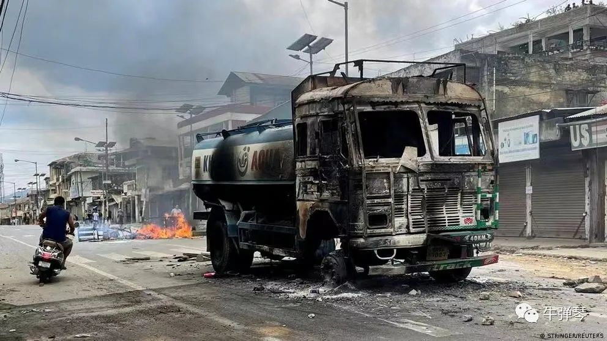
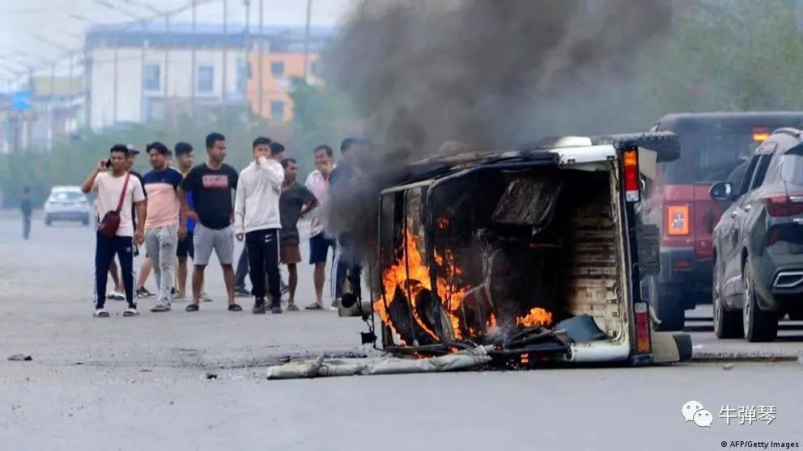
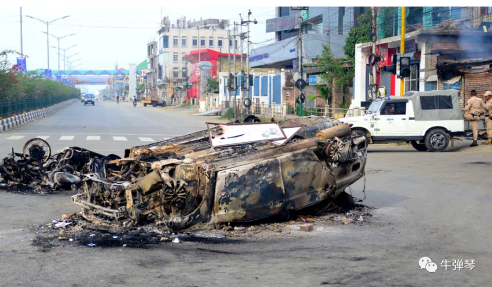
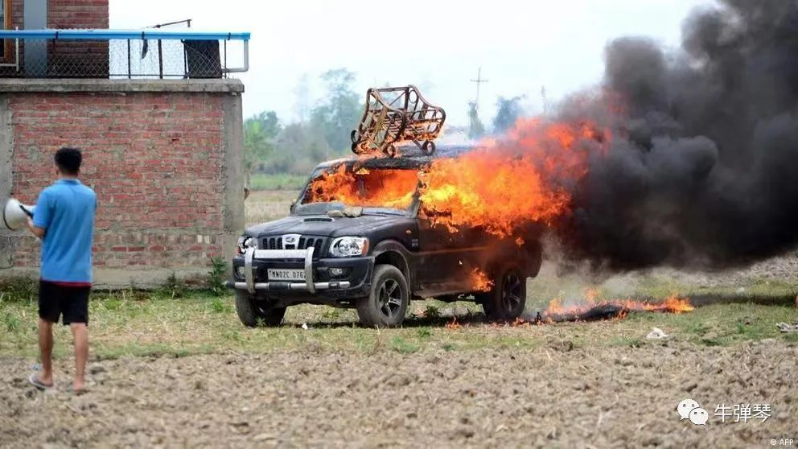
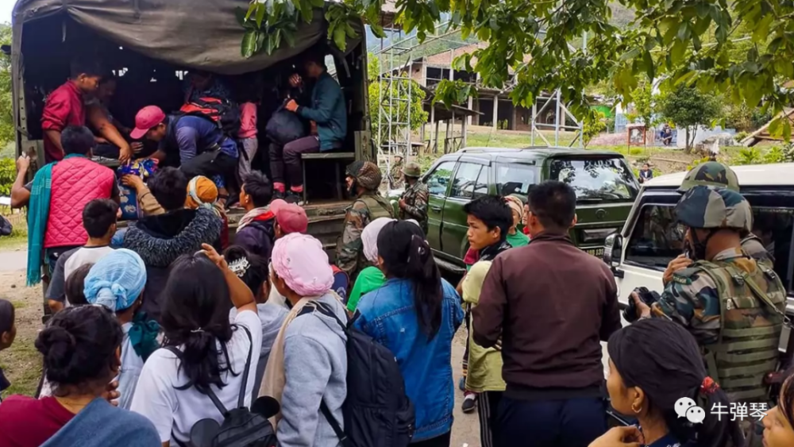
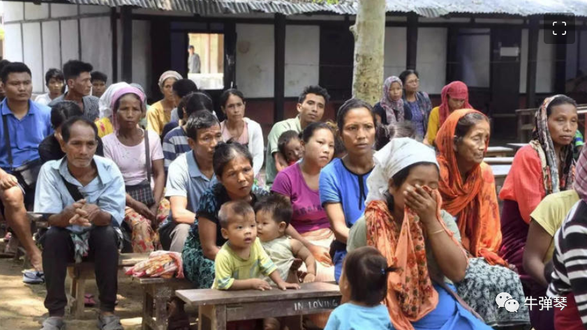

# 印度一地民族宗教冲突致50多人死亡，过去50多年至少5万人因冲突丧生

**印度，一个新的大麻烦来了。**

这是一场激烈的民族宗教冲突。反正，最近几天，在印度东北部的曼尼普尔邦，大量汽车被烧毁，很多教堂被砸烂，一些城镇村庄火光冲天，至少2万人被迫逃离家园，激烈的冲突已导致50多人死亡。

流血冲突还在继续，莫迪沉默不语。

因为 **这次冲突，与以往印度教-伊斯兰教冲突不同，而是基督教-印度教之间的斗争。**

导火索，是政府决定给予信奉印度教的梅泰族，以“表列部落”的地位。根据印度法律，获得这一地位的一般都是少数族群，他们将得到一定比例的政府职位和大学录取名额，以解决结构性歧视问题。

此外，他们还有资格参加国家福利计划、获得特殊权利，以及在某些情况下拥有自治权。

但这激怒了曼尼普尔邦的那加族(Naga)和库基族（Kuki）。他们主要信奉基督教，强烈反对这一决定，认为当地人口最多的梅泰族已经足够强大和富裕。

这就牵涉到曼尼普尔邦错综复杂的历史了。

作为印度东北部的一个小邦，曼尼普尔邦面积大概2.2万平方公里，人口不到300万，北面是那加兰邦，西面是阿萨姆邦，南面是米佐拉姆邦，东邻缅甸。

但 **不管是哪个族，信奉什么宗教，绝大多数曼尼普尔人都与本土印度人有很大差别，因为他们都是黄种人，长得和我们和缅甸人类似，语言也是汉藏语系。**

这里有着悠久的历史，英国统治期间，曼尼普尔也保留了土邦王政权。1947年，曼尼普尔独立，建立君主立宪政权。但1949年，曼尼普尔国王巴格亚昌德拉受邀前往西隆，在没与内阁商议的情况下，签署将曼尼普尔并入印度联邦的协定。

按照很多曼尼普尔人的看法，这个协议完全是国王受印度胁迫和利诱签订，未与内阁商议，也没得到议会或全民公决同意，因此这是违宪和无效的。所以，在曼尼普尔并入印度后，当地就爆发了激烈的独立运动。

数据显示， **就在这不到300万人口的小邦，在过去50多年，至少有5万人在冲突中丧生。**

虽然这些年内乱有所平息，哪知道，最近因“表列部落”地位又爆发了新的冲突。

就在上周，很多信奉基督教的那加人、库基人举行大规模抗议游行，最后不出意外，爆发了激烈的流血事件。反正看图片，房子被纵火，车辆遭焚毁，印度教设施遭到攻击，大批基督教教堂也被付之一炬。

很多悲剧，触目惊心。 **CNN报道，一对母子正在赶路，遇到一群其他民族的暴徒，儿子被活活打死，母亲试图保护儿子，她也最终被杀。**

在50多被打死的人中，很多人是中枪而死，但也有不少被棍棒打死。

惨烈，相当惨烈！

为逃避劫难，很多曼尼普尔人不得不紧急跨越边境，前往缅甸避难。

或者可以说， **苏丹动荡让世界触目惊心，但在印度曼尼普尔邦，比苏丹更惨烈的悲剧在发生。**

有讽刺意味的是，最近几天，全世界正努力从苏丹撤侨；而印度各邦，则努力从曼尼普尔邦撤人。

形势紧急，印度也祭出非常措施，派遣数千军队进入曼尼普尔邦，士兵被赋予“瞄准射击”的权力，即在极端情况下可直接开枪射击；当地政府也实施互联网禁令，断绝网络服务。

所以，具体已死了多少人，到底被谁打死的，外界也根本不清楚。

很有意思的是，尽管冲突血腥而惨烈，但莫迪一直沉默不语。在社交媒体上，很多人抨击这是莫迪糟糕的民族宗教政策导致，为什么特殊权利给予的是信奉印度教的梅泰人？

但在印度本土，很多印度人还群情激奋，居然印度教信徒遭到基督教徒的围攻，这还了得？印度政府你怎么搞得？

最后，怎么看？

还是粗浅三点吧。

**第一，印度东北部是印度的一道伤疤。**

这里与印度本土有着很大的差别，人种不同，宗教不同，语言不同，发展更相对落后。当年的恩恩怨怨，更导致印度东北部独立情绪强烈，一些地方一直有游击队在活动。所以，对印度来说，别想着领土扩张了，让这些人民安居乐业，就是一个艰巨的挑战。不然，还会有更大的麻烦。

**第二，民族宗教政策必须慎之又慎。**

这次动荡，导火索就是“表列部落”的民族特权，这打破了当地本身就脆弱的政治平衡。触动利益比触及灵魂还难，更别提是一个民族的整体利益，也难怪那加人、库基人悲愤异常，为什么给予的是信奉印度教的民众？印度，你到底有没有猫腻？

**第三，暴露了印度更深层次的问题。**

虽然事情发生在印度东北部，但类似事件，印度本土就没有？激烈的民族宗教矛盾，印度教-伊斯兰教之间，印度教-锡克教之间，印度教-
基督教之间，等等，一些地方还有激烈的独立运动。每年都有大量民众倒在血泊中。一些有争议的宗教民族政策，更加剧了这些动荡。

曼尼普尔邦的冲突最终会平息，但这又埋下了新的仇恨的种子，种子在土壤中发芽、成长……

毫无疑问， **14亿人的印度，有着远大的发展前景；但也毋庸置疑，100多个民族的印度，有着太多的悲剧和陷阱。**

