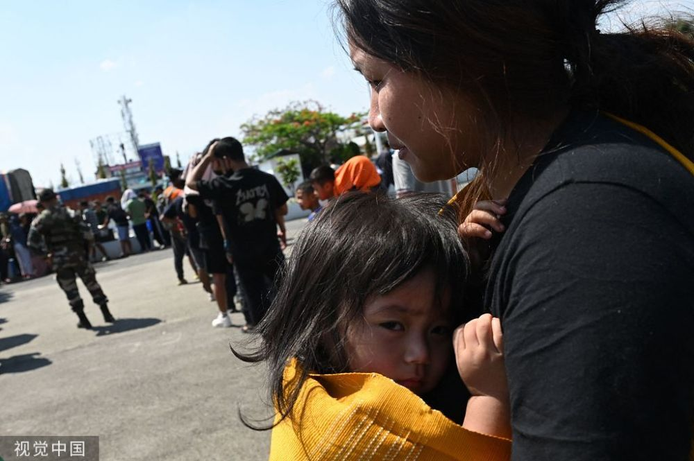

# 印度东北部爆发族群冲突，已致50余人死亡超2万人流离失所

近日，印度东北部偏远地区爆发族群冲突，已导致超过50人死亡，大量民众流离失所。

_当地时间2023年5月7日，印度曼尼普尔邦英帕尔，当地爆发族群冲突，人们在英帕尔机场排队等待印度军队发放食物。
视觉中国 图_

据“德国之声”5月7日报道，印度曼尼普尔邦首府英帕尔及其南部的楚拉昌普县已经通报54人死亡，此外，还有大约2.3万人因暴力冲突升级而流离失所。当地政府表示，族群冲突已经造成约100人受伤，超过500间房屋被烧毁。

据报道，造成冲突的原因是印度政府可能将承认信仰印度教的少数族群梅泰族（Meitei）为“表列部落”。这是对印度一批特定社会群体正式的、带有法律效力的称谓。印度法律保障获得这一地位的少数族群得到一定的政府职位和大学录取名额，以解决结构性歧视问题，在某些情况下，他们还可以拥有自治权。

然而，曼尼普尔邦信奉基督教为主的那加族（Naga）和库基族（Kuki）反对这一决定，他们认为梅泰族已经足够富裕。

5月3日，一场抗议游行升级为暴力冲突。印度政府派遣数千名士兵前往曼尼普尔邦。当地政府实施了互联网禁令，并且下令在“极端情况”下士兵可进行射击。5日晚间，曼尼普尔邦再次发生暴力事件，但此后局势稍有缓和。

曼尼普尔邦与缅甸接壤，拥有2900万人口，梅泰族占总人口约53%。该邦曾经是一个独立的王国，后被英国殖民，直到1949年才并入印度。根据2011年的人口普查，印度教和基督教是该邦的主要宗教。

