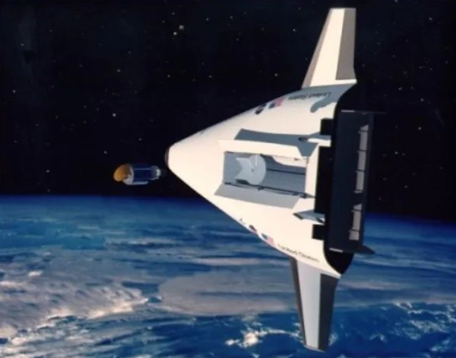
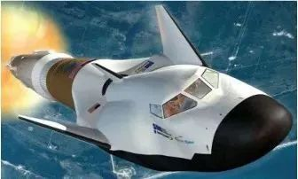
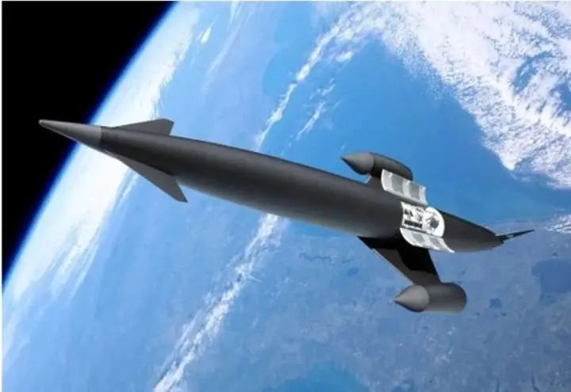
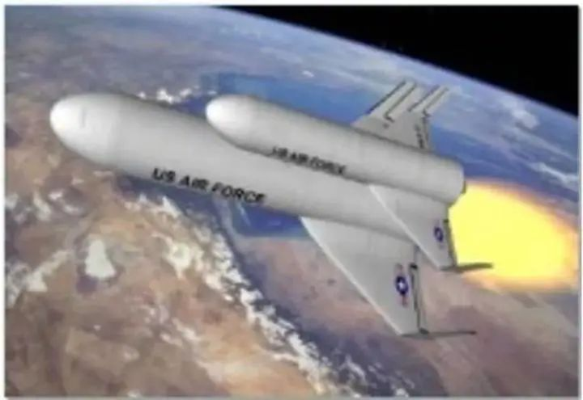
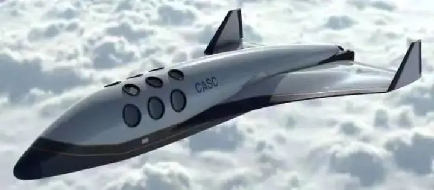

# 在轨飞行276天，我国可重复使用试验航天器成功着陆！太空旅游不再是梦

我国在酒泉卫星发射中心成功发射的 **可重复使用试验航天器，** 在轨飞行276天后，于5月8日成功返回预定着陆场。此次试验的圆满成功，标志着我国
**可重复使用航天器技术研究取得重要突破，** 后续可为和平利用太空提供更加便捷、廉价的往返方式。

**可重复使用的航天器是什么？**

可重复使用航天器是指可以重复使用的、能够迅速穿越大气层，自由往返于地球表面与太空之间，运送乘员和有效载荷；也可以指较长时间在轨停留和机动、完成各种任务的航天器，包括载人飞船、货运飞船、推进飞行器、行星着陆器、航天飞机等。

**我国研究现状**

**2021年7月16日**

我国亚轨道重复使用运载器飞行演示验证项目于2021年7月16日在酒泉卫星发射中心准时点火起飞，平稳水平着陆在阿拉善右旗机场，首飞取得圆满成功。通过优先发展亚轨道重复使用运载器，可先期构建重复使用进出空间基础平台。

**2022年8月5日**

2022年8月5日，我国在酒泉卫星发射中心，运用长征二号F运载火箭，成功发射一型可重复使用的试验航天器，这是长征二号F运载火箭第18次执行发射任务。

试验航天器将在轨运行一段时间后，返回国内预定着陆场，其间，将按计划开展可重复使用和在轨服务技术验证，为和平利用太空提供技术支撑。

**2022年8月26日**

2022年8月26日，由火箭院自主研制的升力式亚轨道运载器重复使用飞行试验获得圆满成功，平稳水平着陆于阿拉善右旗机场，有力推动了我国航天运输技术由一次性使用向重复使用的跨越式发展。

新闻多看点

据“中国运载火箭技术研究院”官方微信介绍， **早在20世纪五六十年代，人类就已经开始了对重复使用航天运输系统相关技术的探索。**
经过几十年发展，主要航天大国和地区已拥有不同程度的重复使用技术储备，形成了多种典型的重复使用运载器方案。目前，各国在发展重复使用航天运输系统的策略上采取更加务实和慎重的态度，近期多以两级入轨系统为发展重点，同时积极探索单级入轨方案。

重复使用运载器有多种分类方式：

根据入轨级数，可分为多级入轨方案和单级入轨方案：

**多级入轨方案** ——采用多级构型，将有效载荷运送至所需近地轨道，按需返回地面，可重复使用的运载器。

**单级入轨方案** ——采用单级构型，将有效载荷运送至所需近地轨道，按需返回地面，可重复使用的运载器。

根据起降方式，可分为垂直起降方案、垂直起飞水平着陆方案、水平起降方案：

**垂直起降方案** ——采用长细体构型，火箭动力发动机，垂直起降。

**垂直起飞水平着陆方案** ——采用升力式构型，火箭动力发动机，垂直起飞，水平着陆。

**水平起降方案** ——采用升力式构型，先进动力，水平起降。

根据回收方式，可分为部分重复使用方案和完全重复使用方案：

**部分重复使用方案** ——运载器更换部件后可重复使用或部件回收后重复使用。

**完全重复使用方案** ——可完全重复使用的运载器。

其中，火箭发动机技术已经相对成熟，是当前工程应用的首选推进方式。组合动力则是未来重要的发展方向，正在围绕组合循环发动机技术开展关键技术攻关和试验验证。火箭动力两级入轨重复使用航天运输系统的一级，是目前国内外重复使用技术关注的焦点。

“可重复使用空天飞行器”的一项重要应用就是“太空旅游”。

人类发展航天技术，探索浩瀚太空，主要目的是认知太空、利用太空和开发太空。太空移民将极大拓展人类的生存空间，是探索太空的重要终极目标之一，而在此之前，首先应该是太空旅游，因为它更可行，甚至在不久的将来触手可及。

所以，太空旅游不仅是让旅游者感受失重、欣赏迤逦太空风光，更重要的是对促进人类大规模进入太空、利用和开发太空发挥重要推动作用。

_△太空旅游运载器示意图_

太空旅游对我们来说并不遥远，运载器动力系统沿用火箭发动机，起飞阶段就像火箭发射一样，因初速度没有达到第一宇宙速度，所以不能环绕地球飞行。
**运载器可爬升到距地球约100多公里的亚轨道上，停留约10分钟后，再依靠惯性像飞机一样返回地球，水平着陆。**
整个过程大约30分钟，全程都按照预定程序，全自动飞行。

_△太空旅游路线示意图_

整个旅行过程，游客不需要穿宇航服；可以带手机拍照发朋友圈；像宇航员一样在舱内飘来飘去体验失重感；透过窗户从太空眺望地球；由于运载器本身有纠错功能，即使指令有误，也能返回正确轨道，甚至可以体验一下太空驾驶的乐趣。

_△太空旅游运载器示意图_

橙柿互动·都市快报记者 毛迪

综合新华社、中国运载火箭技术研究院

