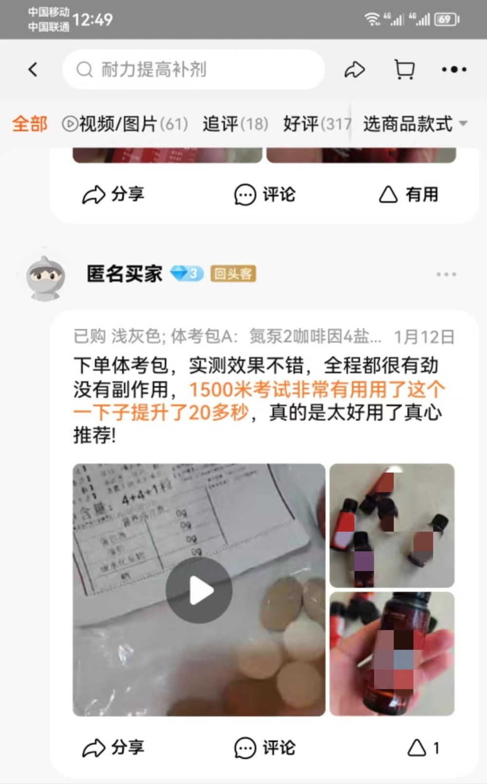

# 宣称无副作用的“体考神器”饮品热销，其咖啡因含量是功能饮料18倍

“只要喝上一口就能体育考试及格，考试成绩大幅提升……”网上有商家叫卖所谓“体育考试神器”的饮品，宣称可在体育测试中服用，无副作用。但北京青年报记者调查发现，此类“体考神器”成分表中的咖啡因含量是普通功能饮料的18倍。

营养学专家表示，虽然咖啡因有提神效果，但青少年身体敏感度高，突然服用过量的咖啡因很有可能造成身体不适，影响成绩。同时并没有研究明确表明咖啡因、牛磺酸、丙氨酸存在提高身体机能的效果。

**调查：咖啡因含量是普通功能饮料18倍 商家称每到体考时期中学生是主要客户**

记者在网上搜索“体考小红瓶”，出现了不少商品。售价在9.9元至128元不等，大多数售价在30元左右两瓶，封面中多称自己为“体考神器”“安全过检不含违禁”还赠送“加强片”。

在商品评论中，看到最多的就是中考体育考试、高考体育考试的消费者。商家号称“无副作用，不属于药品，不含违禁品”。

随后北青报记者以消费者身份对多位商家进行咨询，其中一家销售“小红瓶”的商家宣称“有真实案例反馈”成绩能提高。

北青报记者查看一款“小红瓶”的配料表，其中主要含有咖啡因、牛磺酸、丙氨酸等配料。其中，50ml一瓶的饮品中，就包含了180mg的咖啡因、300mg的牛磺酸和3600mg的丙氨酸。而市面上常见的一瓶250ml的功能饮料，咖啡因也仅在50mg左右，牛磺酸仅在50—55mg左右。如此推算，“小红瓶”内咖啡因的含量是普通功能饮料的18倍。

“运动前20分钟服用半瓶小红瓶，搭配2粒咖啡因片，2粒盐丸和1粒铁氧力效果更佳。如果没反应，再加量。”商家告诉北青报记者，所谓的“加强片”，包含咖啡因片、盐丸和铁氧力3种。

但从商家提供的“加强片”包装中，北青报记者看到，仅使用一个透明塑封袋包装，背面使用贴纸贴上去的配料表及名称，其中亦包含咖啡因、牛磺酸等成分，但并未标注具体剂量。对于盐丸和铁氧力的具体成分，商家并未能清楚表述。

“无副作用，每到中考体能测试时候，很多学生都在买。”商家称，咖啡因加强片也含有高纯咖啡因的，但具体含量多少并不清楚。

**服用者：有人喝后耳根发热 也有人出现胸闷失眠**

北京青年报记者了解到，很多地方中考体育成绩纳入总分，部分具有自主招生资格的高校在校考中增设体育科目测试，一些高校规定大学生毕业体测达标才发放毕业证。一些考生试图利用“体考神器”提升运动能力，借以通过相关体育测试。

“喝完之后耳根发热，身上有种针麻感。”小林是一名大学生，他告诉北青报记者，学校每年都会进行体育考试，每个学期都会有长跑、短跑、俯卧撑、仰卧起坐等项目。而他由于日常缺乏锻炼，总是卡在及格的成绩线上。后来，小林在朋友推荐下，购买了“体考小红瓶”。而据小林表示，自己喝过后，“当时没什么副作用，不过之后的两天时间里，我出现吃不下什么东西的情况。”小林说。

河南的刘女士表示，她在去年曾给中考的女儿买过此类药物，“女儿说，喝下去以后感觉整个人异常兴奋，肌肉酥麻，面部发热，胸口发闷，耳朵里甚至能够听到心脏的跳动。”刘女士说，万幸之后孩子发挥稳定，但出现了失眠、食欲不振、抽筋的情况。

**专家：青少年身体敏感性高 突然服用过量咖啡因有可能出现不适**

“如今大多数人只知道咖啡因提神，往往忽略了过量摄入可能存在的潜在危害。”北京胸科医院营养科专家李卓告诉北青报记者，“咖啡因作为国家管制的第二类精神药物,存在过量中毒的危险。”

她说，咖啡因是中枢神经系统兴奋剂，摄入过量会出现精神过度兴奋的表现，出现肌肉震颤，严重时会出现肌肉的抽搐，情绪上可能出现易怒、焦虑，还可以影响人的心脏功能，表现为心悸、心慌、心跳加快。另外，咖啡因摄入过量还可能引起恶心呕吐等消化道症状，甚至导致消化性溃疡、消化道出血等不良后果。

还需要提示大家的是，对于本身存在缺铁性贫血、骨质疏松等情况的患者，也不适合大量摄入含咖啡因的饮料，避免加重临床疾病。

“所以人体在摄入咖啡因时，有着一定的安全剂量。普通成年人每天最好不要超过400mg，青少年一般不超过100mg（或以不超过3mg/kg来衡量）。”专家表示，“从50ml所谓的‘体考神器’中就含有180mg咖啡因这一点来看，对平时不怎么接触咖啡因的青少年来说，已经明显超标了。”

一些人服用“体考神器”后自述出现身体酥麻、耳根发热、胸闷等情况，其实就是代谢异常旺盛所引起的明显不适症状，再过多摄入咖啡因的话，就很有可能出现恶心呕吐、睡眠紊乱、血压升高、心率加快，甚至中毒等更严重的后果。

同时专家表示，关于咖啡因、牛磺酸、丙氨酸等类物质的健康效益相关的研究证据还很有限，期望通过短期内大剂量摄入来提高身体机能、提升运动能力尚没有充足证据支持。

“毕竟中考的体育成绩是有分数差距的，一些商家更多的是利用了学生及家长的焦虑心理来推销产品。然而，青少年本身的敏感性较高，如果此前没有吃过，盲目大剂量摄入后出现不适的风险性会更大。”专家表示，青少年在考试等精神高度紧张的状态下，千万不能过多饮用所谓的“体考神器”，否则就可能适得其反，影响考试水平的发挥。对于考生来说，保证饮食的规律、食品的健康卫生更为重要。

（北京青年报记者 王浩雄）

