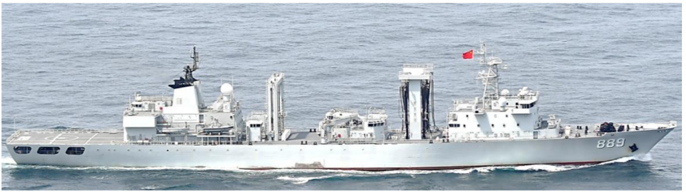

# 日防卫省：中国海军055型驱逐舰“拉萨”号穿航宗谷海峡

（观察者网讯）5月8日，日本防卫省统合幕僚监部发布“中国海军舰艇动向”通报。

通报显示，6日凌晨0时左右，日本海上自卫队在礼文岛西北约40公里的海域上发现向东北方向航行的中国海军055型驱逐舰“拉萨”号及导弹护卫舰“枣庄”号，两舰沿宗谷海峡向东航行。

另外，5月5日晚8时左右，日本海上自卫队在北海道礼文岛西北方向约40公里的海域处发现向东北方向航行的中国海军导弹驱逐舰“贵阳”号、“齐齐哈尔”号，以及综合补给舰“太湖”号，这三条军舰组成的编队继续在日本海航行。

日本防卫省统合幕僚监部表示，“拉萨”号、“枣庄”号、“贵阳”号、“齐齐哈尔”号、“太湖”号曾于4月30日穿航对马海峡进入日本海。

日本海上自卫队出动第一导弹艇队所属的“若鹰”号以及第二航空群所属的“P-3C”“猎户座”反潜侦察机，进行警戒监视和情报收集。

_日本防卫省公布的中国海军舰艇航行轨迹图，右上角为5月5日航行轨迹，左侧为4月30日航行轨迹_

_“贵阳”号_

_“齐齐哈尔”号_

_“太湖”号_

_“拉萨”号_

_“枣庄”号_

