# 杨幂发文宣布离开嘉行传媒，合作十几年烂剧不断，网友纷纷道贺

5月8日，杨幂本人发文官宣离开嘉行传媒的消息，杨幂称：“共有从前，各有未来。”并把头像更改成了童年照片。随后，杨幂工作室也转发称一起奔跑。

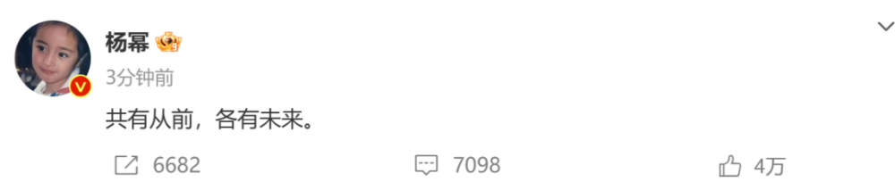

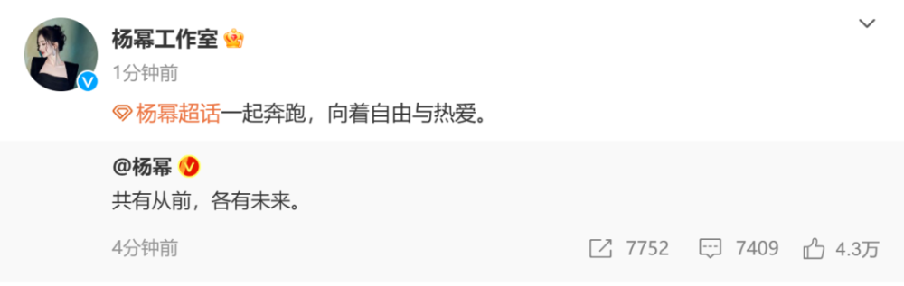

同时，嘉行传媒也宣布与杨幂合作结束，表示感恩过去十几年的共同成长，祝未来一切顺利。

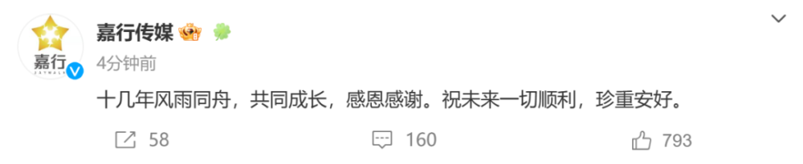

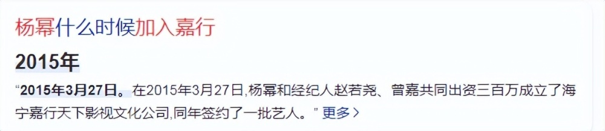

众多网友得知后，都恭喜杨幂，祝她未来越来越好。

官宣前一天，杨幂父亲就发文透露好日子到来，暗示官宣离开嘉行公司。接着，杨幂大粉也称杨幂会有大喜事公布，是一个对杨幂来说非常重要的人生决定，希望粉丝们给予支持，做她最坚强的后盾。

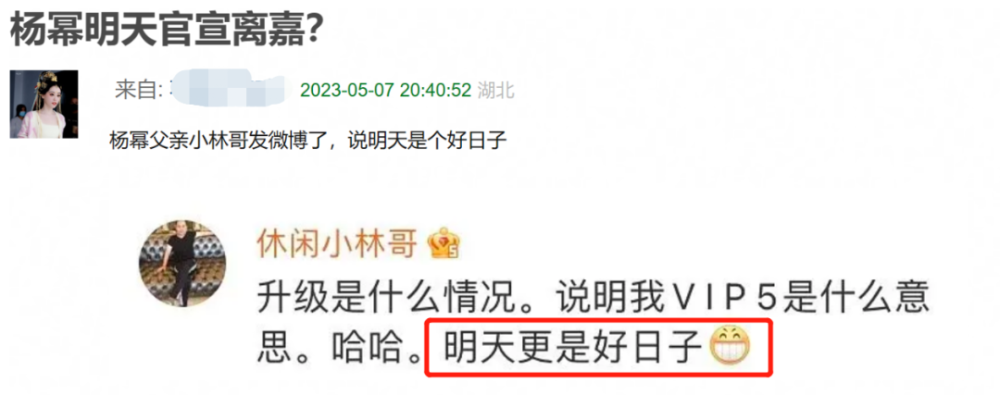

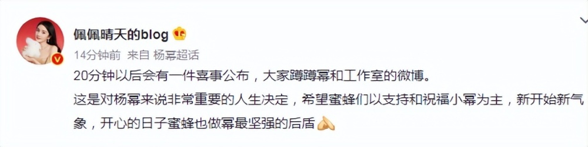

其实早在2022年年末，粉丝就爆料称杨幂与嘉行合约到期，双方结束了合作。

杨幂离开嘉行的说法最早还是圈内人透露，在节目《美味夜行侠》中，提到自家老板是艺人的话题，张云龙表示杨幂不是自己的老板，是对自己帮助很大的人，其他同行认为是杨幂。

而后，杨幂的前造型师及助理也都发文感慨，一个说“物是人非”，一个“她会有最好的，再暖起来”，听起来都是唏嘘之词，也引发离开猜测。

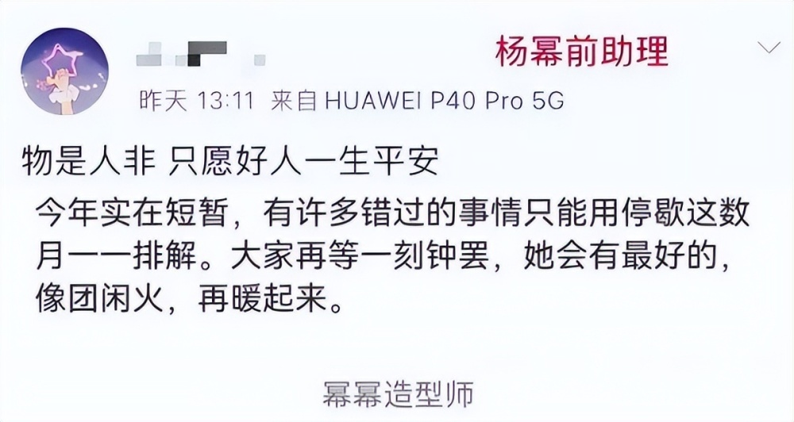

再来就是嘉行传媒关联艺人栏没有杨幂。

嘉行传媒与杨幂有很深的渊源，她不仅是嘉行的顶梁柱艺人，还是起初出资创立的股东之一，更是嘉行艺人的流量“奶妈”。

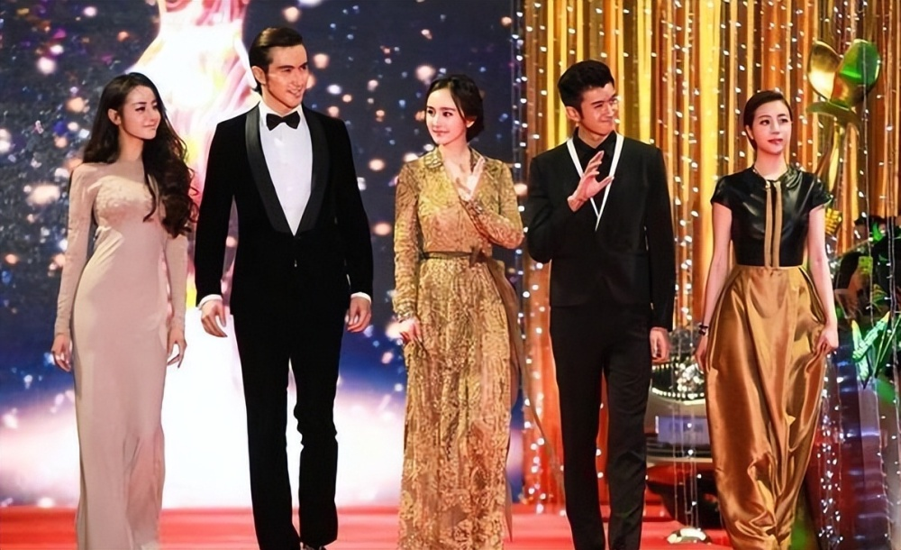

作为老板，杨幂对嘉行尽心尽力，远有疯狂拍戏完成对赌任务，近有嘉行大礼包。对赌期间，杨幂喜提“拼命三娘”称号，一年到头都没停过。嘉行大礼包，顾名思义，就是带新人拍摄嘉行自制剧，这样的模式只是无尽消耗杨幂的能量与人气，即便完成了提拔新人的任务，也败掉了自己的口碑，毕竟大部分自制剧都有一个毛病：新人疯狂加戏，导致剧本粗糙，口碑差。

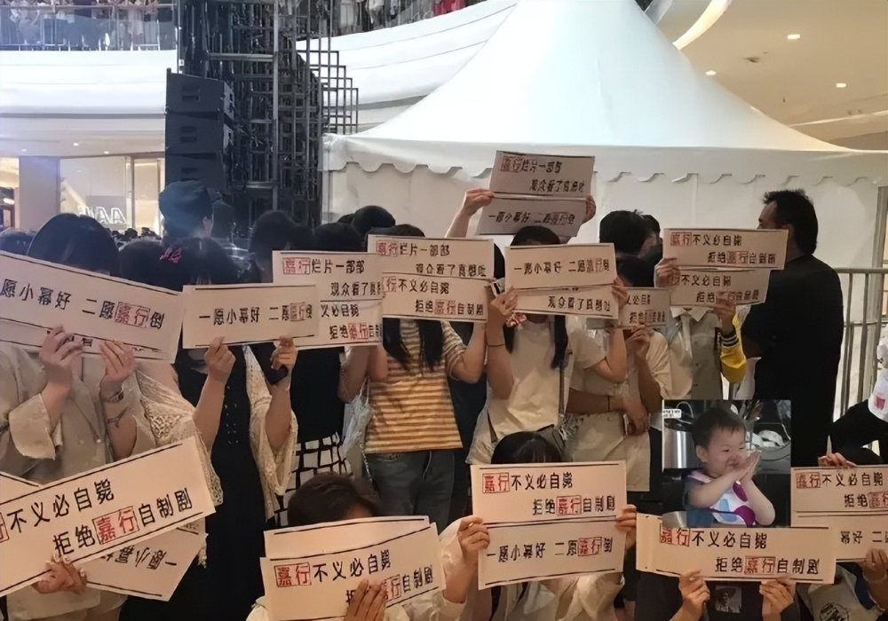

作为艺人，嘉行并没有提供给杨幂更好更大的舞台，事业规划等于无，接戏不考虑质量和品质，屡屡被诟病，连杨幂本人也被吐槽不珍惜口碑。

据粉丝统计，在嘉行期间，杨幂接触的外戏《盛夏晚晴天》要带3位旗下艺人，《古剑奇谭》也带3位，《我是证人》还是3位，《怦然心动》2位，《翻译官》3位，《扶摇》3位，至于热播剧《三生三世十里桃花》，同公司艺人达到了9位数，这节奏可以说是把剧组当自家后花园了。

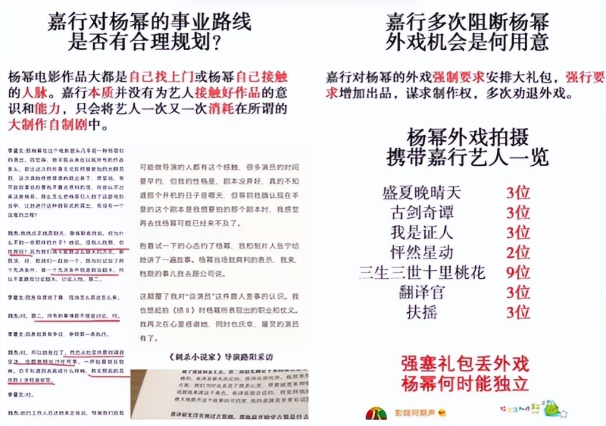

外戏都这样，可想而知，自制剧的情况，由杨幂及嘉行艺人演绎的《谈判官》《扶摇》《暴风眼》等剧，因质量不佳，导致杨幂踏入烂剧女王行列。频繁使用一个班底，换汤不换药，说白了就是牺牲杨幂的口碑带火其他人。

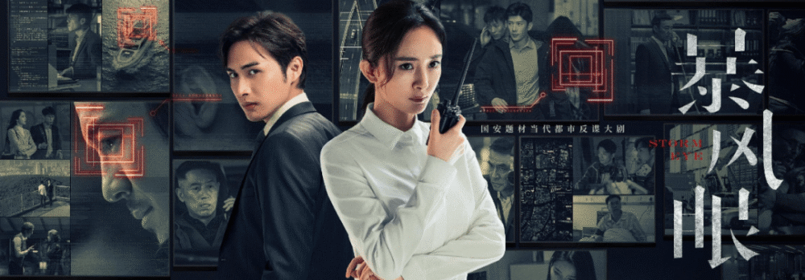

杨幂年龄已经不年轻了，而她的戏路一直没有大发展，还是围着偶像剧打转，同期的85花赵丽颖已经美美完成转型，挑战冷门题材取得成功。反观，杨幂尝试的医生、律师等角色表现力都被诟病，还因《二八》直接油腻出圈。

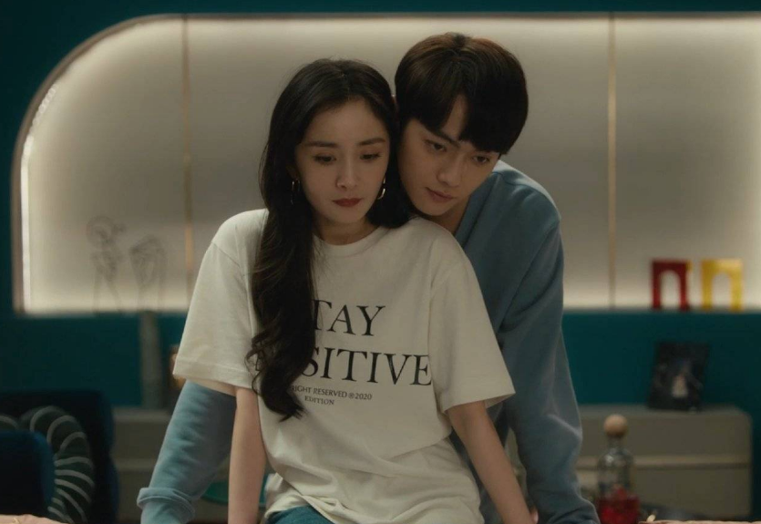

如今杨幂约满不续，也算是体面的结束了合作。最后，祝福杨幂未来工作顺利，事业更上一层楼！

