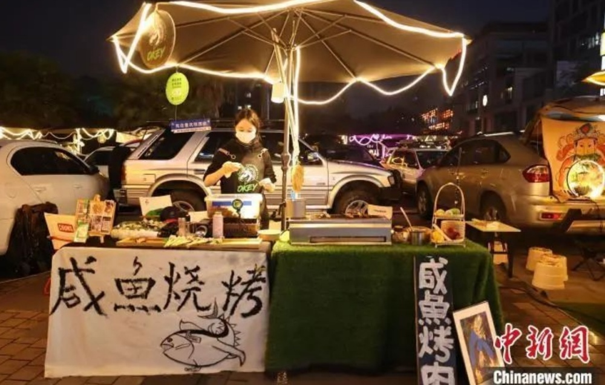
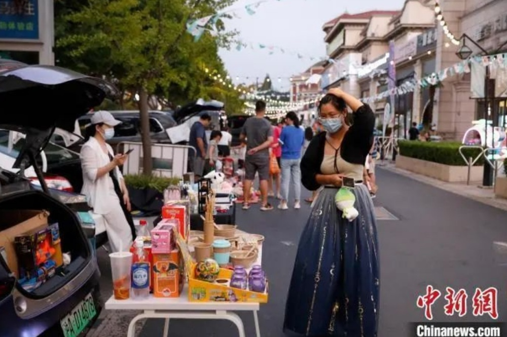
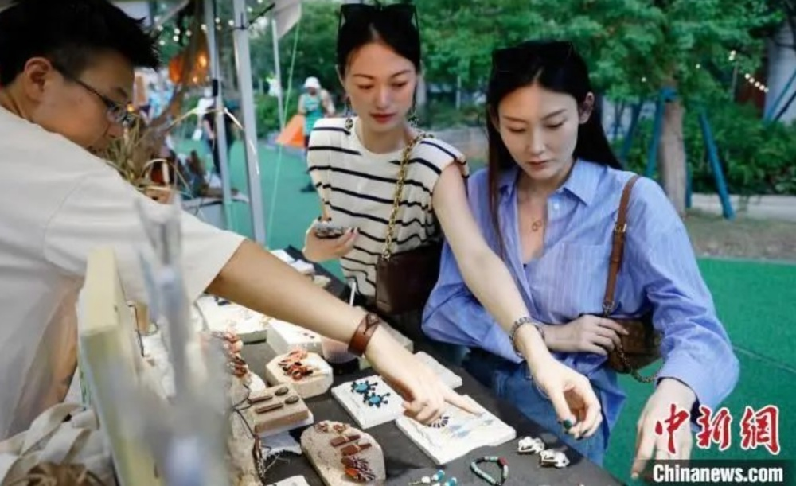
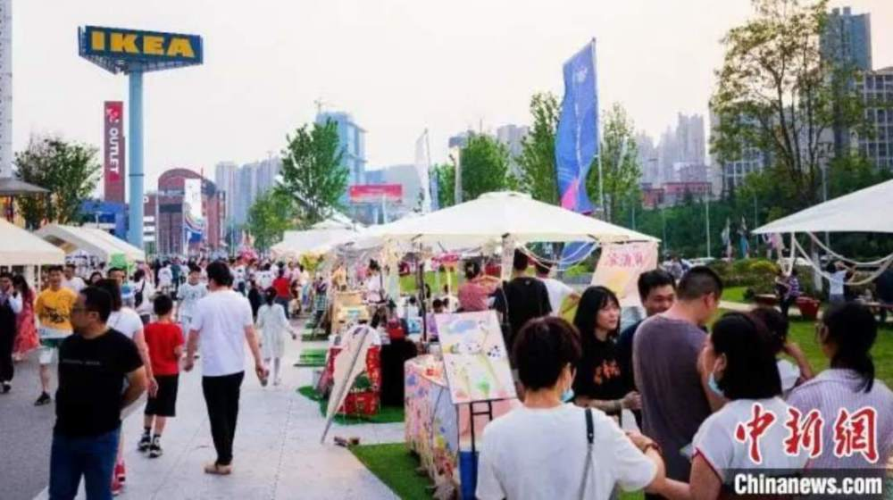

# 深圳不再全面禁止“路边摊”，此前北京上海等多地已进行相关探索

淄博的“烟火气”传到了一线城市。深圳出台新条例，不再全面禁止路边摊。在此之前，北京、上海、兰州等城市也进行相关探索。如何平衡商业经营与城市管理之间的关系，成为各地政府面临的一道新考题。

_资料图：一名年轻人的烤肉摊位。李晨
摄_

**深圳不再全面禁止“路边摊”，多地已出招**

近日，新修订的《深圳经济特区市容和环境卫生管理条例》经深圳市七届人大常委会第十七次会议表决通过，自2023年9月1日起实施。

修订后的《条例》不再全面禁止路边摊。具体包括，将原本“禁止商店、门店超门、窗外墙摆卖、经营”的规定，修改为“商场、门店超出门、窗外墙摆卖、经营的，应当符合规范”。

在原先“禁止擅自占用城市道路及其两侧、人行天桥、人行隧道和其他公共场所堆放物品、摆摊设点、销售商品”的基础上，增加“街道办事处可以根据方便群众、布局合理、监管有序的原则划定摊贩经营场所”的例外规定。

_资料图：上海兴起后备箱集市。樊中华
摄_

今年以来，北京、上海、兰州等城市也在探索外摆经营的相关政策。

1月，北京发布《清理隐性壁垒优化消费营商环境实施方案》，提出51项改革任务打通痛点堵点，其中包括规范商圈外摆经营等内容。2月，上海发布《关于进一步规范新时期设摊经营活动的指导意见(征求意见稿)》，提出区人民政府会同市有关部门根据需要，可以划定设摊开放区，设置特色点、疏导点、管控点，同时划定严禁区、严控区、控制区等。

近日，兰州发布了《关于进一步规范外摆经营的指导意见(试行)》，规范了设置外摆区域、个人设摊行为，明确了外摆设置条件，提出了创新设置特色点位，鼓励形成“基本商业为主体、设摊经营为补充”的服务格局。

**设摊如何管理？各地明确经营规范**

政策方面的不再全面禁止并不意味着完全放开，不少地区已经开始探索新型设摊形式，新的管理规范亟待建立。

例如，今年备受关注的网红城市淄博早在两年前，就对居民摆摊做出指导。2020年6月，淄博经开区综合行政执法局规划12个便民疏导点、早夜市分布点，同时，在规定区域内经营将不收取任何费用、并且一切水电费全免。

_资料图：摊位吸引消费者流连。樊中华
摄_

北京、上海等一线城市对商业外摆的经营品类、区域范围以及外摆时间等也做出明确规定。针对试点外摆可能会产生地摊现象、影响市容市貌的问题，今年年初，北京相关部门负责人对媒体表示，推进外摆试点主要是满足群众休闲消费、品质消费的需要，不是“地摊儿”。

深圳新修订的条例也明确，禁止占用城市道路和公共场所堆放物品、摆摊设点、销售商品。违反此项规定的，由市、区城管和综合执法部门责令改正；拒不改正的，由市、区城管和综合执法部门按照占地面积处每平方米一千元罚款；情节严重的，并处没收违法堆放、摆卖的物品和实施违法行为的工具。

杭州对外摆区的卫生、桌椅设施等作出规定。杭州要求外摆区的桌椅等应作为公共设施向行人和游客免费开放，不得限制使用。

兰州提出，食品摊贩和街头艺人应具备相应的资质，符合条件的个人可以向早市、夜市等运营主体提出申请。

_资料图：步行街外摆摊位。黄维正
摄_

**专家：商业外摆政策不是简单的能或不能**

如何平衡城市“烟火气”与市容环境的关系，如何避免一放就“乱”，一管就“死”？

浙江大学国际联合商学院数字经济与金融创新研究中心联席主任、研究员盘和林向中新网表示，允许商业外摆能够促进民生经济，能够创造就业机会，促进老百姓收入增长，同时也是活跃经济末梢循环中非常重要的一个环节。

盘和林表示，设置路边摊要和城市规划配合起来，划定可以摆摊的路边摊区域、对店家的外摆行为进行管理。

“大多数城管和路边摊摊主的矛盾其实在于政策上的一刀切，在执法过程中不够人性化。”盘和林表示，对于商业外摆，不能简单给出“能”或“不能”的政策，而是要将具体的执法判断交给基层，同时将监督基层执法者的权力交还给摊主、店主、居民。

