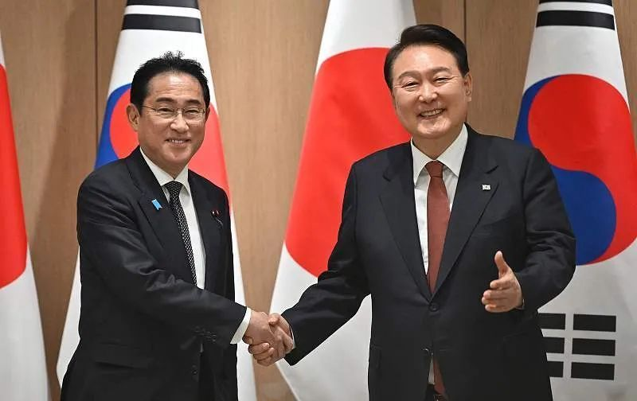
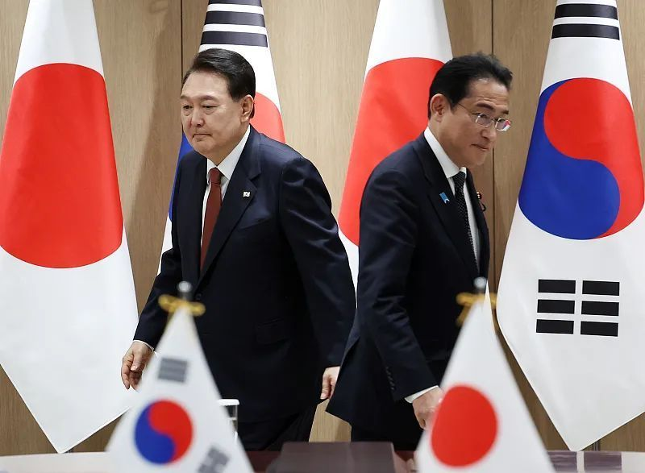
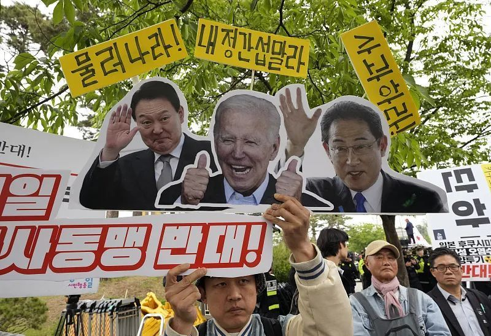

# 韩日领导人“穿梭外交”重启：尹锡悦表态积极、岸田文雄诚意有限

日本首相岸田文雄7日抵达首尔，与韩国总统尹锡悦举行会谈，此访意味着两国首脑互访的“穿梭外交”，时隔近12年正式重启。

_5月7日，韩国首尔，尹锡悦(右)与岸田文雄在会晤期间握手。图源：视觉中国_

“穿梭外交”是指韩日领导人随时互访并举行首脑会谈，由韩国前总统卢武铉2004年12月与时任日本首相小泉纯一郎共同商定。

自2011年10月时任日本首相野田佳彦访韩后，“穿梭外交”中断。

而日本首相上一次访韩还是在5年前。2018年2月，时任首相安倍晋三出席了平昌冬季奥运会开幕式。

7日下午，韩日两国领导人在会谈后举行联合记者会。尹锡悦高度评价岸田此访，称“穿梭外交”重回正轨深具意义，共享普世价值的韩日两国又一次凝聚共识，决定紧密合作应对安全、经济等全球性课题。

长安街知事（微信ID：Capitalnews）注意到，对比尹锡悦的积极表态，以及韩国近日在二战强征劳工赔偿问题上的大幅让步，岸田文雄的回应存在明显温差，诚意有限。

_5月7日，尹锡悦（右）和岸田文雄出席联合记者会。图源：视觉中国_

谈及韩日两国间的历史遗留问题时，岸田文雄说，归功于尹锡悦的决断，韩国政府3月发表二战强征劳工索赔问题解法，并一直进行相关努力。很多人伤痛还在，却能面向未来敞开心扉，令人感动。

连日来，岸田在历史问题上的表态备受关注。韩国民众及在野党要求岸田在历史问题上向韩国道歉，韩国外长朴振也表示，期待日本作出“有诚意的回应”。

然而，岸田在记者会上仅表示，“我本人对许多人在当时的严酷环境中遭遇非常痛苦而悲惨的经历感到心疼。”

此外，岸田强调，包括韩日两国1998年发表的《金大中—小渊惠三联合宣言》在内，继承历届日本内阁历史认知的立场今后也不会动摇。这实际上也只是重申了日本政府的一贯立场。

对于韩国国内“要求日本道歉”的声音，尹锡悦急着替岸田“打圆场”。尹锡悦称，重要的是怀着诚意解决，这不是一方向另一方提要求就能解决的问题。他表示，韩国政府解决二战强征劳工索赔问题的方针不会改变。

另据日媒报道，尹锡悦还在会谈时向岸田表示，必须摆脱“如果不清算历史就无法推进未来的合作”的思路。

上述言论很快在网络上受到韩国网友强烈抨击。有韩国网友警告称，“忘记过去的民族没有未来。”

_7日，尹锡悦与岸田文雄在合影后各自走向座位。图源：视觉中国_

除历史问题外，岸田此访也回应了韩国社会高度关注的福岛核污水排海问题。

尹锡悦在记者会上宣布，韩日两国商定向福岛核电站排污现场派遣韩国专家考察团。

岸田文雄则表示，他很清楚韩国民众对核污水排海感到忧虑。作为日本首相，他不会认可对本国国民、以及韩国国民健康和海洋环境造成负面影响的排放形式。

但事实上，面对国际社会特别是周边邻国的关切，日本政府一直试图淡化、掩盖核污染水排海的危害，坚称经过处理的核污染水是“安全”的。

就在上月底，日本经济产业大臣西村康稔再次强调，日本政府计划从今年春夏开始将核污染水排海的方针不会改变。

此前有报道称，岸田考虑最快今夏访问韩国，如今却将行程大幅提前。

然而，无论是二战强征劳工的历史遗留问题，还是核污染水排海等迫切的现实问题，岸田此访都未向韩国展现出足够的诚意。

长安街知事（微信ID：Capitalnews）注意到，岸田访韩行程“加急”，有多层考虑。

先看直接原因。岸田已邀请尹锡悦参加5月在广岛举行的七国集团（G7）峰会，这样一来，尹锡悦将在两个月内再次访日，如果岸田中间不回访，未免有外交失礼之嫌。

而更深层的原因，则是美日韩三方合作加速推进。此前有韩媒指出，这意味着韩美日“三眼联盟”已提上日程。

_5月7日，韩国民众在总统府前举行抗议集会。图源：视觉中国_

尹锡悦4月访美与拜登举行会谈，会后双方共同发表《华盛顿宣言》，阐明加强美国对韩提供“延伸威慑”的方案。

如今韩美正在考虑吸纳日本加入这一宣言。此次韩日首脑共见记者时，尹锡悦表示“不排斥日本参与其中”。他指出，《华盛顿宣言》尚未完全成形，需要在共同策划、共同落实的过程中完善充实其内容。只要相关进程步入轨道，日方也在对美关系方面做好准备，可随时同日方就此展开合作。

与此同时，韩日还决定在双方推行各自的“印太战略”中保持密切合作与沟通，这无疑是继续积极迎合美国“印太战略”，在亚太地区大搞封闭排他的“小圈子”。

本月初，美国政府高官透露，拜登将在5月赴日本出席G7广岛峰会期间，与岸田文雄、尹锡悦举行三方会谈。《纽约时报》评论称，日韩关系回暖对美国意义重大。

当前，韩国外交一味迎合美国、被批“屈辱外交”也义无反顾的做法，持续遭到韩国国内强烈批评。

据《韩民族日报》报道，在尹锡悦政府上台1年之际，民调显示，韩国民众每10人中，有4人对尹锡悦的施政表现作出“极差”评价。

韩民族和平研究所所长郑旭湜指出，尹锡悦政府标榜“全球化韩国”，实际上却是“把赌注全压在美国身上”，让人分不清这到底是不是“美国的韩国”。

郑旭湜说，这并不是要“反美”，而是应停下来想一想，韩国在提升硬实力的同时，在外交上究竟是什么水平。

