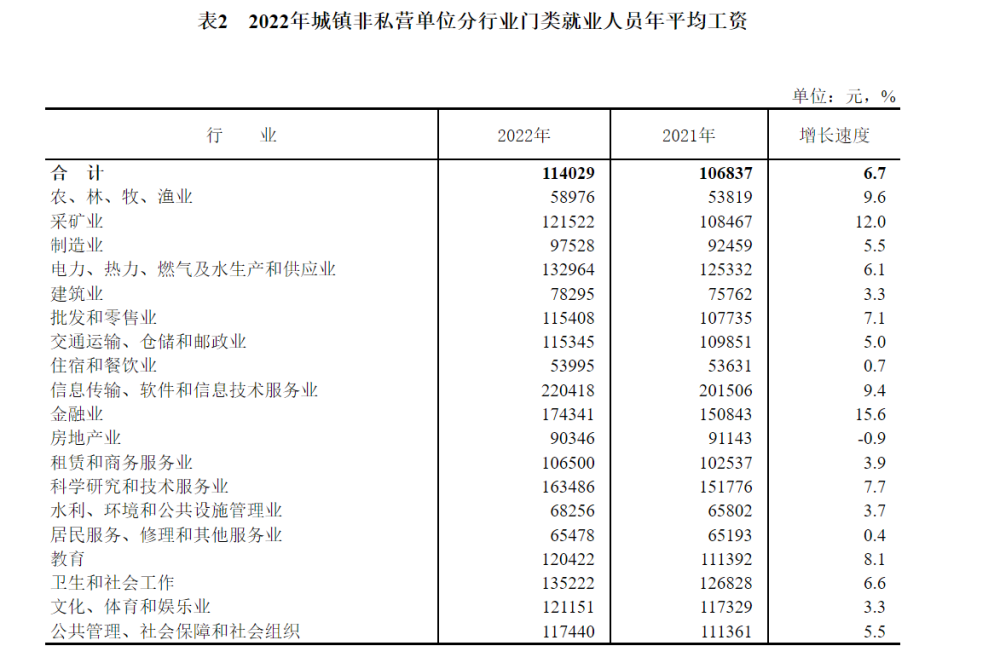
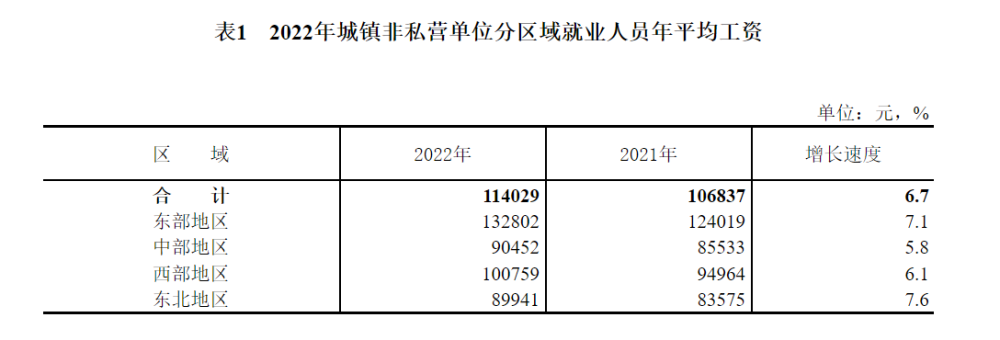
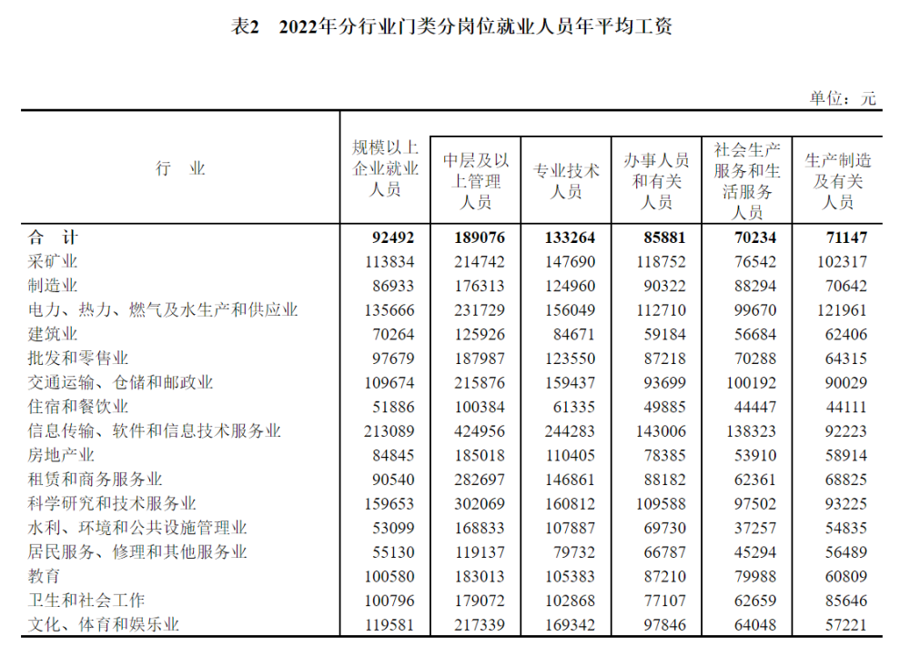

# 2022年平均工资出炉：IT业最高，金融业第二，房地产业下降

5月9日，国家统计局发布2022年城镇单位就业人员平均工资数据。

数据显示，2022年，全国城镇非私营单位就业人员年平均工资为114029元，比上年增长6.7%，增速比2021年回落3.0个百分点，扣除价格因素实际增长4.6%；城镇私营单位就业人员年平均工资为65237元，比上年增长3.7%，回落5.2个百分点，扣除价格因素实际增长1.7%。

国家统计局人口和就业统计司司长王萍萍表示，据国家统计局对138.1万家规模以上企业的联网直报统计和72.1万家规模以下样本单位的调查，2022年全国城镇单位就业人员平均工资保持增长。

**行业间工资水平差距较为明显**

**2022年，无论是在城镇非私营单位还是在私营单位中，就业人员年平均工资水平排在前三位的行业均为技术含量较高的信息传输、软件和信息技术服务业，金融业，科学研究和技术服务业。**
工资水平排在后三位的行业略有不同，在城镇非私营单位中为住宿和餐饮业，农林牧渔业，居民服务、修理和其他服务业；在私营单位中为农林牧渔业，水利、环境和公共设施管理业以及住宿和餐饮业。与2021年相比，2022年平均工资水平排在前三位与后三位的行业保持不变。城镇非私营单位工资水平行业高低倍差达到4.08；城镇私营单位工资水平行业高低倍差为2.91。

2022年城镇非私营单位分行业门类就业人员年平均工资。来源：国家统计局

**工资水平保持增长，增速回落**

**在19个行业门类中，有18个行业的就业人员平均工资保持增长**
，其中采矿业，信息传输、软件和信息技术服务业、金融业等行业城镇非私营单位和私营单位（以下简称“两类单位”）平均工资增速均相对较高；
**房地产行业平均工资水平下降，部分人员密集型或接触型服务业平均工资增速较低**
。受国际能源价格上涨等因素影响，2022年，采矿业两类单位就业人员平均工资分别增长12.0%和9.3%；受人们对互联网学习、工作、社交和网络购物需求量较大等因素影响，信息传输、软件和信息技术服务业两类单位平均工资分别增长9.4%和8.1%；
**金融业两类单位平均工资增速均为15.6%，主要受行业结构调整、减员增效等因素影响**
。以城镇非私营单位金融业包含的四个行业大类为例，货币金融服务业（主要是银行等）、资本市场服务业（主要是证券基金和投资公司等）和其他金融服务业的工资水平较高，分别为21.6万元、
**45.2万元** 和42.3万元，平均工资增速分别为6.1%、2.4%和6.7%，而
**保险业的平均工资较低，仅为9.1万元，其增速却高达19.1%**
。保险业平均工资增速较高的主要原因是，工资水平较低的保险代办员在2022年大量减少，使保险业就业人数减少近23%，工资总额减少8.2%。低工资保险业就业人员的减少是金融业平均工资水平变化较大的主要原因。

2022年城镇私营单位分行业门类就业人员年平均工资。来源：国家统计局

**分地区看，无论是在城镇非私营单位还是私营单位中，工资水平都是东部最高，东北最低**

**从城镇非私营单位看**
，东部、中部、西部和东北地区年平均工资分别为13.3万元、9.0万元、10.1万元和9.0万元，分别增长7.1%、5.8%、6.1%和7.6%。以东部为1，东部、中部、西部和东北地区平均工资之比为1:0.68:0.76:0.68，2021年为1:0.69:0.77:0.67，东部与东北地区差距缩小0.01，与中部、西部地区的差距有所扩大。
**从城镇私营单位来看**
，东部、中部、西部、东北地区年平均工资分别为7.3万元、5.3万元、5.6万元和5.0万元，增速分别为4.7%、1.5%、2.8%和3.7%。以东部为1，东部、中部、西部和东北地区平均工资水平之比为1:0.73:0.76:0.68，2021年为1:0.76:0.78:0.69，东部地区与其他地区差距有所拉大。

2022年城镇非私营单位分区域就业人员年平均工资。来源：国家统计局

2022年城镇私营单位分区域就业人员年平均工资。来源：国家统计局

王萍萍表示，个人工资与全国平均工资的差异受多种因素影响，应理性看待。由于所处地区不同、行业不同、单位类型不同，单位之间的工资水平有时会存在较大差异；在同一单位内部，由于就业人员所处岗位不同，工资水平也会存在一定差异。

当前的工资统计使用分组数据反映不同地区、行业、单位类型的工资水平，以及地区内、行业内不同岗位就业人员的工资水平。比如，在规模以上企业就业人员中，信息传输、软件和信息技术服务业，科学研究和技术服务业单位的中层及以上管理人员年平均工资分别为42.5万元和30.2万元，而水利、环境和公共设施管理业，住宿和餐饮业部分岗位就业人员的年平均工资在4万元左右。平均工资数据可以了解劳动力市场中相应就业人员大致的工资水平。但是，由于单位效益不同、个人具体情况不同，即使是同一地区、相同行业、相同单位类型和相同岗位的就业人员，个人工资水平之间仍会存在一些差异。

2022年分行业门类分岗位就业人员年平均工资。来源：国家统计局

城镇单位就业人员平均工资的增长变化也受多重因素影响，既有宏观政策、社会经济大环境等外部因素，也有单位改制、用工结构变化等内部因素。比如，同为农林牧渔业单位，城镇非私营单位和私营单位的单位性质、从事工作所属行业大类、就业人员类型都不相同，这些因素都会导致工资增速差异较大。教育行业城镇非私营单位多为公立学校，而私营单位中培训机构较多，受经济形势变化和政策调整的影响，在平均工资增速上会表现出较大差别。

总之，由于种种原因，具体到个人的工资水平和增速，可能与全国平均水平和增速差别较大，这需要从行业、地区、单位类型、岗位以及单位经营状况和个人具体情况出发进行全面分析，理性看待。

