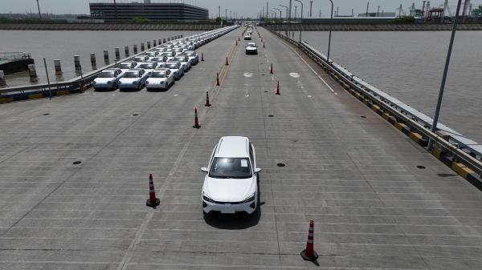

# 中国出口连续两个月正增长，4月对俄罗斯出口大增153.1%

_上海外高桥港区海通码头，新能源车排起长队，有序驶入巨型滚装船。
陈佳 摄_

5月9日，海关总署发布的数据显示，今年前4个月中国进出口总值1.94万亿美元，同比下降1.9%。其中，出口1.12万亿美元，同比增长2.5%；进口8227.6亿美元，同比下降7.3%；贸易顺差2941.9亿美元，同比扩大45%。

具体看4月，按美元计价，中国进出口总值5006.3亿美元，同比增长1.1%。其中，出口2954.2亿美元，同比增长8.5%；进口2052.1亿美元，同比下降7.9%；贸易顺差902.1亿美元。

_数据来源：海关总署_

按人民币计算，4月进出口总值3.43万亿元，同比增长8.9%。其中，出口2.02万亿元，同比增长16.8%；进口1.41万亿元，同比下降0.8%；贸易顺差6184.4亿元。

_数据来源：海关总署_

宁波新东方工贸有限公司总经理朱秋城告诉澎湃新闻记者，刚刚出炉的前4个月的数据增量和企业的感知是一致的。

“一季度的外贸增量，对于我们一线外贸企业来说，在我们合理预期之内。因为从三四月开始，企业的整体感受是需求在回暖。我们预计今年外贸的核心趋势是前低后高，相信未来几个月会更好，会越来越好，这是大的方向。同时我们看到整个中国外贸的韧性还是强大的，从开年到现在一直保持一定的增量。”朱秋城表示，特点在于结构在变化。“首先，外贸交易的国家有所变化，美国的需求及交易增量很少，而东盟、一带一路、RCEP市场等有增量。我们公司去年开始做韩国市场，保持了一定增量。”

**4月汽车出口高位提速**

4月份，中国出口2954.2亿美元，同比增长8.5%；继3月出口同比增速大增14.8%后，继续保持正增长。在当前海外经济下行势头已现，近两个月韩国、越南出口额均出现两位数同比负增长的背景下，为何中国出口额同比增速连续两个月保持正增长？

从基数因素看，东方金诚首席宏观分析师王青对澎湃新闻表示，上年同期一些地方处于疫情高峰期，出口基数明显偏低。2022年4月中国出口额同比增长3.5%，较前值骤降10.8个百分点。同时，从出口额环比看，4月出口额环比下降6.4%，而疫情前十年该数据的平均值为环比上升6.2%。

从出口结构看，4月汽车（包括底盘）出口额同比增长195.7%，出口量增长148.0%，增速都较一季度进一步加快，而且显示出量价齐升势头。

王青表示，汽车出口高位提速，制造业转型升级正在塑造出口新动能。这主要源于中国在新能源汽车领域实现“弯道超车”，正在大幅增加包括发达国家市场在内的全球市场出口份额。与此同时，4月锂电池、太阳能电池出口也在延续较快增长势头，体现国内制造业转型升级对出口的促进作用明显。

光大银行金融市场部宏观研究员周茂华也对澎湃新闻表示，外贸出口强劲表现，与中国外贸结构持续优化，生产活动进一步恢复，外贸企业积极应对海外需求变化，以及纾困与稳外贸政策措施显现有关。

朱秋城也表示，交易的产品类型不同，增量也不同。“我们发现有些企业较好，有些企业也不乐观，还是存在冰火两重天的分化，就是因为产业结构产品结构不同。看数据会发现，廉价劳动力或劳动密集型的如纺织服装类，可能市场就会比较难，而像一些机电高科技产品类还是保持一定的增量。”

从外需看，王青表示，美、欧等发达国家经济下行势头在中国4月出口数据中有所体现。其中，4月中国对美出口额同比下降6.5%，为连续9个月同比负增长；受上年同期出口基数大幅下行带动，当月同比降幅较上月小幅收窄1.2个百分点。

“前期美联储持续大幅加息，正在对美国国内总需求形成较强抑制效应，加之近期银行业危机会进一步加剧经济下行，短期内中国对美出口转向正增长的难度很大。”王青说道。

王青还表示，同样受上年同期基数下沉影响，4月中国对欧盟出口同比增长3.9%，增速较上月小幅加快0.5个百分点，但仍显著落后于整体出口增速。背后是在地缘政治冲突未解、欧洲央行大幅加息等因素影响下，今年欧盟经济下滑幅度较大。预计从5月开始，中国对欧盟出口大概率或同比负增长。

值得注意的是，4月中国对俄罗斯出口同比劲升153.1%，连续两个月处于三位数高增水平。王青表示，主要原因是国际制裁加剧背景下，俄罗斯将从欧洲等地的商品进口转向中国。

**4月进口同比降幅扩大**

4月份，中国进口2052.1亿美元，同比下降7.9%；降幅较上月扩大6.5个百分点。从环比来看，4月进口额环比下降9.7%。王青表示，与历年同期相比，环比表现明显弱于季节性，印证当月进口动能边际减弱。

价格因素方面，王青表示，4月国际大宗商品价格月内走势以下跌为主，其中，上旬原油、有色金属等商品价格整体上扬，但随后因欧美央行继续加息、银行业风险持续暴露等因素导致需求预期承压而转为下跌。尽管从均值来看，4月RJ-
CRB商品价格指数月均值较3月有所上涨，但因去年同期基数进一步抬升，同比仍下跌10.1%，跌幅与上月基本持平。

“3月以来，国际大宗商品价格同比转负，且跌幅持续处于两位数，由于进口商品统计的是到岸价，与国际市场价格变动存在一定时滞，因此，4月进口额降幅的大幅走阔实际上反映了3月起大宗商品价格同比转为大幅下跌的累积影响。”王青说道。

周茂华表示，4月大宗商品价格进一步回落，降低了国内原材料等商品进口的整体成本。

从需求角度看，王青表示，4月国内制造业PMI重回收缩区间，显示经济扩张动能有所放缓。这也表明，当前中国经济向上修复的过程比较温和，经济回升的基础尚不牢固，市场信心有待进一步提振，因而对进口需求的拉动作用仍较为有限。

周茂华也表示，进口增速放缓超预期，反映国内经济处于恢复状态，部分行业企业处于去库存尾声，企业补库存意愿仍显不足。

**未来外贸怎么走？**

展望后续出口走势，王青表示，短期来看，伴随低基数效应退去，加之外需放缓势头持续，5月中国出口额有可能再现小幅同比负增长，且同比下滑过程将会持续一段时间，二季度外需对经济增长将延续负向拉动。

“这也是近期出口额数据保持正增长，而监管层持续加码稳外贸的原因。我们判断，接下来推动国内经济修复将更加倚重内需，未来一段时间宏观政策将在促消费、稳投资方面持续发力。”王青说道。

值得一提的是，近期很多地方正在组织外贸企业“走出去”，将海外客户“请进来”。王青表示，这明显加大了对海外市场的开拓力度，加之在各类稳外贸政策扶持下，当前国内民企出口修复较快，跨境电商等外贸新业务增长势头良好，都有助于抵消海外订单不足对中国出口的拖累。

周茂华也表示，从趋势看，欧美等经济体需求趋缓的势头尚未扭转，去年外贸出口基数相对较高，外贸出口增速仍面临放缓压力。但预计出口保持适度增长，主要是新兴经济体整体复苏前景相对乐观一些，而中国外贸出口结构持续优化，新能源类产品出口保持良好势头等。

进口方面，王青表示，5月上旬，原油价格领衔国际大宗商品价格大幅下跌，加之去年5月大宗商品价格仍持续上扬，这意味着今年5月大宗商品价格同比将面临更高的基数，因而预计5月价格因素减弱对进口额名义增速的下拉作用可能会比4月更加明显。

“尽管中国经济处于修复通道意味着进口需求仍有回升的基础，但料难以抵消进口价格下跌对进口额的拖累效应。”王青说，预计5月进口额仍将延续同比负增长状态。

