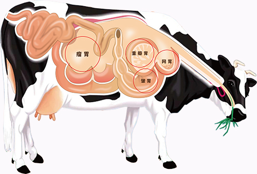

# 为减少甲烷排放准备喂牛“吃屎”？小修小补难以解决温室气体排放难题

华盛顿州立大学的最新研究显示，从未成年袋鼠粪便中提取的微生物可抑制模拟牛胃中甲烷的产生，其替代甲烷产生的乙酸还有助于奶牛肌肉生长。这意味着喂牛吃小袋鼠粪便里的微生物，或可改善奶牛排放甲烷带来的环境问题。

_小袋鼠（图源：网络）_

甲烷是第二大温室气体，对全球变暖的作用是二氧化碳的30倍。释放到大气中的甲烷有一半以上来自农业部门的牛羊，而人类对肉食的喜爱则带来更多牛羊畜养、进而加剧甲烷排放。研究显示，幼年袋鼠前肠中的微生物会产生乙酸，可通过粪便提取培养。这些微生物在实验中仅用几个月就取代模拟瘤胃中产生甲烷的微生物，成为优势种，可减少奶牛甲烷排放。

人类离不开的好朋友——牛竟然是温室效应的罪魁祸首？为改善牛排放甲烷人们用过哪些方法？喂牛“吃屎”的原理是什么、可以推广吗？我们邀请了中科院大气所、北京陶诗言气象发展基金会气象学家魏科解答。

**核心要点**

  * _1_ 牛每天打嗝可排出约200-300升的甲烷，是其放屁甲烷排放量的十倍。将全球的牛看作一个国家，该国每年甲烷排放量可居全球第三。
  * _2_ 牛大量排放甲烷，错的不是牛而是产业布局，是无序发展的畜牧业和非理性的饮食结构。
  * _3_ 对传统畜牧业的“小修小补”，不足以解决根本问题，减少农业和畜牧业温室气体排放量最有效的做法，就是减少畜牧动物的数量。

问：牛打嗝放屁究竟有多大威力？为何会成为温室效应的罪魁祸首？

魏科：温室效应气体的第二大来源就是甲烷，它对全球温室效应起到了25%左右的作用，近些年这一比例还在上升。据联合国政府间气候变化专门委员会2021年数据，农业、林业等用途占据了全球温室气体排放的24%，“畜牧”就是其中的重要部分，牛的甲烷排放最常见。

牛作为反刍动物有四个胃，摄入粗饲料后储存在瘤胃里，之后再细嚼慢咽地反刍。这些饲料经过微生物发酵产生大量甲烷，并以打嗝和放屁的形式排出，
**打嗝排放的甲烷又是放屁的十倍，每天大概有200~300升甚至500升** （取决于牛的体型和饲养方式）。
**比尔·盖茨《气候经济与人类未来》一书中的一张统计表显示，若将全球的牛看作一个国家（Republic of
Cattle），该国排放的温室气体总和能排到世界第三。**

_牛的“四个胃”（图源：中国数字科技馆）_

问：为了减少牛的甲烷排放，过去都做了哪些努力？

魏科：作为畜牧大国，新西兰在十年前就提出要对牛征“放屁税”，但遭到广大畜牧业养殖户的强烈反对，该措施随即被搁置。研究人员曾通过为奶牛饮食加入化学抑制剂、开发疫苗等方式来减少奶牛的甲烷排放，但收效甚微：奶牛瘤胃内的微生物很快对抑制剂产生耐药性；而奶牛体内产生甲烷的微生物组则与其栖息地和饮食有关，全球有很多种，疫苗很可能无法覆盖。

问：新西兰去年曾尝试对牛羊征收“ 放屁税 ”，这个法案会成功吗？

魏科：对牛征税，就从一个科学问题变成了经济和政策问题。近年来公众对减排政策关心最多的就是其是否会降低普通民众的基本生活质量。若以牺牲经济和生活质量为代价来推行减排，会引起剧烈反弹。

**国际社会普遍认为牛大量排放甲烷，错的不是牛而是产业布局，产业对资本方来说是投资和收益的问题，并不是非畜牧业不可。**
近些年大家逐渐意识到牛肉等消费带来的碳排放量实在太高，开始减少红肉摄入、多吃蔬菜。同样吃肉，吃牛肉带来的碳排放量远高于吃鸡肉，比吃蔬菜则更高不少。于是很多人认为想要减少养牛带来的碳排放量，可能不是通过向牛征税的方式，而是倡导新消费方式、减少牛养殖量；对畜牧业依赖严重的国家则可通过经济结构转型的方式减轻畜牧业依赖。

目前牛肉在西方社会饮食中所占比例过大，由此导致大片土地被用作养牛，消耗巨量的水分和饲料。其实通过调整饮食结构改吃鸡肉和鱼肉，尤其是近些年人工养殖的海鱼技术发展很快，可以实现大规模高质量升级替代。另外，去年剑桥大学和以色列莱希曼大学相关研究(Tzachor,
et al.,
2022)表明，螺旋藻的蛋白质、铁和脂肪酸等营养的含量优于牛肉，可以作为日常饮食中健康、安全、更可持续的肉类替代品。例如，可以用螺旋藻粉作为意大利面、煎饼和糕点的配料，增加食品中蛋白质等营养素的摄入量。

_不同产品带来的碳排放量（图源：番茄资本）_

对牛征税实际上是对人征税，进一步就是对产品征税，畜牧业下游的牛肉、乳制品等价格就会随之提高，最终这项税还是落到国内外消费者头上了。因此这项法案一定会影响到新西兰畜牧业整体的国际竞争力，最终反噬到新西兰经济，或许会像上次一样因养殖户强烈反对而流产。

问：如何看待喂奶牛吃小袋鼠排泄物，原理是什么？有希望真正解决牛的甲烷排放问题吗？

魏科：这其实是之前解决甲烷排放问题的延续。此前，科学界和产业界希望能通过给饲料里增加添加剂，从而降低发酵过程中的甲烷产量，例如瑞士公司Agolin，在饲料中添加了含有香菜籽油、丁香和野胡萝卜的提取物，据称新饲料可以增加乳牛的乳量，这不但能提高牛只的身体机制效率，也可以减少大约
6%到30%的甲烷排放量。而另一家瑞士公司Mootral，开发了一种以大蒜、柠檬酸提取物为基础的饲料添加剂，声称可将反刍动物的甲烷排放量降低38％。类似的研究，全球还有其他公司和组织在做，毕竟饲料也是巨大的商业机会。

这次所说的给牛喂袋鼠粪便，看来又是一种思路。其实严谨来看喂的也并不是粪便，主要是粪便里的微生物：通过替换牛瘤胃中的微生物，将原来产生甲烷的微生物换成不产生甲烷的微生物，从而减少反刍过程中的甲烷排放量。

**思路虽然很清奇，但是对于牛的甲烷问题，只是增加一个思路而已。** 过去这么多年，大家对这个问题有比较深入的讨论。
**对传统畜牧业的“小修小补”，不足以解决根本问题，减少农业和畜牧业温室气体排放量最有效的做法就是减少畜牧动物的数量。另外饮食结构调整势在必行，尤其是对养牛有着疯狂偏执的国家。颠覆性的“人造肉”、“植物奶”的平替也是一个思路。**

**但不管怎么说，错的都不是牲畜，而是无序发展的畜牧业和非理性的饮食结构。人类完全可以吃得更好，吃得更健康，吃得更环保。**

参考文献：TZACHOR A, SMIDT-JENSEN A, RAMEL A, et al., 2022. Environmental Impacts
of Large-Scale Spirulina (Arthrospira Platensis) Production in Hellisheidi
Geothermal Park Iceland: Life Cycle Assessment [J]. Marine Biotechnology,
24(5): 991-1001. doi: 10.1007/s10126-022-10162-8.

专家信息：

整理：王嘉欣

版权声明：本文系腾讯新闻《一起来唠科》独家稿件，未经授权禁止媒体转载，但欢迎转发至个人朋友圈。

