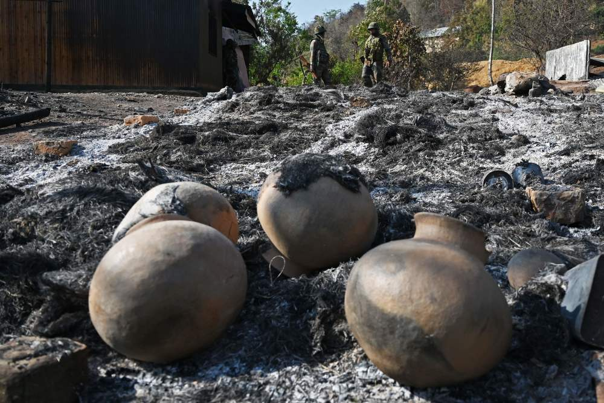
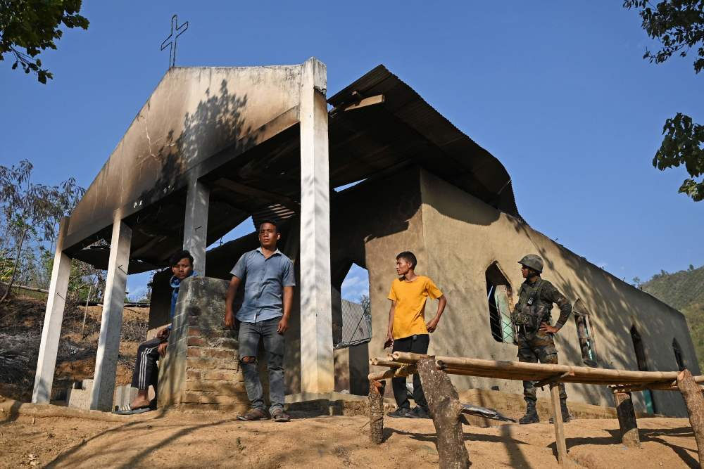
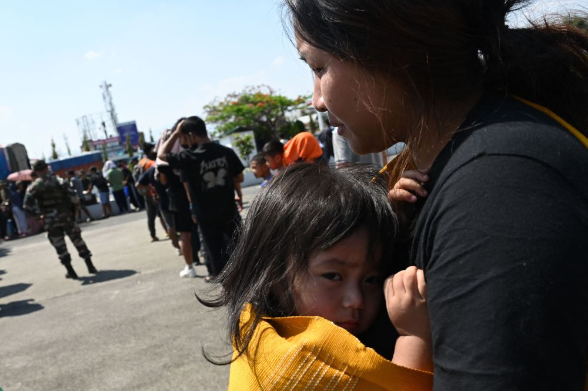

# 印度东北部部落冲突已致至少60人丧生 暴民从警局偷走数百件武器

当地时间5月3日起，印度曼尼普尔邦的梅泰族和库基等山区部落发生暴力冲突。

据印度媒体报道，截至5月8日，该邦的暴力冲突已造成至少60位平民丧生。当地电视台播放的画面显示，车辆和建筑物燃起大火，街道冒着浓浓黑烟。

据印度媒体分析，梅泰族和山区部落在土地、经济发展等问题上长期相互猜疑，当地法院就梅泰族申请成为“表列部落”一事的裁定成为了冲突的导火索。

**“表列部落”之争**

曼尼普尔邦位于印度东北部，与缅甸交界，人口不到300万。梅泰族是该邦的主体民族，占全邦人口的一半以上，主要居住在山谷平原。库基、纳迦等少数民族部落主要生活在占该邦90%土地面积的山区。

梅泰族和其他部落的冲突与印度政府的“表列部落”政策有关。

根据印度宪法，“表列部落”和“表列种姓”是印度最弱势的社会经济群体，为了改善这些群体的状况，他们被赋予在土地、大学录取、奖学金、政府工作机会等多个方面的优待政策。

在曼尼普尔邦，库基、纳迦等部落属于“表列部落”，梅泰族则没有被认定为“表列部落”。

据印度媒体Scroll报道，梅泰族代表在约十年前就向政府提出成为“表列部落”的申请。梅泰族代表说，该族在历史上就是一个部落，需要获得“表列部落”的地位来保护自身免受外来者涌入和“渗透”。

梅泰族代表辛格称，山区部落可以到平原购买土地，梅泰人却不允许购买山区土地，这令梅泰族社区面临土地紧张，“我们在祖传的土地上几乎成了外人。”

但这一申请一直悬而未决。今年4月19日，曼尼普尔高等法院就梅泰族的请愿做出裁定，要求邦政府“应尽快考虑请愿者提出的将梅泰族列入‘表列部落’名单一事，最好在4个月之内做出答复。”

曼尼普尔邦的山区部落强烈反对法院的这一裁定。山区部落代表称法院裁定是“司法越界”。曼尼普尔邦议会山区委员会称，宪法规定所有影响“表列部落”保留地区的法律都需要经过部落代表的审查，但这次法院裁定“既没有把部落代表作为案件当事方，也未进行相关咨询”。

代表山区部落利益的曼尼普尔全体部落学生会称，梅泰族是一个社会和经济相对发达的群体，并非部落，且梅泰族人在政府担任要职。

5月2日，曼尼普尔全体部落学生会发起了反对将梅泰族列入“表列部落”名单的“部落团结集会”，来自山区的数千名部落居民加入了集会。

5月3日，示威活动演变成梅泰族人和山区部落之间的暴力冲突。5月4日，暴力冲突升级，发生人员伤亡，房屋、车辆、教堂和庙宇遭到纵火。梅泰族和山区部落均指责对方发动了暴力袭击。

_当地时间2023年5月8日，印度曼尼普尔邦发生部落冲突后，士兵正在检查遭暴徒纵火的房屋残骸。图/视觉中国_

**暴民从警察局偷走数百件武器**

据美国有线电视新闻网（CNN）报道，一名生活在曼尼普尔邦首府英帕尔市的不愿透露姓名的青年称，他的住处在5月4日受到了暴民“精心策划”的袭击。

“我们目睹的似乎是一系列非常系统、精心策划的袭击。”这名青年称，“我差点儿没能逃脱。暴民闯进了我的屋子，我翻篱笆到邻居家，然后逃到了军营。”

该青年称，自5月4日起，他一直住在军营，除了一台笔记本电脑，他没能从住处带出其他物品。“很多人不幸身亡，有一对母子在来军营的路上被暴民杀害了。”他称。

据《纽约时报》报道，曼尼普尔邦一村庄60岁的村长称，他的村庄有80户人家，在5月5日受到约200名暴民的袭击。“我们有四五支枪，他们有更多枪，双方互开了很多枪。我们跑到稻田里寻找掩护。在我们猛烈的反击下，他们被迫撤退了。”村长说。

据《印度斯坦时报》援引一名不愿透露姓名的警方人员说法，暴民从各个警局偷走了数百件武器。

曼尼普尔邦安全顾问辛格5月6日表示，当天，警察收回了87件武器，“曼尼普尔邦的各个警察局正在清点被暴民偷走的武器，我们敦促人们交出武器，如若不然，警方将采取严厉行动。”

英帕尔市医院和其他多家当地医院收治了超过260名暴力冲突的伤者。曼尼普尔邦楚拉昌普县医院的一名医生对CNN表示：“多数住院伤者遭受了严重枪伤或被棍棒击打头部。”

当地新闻网站“曼尼普尔前线”的编辑Chaoba称，他在曼尼普尔邦从未见过如此的“法律和秩序的全面崩溃”，冲突导致的死亡人数不断上升，最高警长的住宅也遭到袭击。

据印度媒体当地时间5月8日报道，冲突已造成至少60位平民死亡。另外，上万名曼尼普尔人逃离了家园，许多人向西逃到了邻近的阿萨姆邦。

_当地时间2023年5月8日，印度曼尼普尔邦发生部落冲突后，士兵（右）与村民们站在一座被洗劫一空的教堂前。图/视觉中国_

辛格说，死亡人数仍在核实中，“一些报告的死亡人数更高，我们正在验证这一点。医院里的一些尸体可能与暴力冲突事件无关。”

据半岛电视台报道，曼尼普尔邦政府自5月3日起就在该邦的多个地区实施宵禁，并暂停多个地区的互联网接入。不过，曼尼普尔邦警察起初未能控制住暴力冲突。

5月4日，印度军方派遣军队和准军事人员进入曼尼普尔邦。据《印度快报》报道，自暴力冲突发生以来，印度军方先后向曼尼普尔邦部署了约125支陆军和阿萨姆步枪队纵队，每支纵队约有70名人员。

在军队进入曼尼普尔邦的当天，曼尼普尔邦政府发布“见机射击（shoot-at-
sight）”命令，授权安全部队“在极端情况下”向暴民开火。曼尼普尔邦内政部的一份声明说，该命令适用于“已用尽所有形式的劝说、警告、合理武力等”和“失控”等极端情况。

印度军方5月5日晚称，陆军和阿萨姆步枪队在曼尼普尔邦共救出2.3万名平民，并将他们转移到附近的军事基地。军方部署了巡逻队、无人机和直升机监控冲突区域。

5月6日起，曼尼普尔邦的暴力冲突逐渐平息。但当地居民表示，气氛依然紧张，燃料、饮用水等生活必需品出现短缺。“大家都人心惶惶，躲在家中，只有必要时才冒险出门。”一名居民说。

**山区和山谷平原居民互相猜疑**

印度“连线”网刊文称，曼尼普尔邦暴力事件不能视为突发事件，当地不同族群之间的矛盾长期未得到解决，且邦政府和中央政府缺乏消除族群分歧的政治意愿，族群之间的鸿沟不断扩大，导致了暴力事件的发生。

《印度快报》5月8日刊文称，曼尼普尔邦当前冲突的起因可以追溯至今年2月邦政府推行的山区森林调查。邦政府以“保护森林”为由驱逐了部分居住在山区森林的部落居民，此举招致山区部落的反对。

根据印度研究机构“土地冲突观察”的梳理，2月，曼尼普尔邦的森林部门和警察以“侵占受保护的森林”为由驱逐了一些库基部落的居民；但库基部落认为，政府接管他们的“祖传”土地是非法的。3月，部落居民举行集会，抗议驱逐事件，并与警察发生冲突。

4月，曼尼普尔邦高等法院就梅泰族申请“表列部落”问题做出裁定，令局势火上浇油。印度贾瓦哈拉尔·尼赫鲁大学政治学教授郝吉普称，山区部落担心梅泰族争取“表列部落”地位是侵占山区土地的一种策略。

_当地时间2023年5月7日，印度曼尼普尔邦英帕尔，当地爆发部落冲突后，人们在英帕尔机场排队等待印度军队发放食物。图/视觉中国_

“连线”网的文章称，山区和山谷平原的居民在土地等问题上长期相互猜疑。山区的土地占全邦面积的90%，山谷只占10%；但是，山区部落可以到山谷购买土地，生活在山谷的梅泰族却无法购买山区土地，这引发了梅泰族的嫉妒和焦虑。

而在山区部落看来，在过去的几年里，大多数开发工作只在山谷平原进行，就好像是一场计划好的“阴谋”，让山区落后于山谷。梅泰族由于人口较多，在曼尼普尔邦议会中占有三分之二议席。山区部落认为，在涉及自身利益的决策过程中缺乏话语权。

“连线”网称，如果曼尼普尔邦的首席部长毕伦谨慎行事，或许可以避免族群暴力冲突，但他为了选票拉拢多数族群，没有为了维持地区和平推动不同族群之间的团结。

另外，据《印度教徒报》报道，曼尼普尔邦的亲政府团体声称，一些部落正试图破坏邦政府的禁毒运动，该运动的举措包括销毁山区的罂粟田等。《印度快报》称，当地毒枭可以从山区的罂粟田获利，不能排除毒枭煽动暴力活动的可能性。

新京报记者 陈奕凯

编辑 张磊 校对 刘越

