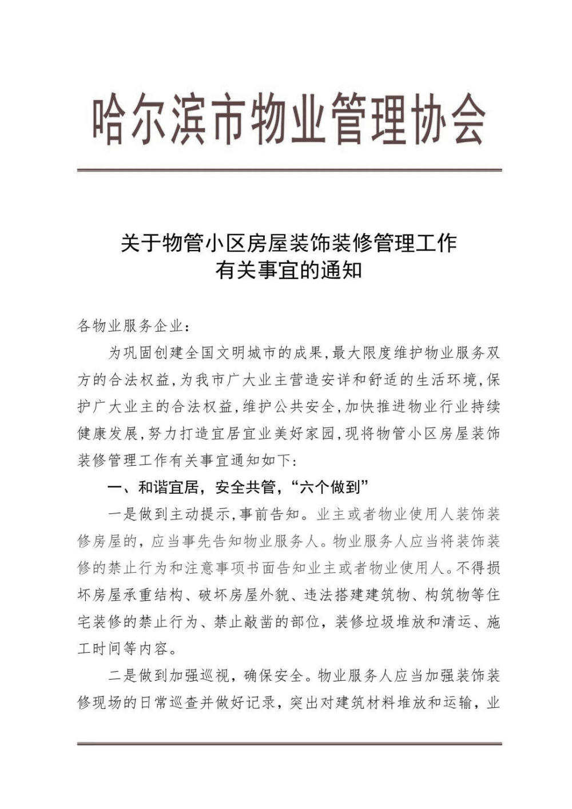

# 哈尔滨私拆承重墙事件已有4人被采取刑事强制措施，律师称或构成危害公共安全罪

4月28日，有黑龙江哈尔滨松北区利民学苑小区B栋的居民发现，3层商户租户在装修时破坏了一部分承重墙，导致多户住户家中墙体出现裂缝，该小区物业随后贴出了紧急撤离的通知。

5月9日，当地政府发布消息，称已对4名相关责任人采取刑事强制措施，下一步将依据权威检测机构出具的技术报告，制定相应方案。

5月9日，相关律师在接受红星新闻记者采访时表示，该商铺的租户与施工方或都将担责。如果租户明知拆除承重墙可能导致楼房坍塌的危险，故意为之导致整栋楼业主人身安全面临重大风险，可能涉嫌以危险方法危害公共安全罪。

**当地物业协会要求**

**装修不得损害房屋承重结构**

红星新闻记者注意到，5月7日，哈尔滨市物业管理协会发布《关于物管小区房屋装饰装修管理工作有关事宜的通知》，其中要求各物业服务企业“六个做到”，包括“主动提示，事前告知”，要求应将装饰装修的禁止行为和注意事项书面告知业主或物业使用人。其中包括：
**不得损坏房屋承重结构、构筑物等住宅装修的禁止行为、禁止敲凿的部位，装修垃圾堆放和清运、施工时间等。**

此外，该通知还要求物业加强装饰装修现场的日常巡查并做好记录，突出对损坏房屋承重结构等违规装修行为的巡视与监督，
**对违反房屋装饰装修和安全生产管理规定的，物业要严格履责，及时制止。**

_哈尔滨市物业管理协会发布的相关通知
图源：哈尔滨市物业管理协会公众号_

5月9日，红星新闻记者联系上哈尔滨市物业管理协会工作人员，该工作人员表示通知内容属实。但该通知是否和不久前发生的利民学苑小区承重墙被破坏一事有关，该工作人员表示无法确认，“这文件领导让发，我们就发了。”

据天眼查相关信息显示，哈尔滨市物业管理协会2003年成立，属社会团体，此前曾归哈尔滨市住房和城乡建设局管理，主要职能为“宣传行业法规政策、业务培训、咨询服务、接受委托工作”。

**4名相关责任人被采取刑事强制措施**

**律师称或涉嫌以危险方法危害公共安全罪**

据央视新闻5月9日报道，哈尔滨市松北区利民学苑小区租户私拆承重墙事件发生后，哈尔滨市委市政府高度重视，成立事件调查组，市区两级组建工作专班，连夜对该事件进行调查处置。相关调查、监测、处置工作正在有序进行中。

同时，委托国家和省级权威检测机构开展调查、鉴定、处置等全面技术工作。根据检测机构和专家组意见，对拆改的墙体采取局部支护等应急处置措施，防止结构构件损伤及变形进一步发展。

此外，公安机关现已依法对4名相关责任人采取刑事强制措施。下一步将依据权威检测机构出具的技术报告，制定相应方案。

河南泽槿律师事务所主任付建对红星新闻记者表示，刑事强制措施是指公安机关、人民检察院或人民法院为了保证刑事诉讼的顺利进行，依法对刑事案件的犯罪嫌疑人、被告人采取的在一定期限内暂时限制或剥夺其人身自由的一种法定强制方法。我国《刑事诉讼法》规定了5种强制措施，分别是拘传、取保候审、监视居住、拘留、逮捕。

付建说，就此次事件而言，目前当地公布了依法对4名相关责任人采取刑事强制措施的消息，但是未具体说明4人的身份。“
**如果租户明知拆除承重墙可能导致楼房坍塌的危险，故意为之，导致整栋楼业主人身安全面临重大风险，可能涉嫌以危险方法危害公共安全罪。**
实施拆墙行为的装修公司或者施工队属于专业人员，知道或者应当知道承重墙不能拆除，因此对于拆除承重墙具有过错，与租户共同实施了拆墙行为，也应当承担相应的刑事责任和民事责任。”

付建还表示，小区物业对居民装修等活动具有管理职责，对小区内居民人身财产安全负有保障义务。根据规定，居民装修拆除非承重墙的墙体应当到物业备案。在此次事件中，物业对租户装修过程中擅自拆除承重墙没有及时发现和制止，在管理上存在一定的疏忽，根据民法典第一千一百九十八条的规定，物业也需要对租户私自拆承重墙给其他业主造成的损失，承担与其过错相适应的赔偿责任。也就是说，物业要因其过失承担相应的民事责任，物业在此次事件中不负刑事责任。

付建介绍，施工者作为专业人员，应当知道房屋的主体结构以及承重墙对整栋楼所起的作用，当租户提出拆除承重墙时应当明确告知不利后果，
**对于这种严重危及公共安全的装修方案，施工者应当拒绝当事人的委托。如果明知拆除承重墙可能导致楼房坍塌的危险，为了谋取利益故意为之的，可以认定为以危险方法危害公共安全罪的共犯。**

**以危险方法危害公共安全罪**

**最高可判死刑**

北京安剑律师事务所律师周兆成从民事责任、行政责任、刑事责任3个方面，对此事进行了解读。他说，
**从刑事责任角度来说，私自拆除承重墙的行为让楼房变危楼，危害公共安全，涉嫌构成以危险方法危害公共安全罪。**
《刑法》第一百一十五条规定：以其他危险方法致人重伤、死亡或者使公私财产遭受重大损失的，处十年以上有期徒刑、无期徒刑或者死刑。过失犯前款罪的，处三年以上七年以下有期徒刑；情节较轻的，处三年以下有期徒刑或者拘役。

周兆成说，从民事责任角度来说，拆除承重墙对楼体造成损坏，影响楼内其他业主正常居住，对他人有侵权行为，民事上需要进行赔偿，包括赔偿房屋修复、加固费用，以及这段时间其他业主不能居住造成的损失等。

而从行政责任角度来说，私自拆除承重墙违反《建设工程质量管理条例》。《建设工程质量管理条例》第六十九条规定：房屋建筑使用者在装修过程中擅自变动房屋建筑主体和承重结构的，责令改正，处5万元以上10万元以下罚款。

陕西德尊律师事务所主任陈灏律师对红星新闻记者表示，采取刑事强制措施的前提是，已经作为刑事案件立案侦查，有初步证据证明被采取刑事强制措施的人可能涉嫌犯罪。
**从目前情况看，可能涉嫌以危险方法危害公共安全罪，或者故意毁坏财物罪都有可能，具体涉嫌罪名由公安机关根据所掌握的证据结合案情确定。**

红星新闻记者 付垚 吴阳

责编 任志江 编辑 彭疆

