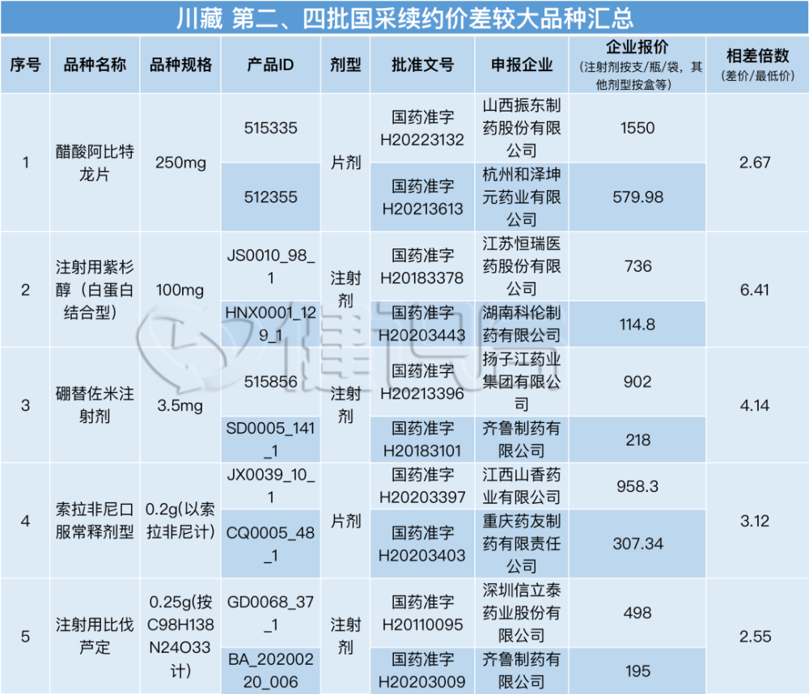
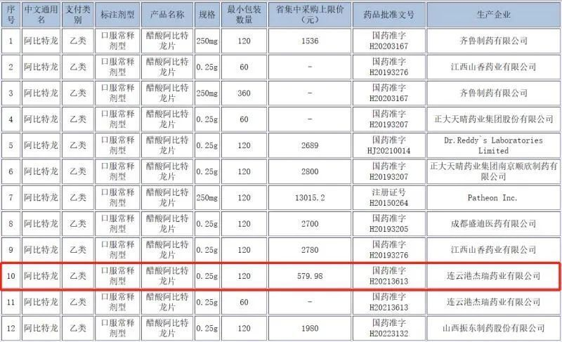
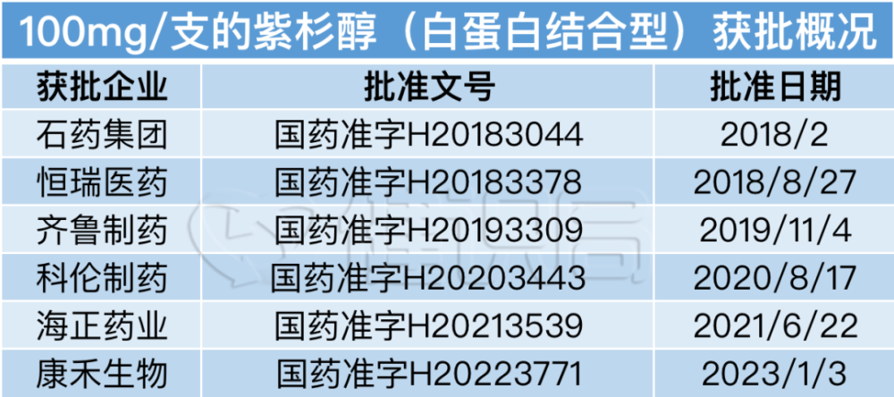

# 国家集采续约“乱象”：价格相差6倍，都算中选品种？

国家集采“常态化”之后，中选企业的续约一直是由各省自己操办。然而，近期却有药企反映： **有的省份在集采续约中出现了不公平的状况。**

近期，健识局获得一份统计表格，列举了川藏两地第二、四批国家集采续接品种第二轮拟中选结果中的部分品种价格。同样入围四川、西藏两地的集采续约，
**不同企业的同一品种价格差最高竟达6倍以上。**

国家医保局组织历次国采，都有一条基准线：“中选的同组药品价差在1.8倍以内”。这一原则保证了不同的集采品种的价格差不会太大，患者使用不同品牌的集采药，花费是相对接近的。

然而在续约时，同一品种间的价差一下就拉大了。药企担心： **同一种集采药之间价差那么大，容易滋生新的灰色空间；另外，对积极降价的企业也不公平。**

同样集采中选，价格最多差6倍

健识局回溯第二、四批国采在各省的续约情况发现， **上述企业描述的问题主要出现在四川、西藏等几个省份的续约中。**

4月28日，四川省公布：川藏两地第二、四批国采品种的续约工作基本操作结束。上述材料中反映的主要是第二批国采的续约品种。

注射用紫杉醇（白蛋白结合型）产品是其中较有代表性的续约品种。川藏集采续约共有四家企业入选，分别为恒瑞医药、石药集团、齐鲁制药和科伦制药，
**对应的中标价格分别为每支736元、148元、135元和114.8元。** 最高和最低价之间差了6倍以上。

为何出现这样的局面？

规格为100mg的注射用紫杉醇（白蛋白结合型）是2020年1月第二批国家集采品种，当时三家企业中选，分别为恒瑞、石药和原研厂家新基公司，
**中选价分别为每支780元、747元和1150元。**
新基公司（现被施贵宝收购）因跨境飞检不合格，很快就被取消中选资格，国采这一标基本由恒瑞和石药瓜分全国市场。

但到了续约时，情况发生了很大变化。

第二批国采2020年4月陆续落地执行，供货周期大部分是两年。 **这两年间，齐鲁和科伦的紫杉醇（白蛋白结合型）陆续获批上市，形成了销售能力，**
自然希望争取续约机会。

机会出现在2022年4月河南牵头组织的十三省联盟采购，对国家集采第二、四批协议期满药品开展集中带量采购。可能是河南注意到了
**紫杉醇（白蛋白结合型）这一品种出现了竞争格局变化** ，当时给出的最高限价只有579元，低于恒瑞和石药的国采中选价格20%以上。

没想到的是，结果比预想的更加惨烈。6月份，河南省医保局公布了联盟采购的结果，紫杉醇（白蛋白结合型）的中选企业有三家，
**分别为石药、齐鲁和科伦，最高中选价仅为165元，最低价148元。**

业内人士分析：“齐鲁、科伦是新进者，杀低价在情理之中；石药从700多元降到100多元，
**可能考虑国采时其在这13省里中选较少，所以也拼命降价来抢市场。”**

降价争夺市场，各企业比拼成本和质量控制，本就是集采的目标。但在2023年4月四川的国采续约中，不仅石药、齐鲁、科伦这三家低价品种入选，此前在国采标内的恒瑞基本维持了原价中选，令人大跌眼镜。

企业竞争热情高，续约政策反成阻碍

按规定，第二批国采续约应当是2022年4月左右落地。知情人士分析：川藏国采续约之所以拖到了2023年，
**可能是因为去年四川省医保部门忙于完成国家局交办的种植牙集采工作，** 没有精力组织国采药品续约。

除了注射用紫杉醇（白蛋白结合型）之外，此次川藏续约中， **醋酸阿比特龙、硼替佐米、索拉非尼、比伐芦定等品种也存在价差过大的问题**
。低价的品种都是在其他省份续约或者集采中降价的，而高价品种基本执行的是国采原价。

健识局注意到， **这样大的价差并不只是这次川藏续约中出现，在其他省份也有过类似情况。**

2022年6月，江苏省公布了第二、四批国家集采品种的续约工作。在最终的中选结果中，注射用紫杉醇（白蛋白结合型）品种共有4家企业入围：齐鲁、石药、科伦和恒瑞。

江苏并没有参加河南13省集采联盟，紫杉醇这个品种的续约价格出现了较大的差额。同样，阿比特龙的续约纳入了江苏杰瑞制药等几家新面孔，
**杰瑞制药以500多元的低价入围，只有国采价的五分之一。**

江苏药品挂网价格表

出现类似情况的省份可能还不在少数， **原因可能是近几年过评产品陆续获批，新进企业急于通过低价冲击集采市场。**
仍以紫杉醇为例，到了2022年续约时，国内有资格参与竞价的企业已达5家。新进企业显然比石药、恒瑞这样的老前辈更渴望分享集采市场，因此价格也就有了进一步下探的空间。

有的省份考虑到了这一层因素， **通过组织国采到期品种的“二次集采”，来平衡新老供应商之间的利益，打散市场重新分配；**
另一些省份则新老品种同时纳入，价格也没有太强制的要求，便出现了价差过大的情况。

国家集采本来是全国一盘棋，而如今的续约却出现了互相割裂的趋势：续约品种之间价差过大，而且不同省份续约规则也不完全统一。

价差一大，企业的神经最为敏感。众所周知，过去几十年里，中国医疗腐败问题最大的温床就是屡禁不绝的药品回扣。
**价格越高，灰色空间越大。这正是国家下决心搞集采，尽最大可能压缩仿制药价格的原因。**

如今，集采续约规则反倒又给了新的机会。

价差应当公允合理，期待医保局出手规范

当下集采续约的混乱之下，反倒是愿意降价入局的企业开始吃亏。这必然会影响相关企业在后续国内药品集采的积极性。

实际上，国家医保局是有考虑到续约问题的。

2021年，国家医保局发布《关于做好国家组织药品集中带量采购协议期满后接续工作的通知》，对即将到来的续约做出指引。例如，
**在市场最为关心的续约价格上，基本上不允许高出此前谈判的最高价，或者是此前谈判最低价的1.5倍。**

这一条原则主要是考虑到了原料成本上涨的因素，但从各地的续约情况来看，续约价格均低于上一次谈判的最低价， **极少有敢上调价格的案例。**

但第一次国采中的价格空间，如何在续约中进一步压缩？全国各省份之间如何保证价差基本合理，使参与企业感到公平有序？这其中仍有讨论空间。

医保局发布的续约通知中还提到过：需求量较大或供应保障要求较高的省， **鼓励同一品种由多家企业中选，不同中选企业的价格差异应公允合理。**

什么样的价格差异算是公允合理的？这也并没有明确的标准。各地在执行时，难免会有理解差异，如川、藏、苏这些省份的续约中，
**同一品类不同企业的中标价格可以相差五六倍，这样是否也算公允合理？**

最初，为了降低企业和医院之间的回扣空间，降低患者的支付压力，国家药品集采营运而生。眼下这种大额差别背后的不公平，可能会影响药企参与一致性评价和集采的积极性。这才是各方期待国家医保局再度出手，规范集采续约的根本原因。

撰稿｜烟酰胺

编辑｜江芸 贾亭

运营 | 廿十三

#集采#

