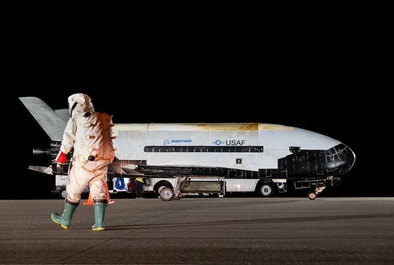
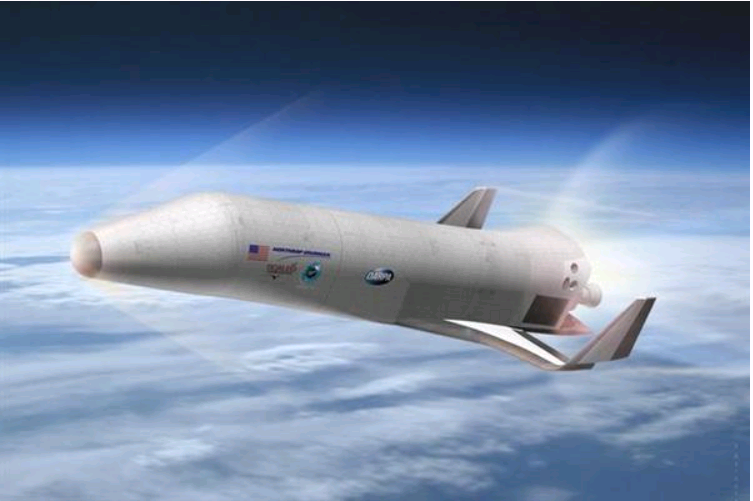
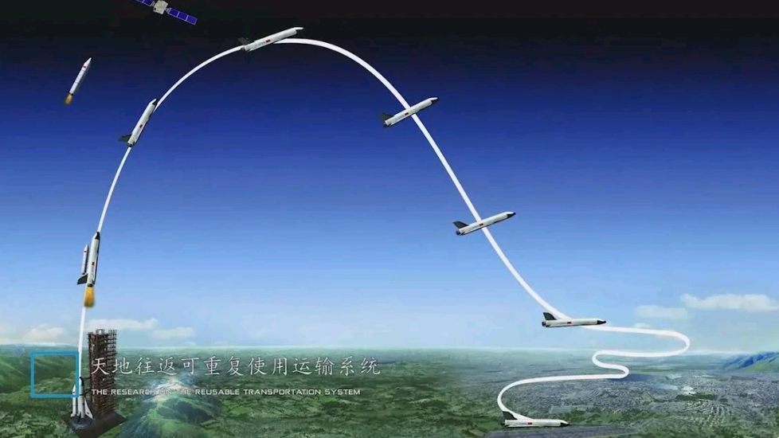
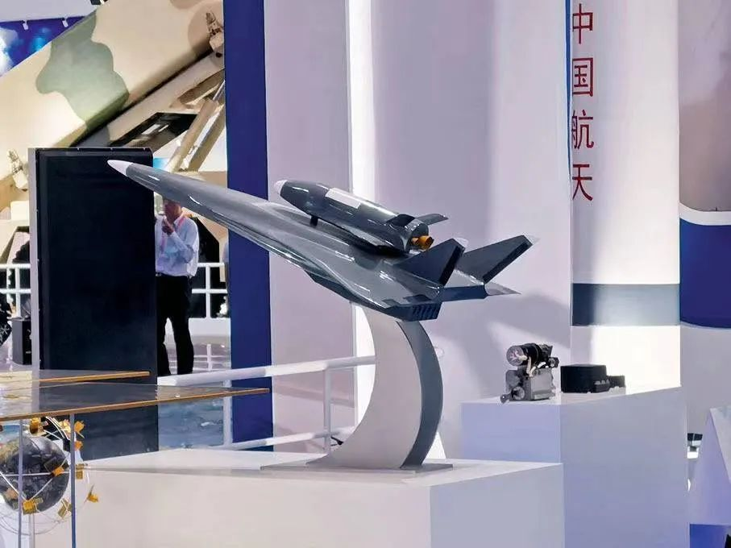

# 在轨飞行276天后，中国“空天飞机”成功着陆，它与美X-37B有很大不同

和以往一样，中国官方8日又发布了一条“字少事大”的消息——“可重复使用试验航天器在轨飞行276天后，成功返回预定着陆场”。此次试验的圆满成功，标志着我国可重复使用航天器技术研究取得重要突破。

“在轨飞行276天”“可重复使用航天器”，以往当这些元素凑到一起的时候，相信大部分熟悉航天的人，第一反应都是——这不是在说美国的X-37B空天飞机嘛。当新闻里的主角换成“中国”，那么这种中国版的“空天飞机”（虽然它还是试验型号，但为称呼方便，姑且就算成打引号的空天飞机吧），与X-37B差别有多大呢？

首先，这组数据能在一定程度上说明双方的技术差距。

_美国X-37B空天飞机_

X-37B的首次太空之行开始于2010年4月22日，着陆于2010年12月3日，累计在轨时间为224天。

相比之下，中国这种可重复使用试验航天器是于2022年8月5日从酒泉卫星发射中心由长征二号F运载火箭成功发射升空，累计在轨时间276天。应该说，首次太空任务就创造了如此优秀的在轨时间纪录，足以证明中国版“空天飞机”在性能和设计上的成功。

但X-37B起步毕竟比我们早了十多年。目前X-37B已经进行了6次太空任务，在轨时间一次比一次长，其中第六次任务的在轨时间长达908天，这是一个相当惊人的数字。应该承认，我们还需要继续努力。

其次，在空天运输飞行器方面，相比X-37B的“一骑绝尘”，中国正在“多条腿走路”。

所谓空天运输飞行器，是一种能够在稠密大气层、临近空间、轨道空间往返飞行的重复使用航天运输系统。这种飞行器集航空、航天技术于一身，既能满足民用运输需求，又能执行军事任务，具有自由进出空间、按需返回地面、可重复使用的典型特点，已成为未来进行大规模空间开发及确保空间优势的关键因素。

_XS-1太空飞机设想图_

实际由美国军方主导的X-37B空天飞机，是当前美国最主要的空天飞行器项目。其实美国之前曾研发了一系列充满想象力的空天飞行器，例如垂直起飞、水平降落的可重复使用XS-1太空飞机项目、单级入轨的“东方快车”项目等，但它们都因为各种原因下马了。

相比之下，公开报道显示，中国发展了多种技术路线的可重复航天器项目。

2020年9月4日，我国在酒泉卫星发射中心成功发射了可重复使用航天器，该航天器在轨飞行2天后，于9月6日成功返回预定着陆场，标志着我国可重复使用航天器技术研究取得重要突破。

2021年7月16日，由中国航天科技集团一院研制的亚轨道重复使用演示验证项目运载器在酒泉卫星发射中心准时点火起飞，按照设定程序完成飞行后，平稳水平着陆于阿拉善右旗机场，首飞任务取得圆满成功。

该亚轨道运载器经过检测和维护后，又于2022年8月26日成功实现重复使用飞行试验，平稳水平着陆于阿拉善右旗机场，此次试验有力推动了我国航天运输技术由一次性使用向重复使用的跨越式发展。

在2021年的珠海航展上，中国航天科工集团还展出了“腾云”空天运输系统模型，这是一种水平起飞和降落的完全可重复使用航天器。发射时，载机驮着航天器从地面机场滑跑起飞，在高空分离后，航天器在自身火箭发动机的推进下进入太空，载机则自行返回降落，航天器完成任务后也能再入大气层滑翔降落。与现有运载火箭相比，这种可完全重复使用的空天飞行器将极大降低发射成本低并提高发射灵活性。

那么问题就来了——为什么美国只有X-37B坚持到最后呢？

答案很简单——由于冷战结束后，美国大幅削减航天项目拨款，偏重太空运输领域的航天器项目纷纷下马，只有X-37B凭借极大的军用潜力幸存下来。或者说，X-37B从研制之初就有浓厚的军用色彩。X-37B的前身是美国空间机动飞行器（SMV）计划，该计划定义为一种小型的、有自主动力的、可重复使用的具备很强轨道机动能力的太空飞机，设计之初就是未来低成本、可灵活进行空间部署的军事航天飞机的一部分。

目前，X-37B在美国空军快速反应能力办公室的主管下执行飞行任务，而一系列飞行任务的控制工作则由科罗拉多州施里弗空军基地第三航天试验中队负责。由此可想见，X-37B虽然也承担部分科研项目，但它更多是承担高度机密的太空军事技术测试任务。

相比之下，中国如今推动的空天运输航天器项目，都是意在为和平利用太空提供更加便捷、廉价的往返方式。它的优点是能水平降落，从而使得飞行乘组返回地面时更安全也更舒适，一旦技术成熟，未来可用于进行亚轨道和地球轨道的太空旅游，甚至可以发展为地球上点对点的人与货物的极速运输。

这种在和平利用太空境界上的差异，或许才是中美研制“空天飞机”领域的最大不同吧。

