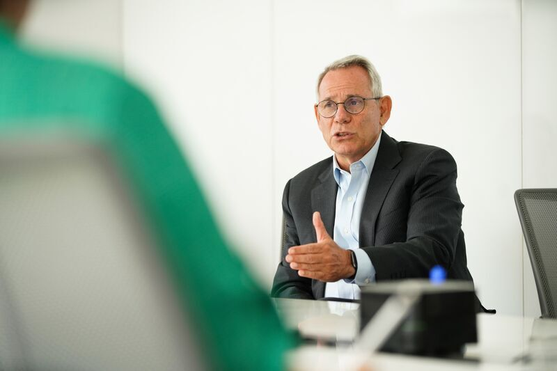

# 外媒：全球最大纸浆生产商正考虑以人民币进行对华贸易，说明一个变化

【环球网报道 记者 朱嘉琪】据彭博社9日报道，全球最大硬木纸浆生产商巴西企业“Suzano
SA”的首席执行官表示，正在考虑以人民币计价向中国出售其产品。报道认为，这进一步表明美元正在失去在大宗商品市场的主导地位。

_全球最大纸浆生产商
“Suzano SA”首席执行官沙尔卡 图源：美媒_

报道称，“Suzano
SA”首席执行官沙尔卡在接受采访时表示，人民币的重要性正在上升，中国一些较小的客户也要求用人民币进行交易。报道补充称，中国是全球大宗商品最大买家，其购买量占到“Suzano
SA”公司所售纸浆的43%。

彭博社认为，虽然美元仍然占据主导地位，但人民币正在从石油到镍等各种交易中被加速使用。沙尔卡称，他相信美元的重要性将下降，但承认尚未出现美元向人民币过渡的“重大转变”。

报道继续提到，沙尔卡称，美中之间日益紧张的关系是该公司的主要担忧，因为这可能会在很长一段时间内抑制纸浆的需求和价格。“我毫不怀疑，中国将在全球市场上变得更加重要，”沙尔卡说，“我个人的看法是，（如果）西方和东方之间进行长期合作会好得多，但我们现在看到的是日益紧张的局势。”

自2010年来，美元一直在中国跨境收支货币占比中稳居首位。但随着全球多国掀起“去美元化”浪潮，以及中国积极推动双边贸易用人民币结算，减少使用美元正成为中国跨境交易中的新气象。今年3月以来，多国接连转向人民币结算。4月26日，阿根廷经济部长马萨宣布，阿根廷将停止使用美元来支付从中国进口的商品，转而使用人民币结算。4月初，马来西亚总理安瓦尔表示，马来西亚央行已经开始与中国讨论，令两国贸易可以用林吉特和人民币结算。事实上，截至目前，已有包括印度尼西亚、伊朗、俄罗斯、德国在内的30多个国家正逐渐在贸易结算或投资中转向使用人民币。人民币的国际朋友圈越来越大，人民币在全球特别是新兴经济体的认可度大幅提升。

