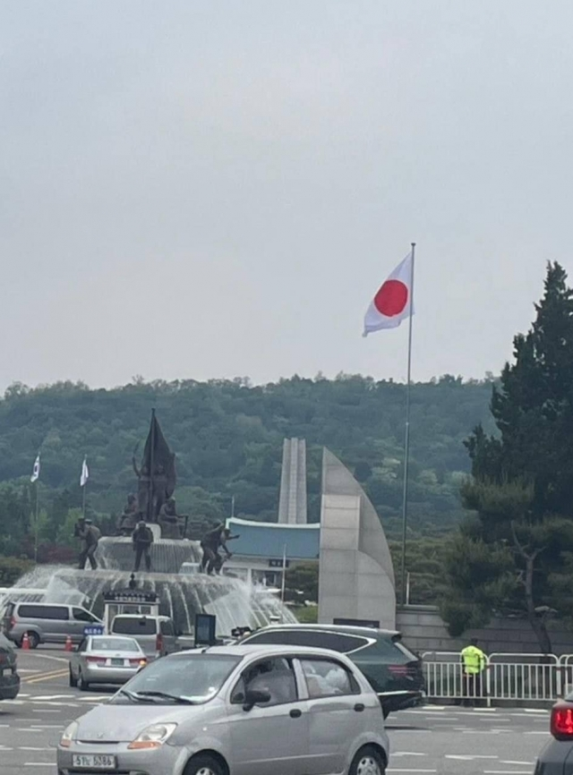
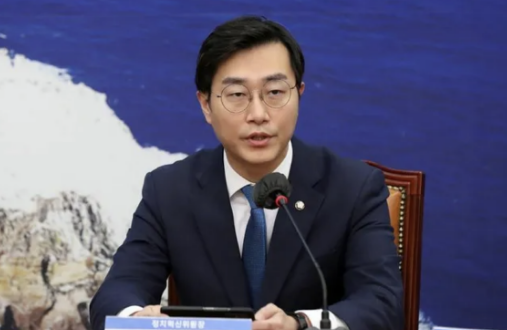

# 岸田访韩，国家公墓显忠院升起日本国旗，在韩国引发争议

【环球网报道】据韩国《朝鲜日报》9日报道，日本首相岸田文雄7日访问韩国时前往韩国国家公墓国立显忠院进行祭拜，当时显忠院入口处升起了日本国旗。这一幕在韩国引发争议，韩国共同民主党最高委员张京泰称，这一幕“实在令人哀叹”。

韩媒称，日本首相岸田文雄7日访问韩国时前往韩国国家公墓国立显忠院进行祭拜，当时显忠院入口处升起了日本国旗。

岸田文雄7日在会见尹锡悦之前先行前往了显忠院参拜，这也是外国领导人访问韩国时的一项惯例。《朝鲜日报》称，在岸田到来当天，显忠院入口处升起了日本国旗。对于这一幕，张京泰在社交媒体脸书上发帖称，“在大韩民国正中央的国立显忠院看到飘扬的日本国旗，我抱着对为韩国独立捐躯的殉国烈士的强烈羞耻”，一幕“实在令人哀叹”。

_韩国共同民主党最高委员张京泰
资料图_

报道称，对于张京泰的抨击，显忠院方面则辩称，每次外国领导人前来时都会升起对应国家的国旗，“升日本国旗是基于这种典礼程序”。

张京泰还提到，尹锡悦在7日与岸田文雄的会谈上称，要摆脱对日外交思维定式，“只因历史问题没有完全得到解决，就不肯为面向未来的合作而踏出一步，这是不可取的”。对于尹锡悦这种言论，张京泰写道，“我，张京泰，在这里明确表示，‘不，我们大韩民国绝对不能（像尹锡悦说的）这样’”。

日本首相岸田文雄7日抵达韩国首尔，展开为期两天的工作访问。韩联社称，韩国总统尹锡悦3月率先访日，岸田文雄对此进行回访，这意味着韩日两国时隔12年重新启动领导人互访的“穿梭外交”。这也是2018年2月时任首相安倍晋三以平昌冬奥会为契机访韩后，日本首相时隔5年多再次访韩。韩国舆论认为，尹锡悦3月已在“二战劳工赔偿问题”上对日本作出大幅让步，这次轮到日本采取相应措施，期待岸田的一份“访韩礼物”。不过，韩日领导人在7日“尹岸会”上的相关表态让许多韩媒颇为失望，认为会谈成果“干瘪”。韩国国内反对“对日开展屈辱外交”的声音一直不断，多个市民团体7日在龙山总统府外举行抗议集会。尹锡悦即将迎来执政一周年，对于其在过去一年里推行的“价值观外交”，韩联社援引专家的话提醒称，美国也会在价值观与实际利益发生冲突时选择实际利益，因此韩国不能一味追求价值观，而让韩中关系变得疏远。

