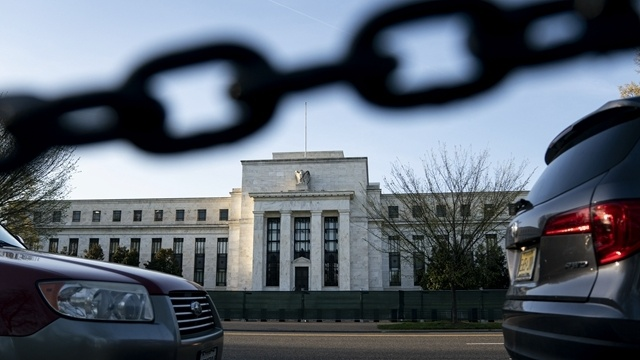

# 意外！经济数据亮眼GDP大幅反弹，人民币为何贬值至7门前

一边是不断扩大的贸易顺差，一边则是加速复苏的GDP数据，但人民币汇率似乎不为所动，反而从一季度的6.7附近一路贬值至6.92左右，再度来到了7门前。

5月9日公布的数据显示，中国以美元计4月出口同比增长8.5%，增速高于预期，但较上月的两位数高增长回落；进口降幅扩大至7.9%。实现贸易顺差902.1亿美元，扩大82.3%。此前，中国首季GDP增长4.5%，大超预期，且各界预计二季度增速有望超出7%。

“最近人民币疲软，部分因为出口商一直不愿出售美元，这导致了自2019年6月以来最大的外汇结算净赤字，年初至今外汇存款也持续增加。美元存款利率自全球金融危机以来首次达到了5%。”巴克莱宏观、外汇策略师张蒙在发给记者的邮件中提及。但她认为，复苏的中国经济和疲软的美元应该会限制人民币贬值空间，甚至助力人民币在未来转强。机构预计第二季度结束时美元/人民币汇率为6.9，然后在2023年底回落至6.7。

**人民币暂时与经济数据脱节**

在岸人民币对美元在北京时间5月9日16:30官方收报6.9275，较上一交易日官方收盘价跌109点。截至同日北京时间18:45，美元/离岸人民币报6.9253。

在GDP大幅反弹的背景下，近期人民币却意外走贬，再度陷入了6.9区间，数据参差不齐和地缘政治扰动或是主因。同时，出口商的行为也造成了汇率的下行压力。

张蒙对第一财经表示，中国出口商囤积美元应收款项的迹象明显，而不将其兑换成人民币。这种行为是受到内地美元存款利率提高的影响。“出口商只兑换足够支付必要开支（如物流和工资）的部分金额。据企业反馈，剩余的金额被存入银行。这一情况在外汇结算数据中得到了反映。”

“3月，银行代表客户进行的外汇收款达到了2980亿美元，这略高于其12个月移动平均水平（2940亿美元），远高于2019年的月均水平（2230亿美元）。然而，中国企业的外汇售出/收款比率降至60.5%，是过去一年中最低的水平。因此，我们认为6.95是美元/人民币的首个阻力水平，因为出口商可能会在这个水平上出售其美元持仓。”

在外汇存款高增的同时，中国出现了令人瞩目的贸易逆差，这似乎存在一定的相关性。

4月13日，中国公布的出口数据大超预期。3月中国出口增速达14.8%，大幅好于市场预期的-5.1%，尤其难得的是，同期韩国出口（-13.6%）、越南出口（-13.2%）仍然保持弱势；中国以美元计4月出口同比增长8.5%，增速高于预期；进口降幅扩大至7.9%。实现贸易顺差902.1亿美元，扩大82.3%。

此外，就中国进口商方面来看，3月银行代客外汇支付达到2870亿美元，这超过了其12个月移动平均水平（2830亿美元），仍远高于2019年的月均水平（2190亿美元）。进口商的购汇/支付比率保持在68.2%，远高于2021年的平均水平（63.5%）。这导致外汇市场上出现了大量的美元需求。

事实上，虽然贸易顺差被认为是推动人民币走强的真金白银，但关键在于这些出口创汇有多少被转换为人民币，否则并不会对市场构成推动。数据显示，净外汇结算赤字对第二季度的人民币施加压力，赤字幅度也达到了2019年6月以来的最大值。企业的套期保值比例从2022年的月均24%，下降至3月份的21%，增加了人民币汇率的压力。

**进一步贬值空间有限**

但这种情况可能会迅速转变。机构认为，外汇存款在今年以来一直在增长，如果动量转变，这些存款的下降可能会迅速使美元对人民币汇率走低。

“实际上，我们的外汇存款敏感性分析表明，人民币因素往往比利率差异具有更强的解释力。美元/人民币汇率下降1个百分点，可能会导致外汇存款在一个月内下降80亿美元。我们认为这更可能是下半年的故事，更强的经济和更高的收益率或推动人民币重新走强。”巴克莱认为。

此外，机构也并不认为在港上市的中资企业股息支付需求会对人民币构成太大的不利影响。机构估计，今年将支付总额为800亿美元的股息，其中约70%将在7月和8月进行。企业可能会卖出离岸人民币来购买美元或港币以支付股息，但压力应该是温和的，原因在于——总体股息规模并不惊人；公司在利用外汇存款方面有其他选择。那些存放在海外银行的美元存款可能是首选。2021年和2022年7月至8月的总体美元存款下降分别为200亿美元和290亿美元。

二季度，经济数据的持续复苏可能也将提供情绪支撑。第一财经记者也发现，多家国际投行纷纷上调中国全年GDP增速预测至6%以上。一季度，中国服务业强劲复苏，出口和贸易顺差大超预期，外加各界此前似乎低估了低基数的效应，这也解释了这一波预测的上调。

各界认为，在更低基数的影响下，二季度GDP增速或达7%以上。

“二季度相较一季度而言是一个‘甜蜜点’（sweetspot），原因在于去年的基数更低。由于去年疫情导致基数大幅下降，加上今年线下服务业持续强劲复苏，我们预计第二季度的GDP同比增长将进一步明显反弹。我们维持二季度同比GDP增长预测为7.6％，但我们认为风险偏向上行。”野村中国首席经济学家陆挺此前告诉记者。

不过，二季度开始，复苏质量将迎来考验，例如，内需反弹的可持续性和幅度仍待观察，结构性就业问题更加凸显；地产行业逐步走出“谷底”，销售“回暖”传导到投资端还需等待；考虑到信贷增量的空间和节奏的问题，后续自发融资需求的改善在二季度或仍偏慢。

据记者了解，目前投资者对中国宏观经济也存在一些疑问，例如，GDP和信贷强劲增长，而PMI和CPI环比走弱。最近，假期消费推动小额消费上升，但由零售贷款支持的大笔消费看起来不算强劲，消费全面复苏仍需时间，可能要到三、四季度，这取决于更稳定的就业市场和资本市场增强财富效应，进而带动消费者信心复苏。

汇率永远是相对的，因而海外政策的变化也将对人民币走势产生关键影响。

美联储上周四（4日）凌晨宣布将利率上调25BP至5.00%~5.25%区间。更关键的是，声明中删除了对未来加息的描述，暗示6月可能暂停加息。不过美联储主席鲍威尔对抗击通胀的任务毫不松口，亦坚定地否定了近期降息的可能性。

随后上周五的数据显示，美国非农就业岗位4月份增加了25.3万，失业率降至3.4%，显示就业市场在银行业动荡、利率上升和高通胀的情况下依然坚挺。这也导致美联储加息前景存在变数。鲍威尔此前强调，加息将是数据依赖的。

目前，美国的数据也存在一些矛盾的信息。“ISM制造业和服务业调查数据都在下降，美国消费者和小企业信心调查也显示疲软，这些软数据预示着美国经济进入衰退的预兆一致。然而，硬数据（例如就业数据）并未将这种恶化反映到同样的程度，需要继续观望。”渣打全球首席策略师罗伯逊（Eric
Robertsen）对记者表示。

未来，如何权衡抗击通胀和维持金融稳定，也将给美联储提出挑战。近期，美联储最新公布的信贷调查（SLOOS）显示，主要银行在第一季度收紧信贷标准，而消费者和企业的贷款需求也在持续下降。随着美联储持续加息以及银行危机的蔓延，这一情况或将延续，但调查并不认为在短时间内将发生信贷紧缩。

美元指数维持在101附近。10日晚间即将公布的美国CPI可能会影响市场，各界预计4月整体数据将稳定在年化5%，而同期核心通胀率预计将从年化5.6%收窄至5.5%。

“截至4月28日，美元指数实际值是101.66，我们的模型评估结果是高估。未来美元指数将与欧元维持一个较为平衡的关系。日元、英镑、澳大利亚元的表现不能被忽视，它们的份额虽小，但积小成多，短期内的作用是有一定分量的。”某大行国际业务专家朱延桦告诉记者。

他也提及，人民币汇率经过去年第四季度与今年第一季度创纪录的高波动之后渐渐平复下来。“这种平复可以视作为下一次动荡前的窗口期。横盘近2个月，从时间层面来看还稍欠一些。需要警惕下半年，方向择明之后波动率的再次放大。”

