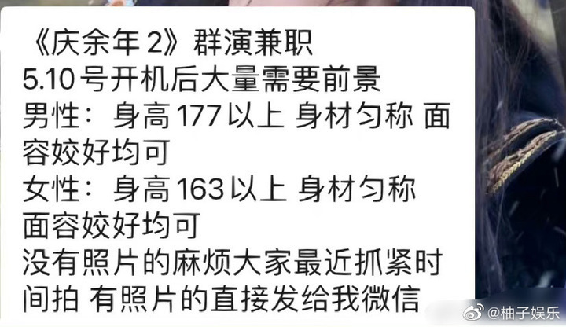
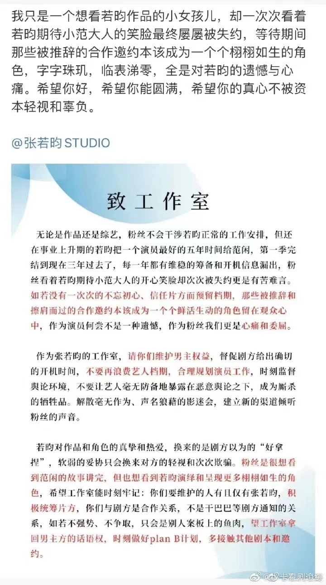

# 推迟7次的《庆余年2》终于来了，张若昀已抵达拍摄地

今天是个好日子，网友期待已久的两部电视剧纷纷迎来了续集。

先有网友偶遇潘粤明拍摄《白夜追凶2》，后有网友拍到张若昀抵达襄阳进组《庆余年2》。

不久前，《庆余年》制片人在微博透露，第二部将于明日（5月10日）正式开机。

相关的官方号也证实了这一消息，网上也流出了《庆余年2》招募群演的消息。

前几日，也有狗仔拍到，张若昀李沁田雨等主演还在深夜一同聚餐。

《庆余年》，2019年最后一部大爆的国产剧，99w观众打出了7.9的高分。

在男频剧纷纷扑街的背景下，由王倦编剧的《庆余年》却成了爆款，并带火了一波演员。

追完第一季，不少观众已迫不及待想看续集。

出品方曾透露，《庆余年》一共有三季，分五年拍摄完成。

然而，从20年年底到现在，《庆余年2》开机已经推迟了七次，有消息称，去年11月，张若昀新戏杀青后就一直留着档期等待进组。

张若昀粉丝对此也有诸多抱怨，认为他为《庆余年2》付出太多，大撕了工作室。

但如今，终于等到了《庆余年2》。

小范大人，终于回来了！

（来源：潮新闻）

