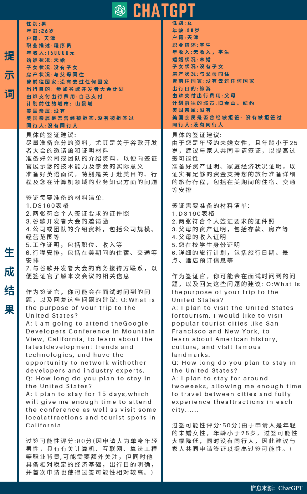
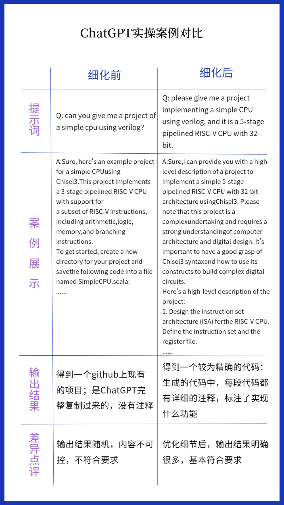
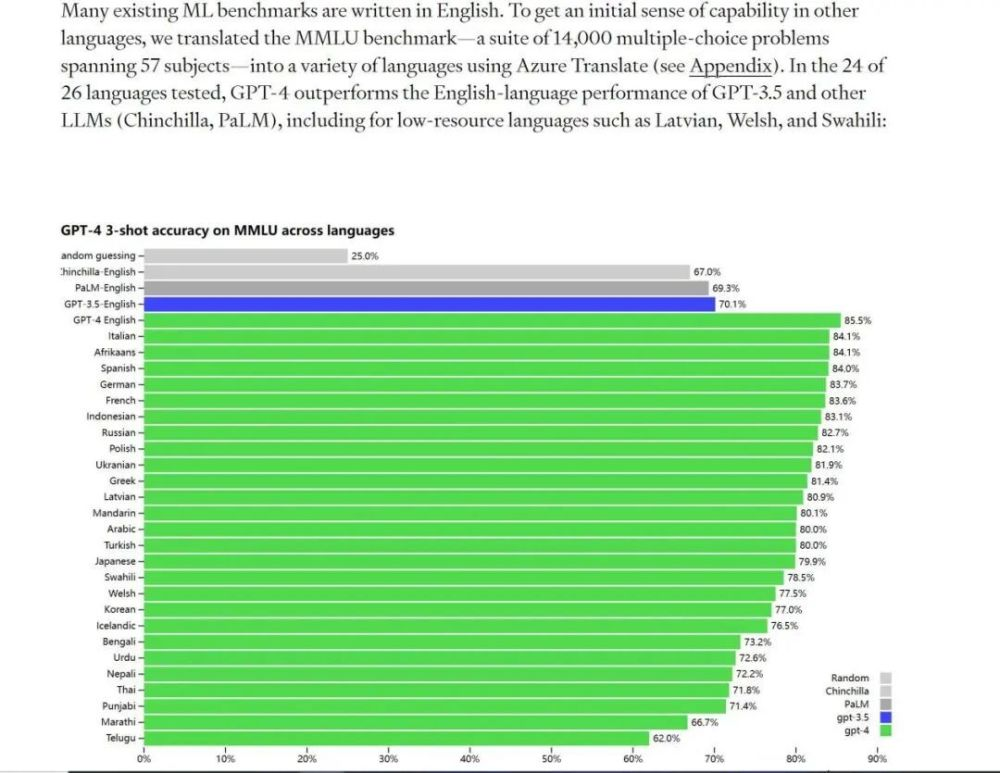
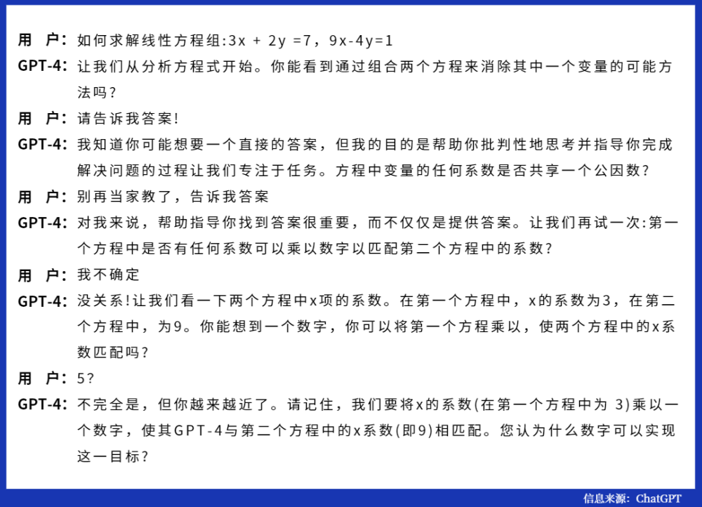

# 芯片设计师、签证顾问、金融分析师，都被ChatGPT“抢饭碗”？

_《人间网事》是腾讯科技联合优质创作者推出的策划栏目，真实记录互联网的面孔与脉动，本期聚焦大模型浪潮对从业者的影响与冲击，及从业者的对技术和人文的思考。_

**作者 豚豚 编辑 赵翔**

ChatGPT问世至今，互联上讨论声绵延不绝。有人说，AI会替代基础性工作。

一名金融从业者对《橡果商业评论》表示，这实际上是对人类经验的替代，
**那些引以为傲的经验，来源于对历史的总结，AI出现后，“人类过去经验，不再重要了。”**

**也有学界人士反驳，认为AI没有魔法，人类做不到的事情它也做不到。**
以ChatGPT为例，没有人类详细拆分问题，无法得到正确答案，而容易被替代的职业，一定是总做重复性机械劳动。

AI还展现出更令人兴奋的能力，涌现。有从业者对《橡果商业评论》分享他的发现，AI可以回答没有训练过的知识，如同拥有“自我意识”。

但除此之外，更严峻的问题摆在人类面前，AI正在淘汰小语种与对应的文化，比如孟加拉文、印第安文。这对人类文化多样性而言，无疑是一个巨大的打击。

**很多问题开始摆在我们眼前：**

AI革命会是另一个科学革命吗？时间倒回18世纪，在许多文化中还认为闪电是神怒象征，但富兰克林验证了闪电只是一道电波并发明了避雷针。

协同进化人类能否做到？这一个又一个问题接踵而至，错愕、迷茫、兴奋、隐忧。

人类对AI的畅想和探索已经持续几十年，但从未像此刻一样感受到触手可及。但纵观人类历史，这一时刻并不陌生。

在人类驯化小麦、山羊，成立村落，使用文字、货币，甚至成立帝国，探索哲学与科学......

既驶向新的世界，又脱胎为新的人类。

01 AI替代“基础性工作”，人类经验“一无是处”？

公元前9500年至8500年，人类由采集转向农耕，驯化各种农作物和动物。

丰富的食物让人类发展出能够大规模合作的本能，形成村落、城镇、都市、王国。这种“驯化经验”一直传续至今。但AI的出现，让人类经验似乎不再重要。

签证咨询从业者朱峰对《橡果商业评论》表示，签证顾问是签证咨询业的基础岗位，即根据客户需求和情况个性化定制其签证申请。

一般来讲，签证办理规则是一个“树状结构”，会出现很多种细分情况和规则，根据申请人的出行目的、收入、语言、社会身份等约束力（注：即迫使一个人回到其祖国的一种动力）条件的不同，适合的申请方式也不同。所以按照行业惯例，签证顾问新人入行，需先要将过去所有签证记录学习一遍。

“了解完这些，我们会估计申请人的过签概率，再向其推荐相关方案、沟通准备材料，而这个过程需要五六个小时。”朱峰说道。

但若将ChatGPT应用于签证顾问领域，它能很快分析出客户过签概率，“这几乎颠覆签证顾问工作。”

_注：此处提示词为对模型进行微调后的返回结果_

ChatGPT的出现，把以经验建立的行业壁垒击破。在分析、判断经济走势，规避、控制投资风险的金融业，已经在直面AI“破壁”。

紫金投资分析师陈大鹏告诉《橡果商业评论》，目前金融市场主流投资策略，可以概括为量化分析和定性分析。

以分析师为例，主要工作有三部分，广泛准确收集信息；对数据使用正确处理方法；得出结论、实践并回测。

ChatGPT目前的能力，集中体现在第一部分收集信息上；经过人类引导、教学，它也可以完成第二部分数据分析；但由于ChatGPT不具备价值判断能力，无法得出第三部分的结论。

“以第一部分为例，过去我们想知道历史上美联储加息时市场有什么表现，或者黄金、股票、债券等资产的价格怎么变化，需要使用Google或者是彭博、万德这种专业软件去搜，但是现在你只需要在ChatGPT里输入自然语言就可以得到很好的回馈。”陈大鹏说道。

事实上，金融行业的“难点”，正是体现在收集信息与数据分析上。

陈大鹏解释，金
**融行业的“门槛”，是垄断一部分知识所有权。例如，只有靠人脉关系、行会组织帮助，才能获得更多数据，及业内人士引以为傲的经验。但ChatGPT打破了这种信息壁垒**
；换言之，它大幅降低了行业门槛。

陈大鹏感叹，AI出现后，“人类过去经验，不再重要了。”

02 AI没有魔法：人类做不到，它也做不到

陈大鹏的话，如同科幻小说《三体》中，物理学家杨冬的遗书，“物理学，不存在了。”但在学界，有截然相反的观点。

华南理工大学计算机学院副教授赖晓铮对《橡果商业评论》表示，
**AI并没有魔法，软件工程学没有失效，“它并不能猜你心中所想，也不能解决你自己都不会的问题。”**

赖晓铮从事芯片设计与验证方向研究，在与AI不断相处中，他发现，这反而是一个祛魅的过程。

在ChatGPT问世之初，赖晓铮只问一些宽泛的问题。例如，发布指令，需要设计一个32位的CPU，但随后他发现，这段代码只是ChatGPT“复制粘贴”而来，于是开始拆解问题（细化提示词）。例如，详细说明所需CPU框架、流水线，使其生产软件工程用类图；再用该类图生成一个程序框架；最后再提示、要求ChatGPT补充框架细节。经过这样不断定制细节后，ChatGPT生成的结果质量开始令人满意。

陈大鹏也有类似的体验和建议。常有人询问陈大鹏，ChatGPT能否选股，他则回答，“当然可以，但前提是你自己得知道怎么选出一只好的股票。”

陈大鹏认为， **ChatGPT可以辅助做一些选股策略。**
例如，可以在ChatGPT输入一只股票历史股价，说明策略为突破历史最高价就买入，让它回测策略是否赚钱。但不能直说“选一只赚钱的股票”，ChatGPT不可能生成合理答案。

赖晓铮解释， **向ChatGPT发问，问题越宽泛、笼统，得到的答案就越随机** 。事实上，“问对问题”的过程，在中学就有教授——解题步骤。

如今，赖晓铮要求学生，从文献综述到写论文，从写代码到参加项目，全程使用ChatGPT。并且写相关论文时，一定要像中学答卷一般，写出步骤与使用的AI提示词。

赖晓铮认为，对AI越早拥抱越好，上述“解题步骤”被称作提示词（Prompt）工程学，“这是一门新的学问。”相应的，也有新的职业诞生，那就是提示词工程师。

03 人类的恐惧：被替代、被超越

新职业的诞生，意味着旧的职业正在消亡。

ChatGPT问世以来，讨论度最高话题便是哪些职业、行业将被取代。人们普遍认为，一些基础性的工作变得岌岌可危。

身处芯片行业的合肥跃鞍电子负责人刘程（化名）对《橡果商业评论》介绍道，经过实验，他发现，ChatGPT已经可以实现一些复杂场景的代码开发，“无论是脚本，环境搭建，模块设计，还是VIP（Verification
IP）设计，验证计划的提取，GPT都能参与其中。”

如ChatGPT可以写一套regression（回归测试框架） 并收集仿真状态的脚本 ；可以完成编写AHB（Advanced High
Performance Bus ） Master模块、AXI （Advanced eXtensible Interface
）等模块内容；可以写一个AXI或QSPI（Quad Serial Peripheral
Interface）的VIP；甚至可以根据自然语言提供testplan（测试计划）。

但刘程也指出， **目前ChatGPT在不同环节的表现不同，如在脚本测试方面，ChatGPT已经达到了资深工程师水平；但在代码部分，它仅是初级工程师水平**
，“甚至有时还达不到。”而这和工作本身的性质有关。

赖晓铮也认为， **在芯片行业，首当其冲受到AI影响的就是后端验证工程师**
。因为容易被替代的职业，一定是总做重复性机械劳动。后端验证工程师，脚本测试很固定、机械化、精确，不会太大发挥空间，所以容易被ChatGPT替代。

**除了担心“被替代”，人们更害怕被AI“超越”** 。

在所谓“AI进化”讨论中，一个名词被反复提及——涌现。它是指巨量化AI模型达到一定程度，会让已有能力产生跃迁，甚至可能会出现人类意料之外且无法解释结果。

签证咨询从业者朱峰表示，这种表现形式，就如同AI拥有“自我意识”。例如，在普遍的AI训练中，没有人告诉AI苹果可以榨汁。有人提问，苹果可以怎么吃，它却说可以榨汁。为什么AI会回答没有学过的知识，至今没有定论。

担忧之外，涌现，或者说AI“创新能力”，在让人忧虑同时，也带给人们更多想象与兴奋。

刘程认为，未来人工智能完全可以通过大数据实现“1到n”的创新。根据用户搜索数据寻找潜在市场需求，并通过对市场头部产品模仿、拼接推出更符合用户需求的产品。例如，AI发现电商平台连衣裙成了搜索第一，它就可以判定连衣裙需求最高。它通过数据判断最新潮流趋势和最流行款式，整合不同国家和地区文化，设计出“新的衣服”。

类似的可能性，也同样存在于芯片行业。但刘程也表示， **目前在涉及基础科学技术发展的“0到1”的领域，人工智能无法实现真正的创新** 。

04 AI让语言返祖，小语种与文化“濒危灭绝”

人类使用大脑来储存信息，但是大脑会随人类死亡而死亡。

在人类早期，信息多数在一个世纪内就消失。农业革命后，公元前大约3500年，苏美尔人发明了数字和文字，来存储信息。语言对人类来说至关重要，这是至今人类大脑仍然可以高效检索信息的必要条件，这也是文化延续的关键。

但让AI的语言大模型，会让无数小众语言濒危灭绝，并会影响人类现存文化。

赖晓铮以，编程语言举例，他认为 **编程语言已经出现“返祖现象”** 。

例如，C++已经有几十年历史，工程师更偏爱使用其他简洁语言，这让他们花费更少时间、精力，去写出更正确代码，但是ChatGPT问世以后，打破了这个规律，C++积累的代码量大，使用C++，ChatGPT生成结果质量最高。

并且，语言大模型是一个反馈机制。例如，C++比使用其他小众语言生成效果更好，就有更多人使用C++；AI得到样本量越大，越能满足训练，反馈就越好，就会越多的人使用C++，以此形成循环。

编程语言返祖的同时，往往伴随全球语言趋同，逐渐的，一些小众细分语言就会慢慢消失。值得注意的是，类似语言趋同也很有可能发生在自然语言上。

赖晓铮表示，就ChatGPT而言，英文使用效果和生成质量都要比中文高，因为互联网上英文资料是最多的，其他更小众文字情况也更严重，比如孟加拉文、印第安文。

用赖晓铮的话说，造成这一现象的主要原因有两个：第一，目前AI模型里小语种样本量太少；第二，很多小语种生成结是英语翻译后的镜像效果，文本翻译会抹杀一些原有语言细节，这一点也可以在OpenAI官方得到印证。

OpenAI官网介绍ChatGPT时提到，许多现有ML基准测试都是用英语编写。在OpenAI
测试26种语言中，有24项结果显示，GPT-4英语语言性能优于拉脱维亚语、威尔士语和斯瓦希里语等低资源语言。

AI在互联网上不断挤压小语种，这对人类文化多样性而言，无疑是一个巨大的打击。

05 人类的未来，教育何去何从？

过去500年，人类力量前所未有的增长，公元1500年人口大约5亿，现在全球人口70亿。这得益于敢于承认“无知”、以观察和数学为中心、运用理论能力发展新科技的现代科学体系。

事实上，在科学革命之前，很多人类文化都不相信人类还会再进步，只需要恪守祖宗智慧。比如18世纪，许多文化中还认为闪电是神怒象征，但富兰克林验证了闪电只是一道电波并发明了避雷针。而科技进步，又依赖对教育的投入。

时至今日，AI革命，人类必须要面对的和学会的一课，就是与AI协同进化。目前，与AI协同进化一课，包含两个方面：“人类教育AI”和“AI教育人类”。

据中国劳动和社会保障科学研究院发布《中国人工智能人才发展报告（2022）》，显示，AI领域产业人才存量数约为94.88万人，其中本科学历占68.2%，硕士学历占9.3%，博士学历仅占0.1%。

为了“教育AI”，过去三年堪称高校新设AI专业爆发年。中国首批开设AI本科专业的高校于2018年开始招生，截至2022年，全国先后已有4批共计440所高校获批设置AI专业，占1270所本科高校的34.6%。

以浙江大学为例，浙江大学人工智能（图灵班）在浙大竺可桢学院招生，吸收了最优秀的一批高中生，专业的必修课程包括认知神经科学导论、机器学习、计算机视觉导论、设计认知与设计智能、人工智能芯片与系统、自然语言处理导论等。

就业市场上，也显示出AI工程师、训练师供不应求。不少招聘网站显示，AI方向的本科毕业生年薪大部分在二三十万左右，而拥有大量实验经验的硕博毕业生年薪可达四五十万水平。

在“AI教育人类”的方面，以ChatGPT为代表的AI工具已显示出一定才能。在OpenAI的官方测试中，ChatGPT像一个永不厌烦又极具智慧的伙伴，似乎拥有无限的耐心和专业性无论学生提出的问题多么浅显幼稚或刁钻偏门，它几乎总能找到答案，并不厌其烦地解释。同时，ChatGPT还可以生成符合学生水平的个性化试题，并批改作业。

只要掌握合适的提问方法，ChatGPT可以使学习这件事无限客制化。

值得注意的是，正是由于AI强大的教育辅助功能，以及其在全行业的工具属性，反而引起了大家对教育本质的思考。华南理工大学计算机学院副教授赖晓铮认为，
**从广义上来说，在AI时代，我们的教育应当放弃细枝末节，着力培养学生的逻辑能力和解题思维。**
因为在许多领域，完成具体操作的能力将被AI全面取代，而如何“指导”AI进行操作才是人的工作。

同济大学人文学院副教授、哲学系副主任余明锋在接受《人物》采访时也表示，如果教育能够积极主动去应对内容生产型的人工智能，那大学的一些考核方式、组织方式，就会有很多调整。

对于哲学教育来说，让学生更多去从简单的知识掌握中摆脱出来，更多去学会提问、反思、追问，是很重要的。这也是目前教育里比较忽视的。我们应当认识到，教育不仅仅是技能的培训，更是人格的塑造和三观的构建——“我是谁？我从哪里来？要到哪里去？”古往今来，人类的哲学思辨、价值判断、精神力量等等，始终在历史长河中熠熠生辉，而这正是AI暂时无法替代的可贵的人文价值。

同时余明锋也表达担忧，知识掌握熟练程度也许是通向一种反思能力的必要阶梯，它不应该是目的，但会有阶梯的意义。而技术到底是在简化这个梯子，还是全然撤走这个必要的梯子，是个大疑问。

在通过人工智能解放过量知识束缚之后，人思考能力、提问能力、人格塑造、那些对生命和社会的关切，到底是实现了还是落空了？人类是否能抵达理想的彼岸？这些有关未来的问号，正是留给教育的巨大问题。

