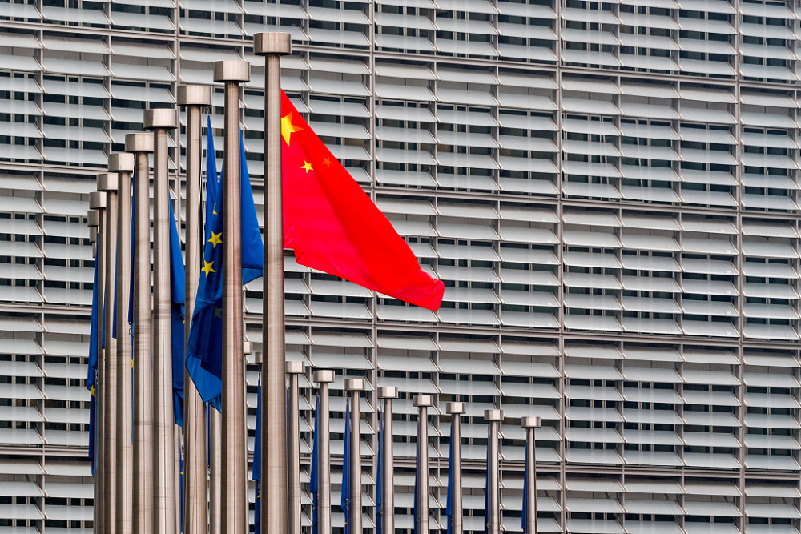

# 英媒炒欧盟将讨论是否制裁中企，专家：若实施将破坏双方互信合作

【环球时报驻德国特约记者青木环球时报记者;赵觉珵刘欣环球时报特约记者柳玉鹏】英国《金融时报》7日披露称，自俄乌冲突爆发以来，欧盟近日首次提出对7家中国企业进行制裁，理由是这些企业向俄罗斯出售的设备可能被用作军事用途。8日接受《环球时报》记者采访的专家认为，在中欧关系回暖的当下，相关做法如果付诸实施，将严重破坏双方互信与合作。

_资料图_

《金融时报》援引其记者看到的文件称，上述7家中国企业已被列入一份新制裁名单，欧盟成员国本周将就该名单进行讨论。法新社8日称，欧盟委员会建议停止向名单上的中国企业出口敏感技术。欧盟委员会的制裁提案宣称：“在俄罗斯军方和工业综合体支持俄对乌军事行动的过程中，电子元器件的应用发挥了关键促进作用。鉴于此，将为俄罗斯军工综合体开发、生产和供应电子元器件的特定俄罗斯实体，以及涉及规避贸易限制的第三国的某些其他实体囊括在（制裁范围）内，是合适的举措。”

《金融时报》称，名单上的两家总部位于中国内地的公司——三合成半导体和金派科技——此前已被美国制裁。此外，名单上还包括5家总部设在香港的公司，包括同样被美国财政部制裁的信诺电子科技有限公司和希舸电子技术有限公司。除7家中国公司外，欧盟的新制裁名单还包括两家阿联酋公司和一家亚美尼亚公司。布鲁塞尔还提议对一些参与为俄罗斯制造和供应无人机的伊朗公司实施制裁。

德国《柏林日报》8日报道称，到目前为止，欧盟一直避免制裁中国，因为没有具体证据表明北京在武器和战争科技方面支持莫斯科。但这种观点似乎在欧盟委员会内部发生了变化。报道称，针对中国公司的措施将明显加剧欧盟与北京之间的紧张关系，并可能导致反制裁。俄罗斯“今日政治网”8日援引俄学者奥列琴科的话称，西方媒体关于欧盟可能对中国公司实施制裁的消息是宣传的一部分，没有实际依据，“而且与中国矛盾升级不符合欧盟的利益”。他表示，中国的地理位置及其在国际舞台上的行动几乎不影响欧盟利益，而美国试图以任何方式建立反华联盟。奥列琴科说：“欧洲是否会这样做，我对此表示怀疑。欧盟内部不会有统一的立场。”

中国国际问题研究院欧洲研究所所长崔洪建8日告诉《环球时报》记者，部分欧洲政客受到美国影响，试图模仿美国的一些做法，例如华盛顿在俄乌冲突发生后频繁采用的单边制裁行为，这对中欧关系是不利的。崔洪建说，上述情况也体现出欧盟对华政策的复杂性，一方面布鲁塞尔希望重启与中国的交流合作，另一方面仍在强调所谓的安全因素，对华采取强硬姿态。

崔洪建认为，乌克兰危机是当前中欧对话沟通中的一个重要内容，中欧双方在劝和促谈方面是可以开展合作的，在维护联合国宪章宗旨和原则、避免出现核危机、推动人道主义救援等领域均有一定共识。未来，欧盟在乌克兰问题上应该更聚焦于与中国合作，而不是跟着美国走。

德国电视一台8日引述中国外交部发言人汪文斌在回答相关提问时的回应称：“我们敦促欧方不要走上错误道路，否则中方必将坚定维护自身合理合法权益。”

