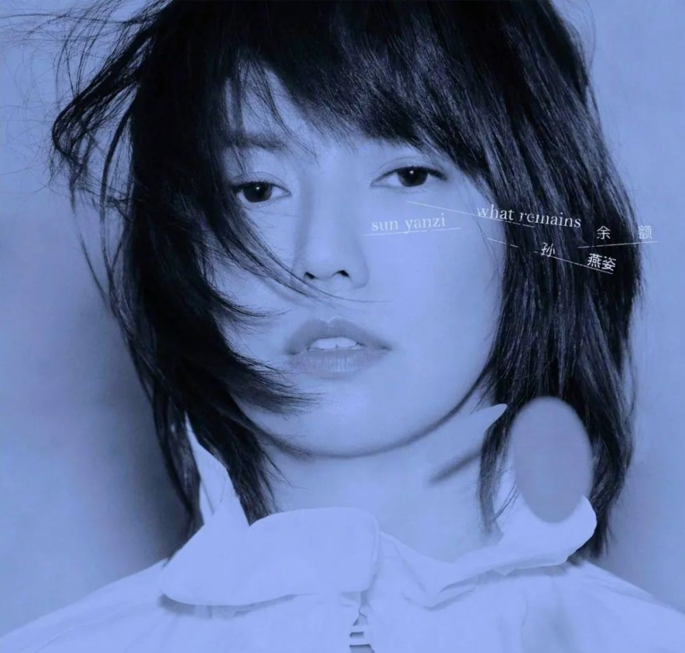
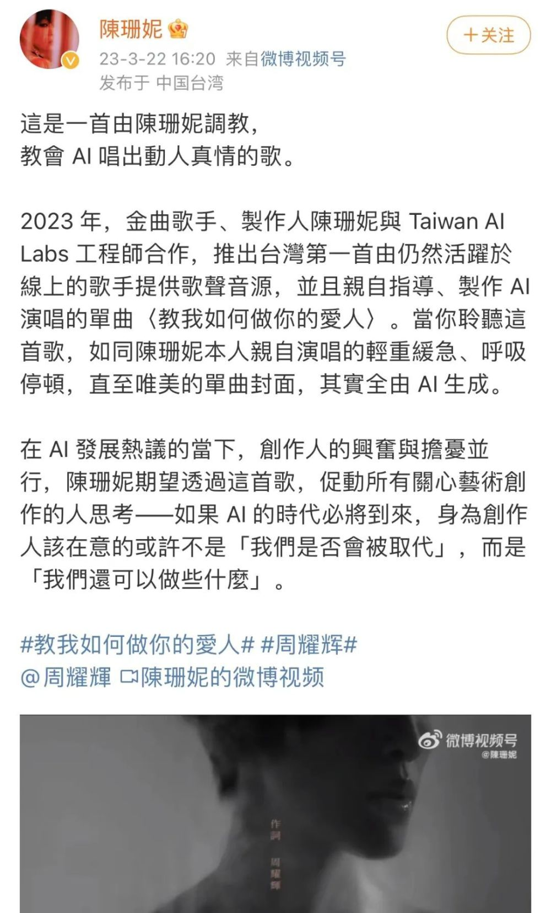

# 这个孙燕姿，让人好害怕

**作者 | 古月一刀**

如果问华语乐坛近期产量最高的歌手是谁，“AI孙燕姿”一定有姓名。

在B站上搜索“AI孙燕姿”，便是无穷无尽的翻唱视频。

里面既有听众们耳熟能详的《一直很安静》《岁月神偷》《红豆》，也有令人哭笑不得的《好汉歌》《火红的萨日朗》《朝你大胯捏一把》。

AI技术加持下的孙燕姿，各种曲风皆不在话下。与以往“鬼畜视频”里的那种怪异调音不同，此类音频极大地保留了孙燕姿本人的声音特质，在一些作品中甚至能达到以假乱真的程度。

_孙燕姿_

除了“AI孙燕姿”，周杰伦、王力宏、邓紫棋、陈奕迅等歌手也出现了大批AI分身。他们彼此翻唱着对方的歌，无须授权，无须付费。在这里，音乐圈似乎率先迈入了乌托邦。

如果说夸张的“鬼畜创作”只是博听众们一笑，歌手们还能勉强接受的话，那么现在的“AI创作”则实实在在地让他们感到了恐慌。

是福，是祸？这一波势不可挡的AI浪潮，究竟该以怎样的姿态面对？继程序员、秘书、插画师、模特等职业之后，歌手们也不得不开始思考了。

01

柯南的变声器

“UP主”子鱼（化名），虽然至今只做了4个“AI孙燕姿”的音频，但总播放数已经超过了150万次。其中仅《下雨天》单曲就超过了100万次，收藏人数接近2万人。

视频中，诸如“开口跪”“一模一样”“这不是原唱？”等弹幕比比皆是，不少网友震惊于AI技术已经发展到如此地步。

_网友震惊于AI技术的发展_

子鱼之前也做过“AI周杰伦”“AI陶喆”等视频，但对比下来，效果都远远不如“AI孙燕姿”。

“这可能与孙燕姿本身的声音辨识度有关，吐字相对清晰，音色有一定的颗粒感，气息使用也自成一派，训练出的AI模型贴合了这样的特质，所以让人感觉像。”他说。

子鱼告诉我，比起那些“鬼畜区”的大佬，他的技术还很稚嫩，都是在网上看视频一步步自学的，核心就是开源项目So-vits-svc（以下简称Sovits）的使用。

这个Sovits的作用，就等同于柯南脖子上的“蝴蝶结变声器”，即把一个音色变成另一个音色，这也是做“AI歌手”的关键。

_名侦探柯南_

根据Github上的介绍，目前这个项目已经迭代到了4.0版本。相较于以往VITS、soft-
vc、VISinger2等项目，Sovits的使用大大简化，仅凭数段音频就可训练出用户想要的声学模型。

当然，这个音频有一些特殊的要求。

比如，它得是“干声”。在一首歌中，它就是去掉乐器、伴奏、混响、和声后剩下的“原始声音”。

再比如，它得训练材料得足够多。“在4.0版本里，想完成一首惟妙惟肖的作品，最起码要有2小时的‘干声’材料打底。”子鱼说。

在歌曲上，为了让AI的唱腔更加游刃有余，训练者还必须收集歌手在各个音调中的“干声”表现。“所以一般而言，音域广的歌手，ta的AI作品会更像一些。”

这些特殊的要求，如果单靠创作者自己找，实际上也很难完成。但因为有很多网友分享了自己整合的歌手“干声”材料，上传到网上让感兴趣的网友们自行下载，这大大降低了Sovits的使用门槛。

子鱼最初使用的就是这些整合包，让他很快训练出了“AI孙燕姿”的声音模型。后面只要用这个模型去替换掉原本歌曲的干声即可，熟手的话，整个过程不超过2小时。

_孙燕姿_

在训练过程中，子鱼后面也掌握了正常的使用方法，即便不用整合包，他自己也能通过软件去筛出一首成品歌曲的“干声”，以一首歌约3分钟为例，只要筛40首歌，就能获得足够时长的“干声”材料。

“当然了，由于算法的局限以及材料的质量高低，很多AI歌手的表现还不算完美。但这些通过补充更多高质量的材料以及后期的修音，可以一定程度地解决这些问题。”

子鱼私底下训练出过自己的AI模型，他用自己的声音替换了许多歌曲，英文的，日文的，都很轻松地兼容了。

“第一次听到自己声音的时候，起了满身的鸡皮疙瘩，好玩的同时也感到一丝恐惧。”子鱼说。

02

在谁的手上

感到恐惧的远不止子鱼一人，那些首当其冲的歌手们更是如此。

最近，女歌手陈珊妮在社交媒体上自曝，她在3月14日发布的新歌《教我如何做你的爱人》，实际上是“AI陈珊妮”唱的。

_陈珊妮自爆其新歌由“AI陈珊妮”演唱_

消息一出，音乐圈无不感到震惊。

因为在此前没有听众发现过，甚至有粉丝评论过陈珊妮的嗓音好像“回春”了——这首歌的演唱水准比她近年的表现要更好。

这件好像是行为艺术的事，向人们赤裸裸地传递了一个信息——一个制作精良的“AI歌手”已经可以做到瞒天过海，欺骗过绝大多数人了。

陈珊妮随后公布了自己这么做的初衷，“在 AI 发展热议的当下，希望透过这首歌，与所有关心创作的人一起思考——如果 AI
的时代必将到来，创作人该在意的或许不是‘我们是否会被取代’，而是‘我们还可以做些什么’。”

实际上，AI歌手并不是一个新鲜事物。

初音未来早在2007年就面世了，后来模仿这种“二次元形象+语音合成引擎”的虚拟歌手层出不穷，B站的洛天依，LOL推出的K/DA女团都是这种。

_初音未来
（来源：初音未来官方图集）_

但以往的这些AI歌手，并未引起过太大的波澜。究其原因在于，这些歌手通常有着鲜明的虚拟形象，大家都心知肚明ta是个假的，其“电力充足”的电子音喉也无时无刻不在提示着ta们的虚拟身份。它们的存在，不会混淆人们的真假认知。

现在的AI歌手则不一样。他们的声音来源于真实的材料，“调教”的目的也是为了无限度地拟真，这使得人们的认知很容易产生混乱。

一个理所当然的疑问就出现了，如果人们刻意使用“AI歌手”来作恶怎么办？

本就泛滥的假唱变得更加难以辨别，歌手行当的门槛变得越来越低，有关歌手声音上的侵权变得愈加频繁……

而有关声音的作恶，也会顺其自然地会延展到更广的领域。由亲朋好友的声音所伪装的电信诈骗，AI变声后而造成的入室抢劫，婚恋领域屡见不鲜的“杀猪盘”有了新型工具……

与此次相对的，则是通过“AI歌手”来向善。

比如还原邓丽君、张国荣、迈克尔·杰克逊这些已故歌手的声音，让听众们得以缅怀。而这一点放在更广的层面，也可“复活”那些离世人们的声音，给亲朋们以慰藉。

就和技术本身没有善恶，关键要看使用者的意图一样，“AI歌手”的出现既有可能更好为公众服务，也有可能成为犯罪者的帮凶，其核心还是要看使用者的抉择。

03

黑船来袭

长期来看，AI技术与音乐的加深绑定，几乎是一种势不可挡的趋势。虽然总有人认为，AI无法代替人的艺术性创作，AI的声音是没有感情的，AI无法实现人类细腻的表达云云，但实际上对于音乐圈而言，AI技术早已深入到产业的方方面面。

音乐播放器用之已久的“猜你喜欢”，就是AI技术的运用的一个表现。它实现了对用户口味的精准猜测，让播放器随机出的歌曲越来越对听众的胃口。它也让更多才华横溢的小众音乐人得以露头，省去了新人们进行自我营销带来的高昂成本。

基于AI技术的母带制作服务（例如LANDR），为音乐人们提供了一种成本远低于传统母带制作服务的替代性方案，目前已经有超过200万音乐家利用它制作出超过1000万首歌曲，AI技术帮助许多不具备音频调整技能的音乐人们解决了大难题。

但对于音乐人来说，此时此刻最担心的，恐怕是自身的权益损害问题。

上个月，一位外国网友就因制作了说唱歌手Drake和“盆栽哥”The Weeknd的AI版歌曲《Heart on My Sleeve》引起了法律纠纷。

_说唱歌手Drake和“盆栽哥”_

这首一经推出就获得了超过2000万播放量的AI歌曲，被环球音乐集团怒怼下架，并公告粉丝们：

“你们是想站在艺术家、粉丝、人类的创造性表达这一边，还是站在造假、欺诈、不给艺术家付款、否定艺术家的那一边？”

如此上纲上线，正义凛然，少不了生意上的考量，如果把听众也容纳到整个音乐圈子里，对于此事的态度远没有那么泾渭分明。

至少从《Heart on My Sleeve》的大多数正面评论来看，很多听众是喜欢这样的作品的，他们认为这是一首兼具娱乐性和艺术性的歌。

但问题在于这样的行为究竟是一种新技术勃发后，创作者们搏粉丝一笑的创意行为，还是用技术圈钱，实则侵犯了歌手“声音权”的侵权行为，两者的界限在当下并没有被清晰地划定。

在国内，“AI孙燕姿”们的视频，仍然大张旗鼓地高挂于视频平台上。它们与“AI换脸”视频一样，现阶段还是被当做娱乐性的，具有“圈地自萌”性质的事物看待。

然而当这样的视频更加出圈呢？当中国也诞生了一首中国版的《Heart on My
Sleeve》爆红作品，未经授权用了两大知名歌手的声音，很难说不会遭遇与海外一样的版权纠纷。

毕竟创作者实实在在收获了流量与金钱，而被他使用声音的歌手们也无故受到了或正面、或负面的影响。

不可否认，音乐圈也有人愿意把自己的声音贡献出来让人使用。比如歌手格莱姆斯，她就公开表示过“很乐意大家使用她的声音”。但她不是没有条件的，她的要求是要分50%的版税。

_黎安·莱姆斯
乡村音乐与流行音乐歌手 （图源：百度百科）_

如果创作者与歌手能够达成某种利益分成上的约定，这倒不失为一种好的模式。

就像1853年停在江户湾的那艘大黑船，“AI歌手”的诞生让人害怕的同时也让人好奇。是利大于弊，还是弊大于利，现在还难以言明。唯一明确的是，现在才刚刚开始。

文中配图来源于网络

编辑 | 向由

排版 | 泽伟

关注南风窗，查看更多精彩内容

