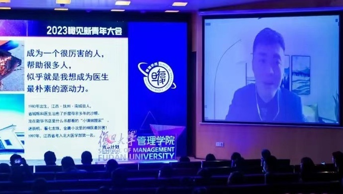

# 陶勇医生：有人问我是不是不务正业？我的圆心在医院，但半径变大了

“现在我常常被人问到是不是不务正业？既在医院坐诊做手术，也是创业者；既是12个研究生的导师，也是做科普的公益人，还是一个‘网红’。其实我也常常问自己这个问题，过去的我是传统的医生，‘圆心’在医院，半径就是诊室、药房和手术室。现在‘圆心’还是在医院，但‘半径’变得更大了。向前延伸，以科技为半径，我们可以减少更多失明的人。向后延伸，以人文和公益将这个半径延伸到大家内心，让视障人士获得温暖。我们希望新时代的医学是有温度的医学。”
**曾经历暴力伤医事件的北京朝阳医院眼科主任医师陶勇** ，近日在“2023复旦大学管理学院瞰见新青年大会”演讲时说。

**我们只管在三四月播种，收获交给九十月**

1997年，陶勇以江西省第一名的成绩考入北京医科大学。“这颗医学种子是妈妈给我种下的。”在陶勇的家乡，江西省南城县建昌镇，沙眼在很长一段时间都是一个致盲性眼病。“从小，我妈就喜欢给我上眼药，在她看来这等于杀菌。小时候我不是特别理解，直到有一次陪她去南昌大医院看病，医生用细小的针从她的眼睛里取出非常多的小结石，那之后妈妈的眼睛就不太难受了。我那时候就有一种感觉，医生太神奇、太伟大，能够帮助患者解决病痛。不知不觉，我对医生有了好感。成为一个很厉害的人，帮助很多人，似乎是我想成为医生最朴素的原动力。”

医学生涯很苦很累，本科时陶勇要读74门课，“每一门，书都像砖头一样，可以从地上摞到天花板，但进步感会让我忘掉这个痛苦。后来再到临床研究，更辛苦，因为晚上还要值夜班和急诊。”

针对从医的意义，陶勇特别讲述了一个12年前的故事。他遇到一位非常瘦的患者，患者因为白血病刚做完移植，骨瘦如柴，随身带着厚厚的大棉垫，走到哪儿都要放到椅子上，否则坐着硌得慌。屋漏偏逢连夜雨，这位患者的眼底黄斑出现了一个病灶。“黄斑，可以理解为眼底的‘心脏’，如果黄斑出了问题，视力会丧失。这让我犯了难，因为这个人的体质很弱，病变随时有可能发展，但他此时此刻的黄斑还没有受到损伤。这就像看到一个走在悬崖边上的人，叫不叫他？叫他，万一还是掉下去了，他可能怪你：本来不会掉下来，是被你吓到了。”

经过一番纠结，陶勇还是选择“叫”他。但此事并不容易，因为不知道他的眼底是什么病变。于是，陶勇做了一个更大胆的决定，给他的眼睛上了麻药，像取沙眼的结石那样，做了一个显微穿刺，取了0.1毫升液体来化验。当时没有成熟的微量眼内液检测技术，陶勇自己上网设计序列，最后给他进行检测。“这很冒险，因为他的免疫力低下，稍有不慎会感染出血，反而可能因为我的穿刺造成不可弥合的灾难。”

幸运的是，最终病变找到了，是巨细胞病毒。通过注射抗病毒药物，一个多星期后，病毒负载量迅速下降，这个病变几乎消失得无影无踪。

“我以为这件事情就这么过去了，但没想到的是，2020年我遇到自己人生至暗时刻，突然收到他的微信好友邀请。”这位多年前的患者，给陶勇发来一段视频，从中能够看到他现在有一个幸福的三口之家，视频最后他还了做一件非常冒险的事情——蹦极，底下是一片湖水。他告诉陶勇一个秘密，当年他来就医时刚结婚不久，如果眼睛失明，做好了跳楼的准备，因为做完白血病移植，已花光家里所有的钱，不想再拖累妻子……

“ **12年前的一个举动，多年之后才告诉我它的意义：一个跳楼的人变成了跳水的人。**
鲁迅先生曾经有一句话：无尽的远方，无数的人，都与我有关。我们常常困惑于当下付出的每一滴汗水，能不能结出丰硕的果实，其实我们只需要耐心等待。余世存老师也说过一句话：与其焦虑时光，不如平整土地。我们只管在三四月播种，收获交给九十月。所以，
**某种程度上，‘意义’是一个动词。** 我们一定要相信，每一份努力都在不知不觉地改变整个世界。”陶勇感慨地说。

**兜兜转转做这些事情只有一个愿望，就是天下无盲**

赠人玫瑰，手有余香。十多年来遇到各种疑难眼病患者，陶勇积累了丰富的眼内液检测经验，在该领域出版了唯一一本专著《眼内液检测的临床应用》，申请了多项国家发明专利，也是北京朝阳医院科创中心第一个成果转化项目，现通过第三方检验所已向全国700多家医院和3000多名医生进行推广，帮助了8万多名眼病患者。

“我们牵头完成了首个眼内液病毒核酸检测的专家共识，并且在去年第一次把眼内液检测技术写进两本眼科学教材，得到了同行的认可。”陶勇介绍，现在包括美国、日本的教授都来寻求帮助和合作，因为他们有全世界最大的眼内液样本库。

一方面农村有大量医疗需求，另一方面全国只有三千名眼底医生，如何采用高科技将诊断能力传递给基层医生，是陶勇持续思考的问题。

比如，全国每年新增8万多白血病患者，按照5%的发病概率，每年会新增4千多因巨细胞病毒视网膜而失明的患者。“如果采用人工智能手段，在早期血液科移植时进行筛查，通过云端人工智能筛查程序，自动报警，就可以弥补眼底医生人手不足的缺陷，让患者得到早期诊断。”陶勇介绍，他们已经把“巨细胞病毒视网膜人工智能筛查”，落地北京儿童医院、湖南省儿童医院、保定儿童医院等医院。

有一些失明患者很孤独，他们希望走出去晒太阳、闻花香、听鸟语。“我们和企业开发了电子助盲器，加上训练，可以通过充满障碍物的未知环境。”

除了创业，陶勇积极运用喜马拉雅、抖音、快手等平台进行传播，创作了《目光》《自造》和《保护眼镜大作战》科普漫画。

除了科技，陶勇也努力用人文和公益帮助视障人群。他们在陆续拍摄视障人群全生命周期的纪录片，希望公众持续关注视障人群教育、高考、就业、婚恋、养老等问题。他们发现很多视障儿童喜欢表达和交流，就跟北京市盲校合作，在公益爱心人士帮助下培养他们的发声技巧，让他们成长后也可以拥有音频网站主播的多元化选择，更好地创造个人价值。

**“我兜兜转转做这些事情只有一个愿望，就是天下无盲。”**
陶勇说，这是一个愿景，为此他和团队正在实施“光M计划”，这个“M”（mang）既是光芒万丈的“芒”，也是视障看不见的“盲”。
**“希望他们能获得光明，无论是眼中还是内心，我们会持续在全生命周期给他们帮助。”**

陶勇最后寄语现场年轻人：“我年轻时也对未来的不确定性有一丝迷茫甚至畏惧，但不确定性恰恰是给年轻人最好的机会，我们才能更好地找到自己的位置，发出自己的心声。”

