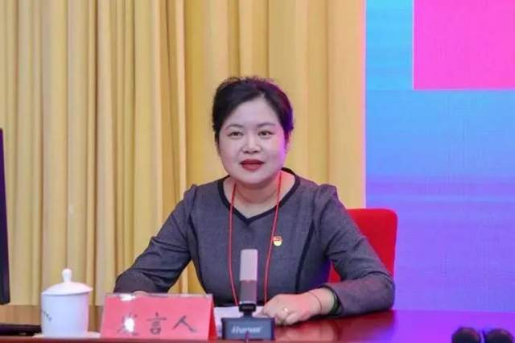
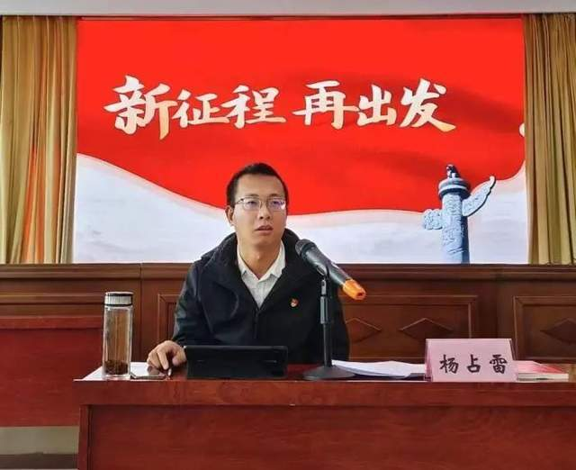

# 85后、90后年轻干部陆续登台，有哪些看点

近年来，越来越多“85后”“90后”年轻干部出现在地方党政部门的重要岗位，关于年轻干部任用与培养的话题也引起诸多讨论。

**又有两位85后履新厅级**

前不久，天津市发布27名市管干部任前公示。其中，出生于1985年9月的连欣和出生于1986年7月的杨占雷拟提名为市辖区的副区长人选。

_图为连欣。来源：天津市委党校官网_

据微信公众号“东丽人大”消息，4月26日，天津市东丽区十八届人大常委会召开第十二次会议，任命连欣为东丽区副区长。据微信公众号“北辰人大”消息，4月27日，天津市北辰区十八届人大常委会召开第十三次会议，任命杨占雷为北辰区副区长。

中国人民大学公共管理学院教授祁凡骅接受中新网采访时表示，我国干部管理是老、中、青结合的梯队建设，当前“70后”省委常委、“80后”厅级干部与“90后”处级干部已不鲜见。

此前，有多位“90后”处级干部引起媒体关注。例如，现任福建省三明市清流县委副书记、县长莫彩华出生于1990年，据媒体报道，莫彩华是全国首位“90后”县长。

公开资料显示，连欣和杨占雷均为全日制研究生学历，博士学位。莫彩华于2009年9月进入中国人民大学商学院学习，毕业后继续在该校攻读硕士、博士研究生。

**年轻干部晋升渠道是否不同？**

北京大学政府管理学院教授白智立告诉中新网，我国干部和各级领导干部，其主体是公务员。公务员管理，或者说我国的干部管理、领导干部的任用管理，一般而言强调逐级晋升。

“除了工作实绩特别优秀可以破格晋升之外，一般强调职务经历、经验和年功，这些都是现代公务员制中的功绩制标准的基本要求，也就是基于一定资格，如学历、资历等加以任用管理。”他说。

_图为杨占雷。图片来源：蓟县出头岭镇人民政府微信公众号“秀美出头岭”_

南开大学周恩来政府管理学院教授季乃礼认为，各地近年来推出的引进生政策，是加强年轻干部源头建设的重要举措之一。

今年3月21日，福建省委组织部发布任前公示，出生于1984年11月的团省委副书记(主持工作)李腾，拟任省级群团机关正厅长级职务。4月，福建共青团“组织机构”一栏最新信息显示，李腾已任共青团福建省委书记。

公开报道显示，李腾毕业于清华大学汽车工程系机械工程专业，工学博士学位。2012年8月，他作为引进生到福建工作。

《瞭望》新闻周刊2018年报道，2012年以来，福建省探索从清华、北大、人大等名校引进优秀博士、硕士毕业生，直接挂职副县(区)长、副镇长等重要岗位干部，并配套多项措施重点培养，旨在战略性培养储备年轻干部。

短期挂职锻炼、选调生也是年轻干部获得任用的重要渠道。

据《天津日报》今年4月报道，今年伊始，天津市委组织部正式启动实施“瞪羚淬炼”，先后推进从市级机关、市管企事业单位选派一批35岁左右的年轻干部到乡镇街道担任党政正职，从驻津高校、市属高校和重点园区择优选派50名干部人才进行双向挂职等工作，不断推动体制机制创新，拓展培养锻造高素质干部队伍的有效途径，持续充盈各级年轻干部“蓄水池”。

**治理能力将有何创新？**

在祁凡骅看来，伴随数字经济时代到来，成长于互联网时代的新生代干部正逢其时，有望通过他们积极引进先进的社会治理理念、人才管理模式，创新运用治理工具和技术手段，为本地区、本部门带来新的发展思路和动力。

_资料图：2023年3月3日，湖南永州市东安县启动“千帆计划”，以选拔和培养“90后”优秀年轻干部。严洁
摄_

2014年7月，天津市武清区和清华大学达成战略合作，人才合作是双方合作的主要内容之一。2021年，时任武清区南蔡村镇党委书记的连欣接受媒体采访时说，“之前，我在清华大学担任教师，主要负责科研工作，到武清挂职，发现这里非常适合年轻人发展，我找到了适合自己的事业发展平台。”

“运用掌握的最新公共管理知识和方法，给政府管理和社会治理带来范式上的转换，积极推进中国现代化进程，将是这一代年轻干部的使命和任务。”白智立说。

季乃礼则认为，年轻干部应多到基层磨练，增进与人民群众的感情，积极参与党校、干部学院理论提升活动，加强党性锻炼。

来源：中国新闻网微信公号、澎湃新闻

